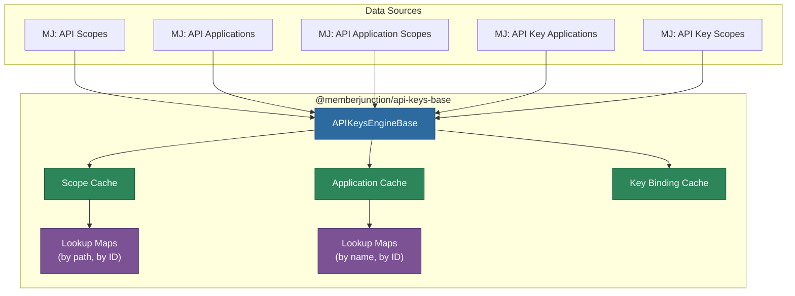
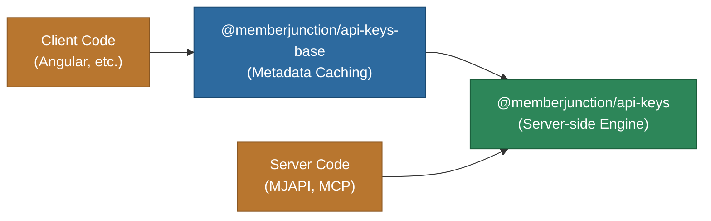

# @memberjunction/api-keys-base

Metadata caching engine for MemberJunction's API key authorization system. This package provides cached, read-only access to API scopes, applications, and key bindings. It can be used on both client and server.

## Architecture



## Overview

The `APIKeysEngineBase` class extends MemberJunction's `BaseEngine` pattern to load and cache all API key-related metadata in memory. It is designed for fast, synchronous lookups after an initial asynchronous load.

**Key capabilities:**

- Cached access to API scopes, applications, application scopes, key applications, and key scopes
- Fast lookup maps for scopes (by path and ID) and applications (by name and ID)
- Hierarchical scope path resolution (e.g., `entity:read`, `agent:execute`)
- Application authorization checks for API keys
- UI configuration parsing for scope display

## Installation

```bash
npm install @memberjunction/api-keys-base
```

## Usage

### Initializing the Engine

```typescript
import { APIKeysEngineBase } from '@memberjunction/api-keys-base';

// Initialize with metadata load
await APIKeysEngineBase.Instance.Config(false, contextUser);

// Force refresh of cached data
await APIKeysEngineBase.Instance.Config(true, contextUser);
```

### Accessing Cached Data

```typescript
const engine = APIKeysEngineBase.Instance;

// All scopes
const allScopes = engine.Scopes;
const activeScopes = engine.ActiveScopes;

// All applications
const apps = engine.Applications;

// Scope lookups
const scope = engine.GetScopeByPath('entity:read');
const scopeById = engine.GetScopeById('scope-guid');

// Application lookups
const app = engine.GetApplicationByName('MCP Server');
const appById = engine.GetApplicationById('app-guid');
```

### Checking Key Authorization

```typescript
// Check if a key is authorized for a specific application
const isAuthorized = engine.IsKeyAuthorizedForApplication(apiKeyId, applicationId);

// Get all scope rules for a key
const keyScopes = engine.GetKeyScopesByKeyId(apiKeyId);

// Get application ceiling rules
const appScopes = engine.GetApplicationScopesByApplicationId(applicationId);
```

### Parsing Scope UI Configuration

```typescript
import { parseAPIScopeUIConfig } from '@memberjunction/api-keys-base';

const uiConfig = parseAPIScopeUIConfig(scope);
console.log(uiConfig.icon);  // e.g., 'fa-solid fa-database'
console.log(uiConfig.color); // e.g., '#6366f1'
```

## API Reference

### APIKeysEngineBase

| Member | Type | Description |
|--------|------|-------------|
| `Instance` | static getter | Singleton instance |
| `Config()` | method | Load/refresh all metadata |
| `Scopes` | getter | All API scopes |
| `ActiveScopes` | getter | Only active scopes |
| `Applications` | getter | All API applications |
| `ApplicationScopes` | getter | All application scope ceilings |
| `KeyApplications` | getter | All key-to-application bindings |
| `KeyScopes` | getter | All key-level scope rules |
| `GetScopeByPath()` | method | Look up active scope by full path |
| `GetScopeById()` | method | Look up scope by ID |
| `GetApplicationByName()` | method | Look up application by name (case-insensitive) |
| `GetApplicationById()` | method | Look up application by ID |
| `GetApplicationScopesByApplicationId()` | method | Get scope ceilings for an application |
| `GetApplicationScopeRules()` | method | Get scope rules for an application + scope |
| `GetKeyApplicationsByKeyId()` | method | Get application bindings for a key |
| `GetKeyScopesByKeyId()` | method | Get scope rules for a key |
| `GetKeyScopeRules()` | method | Get scope rules for a key + scope |
| `KeyHasApplicationBindings()` | method | Check if a key has any application bindings |
| `IsKeyAuthorizedForApplication()` | method | Check if a key is authorized for an application |

### APIScopeUIConfig

```typescript
interface APIScopeUIConfig {
    icon?: string;  // Font Awesome icon class
    color?: string; // Hex color code
}
```

## Relationship to @memberjunction/api-keys

This package provides the **metadata caching layer** that can be used anywhere (client or server). The `@memberjunction/api-keys` package builds on top of this with server-side operations including key generation, validation, scope evaluation, and usage logging.



## Dependencies

| Package | Purpose |
|---------|---------|
| `@memberjunction/core` | BaseEngine, UserInfo, IMetadataProvider |
| `@memberjunction/core-entities` | Entity types (APIScopeEntity, etc.) |
| `@memberjunction/global` | RegisterForStartup decorator |

## License

ISC
