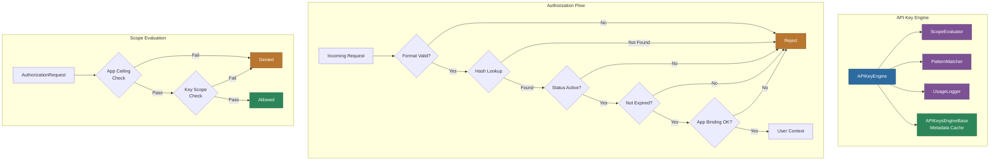
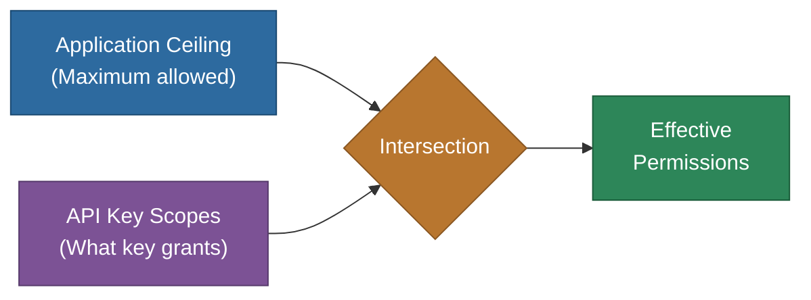

# @memberjunction/api-keys

Server-side API key management and scope-based authorization engine for MemberJunction. Provides key generation, validation, hierarchical scope evaluation, pattern-based access control, and usage logging.

## Architecture



## Overview

This package implements a comprehensive API key authorization system with:

- **Key Generation**: Cryptographically secure keys in `mj_sk_[64 hex]` format
- **Key Validation**: Format checking, hash lookup, status/expiry verification, app binding checks
- **Two-Level Authorization**: Application ceiling + API key scope evaluation
- **Pattern Matching**: Wildcard and multi-value patterns for resource-level permissions
- **Usage Logging**: Automatic audit trails for all authorization decisions
- **Scope Hierarchy**: Structured permission paths (e.g., `entity:read`, `agent:execute`)

## Installation

```bash
npm install @memberjunction/api-keys
```

**Requires Node.js 18+** (uses `crypto` module for key generation and hashing).

## Core Concepts

### API Key Format

Keys follow the format `mj_sk_[64 hex characters]`:
- `mj_sk_` prefix identifies MemberJunction secret keys
- 64 hex characters = 32 bytes of cryptographically secure random data
- Keys are stored as SHA-256 hashes, never in plaintext

### Two-Level Scope Evaluation



Authorization succeeds only when BOTH levels permit the operation:
1. **Application Ceiling** defines the maximum scopes an application allows
2. **API Key Scopes** define what scopes are assigned to a specific key

### Common Scopes

| Scope | Description |
|-------|-------------|
| `full_access` | Bypass all scope checks |
| `entity:read` | Read entity records |
| `entity:create` | Create new records |
| `entity:update` | Update existing records |
| `entity:delete` | Delete records |
| `view:run` | Execute RunView queries |
| `agent:execute` | Execute AI agents |
| `action:execute` | Execute MJ Actions |
| `prompt:execute` | Execute AI prompts |
| `query:run` | Execute SQL queries |
| `metadata:entities:read` | Read entity metadata |
| `communication:send` | Send emails/messages |

## Usage

### Getting the Engine

```typescript
import { GetAPIKeyEngine } from '@memberjunction/api-keys';

const engine = GetAPIKeyEngine();
await engine.Config(false, contextUser);
```

### Creating API Keys

```typescript
const result = await engine.CreateAPIKey({
    UserId: 'user-guid',
    Label: 'My Integration',
    Description: 'Used for CI/CD pipeline',
    ExpiresAt: new Date('2026-12-31')
}, contextUser);

if (result.Success) {
    // IMPORTANT: Show this key once -- it cannot be recovered
    console.log('Raw API Key:', result.RawKey);
    console.log('API Key ID:', result.APIKeyId);
}
```

### Validating API Keys

```typescript
const result = await engine.ValidateAPIKey({
    RawKey: request.headers['x-api-key'],
    ApplicationName: 'MCPServer',
    Endpoint: '/graphql',
    Method: 'POST',
    IPAddress: request.ip
}, systemUser);

if (result.IsValid) {
    // result.User contains the authenticated UserInfo
    // result.APIKeyHash is available for subsequent Authorize() calls
}
```

### Authorizing Requests

```typescript
const authResult = await engine.Authorize(
    apiKeyHash,
    'MJAPI',          // Application name
    'entity:read',    // Scope path
    'Users',          // Resource name
    contextUser,
    {
        endpoint: '/graphql',
        method: 'POST',
        operation: 'GetUsersRecord'
    }
);

if (authResult.Allowed) {
    // Proceed with the operation
} else {
    console.log('Denied:', authResult.Reason);
    console.log('Rules evaluated:', authResult.EvaluatedRules);
}
```

### Pattern Matching

```typescript
import { PatternMatcher } from '@memberjunction/api-keys';

PatternMatcher.matches('Users', '*');           // true - wildcard
PatternMatcher.matches('Users', 'Users');       // true - exact
PatternMatcher.matches('Users', 'User*');       // true - prefix
PatternMatcher.matches('Users', '*ers');        // true - suffix
PatternMatcher.matches('Users', '*ser*');       // true - contains
PatternMatcher.matches('Users', 'Users,Roles'); // true - multi-value
```

### Revoking Keys

```typescript
const success = await engine.RevokeAPIKey(apiKeyId, contextUser);
```

## Components

| Component | Description |
|-----------|-------------|
| `APIKeyEngine` | Main orchestrator for key operations and authorization |
| `ScopeEvaluator` | Two-level scope evaluation with priority-based rule matching |
| `PatternMatcher` | Wildcard and multi-value pattern matching for resources |
| `UsageLogger` | Audit trail logging for all authorization decisions |
| `APIKeysEngineBase` | Metadata caching layer (from `@memberjunction/api-keys-base`) |

## Configuration

```typescript
import { GetAPIKeyEngine } from '@memberjunction/api-keys';

const engine = GetAPIKeyEngine({
    enforcementEnabled: true,        // Enable scope checks (default: true)
    loggingEnabled: true,            // Log all requests (default: true)
    defaultBehaviorNoScopes: 'deny', // Keys with no scopes are denied (default)
    scopeCacheTTLMs: 60000           // Cache TTL for scope rules
});
```

## Database Entities

| Entity | Description |
|--------|-------------|
| `MJ: API Keys` | API key hashes, status, expiration, metadata |
| `MJ: API Scopes` | Hierarchical scope definitions |
| `MJ: API Key Scopes` | Scope rules assigned to specific keys |
| `MJ: API Applications` | Registered applications (MJAPI, MCP, A2A) |
| `MJ: API Application Scopes` | Application-level scope ceilings |
| `MJ: API Key Applications` | Key-to-application bindings |

## Testing

```bash
npm test
npm run test:coverage
```

Test files: `APIKeyEngine.spec.ts`, `ScopeEvaluator.spec.ts`, `PatternMatcher.spec.ts`

## Security Best Practices

1. **Default Deny**: Keys without scopes have no permissions
2. **Minimal Scopes**: Assign only the scopes needed
3. **Resource Restrictions**: Use specific patterns instead of `*` when possible
4. **Expiration**: Set expiration dates for temporary keys
5. **Monitoring**: Review usage logs for suspicious activity
6. **Rotation**: Regularly rotate keys in production

## Integration

Used by `@memberjunction/server` (MJAPI), `@memberjunction/ai-mcp-server` (MCP Server), and `@memberjunction/a2aserver` (A2A Server).

## Dependencies

| Package | Purpose |
|---------|---------|
| `@memberjunction/api-keys-base` | Metadata caching layer |
| `@memberjunction/core` | RunView, Metadata, UserInfo |
| `@memberjunction/core-entities` | Entity types |
| `@memberjunction/global` | Class factory |

## License

ISC
