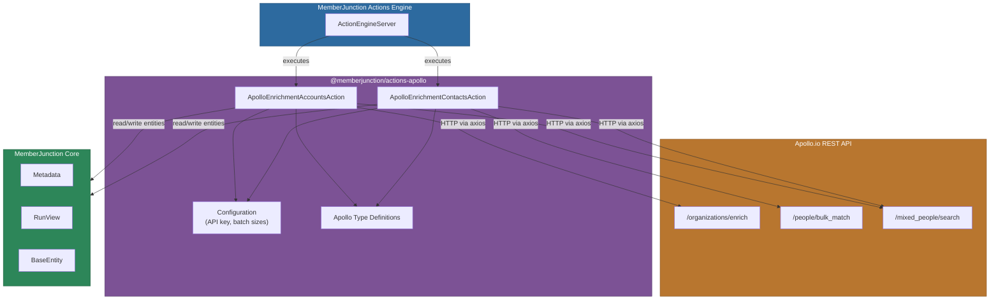
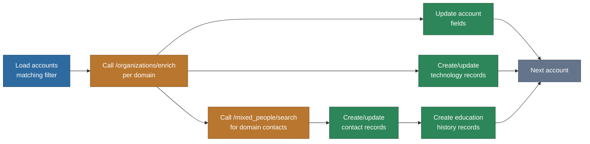
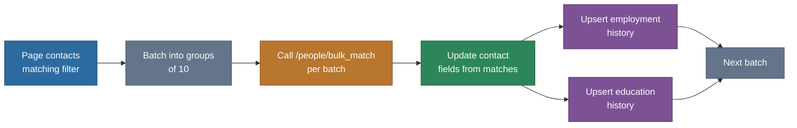

# @memberjunction/actions-apollo

Apollo.io data enrichment action classes for MemberJunction that enable automated enrichment of contact and account records using the Apollo.io API.

## Overview

This package provides two server-side action classes that integrate with Apollo.io's data enrichment services to automatically populate account and contact records with company information, social profiles, technology stacks, employment history, and education data. Both actions extend `BaseAction` from `@memberjunction/actions` and are registered via `@RegisterClass` for automatic discovery by the MemberJunction Actions engine.

Key capabilities:

- **Account enrichment** -- company address, phone, description, social URLs, technology stacks, and associated contacts discovered via organization domain lookup
- **Contact enrichment** -- bulk email verification, social profile URLs, employment history, and education history via people matching
- **Configurable field mappings** -- JSON-based parameter configuration maps Apollo.io fields to your custom entity fields
- **Rate limit handling** -- automatic retry with intelligent backoff for both per-minute and hourly Apollo.io rate limits
- **Batch processing** -- concurrent group processing with configurable batch sizes and pagination for large datasets

For general Actions framework architecture and design philosophy, see the [parent Actions README](../README.md) and [Actions CLAUDE.md](../CLAUDE.md).

## Architecture



### Account Enrichment Data Flow



### Contact Enrichment Data Flow



## Installation

```bash
npm install @memberjunction/actions-apollo
```

## Prerequisites

1. An active Apollo.io account with API access
2. Apollo.io API key set as the environment variable `APOLLO_API_KEY`
3. MemberJunction framework properly configured with server-side action engine
4. Target entities configured for storing enriched data (accounts, contacts, technologies, etc.)

## Configuration

### Environment Variables

```bash
APOLLO_API_KEY=your_apollo_api_key_here
```

### Configuration Constants

The package defines the following defaults in `config.ts`:

| Constant | Default | Description |
|---|---|---|
| `ApolloAPIEndpoint` | `https://api.apollo.io/v1` | Apollo.io API base URL |
| `EmailSourceName` | `Apollo.io` | Source label applied to enriched emails |
| `GroupSize` | `10` | Records per API batch request (Apollo max is 10) |
| `ConcurrentGroups` | `1` | Number of concurrent API request groups |
| `MaxPeopleToEnrichPerOrg` | `500` | Maximum contacts to enrich per organization |
| `ApolloAPIKey` | `process.env.APOLLO_API_KEY` | Read from environment at startup |

## Usage

### Account Enrichment

The `ApolloEnrichmentAccountsAction` enriches account/organization records by looking up company information using domain names. It can optionally discover contacts at the organization, track technology stacks, and create education history records.

#### Parameters

| Parameter | Required | Type | Description |
|---|---|---|---|
| `AccountEntityFieldMappings` | Yes | JSON string | Maps account entity fields (see `AccountEntityFields` below) |
| `AccountTechnologyEntityFieldMappings` | No | JSON string | Maps technology relationship fields |
| `TechnologyCategoryEntityFieldMappings` | No | JSON string | Maps technology category fields |
| `ContactEntityFieldMappings` | No | JSON string | Maps contact entity fields for discovered contacts |
| `ContactEducationHistoryEntityFieldMappings` | No | JSON string | Maps education history fields |

#### AccountEntityFields Structure

```typescript
{
    EntityName: string;          // Target entity name (e.g., "Accounts")
    DomainField: string;         // Field containing company domain
    AccountIDField: string;      // Primary key field name
    EnrichedAtField: string;     // Timestamp field for tracking enrichment
    Filter: string;              // SQL filter for selecting records to process
    AddressField?: string;       // Street address
    CityField?: string;          // City
    StateProvinceField?: string; // State/province
    PostalCodeField?: string;    // Postal code
    DescriptionField?: string;   // Company description
    PhoneNumberField?: string;   // Phone number
    CountryField?: string;       // Country
    LinkedInField?: string;      // LinkedIn URL
    LogoURLField?: string;       // Company logo URL
    FacebookField?: string;      // Facebook URL
    TwitterField?: string;       // Twitter URL
}
```

#### Example

```typescript
import { ActionEngineServer } from '@memberjunction/actions';

const engine = ActionEngineServer.Instance;

const result = await engine.RunAction({
    ActionName: 'ApolloEnrichmentAccountsAction',
    Params: [
        {
            Name: 'AccountEntityFieldMappings',
            Value: JSON.stringify({
                EntityName: 'Accounts',
                DomainField: 'Domain',
                AccountIDField: 'ID',
                EnrichedAtField: 'LastEnrichedAt',
                Filter: 'Domain IS NOT NULL AND LastEnrichedAt IS NULL',
                CityField: 'City',
                StateProvinceField: 'StateProvince',
                LinkedInField: 'LinkedInURL',
                DescriptionField: 'Description'
            })
        },
        {
            Name: 'AccountTechnologyEntityFieldMappings',
            Value: JSON.stringify({
                EntityName: 'Account Technologies',
                AccountIDField: 'AccountID',
                TechnologyIDField: 'TechnologyID',
                TechnologyField: 'Technology',
                CategoryField: 'Category',
                EndedUseAtField: 'EndedUseAt'
            })
        },
        {
            Name: 'ContactEntityFieldMappings',
            Value: JSON.stringify({
                EntityName: 'Contacts',
                EmailField: 'Email',
                AccountIDField: 'AccountID',
                EnrichedAtField: 'LastEnrichedAt',
                FirstNameField: 'FirstName',
                LastNameField: 'LastName',
                TitleField: 'Title',
                EmailSourceField: 'EmailSource',
                ActivityCountField: 'ActivityCount'
            })
        }
    ],
    ContextUser: contextUser
});
```

### Contact Enrichment

The `ApolloEnrichmentContactsAction` enriches existing contact records by matching on name and email combinations through Apollo's bulk people matching API.

#### Parameters

| Parameter | Required | Type | Description |
|---|---|---|---|
| `EntityName` | Yes | string | Target entity containing contacts |
| `EmailField` | Yes | string | Field name for email addresses |
| `FirstNameField` | Yes | string | Field name for first names |
| `LastNameField` | Yes | string | Field name for last names |
| `TitleField` | Yes | string | Field name for job titles |
| `EnrichedAtField` | Yes | string | Field name for enrichment timestamp |
| `Filter` | Yes | string | SQL filter to select contacts for enrichment |
| `ProfilePictureURLField` | No | string | Field for profile picture URLs |
| `AccountNameField` | No | string | Field for account/company names |
| `DomainField` | No | string | Field for company domains |
| `LinkedInField` | No | string | Field for LinkedIn profile URLs |
| `TwitterField` | No | string | Field for Twitter profile URLs |
| `FacebookField` | No | string | Field for Facebook profile URLs |
| `EmploymentHistoryFieldMappings` | No | JSON string | Employment history entity field mappings |
| `EducationHistoryFieldMappings` | No | JSON string | Education history entity field mappings |

#### EmploymentHistoryFieldMappings Structure

```typescript
{
    EmploymentHistoryEntityName: string;             // Employment history entity
    EmploymentHistoryContactIDFieldName: string;     // Foreign key to contact
    EmploymentHistoryOrganizationFieldName: string;  // Organization name field
    EmploymentHistoryTitleFieldName: string;          // Job title field
}
```

#### EducationHistoryFieldMappings Structure

```typescript
{
    EducationHistoryEntityName: string;              // Education history entity
    EducationHistoryContactIDFieldName: string;      // Foreign key to contact
    EducationHistoryInstitutionFieldName: string;    // Institution name field
    EducationHistoryDegreeFieldName: string;         // Degree field
}
```

#### Example

```typescript
import { ActionEngineServer } from '@memberjunction/actions';

const engine = ActionEngineServer.Instance;

const result = await engine.RunAction({
    ActionName: 'ApolloEnrichmentContactsAction',
    Params: [
        { Name: 'EntityName', Value: 'Contacts' },
        { Name: 'EmailField', Value: 'Email' },
        { Name: 'FirstNameField', Value: 'FirstName' },
        { Name: 'LastNameField', Value: 'LastName' },
        { Name: 'TitleField', Value: 'Title' },
        { Name: 'EnrichedAtField', Value: 'LastEnrichedAt' },
        { Name: 'Filter', Value: 'Email IS NOT NULL AND LastEnrichedAt IS NULL' },
        { Name: 'DomainField', Value: 'Domain' },
        { Name: 'LinkedInField', Value: 'LinkedInURL' },
        {
            Name: 'EmploymentHistoryFieldMappings',
            Value: JSON.stringify({
                EmploymentHistoryEntityName: 'Contact Employment Histories',
                EmploymentHistoryContactIDFieldName: 'ContactID',
                EmploymentHistoryOrganizationFieldName: 'Organization',
                EmploymentHistoryTitleFieldName: 'Title'
            })
        },
        {
            Name: 'EducationHistoryFieldMappings',
            Value: JSON.stringify({
                EducationHistoryEntityName: 'Contact Education Histories',
                EducationHistoryContactIDFieldName: 'ContactID',
                EducationHistoryInstitutionFieldName: 'Institution',
                EducationHistoryDegreeFieldName: 'Degree'
            })
        }
    ],
    ContextUser: contextUser
});
```

## API Reference

### Exported Classes

#### `ApolloEnrichmentAccountsAction`

Registered as `"ApolloEnrichmentAccountsAction"` via `@RegisterClass(BaseAction)`. Extends `BaseAction`.

**Processing behavior:**
- Queries accounts matching the configured filter
- For each account, calls `/organizations/enrich` with the domain
- Updates account fields with enriched organization data
- Optionally creates/updates technology stack records with historical tracking (marks ended technologies)
- Optionally discovers and creates contact records via `/mixed_people/search`
- Processes recursively up to 5 times to handle remaining records
- Supports concurrent domain processing (configurable via `ConcurrentGroups`)

#### `ApolloEnrichmentContactsAction`

Registered as `"ApolloEnrichmentContactsAction"` via `@RegisterClass(BaseAction)`. Extends `BaseAction`.

**Processing behavior:**
- Pages through contact records matching the configured filter (500 per page)
- Batches contacts into groups of 10 for Apollo's `/people/bulk_match` endpoint
- Updates matching contacts with enriched social profiles and company data
- Optionally creates/updates employment and education history records
- Supports secondary enrichment via `/mixed_people/search` for organization-level lookups

### Exported Types

All types are exported from `src/generic/apollo.types.ts`:

| Type | Description |
|---|---|
| `ProcessPersonRecordGroupParams` | Parameters for batch contact group processing |
| `ApolloBulkPeopleRequest` | Request payload for `/people/bulk_match` |
| `ApolloBulkPeopleRequestDetail` | Individual person detail within a bulk request |
| `ApolloBulkPeopleResponse` | Response from `/people/bulk_match` |
| `ContactEntityFields` | Field mapping configuration for contact entities |
| `ContactEducationHistoryEntityFields` | Field mapping for education history entities |
| `TechnologyCategoryEntityFields` | Field mapping for technology category entities |
| `AccountTechnologyEntityFields` | Field mapping for account-technology relationship entities |
| `AccountEntityFields` | Field mapping configuration for account entities |
| `ProcessSingleDomainParams` | Parameters for processing a single domain enrichment |
| `OrganizationEnrichmentRequest` | Request for `/organizations/enrich` |
| `OrganizationEnrichmentResponse` | Response from organization enrichment |
| `OrganizationEnrichmentOrganization` | Detailed organization data from Apollo |
| `OrganizationEnrichmentOrganizationAccount` | Account data within organization response |
| `TechnologyMap` | Technology record with name, category, and UID |
| `SearchPeopleResponse` | Response from `/mixed_people/search` |
| `SearchPeopleResponsePerson` | Individual person data from search response |
| `EmploymentHistory` | Employment/education history entry |

## Rate Limiting and Error Handling

Both action classes include a `WrapApolloCall` method that provides:

- **Automatic retry** on HTTP 429 (Too Many Requests) responses
- **Per-minute backoff**: 60-second wait on standard rate limit responses
- **Hourly backoff**: 60-minute wait when Apollo's hourly rate limit is detected (contact action only)
- **Exception handling**: Catches both Axios response errors and thrown exceptions for 429 status codes
- **Comprehensive logging** via MemberJunction's `LogError` and `LogStatus` utilities

### Title Filtering

Both actions automatically exclude contacts with the following job titles to maintain data quality:
- `member`
- `student member`
- `student`
- `volunteer`

## Apollo.io API Endpoints Used

| Endpoint | HTTP Method | Used By | Purpose |
|---|---|---|---|
| `/organizations/enrich` | GET | Accounts action | Organization data by domain |
| `/people/bulk_match` | POST | Contacts action | Bulk contact matching (up to 10 per request) |
| `/mixed_people/search` | POST | Both actions | People search by organization domain |

## Dependencies

| Package | Purpose |
|---|---|
| `@memberjunction/actions` | Base action class (`BaseAction`) and action engine |
| `@memberjunction/actions-base` | Action parameter types (`ActionParam`, `ActionResultSimple`, `RunActionParams`) |
| `@memberjunction/core` | `Metadata`, `RunView`, `BaseEntity`, logging utilities, `UserInfo`, `CompositeKey` |
| `@memberjunction/core-entities` | MemberJunction entity definitions |
| `@memberjunction/global` | `@RegisterClass` decorator for action registration |
| `axios` | HTTP client for Apollo.io API requests |

## Limitations

- Maximum 10 records per bulk API request (Apollo.io API limitation)
- Rate limits apply based on your Apollo.io subscription tier (handled automatically with retries)
- Personal emails may not be revealed in GDPR-compliant regions
- Account enrichment processes domains sequentially within each concurrent group
- Contact enrichment paginates with a maximum of 500 contacts per organization
- Account enrichment recurses up to 5 times to prevent infinite loops
- Excluded job titles (member, student member, student, volunteer) are automatically skipped

## Related Packages

- [@memberjunction/actions-base](../Base) -- Base classes and types used by all action packages
- [@memberjunction/actions](../Engine) -- Server-side action engine that discovers and executes actions
- [@memberjunction/core-actions](../CoreActions) -- Collection of 40+ pre-built MemberJunction actions
- [@memberjunction/actions-content-autotag](../ContentAutotag) -- Content tagging and vectorization actions
