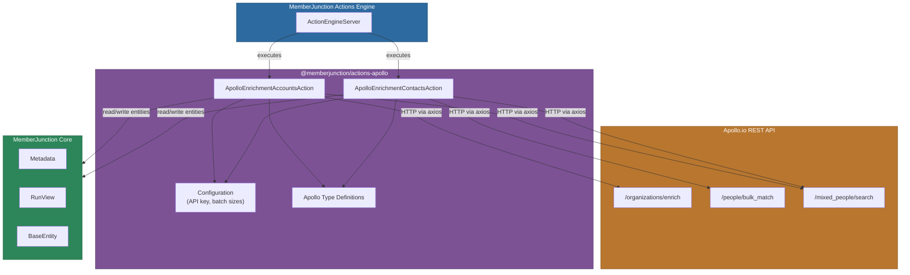
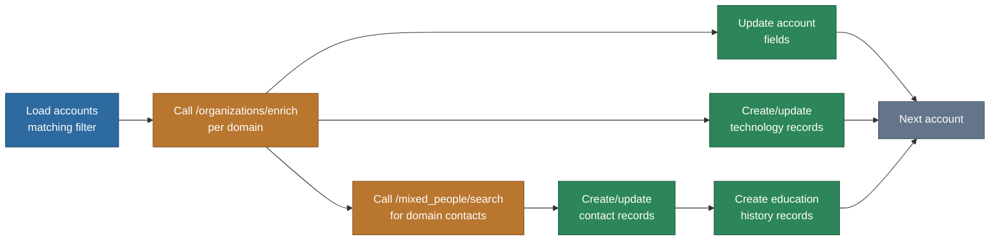
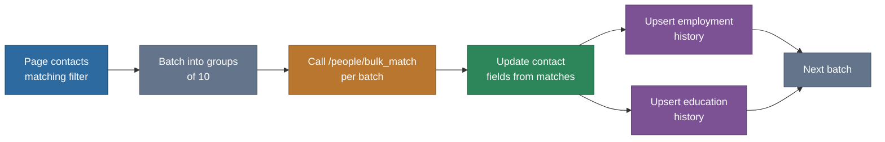

# @memberjunction/actions-apollo

Apollo.io data enrichment action classes for MemberJunction that enable automated enrichment of contact and account records using the Apollo.io API.

## Overview

This package provides two server-side action classes that integrate with Apollo.io's data enrichment services to automatically populate account and contact records with company information, social profiles, technology stacks, employment history, and education data. Both actions extend `BaseAction` from `@memberjunction/actions` and are registered via `@RegisterClass` for automatic discovery by the MemberJunction Actions engine.

Key capabilities:

- **Account enrichment** -- company address, phone, description, social URLs, technology stacks, and associated contacts discovered via organization domain lookup
- **Contact enrichment** -- bulk email verification, social profile URLs, employment history, and education history via people matching
- **Configurable field mappings** -- JSON-based parameter configuration maps Apollo.io fields to your custom entity fields
- **Rate limit handling** -- automatic retry with intelligent backoff for both per-minute and hourly Apollo.io rate limits
- **Batch processing** -- concurrent group processing with configurable batch sizes and pagination for large datasets
- **List management, search and prospecting** -- seven further actions that read and create Apollo lists (labels), page through a list's members, search Apollo's people database for net-new prospects, and move records between lists without destroying their other memberships. See [List management, search and prospecting](#list-management-search-and-prospecting)

For general Actions framework architecture and design philosophy, see the [parent Actions README](../README.md) and [Actions CLAUDE.md](../CLAUDE.md).

## Architecture


```mermaid
flowchart TB
    subgraph Engine["MemberJunction Actions Engine"]
        AE["ActionEngineServer"]
    end

    subgraph Apollo["@memberjunction/actions-apollo"]
        AccAction["ApolloEnrichmentAccountsAction"]
        ConAction["ApolloEnrichmentContactsAction"]
        Config["Configuration\n(API key, batch sizes)"]
        Types["Apollo Type Definitions"]
    end

    subgraph ApolloAPI["Apollo.io REST API"]
        OrgEnrich["/organizations/enrich"]
        BulkMatch["/people/bulk_match"]
        PeopleSearch["/mixed_people/search"]
    end

    subgraph MJCore["MemberJunction Core"]
        Meta["Metadata"]
        RV["RunView"]
        BE["BaseEntity"]
    end

    AE -->|executes| AccAction
    AE -->|executes| ConAction
    AccAction --> Config
    ConAction --> Config
    AccAction --> Types
    ConAction --> Types
    AccAction -->|HTTP via axios| OrgEnrich
    AccAction -->|HTTP via axios| PeopleSearch
    ConAction -->|HTTP via axios| BulkMatch
    ConAction -->|HTTP via axios| PeopleSearch
    AccAction -->|read/write entities| MJCore
    ConAction -->|read/write entities| MJCore

    style Engine fill:#2d6a9f,stroke:#1a4971,color:#fff
    style Apollo fill:#7c5295,stroke:#563a6b,color:#fff
    style ApolloAPI fill:#b8762f,stroke:#8a5722,color:#fff
    style MJCore fill:#2d8659,stroke:#1a5c3a,color:#fff
```

### Account Enrichment Data Flow


```mermaid
flowchart LR
    Start["Load accounts\nmatching filter"] --> OrgAPI["Call /organizations/enrich\nper domain"]
    OrgAPI --> UpdateAcct["Update account\nfields"]
    OrgAPI --> TechRec["Create/update\ntechnology records"]
    OrgAPI --> PeopleAPI["Call /mixed_people/search\nfor domain contacts"]
    PeopleAPI --> CreateContact["Create/update\ncontact records"]
    CreateContact --> History["Create education\nhistory records"]
    UpdateAcct --> Next["Next account"]
    TechRec --> Next
    History --> Next

    style Start fill:#2d6a9f,stroke:#1a4971,color:#fff
    style OrgAPI fill:#b8762f,stroke:#8a5722,color:#fff
    style UpdateAcct fill:#2d8659,stroke:#1a5c3a,color:#fff
    style TechRec fill:#2d8659,stroke:#1a5c3a,color:#fff
    style PeopleAPI fill:#b8762f,stroke:#8a5722,color:#fff
    style CreateContact fill:#2d8659,stroke:#1a5c3a,color:#fff
    style History fill:#2d8659,stroke:#1a5c3a,color:#fff
    style Next fill:#64748b,stroke:#475569,color:#fff
```

### Contact Enrichment Data Flow


```mermaid
flowchart LR
    Start["Page contacts\nmatching filter"] --> Batch["Batch into groups\nof 10"]
    Batch --> BulkAPI["Call /people/bulk_match\nper batch"]
    BulkAPI --> Update["Update contact\nfields from matches"]
    Update --> EmpHist["Upsert employment\nhistory"]
    Update --> EduHist["Upsert education\nhistory"]
    EmpHist --> NextBatch["Next batch"]
    EduHist --> NextBatch

    style Start fill:#2d6a9f,stroke:#1a4971,color:#fff
    style Batch fill:#64748b,stroke:#475569,color:#fff
    style BulkAPI fill:#b8762f,stroke:#8a5722,color:#fff
    style Update fill:#2d8659,stroke:#1a5c3a,color:#fff
    style EmpHist fill:#7c5295,stroke:#563a6b,color:#fff
    style EduHist fill:#7c5295,stroke:#563a6b,color:#fff
    style NextBatch fill:#64748b,stroke:#475569,color:#fff
```

## Installation

```bash
npm install @memberjunction/actions-apollo
```

## Prerequisites

1. An active Apollo.io account with API access
2. Apollo.io API key set as the environment variable `APOLLO_API_KEY`
3. MemberJunction framework properly configured with server-side action engine
4. Target entities configured for storing enriched data (accounts, contacts, technologies, etc.)

## Configuration

### Environment Variables

```bash
APOLLO_API_KEY=your_apollo_api_key_here
```

### Configuration Constants

The package defines the following defaults in `config.ts`:

| Constant | Default | Description |
|---|---|---|
| `ApolloAPIEndpoint` | `https://api.apollo.io/v1` | Apollo.io API base URL |
| `EmailSourceName` | `Apollo.io` | Source label applied to enriched emails |
| `GroupSize` | `10` | Records per API batch request (Apollo max is 10) |
| `ConcurrentGroups` | `1` | Number of concurrent API request groups |
| `MaxPeopleToEnrichPerOrg` | `500` | Maximum contacts to enrich per organization |
| `ApolloAPIKey` | `process.env.APOLLO_API_KEY` | Read from environment at startup |

## Usage

### Account Enrichment

The `ApolloEnrichmentAccountsAction` enriches account/organization records by looking up company information using domain names. It can optionally discover contacts at the organization, track technology stacks, and create education history records.

#### Parameters

| Parameter | Required | Type | Description |
|---|---|---|---|
| `AccountEntityFieldMappings` | Yes | JSON string | Maps account entity fields (see `AccountEntityFields` below) |
| `AccountTechnologyEntityFieldMappings` | No | JSON string | Maps technology relationship fields |
| `TechnologyCategoryEntityFieldMappings` | No | JSON string | Maps technology category fields |
| `ContactEntityFieldMappings` | No | JSON string | Maps contact entity fields for discovered contacts |
| `ContactEducationHistoryEntityFieldMappings` | No | JSON string | Maps education history fields |

#### AccountEntityFields Structure

```typescript
{
    EntityName: string;          // Target entity name (e.g., "Accounts")
    DomainField: string;         // Field containing company domain
    AccountIDField: string;      // Primary key field name
    EnrichedAtField: string;     // Timestamp field for tracking enrichment
    Filter: string;              // SQL filter for selecting records to process
    AddressField?: string;       // Street address
    CityField?: string;          // City
    StateProvinceField?: string; // State/province
    PostalCodeField?: string;    // Postal code
    DescriptionField?: string;   // Company description
    PhoneNumberField?: string;   // Phone number
    CountryField?: string;       // Country
    LinkedInField?: string;      // LinkedIn URL
    LogoURLField?: string;       // Company logo URL
    FacebookField?: string;      // Facebook URL
    TwitterField?: string;       // Twitter URL
}
```

#### Example

```typescript
import { ActionEngineServer } from '@memberjunction/actions';

const engine = ActionEngineServer.Instance;

const result = await engine.RunAction({
    ActionName: 'ApolloEnrichmentAccountsAction',
    Params: [
        {
            Name: 'AccountEntityFieldMappings',
            Value: JSON.stringify({
                EntityName: 'Accounts',
                DomainField: 'Domain',
                AccountIDField: 'ID',
                EnrichedAtField: 'LastEnrichedAt',
                Filter: 'Domain IS NOT NULL AND LastEnrichedAt IS NULL',
                CityField: 'City',
                StateProvinceField: 'StateProvince',
                LinkedInField: 'LinkedInURL',
                DescriptionField: 'Description'
            })
        },
        {
            Name: 'AccountTechnologyEntityFieldMappings',
            Value: JSON.stringify({
                EntityName: 'Account Technologies',
                AccountIDField: 'AccountID',
                TechnologyIDField: 'TechnologyID',
                TechnologyField: 'Technology',
                CategoryField: 'Category',
                EndedUseAtField: 'EndedUseAt'
            })
        },
        {
            Name: 'ContactEntityFieldMappings',
            Value: JSON.stringify({
                EntityName: 'Contacts',
                EmailField: 'Email',
                AccountIDField: 'AccountID',
                EnrichedAtField: 'LastEnrichedAt',
                FirstNameField: 'FirstName',
                LastNameField: 'LastName',
                TitleField: 'Title',
                EmailSourceField: 'EmailSource',
                ActivityCountField: 'ActivityCount'
            })
        }
    ],
    ContextUser: contextUser
});
```

### Contact Enrichment

The `ApolloEnrichmentContactsAction` enriches existing contact records by matching on name and email combinations through Apollo's bulk people matching API.

#### Parameters

| Parameter | Required | Type | Description |
|---|---|---|---|
| `EntityName` | Yes | string | Target entity containing contacts |
| `EmailField` | Yes | string | Field name for email addresses |
| `FirstNameField` | Yes | string | Field name for first names |
| `LastNameField` | Yes | string | Field name for last names |
| `TitleField` | Yes | string | Field name for job titles |
| `EnrichedAtField` | Yes | string | Field name for enrichment timestamp |
| `Filter` | Yes | string | SQL filter to select contacts for enrichment |
| `ProfilePictureURLField` | No | string | Field for profile picture URLs |
| `AccountNameField` | No | string | Field for account/company names |
| `DomainField` | No | string | Field for company domains |
| `LinkedInField` | No | string | Field for LinkedIn profile URLs |
| `TwitterField` | No | string | Field for Twitter profile URLs |
| `FacebookField` | No | string | Field for Facebook profile URLs |
| `EmploymentHistoryFieldMappings` | No | JSON string | Employment history entity field mappings |
| `EducationHistoryFieldMappings` | No | JSON string | Education history entity field mappings |

#### EmploymentHistoryFieldMappings Structure

```typescript
{
    EmploymentHistoryEntityName: string;             // Employment history entity
    EmploymentHistoryContactIDFieldName: string;     // Foreign key to contact
    EmploymentHistoryOrganizationFieldName: string;  // Organization name field
    EmploymentHistoryTitleFieldName: string;          // Job title field
}
```

#### EducationHistoryFieldMappings Structure

```typescript
{
    EducationHistoryEntityName: string;              // Education history entity
    EducationHistoryContactIDFieldName: string;      // Foreign key to contact
    EducationHistoryInstitutionFieldName: string;    // Institution name field
    EducationHistoryDegreeFieldName: string;         // Degree field
}
```

#### Example

```typescript
import { ActionEngineServer } from '@memberjunction/actions';

const engine = ActionEngineServer.Instance;

const result = await engine.RunAction({
    ActionName: 'ApolloEnrichmentContactsAction',
    Params: [
        { Name: 'EntityName', Value: 'Contacts' },
        { Name: 'EmailField', Value: 'Email' },
        { Name: 'FirstNameField', Value: 'FirstName' },
        { Name: 'LastNameField', Value: 'LastName' },
        { Name: 'TitleField', Value: 'Title' },
        { Name: 'EnrichedAtField', Value: 'LastEnrichedAt' },
        { Name: 'Filter', Value: 'Email IS NOT NULL AND LastEnrichedAt IS NULL' },
        { Name: 'DomainField', Value: 'Domain' },
        { Name: 'LinkedInField', Value: 'LinkedInURL' },
        {
            Name: 'EmploymentHistoryFieldMappings',
            Value: JSON.stringify({
                EmploymentHistoryEntityName: 'Contact Employment Histories',
                EmploymentHistoryContactIDFieldName: 'ContactID',
                EmploymentHistoryOrganizationFieldName: 'Organization',
                EmploymentHistoryTitleFieldName: 'Title'
            })
        },
        {
            Name: 'EducationHistoryFieldMappings',
            Value: JSON.stringify({
                EducationHistoryEntityName: 'Contact Education Histories',
                EducationHistoryContactIDFieldName: 'ContactID',
                EducationHistoryInstitutionFieldName: 'Institution',
                EducationHistoryDegreeFieldName: 'Degree'
            })
        }
    ],
    ContextUser: contextUser
});
```

## List management, search and prospecting

Seven actions cover the other half of Apollo: which records are on which list, and moving them between lists. They are the outbound-campaign surface — build a list, drain it through a sequence of stages, and see what is where.

These talk to a **different Apollo base path** from enrichment: `api.apollo.io/api/v1` rather than `api.apollo.io/v1`. The paths are not interchangeable; the same path under the wrong prefix returns 404. Both are declared side by side in `src/config.ts`.

| Action | Purpose | Key required |
|---|---|---|
| `ApolloGetListsAction` | Every label with its kind (`accounts`/`contacts`) and cached member count. Run this first — every other action addresses lists by exact name | MASTER |
| `ApolloCreateListAction` | Create a list, idempotently. A same-named label is returned as-is with `AlreadyExisted: true` | MASTER |
| `ApolloGetListAccountsAction` | One page of a list's accounts, with each one's current label names | MASTER |
| `ApolloGetListContactsAction` | One page of a list's contacts, same shape | MASTER |
| `ApolloSearchPeopleAction` | Search Apollo's people database by organization, title and seniority. At least one filter is required | scoped is fine |
| `ApolloMoveListAccountsAction` | Move accounts between lists, preserving every other membership | MASTER |
| `ApolloMoveListContactsAction` | The same for contacts | MASTER |

### The five Apollo behaviours these encode

These are the load-bearing part. They are documented in full on `src/generic/apollo-lists.types.ts` and referenced by number throughout the client.

1. **A PATCH replaces the whole `label_names` array.** There is no add-one-label call, so a move is *two* writes, each carrying the complete intended set: first `current ∪ {toList}`, then `(current ∪ {toList}) \ {fromList}`. Writing a bare `['Warm']` would silently delete every other list the record was on — and nothing in the response would say so. This is why the move actions re-read the source list for current labels and only accept ids from the caller, never labels.
2. **Roughly 15–17% of removes return success without applying.** Removes are therefore verified by re-reading the destination list, and a record still carrying the source label is reported as `possiblyStuck` — never auto-retried, because an immediate retry flakes the same way. The next page-1 drain sees it carrying both labels and finishes the job. A possibly-stuck record is **not** a failure: the write succeeded and Apollo did not honour it.
3. **A list drain always reads page 1.** Removing records shifts every later page, so advancing to page 2 skips records. Paging therefore defaults to page 1 rather than to "wherever you left off".
4. **Label reads and every write need a MASTER API key.** A scoped key authenticates fine and then 403s, which is indistinguishable from a wrong key — so the client rewrites that 403 into a message naming the requirement.
5. **Labels are read as `label_ids` but written as `label_names`.** The client fetches the label list once per instance and resolves ids to names on every read. An id with no matching label is dropped rather than passed through, since a raw id inside a `label_names` write would create a label named after a hex string.

### Credentials

Two paths, in order:

1. A `CompanyID` param → that company's active `Apollo` **MJ: Company Integrations** row → its `CredentialID` → the `apiKey` inside **MJ: Credentials** `Values`. This is the multi-tenant path.
2. `APOLLO_API_KEY` from the environment, which is what the enrichment actions have always used. Single-tenant deployments keep working with no credential rows.

Every action reports which path supplied its key as a `KeySource` output.

`CompanyIntegration.APIKey` is deliberately **not** read. That column is not a decrypt-on-read field, so a key written through metadata sync comes back as the literal ciphertext string `$ENC$…`; sending that to Apollo produces a 401 that looks exactly like a wrong key. `MJ: Credentials` is the field that decrypts, so it is the only one used. A credential that exists but whose `Values` will not parse fails with `CONFIGURATION_ERROR` rather than falling back to the environment — a broken credential should not silently borrow another workspace's key.

### A typical drain

```typescript
// 1. See the real label names.
await engine.RunAction({ Action: getLists, Params: [], ContextUser: contextUser });

// 2. Read page 1 of the source list — this is where current label names come from.
const page = await engine.RunAction({
    Action: getListAccounts,
    Params: [{ Name: 'ListName', Value: 'Cold Outreach', Type: 'Input' }],
    ContextUser: contextUser
});

// 3. Move by id. The action re-reads page 1 itself, so the labels it writes are
//    never the ones you read above going stale in between.
await engine.RunAction({
    Action: moveListAccounts,
    Params: [
        { Name: 'AccountIDs', Value: ['5f2a…', '5f2b…'], Type: 'Input' },
        { Name: 'FromList', Value: 'Cold Outreach', Type: 'Input' },
        { Name: 'ToList', Value: 'Engaged', Type: 'Input' }
    ],
    ContextUser: contextUser
});
```

Every list param (`AccountIDs`, `Titles`, `Seniorities`, …) accepts a real array, a JSON array string, or a comma-separated string, because these actions get called from an agent input mapping, from an LLM writing params, and from a human typing in a UI. Genuinely malformed input still fails loudly rather than becoming an empty filter — on a people search that is the difference between a scoped query and an unscoped firehose.

### Additional endpoints

| Endpoint | HTTP Method | Purpose |
|---|---|---|
| `/labels` | GET / POST | List and create labels (MASTER) |
| `/accounts/search` | POST | Saved accounts, filtered by `account_label_ids` |
| `/contacts/search` | POST | Saved contacts, filtered by `contact_label_ids` |
| `/mixed_people/api_search` | POST | Prospecting people search — no emails or phones by design |
| `/accounts/{id}` | PATCH | Replace one account's label set (MASTER) |
| `/contacts/{id}` | PATCH | Replace one contact's label set (MASTER) |

There is no delete surface. The only writes are label-array replacements and label creation.

## API Reference

### Exported Classes

#### `ApolloEnrichmentAccountsAction`

Registered as `"ApolloEnrichmentAccountsAction"` via `@RegisterClass(BaseAction)`. Extends `BaseAction`.

**Processing behavior:**
- Queries accounts matching the configured filter
- For each account, calls `/organizations/enrich` with the domain
- Updates account fields with enriched organization data
- Optionally creates/updates technology stack records with historical tracking (marks ended technologies)
- Optionally discovers and creates contact records via `/mixed_people/search`
- Processes recursively up to 5 times to handle remaining records
- Supports concurrent domain processing (configurable via `ConcurrentGroups`)

#### `ApolloEnrichmentContactsAction`

Registered as `"ApolloEnrichmentContactsAction"` via `@RegisterClass(BaseAction)`. Extends `BaseAction`.

**Processing behavior:**
- Pages through contact records matching the configured filter (500 per page)
- Batches contacts into groups of 10 for Apollo's `/people/bulk_match` endpoint
- Updates matching contacts with enriched social profiles and company data
- Optionally creates/updates employment and education history records
- Supports secondary enrichment via `/mixed_people/search` for organization-level lookups

### Exported Types

All types are exported from `src/generic/apollo.types.ts`:

| Type | Description |
|---|---|
| `ProcessPersonRecordGroupParams` | Parameters for batch contact group processing |
| `ApolloBulkPeopleRequest` | Request payload for `/people/bulk_match` |
| `ApolloBulkPeopleRequestDetail` | Individual person detail within a bulk request |
| `ApolloBulkPeopleResponse` | Response from `/people/bulk_match` |
| `ContactEntityFields` | Field mapping configuration for contact entities |
| `ContactEducationHistoryEntityFields` | Field mapping for education history entities |
| `TechnologyCategoryEntityFields` | Field mapping for technology category entities |
| `AccountTechnologyEntityFields` | Field mapping for account-technology relationship entities |
| `AccountEntityFields` | Field mapping configuration for account entities |
| `ProcessSingleDomainParams` | Parameters for processing a single domain enrichment |
| `OrganizationEnrichmentRequest` | Request for `/organizations/enrich` |
| `OrganizationEnrichmentResponse` | Response from organization enrichment |
| `OrganizationEnrichmentOrganization` | Detailed organization data from Apollo |
| `OrganizationEnrichmentOrganizationAccount` | Account data within organization response |
| `TechnologyMap` | Technology record with name, category, and UID |
| `SearchPeopleResponse` | Response from `/mixed_people/search` |
| `SearchPeopleResponsePerson` | Individual person data from search response |
| `EmploymentHistory` | Employment/education history entry |

## Rate Limiting and Error Handling

Both action classes include a `WrapApolloCall` method that provides:

- **Automatic retry** on HTTP 429 (Too Many Requests) responses
- **Per-minute backoff**: 60-second wait on standard rate limit responses
- **Hourly backoff**: 60-minute wait when Apollo's hourly rate limit is detected (contact action only)
- **Exception handling**: Catches both Axios response errors and thrown exceptions for 429 status codes
- **Comprehensive logging** via MemberJunction's `LogError` and `LogStatus` utilities

### Title Filtering

Both actions automatically exclude contacts with the following job titles to maintain data quality:
- `member`
- `student member`
- `student`
- `volunteer`

## Apollo.io API Endpoints Used

| Endpoint | HTTP Method | Used By | Purpose |
|---|---|---|---|
| `/organizations/enrich` | GET | Accounts action | Organization data by domain |
| `/people/bulk_match` | POST | Contacts action | Bulk contact matching (up to 10 per request) |
| `/mixed_people/search` | POST | Both actions | People search by organization domain |

## Dependencies

| Package | Purpose |
|---|---|
| `@memberjunction/actions` | Base action class (`BaseAction`) and action engine |
| `@memberjunction/actions-base` | Action parameter types (`ActionParam`, `ActionResultSimple`, `RunActionParams`) |
| `@memberjunction/core` | `Metadata`, `RunView`, `BaseEntity`, logging utilities, `UserInfo`, `CompositeKey` |
| `@memberjunction/core-entities` | MemberJunction entity definitions |
| `@memberjunction/global` | `@RegisterClass` decorator for action registration |
| `axios` | HTTP client for Apollo.io API requests |

## Limitations

- Maximum 10 records per bulk API request (Apollo.io API limitation)
- Rate limits apply based on your Apollo.io subscription tier (handled automatically with retries)
- Personal emails may not be revealed in GDPR-compliant regions
- Account enrichment processes domains sequentially within each concurrent group
- Contact enrichment paginates with a maximum of 500 contacts per organization
- Account enrichment recurses up to 5 times to prevent infinite loops
- Excluded job titles (member, student member, student, volunteer) are automatically skipped

## Related Packages

- [@memberjunction/actions-base](../Base) -- Base classes and types used by all action packages
- [@memberjunction/actions](../Engine) -- Server-side action engine that discovers and executes actions
- [@memberjunction/core-actions](../CoreActions) -- Collection of 40+ pre-built MemberJunction actions
- [@memberjunction/actions-content-autotag](../ContentAutotag) -- Content tagging and vectorization actions
