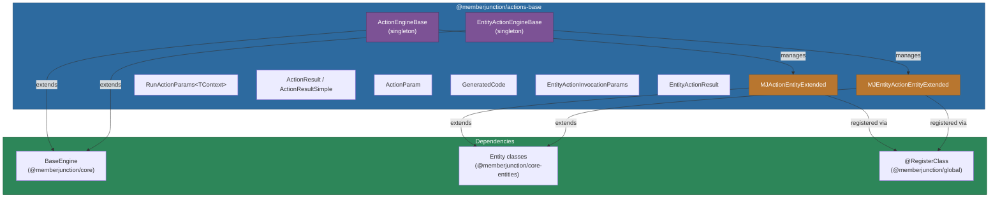
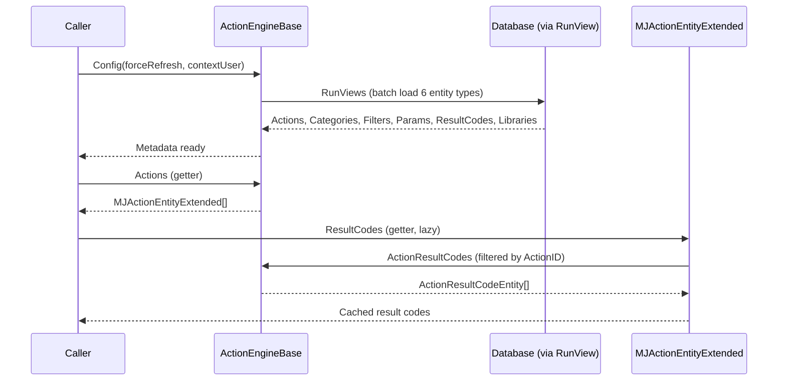

# @memberjunction/actions-base

Base classes, interfaces, and metadata engines for the MemberJunction Actions framework. This package provides the foundational layer that both server-side (`@memberjunction/actions`) and client-side action implementations build upon. It handles action metadata loading, parameter modeling, result types, and extended entity classes with lazy-loaded relationships.

For the broader Actions design philosophy -- including when to use Actions vs. direct class imports, and the "thin wrapper" principle -- see the [parent Actions CLAUDE.md](../CLAUDE.md).

## Installation

```bash
npm install @memberjunction/actions-base
```

## Architecture

The package is organized into two parallel engine hierarchies: one for general-purpose **Actions** and one for **Entity Actions** (actions bound to a specific entity). Both engines are singletons that extend `BaseEngine` from `@memberjunction/core` and load their metadata via `Config()`.



### Data Flow: Config and Execution



## Exports

### Engine Classes

| Export | Description |
|--------|-------------|
| `ActionEngineBase` | Singleton engine that loads and caches all action metadata (actions, categories, filters, params, result codes, libraries). Subclassed by server/client implementations. |
| `EntityActionEngineBase` | Singleton engine for entity-bound actions. Loads entity actions, invocation types, filters, invocations, and params. |

### Extended Entity Classes

| Export | Description |
|--------|-------------|
| `MJActionEntityExtended` | Extends `ActionEntity` with lazy-loaded `ResultCodes`, `Params`, `Libraries`, plus computed `IsCoreAction` and `ProgrammaticName` properties. Registered as `'Actions'` in the MJ class factory. |
| `MJEntityActionEntityExtended` | Extends `EntityActionEntity` with lazy-loaded `Filters`, `Invocations`, and `Params`. Registered as `'Entity Actions'` in the MJ class factory. |

### Parameter and Result Types

| Export | Description |
|--------|-------------|
| `RunActionParams<TContext>` | Configuration object for running an action. Includes the action entity, context user, filters, parameters, and an optional generic-typed `Context` for runtime-specific data. |
| `ActionParam` | Key-value parameter with `Name`, `Value`, and `Type` (`'Input'` / `'Output'` / `'Both'`). |
| `ActionResult` | Full result from engine execution, including `Success`, `Result` (result code entity), `LogEntry`, `Message`, and output `Params`. |
| `ActionResultSimple` | Lightweight result returned by individual action implementations: `Success`, `ResultCode` (string), optional `Message` and `Params`. |
| `EntityActionInvocationParams` | Parameters for invoking an entity action, including invocation type and one of `EntityObject`, `ViewID`, or `ListID`. |
| `EntityActionResult` | Result from entity action execution with same structure as `ActionResult`. |

### Code Generation Support

| Export | Description |
|--------|-------------|
| `GeneratedCode` | Container for AI-generated action code, including `Success`, `Code`, `LibrariesUsed`, `Comments`, and `ErrorMessage`. |
| `ActionLibrary` | Library reference used in generated code: `LibraryName` and `ItemsUsed` (array of imported items). |

## Usage

### Configuring the Action Engine

Both engines must be configured before use. `Config()` loads metadata from the database and caches it. Pass `forceRefresh: true` to reload after metadata changes.

```typescript
import { ActionEngineBase } from '@memberjunction/actions-base';
import { UserInfo } from '@memberjunction/core';

async function initialize(contextUser: UserInfo) {
    const engine = ActionEngineBase.Instance;

    // Initial load -- metadata cached in GlobalObjectStore
    await engine.Config(false, contextUser);

    // Access loaded metadata
    const allActions = engine.Actions;          // MJActionEntityExtended[]
    const coreActions = engine.CoreActions;     // Only core MJ actions
    const categories = engine.ActionCategories; // ActionCategoryEntity[]
    const params = engine.ActionParams;         // ActionParamEntity[]
    const filters = engine.ActionFilters;       // ActionFilterEntity[]
    const resultCodes = engine.ActionResultCodes;
    const libraries = engine.ActionLibraries;
}
```

### Configuring the Entity Action Engine

```typescript
import { EntityActionEngineBase } from '@memberjunction/actions-base';

async function initEntityActions(contextUser: UserInfo) {
    const engine = EntityActionEngineBase.Instance;
    await engine.Config(false, contextUser);

    // All entity actions
    const entityActions = engine.EntityActions; // MJEntityActionEntityExtended[]

    // Filter by entity name and status
    const customerActions = engine.GetActionsByEntityName('Customers', 'Active');

    // Filter by entity name and invocation type
    const viewActions = engine.GetActionsByEntityNameAndInvocationType(
        'Orders',
        'View',
        'Active'
    );

    // Filter by entity ID
    const byId = engine.GetActionsByEntityID('some-entity-uuid');
}
```

### Working with MJActionEntityExtended

The extended entity class provides lazy-loaded related data and computed properties.

```typescript
import { ActionEngineBase, MJActionEntityExtended } from '@memberjunction/actions-base';

const engine = ActionEngineBase.Instance;
await engine.Config(false, contextUser);

const action: MJActionEntityExtended = engine.Actions[0];

// Computed properties
console.log(action.IsCoreAction);     // boolean -- is this a core MJ action?
console.log(action.ProgrammaticName); // Code-safe version of action name

// Lazy-loaded relationships (cached after first access)
const resultCodes = action.ResultCodes; // ActionResultCodeEntity[]
const params = action.Params;           // ActionParamEntity[]
const libraries = action.Libraries;     // ActionLibraryEntity[]
```

### Building RunActionParams with Type-Safe Context

`RunActionParams` supports a generic `TContext` parameter for propagating runtime-specific data (API keys, environment config, feature flags) that is separate from action parameters and not persisted to logs.

```typescript
import { RunActionParams, ActionParam } from '@memberjunction/actions-base';
import { ActionEntity } from '@memberjunction/core-entities';
import { UserInfo } from '@memberjunction/core';

// Define a context type for your environment
interface ServiceContext {
    apiEndpoint: string;
    apiKey: string;
    environment: 'dev' | 'staging' | 'prod';
    retryPolicy: {
        maxRetries: number;
        backoffMs: number;
    };
}

function buildRunParams(
    action: ActionEntity,
    user: UserInfo,
    context: ServiceContext
): RunActionParams<ServiceContext> {
    const params = new RunActionParams<ServiceContext>();
    params.Action = action;
    params.ContextUser = user;
    params.Params = [
        { Name: 'CustomerID', Value: 'CUST-123', Type: 'Input' },
        { Name: 'OrderTotal', Value: 250.00, Type: 'Input' }
    ];
    params.Context = context; // Type-checked against ServiceContext
    return params;
}
```

### Entity Action Invocation

Entity actions support three invocation modes depending on the context.

```typescript
import {
    EntityActionInvocationParams,
    EntityActionEngineBase
} from '@memberjunction/actions-base';

const engine = EntityActionEngineBase.Instance;
await engine.Config(false, contextUser);

const entityActions = engine.GetActionsByEntityNameAndInvocationType(
    'Customers',
    'Single Record',
    'Active'
);

if (entityActions.length > 0) {
    const invocationParams: EntityActionInvocationParams = {
        EntityAction: entityActions[0],
        InvocationType: engine.InvocationTypes.find(
            t => t.Name === 'Single Record'
        )!,
        ContextUser: contextUser,
        EntityObject: customerRecord // BaseEntity instance
    };
    // Pass to your engine's run method
}
```

### Category Hierarchy Utilities

`ActionEngineBase` provides methods for navigating the action category tree.

```typescript
const engine = ActionEngineBase.Instance;

// Check if a category is under the core actions root
const isCoreCategory = engine.IsCoreActionCategory(someCategoryId);

// Check if one category is a descendant of another (recursive)
const isChild = engine.IsChildCategoryOf(childCategoryId, parentCategoryId);

// Look up an action by name
const action = engine.GetActionByName('Send Email');
```

### Code Generation Types

The `GeneratedCode` and `ActionLibrary` types support the AI-powered action generation system.

```typescript
import { GeneratedCode, ActionLibrary } from '@memberjunction/actions-base';

const generated: GeneratedCode = {
    Success: true,
    Code: 'async function execute(params) { /* ... */ }',
    LibrariesUsed: [
        { LibraryName: 'lodash', ItemsUsed: ['map', 'filter', 'groupBy'] },
        { LibraryName: '@memberjunction/core', ItemsUsed: ['RunView'] }
    ],
    Comments: 'Aggregates customer orders by region and calculates totals'
};
```

## Key Design Decisions

**Singleton engines** -- Both `ActionEngineBase` and `EntityActionEngineBase` use the MJ `BaseEngine` singleton pattern. Always access them via the static `Instance` getter; never construct them directly.

**Lazy-loaded relationships** -- `MJActionEntityExtended` and `MJEntityActionEntityExtended` fetch their related data (params, result codes, filters, invocations, libraries) lazily on first property access and cache the result. This avoids loading relationship data for actions that are never inspected.

**IgnoreMaxRows on Config** -- The engine overrides `LoadMultipleEntityConfigs` to set `IgnoreMaxRows: true`, ensuring all action metadata records are loaded regardless of entity-level `UserViewMaxRows` settings. Action Params in particular can exceed 1000 records.

**Generic context on RunActionParams** -- The `TContext` generic preserves type safety for runtime context data flowing from agents through to action implementations, without polluting the persisted parameter system.

## Dependencies

| Package | Purpose |
|---------|---------|
| `@memberjunction/global` | `@RegisterClass` decorator and MJ class factory |
| `@memberjunction/core` | `BaseEngine`, `BaseEntity`, `UserInfo`, `RunView`, `CodeNameFromString` |
| `@memberjunction/core-entities` | Generated entity classes (`ActionEntity`, `EntityActionEntity`, and all related entities) |

## Related Packages

| Package | Relationship |
|---------|-------------|
| [`@memberjunction/actions`](../Engine) | Server-side engine that extends `ActionEngineBase` with execution, logging, and AI code generation |
| [`@memberjunction/core-actions`](../CoreActions) | 40+ pre-built action implementations using `BaseAction` from the Engine package |
| [`@memberjunction/scheduled-actions`](../ScheduledActions) | Cron-based scheduling engine for recurring action execution |

