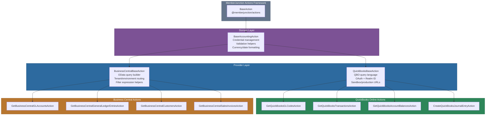

# @memberjunction/actions-bizapps-accounting

Accounting system integration actions for MemberJunction. This package provides a standardized, multi-provider interface for interacting with external accounting systems through the MemberJunction Actions framework. It currently supports QuickBooks Online and Microsoft Dynamics 365 Business Central, with a pluggable architecture for adding additional providers.

This package is part of the [BizApps Actions](../README.md) family within the broader [MemberJunction Actions Framework](../../README.md). See those parent documents for general action design principles and BizApps-level patterns.

## Architecture

The package follows a three-tier class hierarchy -- a domain base class, provider-specific base classes, and individual action implementations. Each provider encapsulates its own API interaction patterns (QBO query language for QuickBooks, OData for Business Central) while sharing credential management and validation logic.



### Credential Flow

All actions resolve credentials through a two-stage lookup. Environment variables take priority over database records, keeping secrets out of the database while allowing non-sensitive configuration (realm ID, environment name) to remain there.

```mermaid
sequenceDiagram
    participant Action as Accounting Action
    participant BAA as BaseAccountingAction
    participant Env as Environment Variables
    participant DB as CompanyIntegration Entity

    Action->>BAA: getOAuthTokens(integration)
    BAA->>Env: Check BIZAPPS_{PROVIDER}_{COMPANY_ID}_ACCESS_TOKEN
    alt Token found in env
        Env-->>BAA: Return access token + refresh token
    else Not in env
        BAA->>DB: Read AccessToken from CompanyIntegration
        alt Token valid
            DB-->>BAA: Return access token
        else Token expired or missing
            BAA-->>Action: Throw authentication error
        end
    end
    BAA-->>Action: Return { accessToken, refreshToken }

    style Action fill:#2d8659,stroke:#1a5c3a,color:#fff
    style BAA fill:#7c5295,stroke:#563a6b,color:#fff
    style Env fill:#2d6a9f,stroke:#1a4971,color:#fff
    style DB fill:#b8762f,stroke:#8a5722,color:#fff
```

## Installation

```bash
npm install @memberjunction/actions-bizapps-accounting
```

This package requires peer dependencies from the MemberJunction ecosystem. In an MJ monorepo workspace, these are resolved automatically.

## Setup

### 1. Create Integration Records

Register each accounting system as an Integration entity in the MemberJunction database.

**QuickBooks Online:**
```sql
INSERT INTO Integration (Name, Description, NavigationBaseURL, ClassName)
VALUES ('QuickBooks Online', 'QuickBooks Online Accounting Integration',
        'https://quickbooks.api.intuit.com', 'QuickBooksIntegration');
```

**Business Central:**
```sql
INSERT INTO Integration (Name, Description, NavigationBaseURL, ClassName)
VALUES ('Microsoft Dynamics 365 Business Central',
        'Business Central Accounting Integration',
        '', 'BusinessCentralIntegration');
```

### 2. Configure CompanyIntegration

Link each MJ Company to its accounting system integration.

**QuickBooks Online:**
```sql
INSERT INTO CompanyIntegration (CompanyID, IntegrationID, ExternalSystemID,
                               CustomAttribute1, IsActive)
VALUES (@CompanyID, @QuickBooksIntegrationID, @RealmID, 'production', 1);
-- ExternalSystemID = QuickBooks Realm ID
-- CustomAttribute1 = 'production' or 'sandbox'
```

**Business Central:**
```sql
INSERT INTO CompanyIntegration (CompanyID, IntegrationID, ExternalSystemID,
                               CustomAttribute1, IsActive)
VALUES (@CompanyID, @BCIntegrationID, @BCCompanyID, 'production', 1);
-- ExternalSystemID = Business Central company ID (GUID)
-- CustomAttribute1 = environment name (production, sandbox, or custom)
```

### 3. Set Environment Variables

**QuickBooks Online:**
```bash
BIZAPPS_QUICKBOOKS_ONLINE_{COMPANY_ID}_ACCESS_TOKEN=your_access_token
BIZAPPS_QUICKBOOKS_ONLINE_{COMPANY_ID}_REFRESH_TOKEN=your_refresh_token
BIZAPPS_QUICKBOOKS_ONLINE_{COMPANY_ID}_REALM_ID=your_realm_id  # Optional if stored in DB
```

**Business Central:**
```bash
BIZAPPS_BUSINESS_CENTRAL_{COMPANY_ID}_ACCESS_TOKEN=your_access_token
BIZAPPS_BUSINESS_CENTRAL_{COMPANY_ID}_REFRESH_TOKEN=your_refresh_token
BIZAPPS_BUSINESS_CENTRAL_{COMPANY_ID}_TENANT_ID=your_tenant_id
```

### Credential Priority

The system checks for credentials in this order:
1. **Environment variables** (recommended for security)
2. **Database** (CompanyIntegration entity fields -- for backward compatibility)

## Available Actions

### QuickBooks Online

| Action | Description | Type |
|--------|-------------|------|
| `GetQuickBooksGLCodesAction` | Retrieve Chart of Accounts | Read |
| `GetQuickBooksTransactionsAction` | Query transactions across multiple types | Read |
| `GetQuickBooksAccountBalancesAction` | Trial balance / account balances | Read |
| `CreateQuickBooksJournalEntryAction` | Create a balanced journal entry | Write |

### Microsoft Dynamics 365 Business Central

| Action | Description | Type |
|--------|-------------|------|
| `GetBusinessCentralGLAccountsAction` | Retrieve Chart of Accounts | Read |
| `GetBusinessCentralGeneralLedgerEntriesAction` | Query general ledger entries | Read |
| `GetBusinessCentralCustomersAction` | Retrieve customers with search/filter | Read |
| `GetBusinessCentralSalesInvoicesAction` | Query sales invoices | Read |

## Usage Examples

### Retrieve GL Codes from QuickBooks

```typescript
import { ActionEngineServer } from '@memberjunction/actions';

const engine = ActionEngineServer.Instance;
const result = await engine.RunAction({
    ActionName: 'GetQuickBooksGLCodesAction',
    Params: [
        { Name: 'CompanyID', Type: 'Input', Value: 'your-company-id' },
        { Name: 'IncludeInactive', Type: 'Input', Value: false },
        { Name: 'AccountTypes', Type: 'Input', Value: 'Bank,Expense,Income' }
    ],
    ContextUser: contextUser
});

if (result.Success) {
    const glCodes = result.Params?.find(p => p.Name === 'GLCodes')?.Value;
    const totalCount = result.Params?.find(p => p.Name === 'TotalCount')?.Value;
    console.log(`Retrieved ${totalCount} GL codes`);
}
```

### Query Transactions from QuickBooks

```typescript
const result = await engine.RunAction({
    ActionName: 'GetQuickBooksTransactionsAction',
    Params: [
        { Name: 'CompanyID', Type: 'Input', Value: 'your-company-id' },
        { Name: 'TransactionType', Type: 'Input', Value: 'Invoice' },
        { Name: 'StartDate', Type: 'Input', Value: '2025-01-01' },
        { Name: 'EndDate', Type: 'Input', Value: '2025-12-31' },
        { Name: 'MinAmount', Type: 'Input', Value: 1000 },
        { Name: 'MaxResults', Type: 'Input', Value: 50 }
    ],
    ContextUser: contextUser
});
```

### Create a Journal Entry in QuickBooks

```typescript
const lines = [
    { accountId: '80', debit: 500.00, description: 'Office supplies' },
    { accountId: '35', credit: 500.00, description: 'Cash payment' }
];

const result = await engine.RunAction({
    ActionName: 'CreateQuickBooksJournalEntryAction',
    Params: [
        { Name: 'CompanyID', Type: 'Input', Value: 'your-company-id' },
        { Name: 'Lines', Type: 'Input', Value: JSON.stringify(lines) },
        { Name: 'EntryDate', Type: 'Input', Value: '2025-06-15' },
        { Name: 'PrivateNote', Type: 'Input', Value: 'Monthly office supply purchase' }
    ],
    ContextUser: contextUser
});

if (result.Success) {
    const entryId = result.Params?.find(p => p.Name === 'JournalEntryID')?.Value;
    console.log(`Created journal entry: ${entryId}`);
}
```

### Retrieve Customers from Business Central

```typescript
const result = await engine.RunAction({
    ActionName: 'GetBusinessCentralCustomersAction',
    Params: [
        { Name: 'CompanyID', Type: 'Input', Value: 'your-company-id' },
        { Name: 'SearchText', Type: 'Input', Value: 'Contoso' },
        { Name: 'OnlyOverdue', Type: 'Input', Value: true },
        { Name: 'SortBy', Type: 'Input', Value: 'balance' },
        { Name: 'MaxResults', Type: 'Input', Value: 25 }
    ],
    ContextUser: contextUser
});
```

### Retrieve Sales Invoices from Business Central

```typescript
const result = await engine.RunAction({
    ActionName: 'GetBusinessCentralSalesInvoicesAction',
    Params: [
        { Name: 'CompanyID', Type: 'Input', Value: 'your-company-id' },
        { Name: 'Status', Type: 'Input', Value: 'Open' },
        { Name: 'OnlyUnpaid', Type: 'Input', Value: true },
        { Name: 'IncludeLines', Type: 'Input', Value: true },
        { Name: 'MaxResults', Type: 'Input', Value: 100 }
    ],
    ContextUser: contextUser
});
```

## API Reference

### Base Classes

#### `BaseAccountingAction`

Abstract base class for all accounting actions. Provides shared credential management, validation, and formatting utilities.

| Method | Description |
|--------|-------------|
| `getCompanyIntegration(companyId, contextUser)` | Looks up the CompanyIntegration record for the given company and provider |
| `getCredentialFromEnv(companyId, credentialType)` | Reads a credential from environment variables using the `BIZAPPS_{PROVIDER}_{ID}_{TYPE}` convention |
| `getOAuthTokens(integration)` | Resolves OAuth tokens from env vars first, then database fallback |
| `getAPIBaseURL(contextUser)` | Returns the NavigationBaseURL configured in the Integration entity |
| `validateAccountNumber(accountNumber)` | Basic numeric account number validation |
| `validateJournalEntryBalance(lines)` | Verifies total debits equal total credits within rounding tolerance |
| `formatCurrency(amount, currencyCode)` | Formats a number as localized currency string |
| `formatAccountingDate(date)` | Returns ISO 8601 date string (YYYY-MM-DD) |

#### `QuickBooksBaseAction`

Extends `BaseAccountingAction` for QuickBooks Online. Uses QBO query language for data retrieval and the QBO REST API for mutations.

| Method | Description |
|--------|-------------|
| `makeQBORequest<T>(endpoint, method, body, contextUser)` | Authenticated HTTP request to the QBO API |
| `queryQBO<T>(query, contextUser)` | Executes a QBO query language statement |
| `mapAccountType(qboAccountType)` | Maps QBO account types to standard categories (Asset, Liability, Equity, Revenue, Expense) |
| `parseQBODate(qboDate)` / `formatQBODate(date)` | Date conversion between QBO and JS Date |
| `getQuickBooksAPIUrl(integration)` | Resolves sandbox or production API URL |

#### `BusinessCentralBaseAction`

Extends `BaseAccountingAction` for Dynamics 365 Business Central. Uses OData v4 for all API interactions.

| Method | Description |
|--------|-------------|
| `makeBCRequest<T>(endpoint, method, body, contextUser)` | Authenticated HTTP request to the BC API |
| `queryBC<T>(resource, filters, select, expand, orderBy, top, contextUser)` | Builds and executes an OData query |
| `buildFilterExpression(field, operator, value)` | Generates an OData filter clause |
| `mapAccountType(bcAccountType)` / `mapAccountCategory(category)` | Maps BC types to standard categories |
| `parseBCDate(dateString)` / `formatBCDate(date)` | Date conversion between BC and JS Date |
| `getBusinessCentralAPIUrl(integration, tenantId, environment)` | Builds the BC API URL from tenant/environment |

### Exported Interfaces

#### QuickBooks

| Interface | Description |
|-----------|-------------|
| `GLCode` | Chart of Accounts entry with id, code, name, type, normal balance, and hierarchy info |
| `Transaction` | Transaction record with type, date, amount, status, entity reference, and line items |
| `TransactionLine` | Individual line within a transaction (amount, account, item, quantity, rate) |
| `AccountBalance` | Account balance snapshot including current balance, sub-account balance, and normal balance side |
| `JournalEntryLine` | Input structure for journal entry creation with accountId, debit/credit, entity references |

#### Business Central

| Interface | Description |
|-----------|-------------|
| `BCGLAccount` | GL account with number, category, balance, debit/credit amounts, and posting info |
| `BCGeneralLedgerEntry` | Ledger entry with posting date, document info, debit/credit amounts, and optional dimensions |
| `BCDimensionSetLine` | Dimension value attached to a GL entry |
| `BCCustomer` | Customer record with contact info, address, balance, overdue amount, and sales totals |
| `BCAddress` | Address structure (street, city, state, country code, postal code) |
| `BCSalesInvoice` | Sales invoice with dates, amounts (excluding/including tax), remaining balance, and optional lines |
| `BCSalesInvoiceLine` | Invoice line item with quantity, unit price, discount, tax, and net amounts |

### Action Parameters Reference

#### Common Parameters (all actions)

| Parameter | Type | Required | Description |
|-----------|------|----------|-------------|
| `CompanyID` | string | Yes | MemberJunction Company ID |
| `FiscalYear` | string | No | Fiscal year filter |
| `AccountingPeriod` | string | No | Accounting period filter |

#### GetQuickBooksGLCodesAction

| Parameter | Type | Default | Description |
|-----------|------|---------|-------------|
| `IncludeInactive` | boolean | `false` | Include inactive accounts |
| `AccountTypes` | string | -- | Comma-separated account types (Bank, Expense, Income, etc.) |
| `ParentAccountID` | string | -- | Filter by parent account |

**Output:** `GLCodes` (GLCode[]), `TotalCount` (number)

#### GetQuickBooksTransactionsAction

| Parameter | Type | Default | Description |
|-----------|------|---------|-------------|
| `TransactionType` | string | -- | Specific type (Invoice, Bill, Payment, JournalEntry, Deposit, Purchase) or omit for all |
| `StartDate` / `EndDate` | string | -- | Transaction date range (ISO 8601) |
| `EntityID` | string | -- | Filter by customer or vendor ID |
| `MinAmount` / `MaxAmount` | number | -- | Amount range filter |
| `MaxResults` | number | `100` | Limit results (max 1000) |

**Output:** `Transactions` (Transaction[]), `TotalCount` (number), `HasMore` (boolean)

#### GetQuickBooksAccountBalancesAction

| Parameter | Type | Default | Description |
|-----------|------|---------|-------------|
| `AsOfDate` | string | today | Balance snapshot date |
| `AccountTypes` | string | -- | Comma-separated account types |
| `IncludeInactive` | boolean | `false` | Include inactive accounts |
| `IncludeZeroBalances` | boolean | `true` | Include accounts with zero balance |
| `SummarizeByType` | boolean | `false` | Return summary grouped by account type |

**Output:** `AccountBalances` (AccountBalance[]), `TrialBalanceSummary`, `TypeSummary`, `TotalAccounts` (number)

#### CreateQuickBooksJournalEntryAction

| Parameter | Type | Default | Description |
|-----------|------|---------|-------------|
| `Lines` | JournalEntryLine[] or JSON string | -- | Journal entry lines (required, minimum 2, must balance) |
| `EntryDate` | string | today | Date of the entry |
| `DocNumber` | string | auto | Journal entry number |
| `PrivateNote` | string | -- | Internal memo |
| `AdjustmentEntry` | boolean | `false` | Mark as adjustment entry |

**Output:** `JournalEntryID` (string), `DocNumber` (string), `TotalAmount` (number), `CreatedDate` (string)

#### GetBusinessCentralGLAccountsAction

| Parameter | Type | Default | Description |
|-----------|------|---------|-------------|
| `IncludeBlocked` | boolean | `false` | Include blocked accounts |
| `AccountTypes` | string | -- | Comma-separated types (Posting, Heading, Total) |
| `Categories` | string | -- | Comma-separated categories (Assets, Liabilities, Equity, Income, Expense) |
| `MinBalance` / `MaxBalance` | number | -- | Balance range filter |
| `MaxResults` | number | `1000` | Limit results |

**Output:** `GLAccounts` (BCGLAccount[]), `TotalCount` (number), `Summary` (object)

#### GetBusinessCentralGeneralLedgerEntriesAction

| Parameter | Type | Default | Description |
|-----------|------|---------|-------------|
| `StartDate` / `EndDate` | string | -- | Posting date range |
| `AccountNumber` | string | -- | Filter by GL account number |
| `DocumentNumber` | string | -- | Filter by document number |
| `DocumentType` | string | -- | Filter by type (Payment, Invoice, etc.) |
| `MinAmount` / `MaxAmount` | number | -- | Amount range filter |
| `IncludeDimensions` | boolean | `false` | Include dimension set lines |
| `MaxResults` | number | `500` | Limit results |

**Output:** `GLEntries` (BCGeneralLedgerEntry[]), `TotalCount` (number), `Summary` (object)

#### GetBusinessCentralCustomersAction

| Parameter | Type | Default | Description |
|-----------|------|---------|-------------|
| `SearchText` | string | -- | Search by name, number, or email |
| `IncludeBlocked` | boolean | `false` | Include blocked customers |
| `CustomerType` | string | -- | Filter by Company or Person |
| `MinBalance` / `MaxBalance` | number | -- | Balance range filter |
| `OnlyOverdue` | boolean | `false` | Only customers with overdue amounts |
| `SortBy` | string | `displayName` | Sort field (displayName, number, balance, overdueAmount, lastModified) |
| `MaxResults` | number | `100` | Limit results |

**Output:** `Customers` (BCCustomer[]), `TotalCount` (number), `Summary` (object)

#### GetBusinessCentralSalesInvoicesAction

| Parameter | Type | Default | Description |
|-----------|------|---------|-------------|
| `CustomerNumber` | string | -- | Filter by customer |
| `Status` | string | -- | Filter by status (Draft, Open, Paid, etc.) |
| `StartDate` / `EndDate` | string | -- | Invoice date range |
| `DueStartDate` / `DueEndDate` | string | -- | Due date range |
| `MinAmount` / `MaxAmount` | number | -- | Amount range filter |
| `OnlyUnpaid` | boolean | `false` | Only invoices with remaining balance |
| `IncludeLines` | boolean | `true` | Include line item details |
| `MaxResults` | number | `100` | Limit results |

**Output:** `Invoices` (BCSalesInvoice[]), `TotalCount` (number), `Summary` (object)

## Adding New Providers

The package is designed for extensibility. To add support for a new accounting system:

1. Create a provider directory under `src/providers/{provider-name}/`
2. Create a provider base class extending `BaseAccountingAction`:
   ```typescript
   export abstract class NewProviderBaseAction extends BaseAccountingAction {
       protected accountingProvider = 'New Provider';
       protected integrationName = 'New Provider Full Name';

       // Implement provider-specific API methods
       protected async makeProviderRequest<T>(endpoint: string, ...): Promise<T> { ... }
   }
   ```
3. Implement individual action classes extending your provider base
4. Export the new actions and interfaces from `src/index.ts`

## Dependencies

| Package | Purpose |
|---------|---------|
| `@memberjunction/actions` | `BaseAction` class and `ActionEngineServer` |
| `@memberjunction/actions-base` | `ActionParam`, `ActionResultSimple`, `RunActionParams` types |
| `@memberjunction/core` | `Metadata`, `RunView`, `UserInfo` |
| `@memberjunction/core-entities` | `CompanyIntegrationEntity`, `IntegrationEntity` |
| `@memberjunction/global` | `@RegisterClass` decorator |

## Related Packages

- [@memberjunction/actions](../../Engine/readme.md) -- Actions execution engine
- [@memberjunction/actions-base](../../Base/README.md) -- Base classes and interfaces
- [@memberjunction/actions-bizapps-lms](../LMS/README.md) -- LMS integration actions (same BizApps pattern)
- [BizApps Overview](../README.md) -- Parent directory with shared patterns

## Development

```bash
# Build the package
cd packages/Actions/BizApps/Accounting
npm run build

# Watch mode
npm run watch
```
