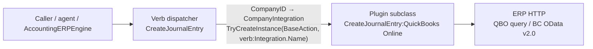
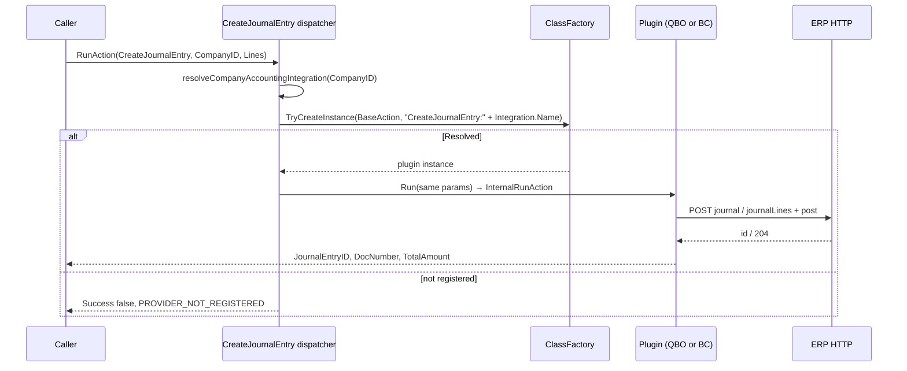
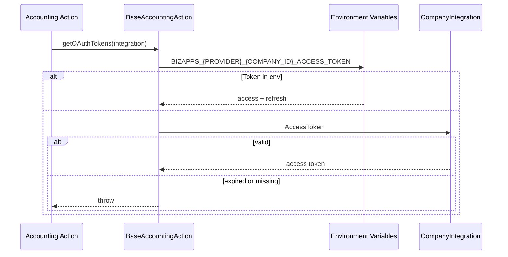

# @memberjunction/actions-bizapps-accounting

Stateless **ERP** verbs for MemberJunction. Callers and agents use a verb name
(`CreateJournalEntry`, `GetChartOfAccounts`, …) — never a vendor class name.
A dispatcher loads the company's accounting `CompanyIntegration` and forwards to
the plugin registered as `` `${verb}:${integration.Name}` ``.

This package is **HTTP plus trivial validation**. It does **not** upsert
`GLAccount`, does **not** flip journal-entry batch status, and does **not** write
`CashBalance`. Those jobs belong to Open Apps (accounting is a subledger, not
the GL). This package has zero knowledge of bizapps-accounting.

ERP is always **ERP** (acronym, caps).

Plan (domain brain, extensions, daily sync):
[erp-provider-layer.md](https://github.com/MemberJunction/bizapps-accounting/blob/next/plans/erp-provider-layer.md)
(accounting PR [#126](https://github.com/MemberJunction/bizapps-accounting/pull/126) if `next` does not have the file yet).

This package is part of the [BizApps Actions](../README.md) family.

## What these actions are (and are not)

| These actions | Not these actions |
|---|---|
| Pull chart / dimensions / balances / GL entries | Upsert `GLAccount`, `Dimension`, `DimensionValue` |
| Post one balanced journal, all-or-nothing at the ERP | Flip a Journal Entry Batch to `Posted` / stamp external id |
| Validate lines (≥ 2, debit xor credit, non-negative, balanced) | Write `CashBalance` / `CashBalanceLine` |
| Resolve credentials via `CompanyIntegration` + env-first OAuth | Own a second integration engine |

Generic Integration Actions (`IntegrationActionExecutor`) stay for object CRUD
such as “list BC customers.” They are **not** how we post a batch. Do not
migrate these verbs onto per-object CRUD.

## Call path


```mermaid
flowchart LR
  Caller["Caller / agent / AccountingERPEngine"] --> Verb["Verb dispatcher<br/>CreateJournalEntry"]
  Verb -->|"CompanyID → CompanyIntegration<br/>TryCreateInstance(BaseAction, verb:Integration.Name)"| Plugin["Plugin subclass<br/>CreateJournalEntry:QuickBooks Online"]
  Plugin --> HTTP["ERP HTTP<br/>QBO query / BC OData v2.0"]
```


```mermaid
sequenceDiagram
  participant C as Caller
  participant D as CreateJournalEntry dispatcher
  participant CF as ClassFactory
  participant P as Plugin (QBO or BC)
  participant ERP as ERP HTTP

  C->>D: RunAction(CreateJournalEntry, CompanyID, Lines)
  D->>D: resolveCompanyAccountingIntegration(CompanyID)
  D->>CF: TryCreateInstance(BaseAction, "CreateJournalEntry:" + Integration.Name)
  alt Resolved
    CF-->>D: plugin instance
    D->>P: Run(same params) → InternalRunAction
    P->>ERP: POST journal / journalLines + post
    ERP-->>P: id / 204
    P-->>C: JournalEntryID, DocNumber, TotalAmount
  else not registered
    D-->>C: Success false, PROVIDER_NOT_REGISTERED
  end
```

## Verbs and plugins

Callers use the **verb** column. Plugins are ClassFactory keys
`` `${verb}:${Integration.Name}` ``. Integration.Name must match the MJ
Integrations row exactly (`QuickBooks Online`,
`Microsoft Dynamics 365 Business Central`).

| Verb (dispatcher key) | QuickBooks Online | Business Central | Notes |
|---|---|---|---|
| `GetChartOfAccounts` | existing GL codes + `Accounts` | existing GL accounts + `Accounts` | Shared `ChartOfAccount` on output `Accounts`; old `GLCodes` / `GLAccounts` unchanged |
| `GetAccountBalances` | existing | **new** | Shared `AccountBalance`; BC `accountCode` = account number |
| `CreateJournalEntry` | existing | **new** | Shared line validation + balance check |
| `GetDimensions` | **new** | **new** | BC: `dimensions` + `dimensionValues`. QBO: Class + Department (no first-class dimensions API) |
| `GetGLEntries` | existing transactions | existing GL entries | Wrap only |
| `GetCustomers` | — | existing | Wrap; QBO → `PROVIDER_NOT_REGISTERED` |
| `GetSalesInvoices` | — | existing | Wrap; QBO → `PROVIDER_NOT_REGISTERED` |

**New in this package:** the seven dispatchers, BC `CreateJournalEntry`,
BC `GetAccountBalances`, and `GetDimensions` for both ERPs.

Backward-compat ClassFactory keys still resolve (same classes, second
`@RegisterClass`):

- `GetQuickBooksGLCodesAction`
- `GetQuickBooksTransactionsAction`
- `GetQuickBooksAccountBalancesAction`
- `CreateQuickBooksJournalEntryAction`
- `GetBusinessCentralGLAccountsAction`
- `GetBusinessCentralGeneralLedgerEntriesAction`
- `GetBusinessCentralCustomersAction`
- `GetBusinessCentralSalesInvoicesAction`

## Result codes

| ResultCode | When |
|---|---|
| `SUCCESS` | Plugin completed |
| `PROVIDER_NOT_REGISTERED` | No plugin for `` `${verb}:${integration.Name}` `` |
| `NO_ACCOUNTING_INTEGRATION` | Company has no QBO/BC `CompanyIntegration` |
| `VALIDATION_ERROR` | Missing `CompanyID`, or journal lines do not balance |
| `ERROR` | Structural line problems, missing context user, HTTP failure |

Journal **structure** (missing Lines, < 2 lines, both debit and credit, negative
amounts) still surfaces as `ERROR` with the historical messages. **Unbalanced**
debits/credits is `VALIDATION_ERROR`.

## Installation

```bash
npm install @memberjunction/actions-bizapps-accounting
```

Import the package once in the host so `@RegisterClass` runs for every
dispatcher and plugin:

```typescript
import '@memberjunction/actions-bizapps-accounting';
```

## Setup

### 1. Integration rows

`Name` is the plugin-key suffix. Do not rename without updating RegisterClass keys.

**QuickBooks Online:**

```sql
INSERT INTO Integration (Name, Description, NavigationBaseURL, ClassName)
VALUES ('QuickBooks Online', 'QuickBooks Online Accounting Integration',
        'https://quickbooks.api.intuit.com', 'QuickBooksIntegration');
```

**Business Central:**

```sql
INSERT INTO Integration (Name, Description, NavigationBaseURL, ClassName)
VALUES ('Microsoft Dynamics 365 Business Central',
        'Business Central Accounting Integration',
        '', 'BusinessCentralIntegration');
```

### 2. CompanyIntegration

One row per company per ERP. Hosts pick their ERP; this package is not married to BC.

**QuickBooks Online:** `ExternalSystemID` = Realm ID, `CustomAttribute1` = `production` or `sandbox`.

**Business Central:** `ExternalSystemID` = BC company GUID, `CustomAttribute1` = environment name.

### 3. Environment variables (preferred over database tokens)

```bash
BIZAPPS_QUICKBOOKS_ONLINE_{COMPANY_ID}_ACCESS_TOKEN=...
BIZAPPS_QUICKBOOKS_ONLINE_{COMPANY_ID}_REFRESH_TOKEN=...
BIZAPPS_QUICKBOOKS_ONLINE_{COMPANY_ID}_REALM_ID=...   # optional if stored on CompanyIntegration

BIZAPPS_BUSINESS_CENTRAL_{COMPANY_ID}_ACCESS_TOKEN=...
BIZAPPS_BUSINESS_CENTRAL_{COMPANY_ID}_REFRESH_TOKEN=...
BIZAPPS_BUSINESS_CENTRAL_{COMPANY_ID}_TENANT_ID=...
```

Lookup order: environment, then `CompanyIntegration` token fields.

## Usage

```typescript
import { ActionEngineServer } from '@memberjunction/actions';
import '@memberjunction/actions-bizapps-accounting';

const engine = ActionEngineServer.Instance;

const result = await engine.RunAction({
    ActionName: 'CreateJournalEntry',
    Params: [
        { Name: 'CompanyID', Type: 'Input', Value: companyId },
        { Name: 'EntryDate', Type: 'Input', Value: '2025-06-15' },
        { Name: 'DocNumber', Type: 'Input', Value: 'JE-100' },
        {
            Name: 'Lines',
            Type: 'Input',
            Value: [
                { accountNumber: '4010', debit: 500, description: 'Revenue' },
                { accountNumber: '1100', credit: 500, description: 'AR' },
            ],
        },
    ],
    ContextUser: contextUser,
});
```

AM-4: when posting, send **account numbers** (`accountNumber`). QBO still uses
`accountId` internally (QBO `Account.Id`); pass `accountId` for QBO lines.

`GetChartOfAccounts` / `GetAccountBalances` / `GetDimensions` take the same
`CompanyID`. Optional filters (`AsOfDate`, `IncludeInactive`, …) are forwarded
unchanged to the plugin.

Direct construction of a vendor class still works for old callers:

```typescript
import { CreateQuickBooksJournalEntryAction } from '@memberjunction/actions-bizapps-accounting';
const action = new CreateQuickBooksJournalEntryAction();
```

New code should use the verb name.

## Adding a new ERP

1. Create `src/providers/{erp}/` with a subclass of `BaseAccountingAction` that
   implements the HTTP helper (`makeXRequest`). Set `integrationName` to the
   **exact** `Integration.Name` you will insert.
2. For each verb you support, subclass the provider base and register **the
   plugin key**, not the vendor nickname:

   ```typescript
   import { RegisterClass } from '@memberjunction/global';
   import { BaseAction } from '@memberjunction/actions';
   import { ACCOUNTING_VERBS, erpPluginKey } from '@memberjunction/actions-bizapps-accounting';

   @RegisterClass(BaseAction, erpPluginKey(ACCOUNTING_VERBS.CreateJournalEntry, 'Your ERP Name'))
   export class CreateYourERPJournalEntryAction extends YourERPBaseAction {
       protected async InternalRunAction(params: RunActionParams) { /* HTTP */ }
   }
   ```

3. Export the class from `src/index.ts` so importing the package registers it.
4. Reuse `parseAndValidateJournalEntryLines` and `validateJournalEntryBalance`.
   Return `VALIDATION_ERROR` when the entry does not balance. Do not invent
   domain writes.
5. Add vitest coverage that spies the request helper. Do not hit a real ERP.
6. Hosts insert an Integration row whose `Name` equals `'Your ERP Name'`.

The dispatcher does not change. It already loads any company integration whose
`Integration.Name` is in the known ERP list — **add your name to
`ACCOUNTING_ERP_INTEGRATION_NAMES`** in `src/constants.ts` so
`resolveCompanyAccountingIntegration` will select it.

## Shared types

| Type | Role |
|---|---|
| `JournalEntryLine` | `{ accountId?, accountNumber?, debit?, credit?, description?, dimensions? }` |
| `ChartOfAccount` | `{ id, code, name, accountType, isActive }` — extra output `Accounts` |
| `AccountBalance` | `accountCode` is the ERP account number; `asOfDate` from the param |
| `Dimension` | `{ code, displayName, values: Array<{ code, displayName }> }` |

QBO `GetDimensions`: there is no dimensions API. The plugin maps **Class** and
**Department**. Empty `values` is success, not an error, when the company does
not use that list.

BC `CreateJournalEntry`: GET `journals` (param `JournalCode`, else GENERAL/DEFAULT
or first journal **without** a `balancingAccountNumber`) → POST each line to
`journals({id})/journalLines` (`amount` = +debit / −credit) → POST
`journals({id})/Microsoft.NAV.post`. If a line POST or the batch post throws,
lines created in **this call** are DELETEd so they do not sit in the journal
for the next post.

`Microsoft.NAV.post` posts the **whole BC journal**, not just this call's lines.
Two concurrent `CreateJournalEntry` calls against the same journal code can
therefore post each other's in-flight lines, and the loser gets no error. That
is BC's journal model, not a bug in the plugin. Mitigations: give each post
its own journal (`JournalCode`), or serialize posts per journal code. Do not
run overlapping posts into one shared GENERAL journal.

## Credentials (unchanged)


```mermaid
sequenceDiagram
    participant Action as Accounting Action
    participant BAA as BaseAccountingAction
    participant Env as Environment Variables
    participant DB as CompanyIntegration

    Action->>BAA: getOAuthTokens(integration)
    BAA->>Env: BIZAPPS_{PROVIDER}_{COMPANY_ID}_ACCESS_TOKEN
    alt Token in env
        Env-->>BAA: access + refresh
    else
        BAA->>DB: AccessToken
        alt valid
            DB-->>BAA: access token
        else expired or missing
            BAA-->>Action: throw
        end
    end
```

## API reference (legacy vendor actions)

Common inputs on every action: `CompanyID` (required), `FiscalYear`,
`AccountingPeriod`.

### CreateJournalEntry / CreateQuickBooksJournalEntryAction / CreateBusinessCentralJournalEntryAction

| Parameter | Type | Description |
|---|---|---|
| `Lines` | `JournalEntryLine[]` or JSON | Required, ≥ 2, must balance |
| `EntryDate` | string | Default today |
| `DocNumber` | string | Optional document number |
| `PrivateNote` | string | Memo / description |
| `JournalCode` | string | BC only — journal to post into |
| `AdjustmentEntry` | boolean | QBO only |

**Output:** `JournalEntryID`, `DocNumber`, `TotalAmount` (QBO also `CreatedDate`).

### GetChartOfAccounts

QBO also emits `GLCodes`; BC also emits `GLAccounts`. Both emit `Accounts`
(`ChartOfAccount[]`) and `TotalCount`.

### GetAccountBalances

| Parameter | Default | Description |
|---|---|---|
| `AsOfDate` | today | Snapshot date (BC returns current balance; date is stamped on the row) |
| `AccountTypes` | — | QBO account types / BC categories |
| `IncludeInactive` / `IncludeBlocked` | false | |
| `IncludeZeroBalances` | true | |

**Output:** `AccountBalances`, `TotalAccounts` (QBO also trial-balance summary).

### GetDimensions

**Output:** `Dimensions: Array<{ code, displayName, values: Array<{ code, displayName }> }>`.

### GetGLEntries / GetCustomers / GetSalesInvoices

Same filters and outputs as the historical BC/QBO actions they wrap. See the
vendor classes for parameter lists.

## Dependencies

| Package | Purpose |
|---|---|
| `@memberjunction/actions` | `BaseAction` |
| `@memberjunction/actions-base` | param / result types |
| `@memberjunction/core` | `RunView`, `UserInfo` |
| `@memberjunction/core-entities` | `CompanyIntegration`, `Integration` |
| `@memberjunction/global` | `@RegisterClass`, `ClassFactory.TryCreateInstance` |

## Related

- [erp-provider-layer.md](https://github.com/MemberJunction/bizapps-accounting/blob/next/plans/erp-provider-layer.md) — accounting engine + extension seam
- [@memberjunction/actions](../../Engine/README.md)
- [BizApps Overview](../README.md)

## Development

```bash
cd packages/Actions/BizApps/Accounting
pnpm test
pnpm run build
```

Tests spy `makeQBORequest` / `makeBCRequest` / `queryQBO`. They must not hit a
real ERP.
