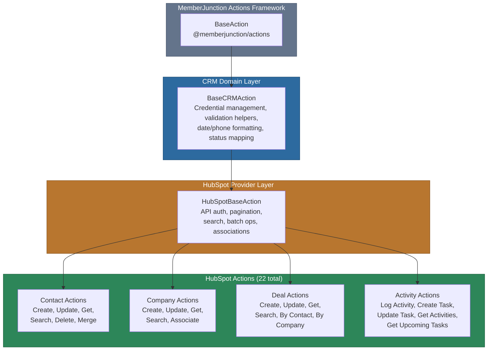
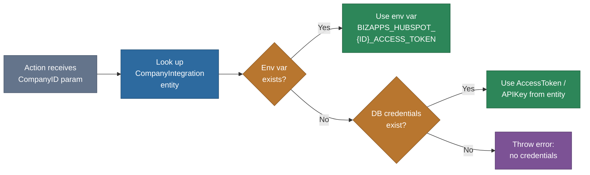

# @memberjunction/actions-bizapps-crm

Customer Relationship Management (CRM) integration actions for MemberJunction. This package provides 22 HubSpot CRM actions covering contact, company, deal, and activity management, built on a provider-extensible architecture that supports multi-tenant credential management.

This package is part of the [BizApps actions family](../README.md) within the [MemberJunction Actions Framework](../../README.md). See those documents for framework-level patterns, the action design philosophy, and shared conventions across all BizApps integrations.

## Architecture

The package uses a three-tier class hierarchy: a domain-level base class for all CRM providers, a provider-specific base class for HubSpot, and individual action classes for each operation.



### Credential Resolution Flow

All actions resolve credentials through a two-step lookup: environment variables first, database fallback second. This supports both development and production deployment patterns.



## Installation

```bash
npm install @memberjunction/actions-bizapps-crm
```

This package is server-side only. It is typically consumed by MJAPI or other server-side hosts that register actions via the MemberJunction class factory.

## Configuration

### 1. Create Integration Record

Register HubSpot as an integration in your MemberJunction database:

```sql
INSERT INTO Integration (Name, Description, NavigationBaseURL, ClassName)
VALUES ('HubSpot', 'HubSpot CRM Integration',
        'https://api.hubapi.com', 'HubSpotIntegration');
```

### 2. Link to Company

Create a CompanyIntegration record for each tenant/company that uses HubSpot:

```sql
INSERT INTO CompanyIntegration (CompanyID, IntegrationID, ExternalSystemID, IsActive)
VALUES (@CompanyID, @HubSpotIntegrationID, @HubSpotPortalID, 1);
```

### 3. Set Credentials

Credentials are resolved from environment variables first, then from database fields.

**Environment variables (recommended):**

```bash
# OAuth access token (preferred)
BIZAPPS_HUBSPOT_{COMPANY_ID}_ACCESS_TOKEN=your_access_token

# Or private app API key
BIZAPPS_HUBSPOT_{COMPANY_ID}_API_KEY=your_api_key

# Optional OAuth fields
BIZAPPS_HUBSPOT_{COMPANY_ID}_REFRESH_TOKEN=your_refresh_token
BIZAPPS_HUBSPOT_{COMPANY_ID}_CLIENT_ID=your_client_id
BIZAPPS_HUBSPOT_{COMPANY_ID}_CLIENT_SECRET=your_client_secret
```

**Database fallback:** store credentials in the `AccessToken`, `APIKey`, or `RefreshToken` columns of the CompanyIntegration entity.

## Available Actions

### Contact Management

| Action | Class | Description |
|--------|-------|-------------|
| Create Contact | `CreateContactAction` | Creates a new contact with email validation and optional company association |
| Update Contact | `UpdateContactAction` | Updates an existing contact's properties |
| Get Contact | `GetContactAction` | Retrieves a single contact by ID with optional associations |
| Search Contacts | `SearchContactsAction` | Searches contacts with filters, sorting, pagination, and date ranges |
| Delete Contact | `DeleteContactAction` | Deletes (archives) a contact |
| Merge Contacts | `MergeContactsAction` | Merges duplicate contacts into a single record |

### Company Management

| Action | Class | Description |
|--------|-------|-------------|
| Create Company | `CreateCompanyAction` | Creates a new company record |
| Update Company | `UpdateCompanyAction` | Updates an existing company's properties |
| Get Company | `GetCompanyAction` | Retrieves a single company by ID |
| Search Companies | `SearchCompaniesAction` | Searches companies with flexible filter criteria |
| Associate Contact to Company | `AssociateContactToCompanyAction` | Links contacts to companies with batch support and primary designation |

### Deal Management

| Action | Class | Description |
|--------|-------|-------------|
| Create Deal | `CreateDealAction` | Creates a new deal/opportunity |
| Update Deal | `UpdateDealAction` | Updates deal properties and pipeline stage |
| Get Deal | `GetDealAction` | Retrieves deal details with associations, timeline, and metrics |
| Search Deals | `SearchDealsAction` | Searches deals with flexible filter criteria |
| Get Deals by Contact | `GetDealsByContactAction` | Retrieves all deals associated with a contact |
| Get Deals by Company | `GetDealsByCompanyAction` | Retrieves all deals associated with a company |

### Activity Management

| Action | Class | Description |
|--------|-------|-------------|
| Log Activity | `LogActivityAction` | Logs calls, emails, meetings, or notes with contact/company/deal associations |
| Create Task | `CreateTaskAction` | Creates a task with subject, priority, due date, and owner |
| Update Task | `UpdateTaskAction` | Updates an existing task's properties |
| Get Activities by Contact | `GetActivitiesByContactAction` | Retrieves all activities for a specific contact |
| Get Upcoming Tasks | `GetUpcomingTasksAction` | Gets upcoming/overdue tasks filtered by owner, status, and priority |

## Usage Examples

### Creating a Contact

```typescript
import { ActionEngineServer } from '@memberjunction/actions';

const engine = ActionEngineServer.Instance;
const result = await engine.RunAction({
    Action: engine.Actions.find(a => a.Name === 'CreateContactAction')!,
    Params: [
        { Name: 'CompanyID', Type: 'Input', Value: 'company-uuid' },
        { Name: 'Email', Type: 'Input', Value: 'jane.doe@example.com' },
        { Name: 'FirstName', Type: 'Input', Value: 'Jane' },
        { Name: 'LastName', Type: 'Input', Value: 'Doe' },
        { Name: 'Company', Type: 'Input', Value: 'Acme Corp' },
        { Name: 'JobTitle', Type: 'Input', Value: 'VP of Sales' },
        { Name: 'LifecycleStage', Type: 'Input', Value: 'lead' },
        { Name: 'AssociateWithCompanyId', Type: 'Input', Value: 'hubspot-company-id' }
    ],
    ContextUser: contextUser
});

if (result.Success) {
    const summary = result.Params.find(p => p.Name === 'Summary')?.Value;
    console.log(`Created contact ${summary.contactId} at ${summary.portalUrl}`);
}
```

### Searching Contacts

```typescript
const result = await engine.RunAction({
    Action: engine.Actions.find(a => a.Name === 'SearchContactsAction')!,
    Params: [
        { Name: 'CompanyID', Type: 'Input', Value: 'company-uuid' },
        { Name: 'LifecycleStage', Type: 'Input', Value: 'lead' },
        { Name: 'CreatedAfter', Type: 'Input', Value: '2025-01-01' },
        { Name: 'SortBy', Type: 'Input', Value: 'createdate' },
        { Name: 'SortOrder', Type: 'Input', Value: 'DESC' },
        { Name: 'Limit', Type: 'Input', Value: 50 }
    ],
    ContextUser: contextUser
});

if (result.Success) {
    const contacts = result.Params.find(p => p.Name === 'Contacts')?.Value;
    const summary = result.Params.find(p => p.Name === 'Summary')?.Value;
    console.log(`Found ${summary.totalResults} contacts`);
    console.log('By lifecycle stage:', summary.resultStats.byLifecycleStage);
}
```

### Logging an Activity

```typescript
const result = await engine.RunAction({
    Action: engine.Actions.find(a => a.Name === 'LogActivityAction')!,
    Params: [
        { Name: 'CompanyID', Type: 'Input', Value: 'company-uuid' },
        { Name: 'ActivityType', Type: 'Input', Value: 'CALL' },
        { Name: 'Subject', Type: 'Input', Value: 'Follow-up call' },
        { Name: 'Body', Type: 'Input', Value: 'Discussed renewal terms' },
        { Name: 'Status', Type: 'Input', Value: 'COMPLETED' },
        { Name: 'DurationMilliseconds', Type: 'Input', Value: 900000 },
        { Name: 'ContactIds', Type: 'Input', Value: ['contact-id-1'] },
        { Name: 'DealIds', Type: 'Input', Value: ['deal-id-1'] }
    ],
    ContextUser: contextUser
});
```

### Retrieving a Deal with Associations

```typescript
const result = await engine.RunAction({
    Action: engine.Actions.find(a => a.Name === 'GetDealAction')!,
    Params: [
        { Name: 'CompanyID', Type: 'Input', Value: 'company-uuid' },
        { Name: 'DealId', Type: 'Input', Value: 'hubspot-deal-id' },
        { Name: 'IncludeAssociations', Type: 'Input', Value: true },
        { Name: 'IncludeTimeline', Type: 'Input', Value: true }
    ],
    ContextUser: contextUser
});

if (result.Success) {
    const summary = result.Params.find(p => p.Name === 'Summary')?.Value;
    console.log(`Deal: ${summary.dealName}, Stage: ${summary.dealStage}`);
    console.log(`Amount: ${summary.amount}, Days open: ${summary.metrics.daysOpen}`);
    console.log(`Overdue: ${summary.metrics.isOverdue}`);
}
```

### Getting Upcoming Tasks

```typescript
const result = await engine.RunAction({
    Action: engine.Actions.find(a => a.Name === 'GetUpcomingTasksAction')!,
    Params: [
        { Name: 'CompanyID', Type: 'Input', Value: 'company-uuid' },
        { Name: 'OwnerId', Type: 'Input', Value: 'owner-id' },
        { Name: 'DaysAhead', Type: 'Input', Value: 14 },
        { Name: 'IncludeOverdue', Type: 'Input', Value: true },
        { Name: 'Statuses', Type: 'Input', Value: ['NOT_STARTED', 'IN_PROGRESS'] }
    ],
    ContextUser: contextUser
});

if (result.Success) {
    const summary = result.Params.find(p => p.Name === 'Summary')?.Value;
    console.log(`Total tasks: ${summary.totalTasks}`);
    console.log(`Overdue: ${summary.overdueCount}, Due today: ${summary.dueTodayCount}`);
    console.log('By due date:', summary.byDueDate);
}
```

## API Reference

### Base Classes

#### BaseCRMAction

Abstract base class for all CRM actions. Provides:

| Method | Description |
|--------|-------------|
| `getCompanyIntegration(companyId, contextUser)` | Looks up and caches the CompanyIntegration entity for a given company |
| `getCredentialFromEnv(companyId, credentialType)` | Resolves credentials from environment variables using `BIZAPPS_{PROVIDER}_{ID}_{TYPE}` format |
| `getAPICredentials(integration)` | Resolves API credentials with env-var-first, database-fallback strategy |
| `getAPIBaseURL(integration)` | Returns the base URL for API calls (from `CustomAttribute1` or provider default) |
| `formatCRMDate(date)` | Formats a Date to ISO 8601 string |
| `parseCRMDate(dateString)` | Parses an ISO 8601 string to Date |
| `formatPhoneNumber(phone)` | Normalizes phone numbers toward E.164 format |
| `isValidEmail(email)` | Validates email format with a regex check |
| `mapDealStatus(stage)` | Maps CRM-specific deal stage names to `'open' \| 'won' \| 'lost' \| 'unknown'` |
| `mapActivityType(type)` | Maps activity type strings to `'call' \| 'email' \| 'meeting' \| 'task' \| 'note' \| 'other'` |

#### HubSpotBaseAction

Provider-specific base class extending `BaseCRMAction`. Adds HubSpot v3 API support:

| Method | Description |
|--------|-------------|
| `makeHubSpotRequest<T>(endpoint, method, body, contextUser)` | Makes an authenticated request to the HubSpot CRM v3 API |
| `makeHubSpotPaginatedRequest<T>(endpoint, params, contextUser)` | Handles cursor-based pagination with configurable `MaxResults` limit |
| `searchHubSpotObjects<T>(objectType, filters, properties, contextUser)` | Executes a HubSpot search API call with filter groups |
| `batchCreateHubSpotObjects<T>(objectType, objects, contextUser)` | Batch-creates objects in HubSpot |
| `batchUpdateHubSpotObjects<T>(objectType, updates, contextUser)` | Batch-updates objects in HubSpot |
| `associateObjects(fromType, fromId, toType, toId, assocType, contextUser)` | Creates an association between two HubSpot objects |
| `getAssociationTypeId(fromType, toType)` | Returns the default HubSpot association type ID for a given pair |
| `mapHubSpotProperties(hubspotObject)` | Flattens a HubSpot object's `properties` map alongside `id`, `createdAt`, `updatedAt`, `archived` |

### Common Parameters

Every action accepts at minimum:

| Parameter | Type | Required | Description |
|-----------|------|----------|-------------|
| `CompanyID` | Input | Yes | The MemberJunction CompanyIntegration company identifier |

Most actions also produce:

| Parameter | Type | Description |
|-----------|------|-------------|
| `Summary` | Output | Structured summary of the operation result |

### Result Codes

Actions return standardized result codes:

| Code | Meaning |
|------|---------|
| `SUCCESS` | Operation completed successfully |
| `PARTIAL_SUCCESS` | Batch operation with some failures (e.g., associating multiple contacts) |
| `VALIDATION_ERROR` | Missing or invalid input parameters |
| `DUPLICATE_CONTACT` | Contact with the given email already exists |
| `DEAL_NOT_FOUND` | Requested deal ID does not exist |
| `NOT_FOUND` | Requested resource does not exist |
| `ERROR` | General operation failure |

## Source Structure

```
src/
  index.ts                          # Package entry point
  base/
    base-crm.action.ts              # BaseCRMAction - domain base class
  providers/
    hubspot/
      index.ts                      # HubSpot provider exports
      hubspot-base.action.ts        # HubSpotBaseAction - provider base class
      actions/
        index.ts                    # Action barrel exports
        create-contact.action.ts    # Contact CRUD
        update-contact.action.ts
        get-contact.action.ts
        search-contacts.action.ts
        delete-contact.action.ts
        merge-contacts.action.ts
        create-company.action.ts    # Company management
        update-company.action.ts
        get-company.action.ts
        search-companies.action.ts
        associate-contact-to-company.action.ts
        create-deal.action.ts       # Deal management
        update-deal.action.ts
        get-deal.action.ts
        search-deals.action.ts
        get-deals-by-contact.action.ts
        get-deals-by-company.action.ts
        log-activity.action.ts      # Activity management
        create-task.action.ts
        update-task.action.ts
        get-activities-by-contact.action.ts
        get-upcoming-tasks.action.ts
```

## Dependencies

| Package | Purpose |
|---------|---------|
| `@memberjunction/actions` | `BaseAction` class and `ActionEngineServer` |
| `@memberjunction/actions-base` | `ActionParam`, `RunActionParams`, `ActionResultSimple` types |
| `@memberjunction/core` | `UserInfo`, `Metadata`, `RunView` |
| `@memberjunction/core-entities` | `CompanyIntegrationEntity` for credential lookup |
| `@memberjunction/global` | `@RegisterClass` decorator for class factory registration |

## Related Packages

- [@memberjunction/actions-bizapps-accounting](../Accounting/README.md) - Accounting system integrations (QuickBooks, etc.)
- [@memberjunction/actions-bizapps-lms](../LMS/README.md) - Learning management system integrations (LearnWorlds, etc.)
- [@memberjunction/actions](../../Engine/readme.md) - Actions execution engine
- [@memberjunction/actions-base](../../Base/README.md) - Base classes and type definitions

## Adding New Providers

To add a new CRM provider (e.g., Salesforce):

1. Create a provider directory: `src/providers/salesforce/`
2. Create a provider base class extending `BaseCRMAction`:
   - Set `crmProvider` and `integrationName`
   - Implement provider-specific authentication and request methods
3. Add individual action classes in `src/providers/salesforce/actions/`
4. Register each action with `@RegisterClass(BaseAction, 'ActionName')`
5. Export from provider `index.ts` and the package root `index.ts`
6. Configure Integration and CompanyIntegration records for the new provider
