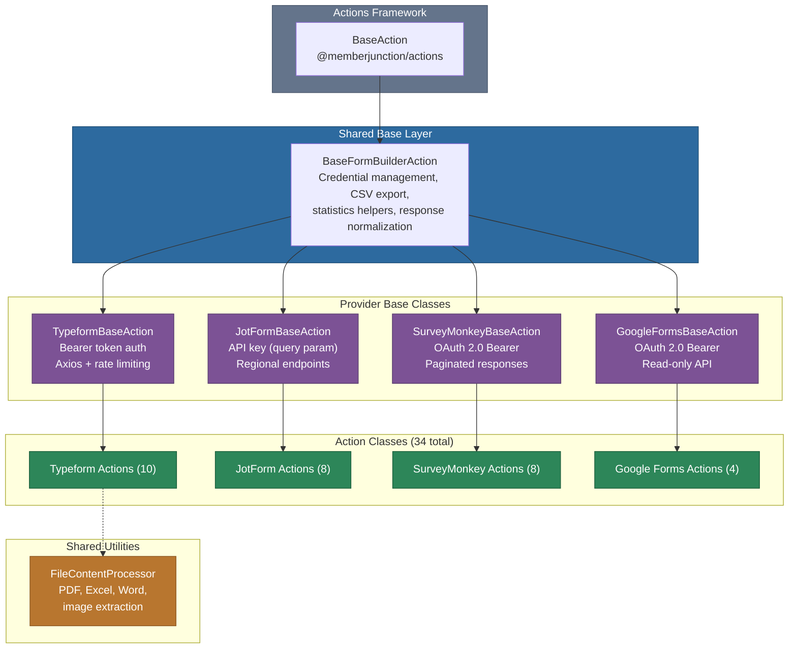
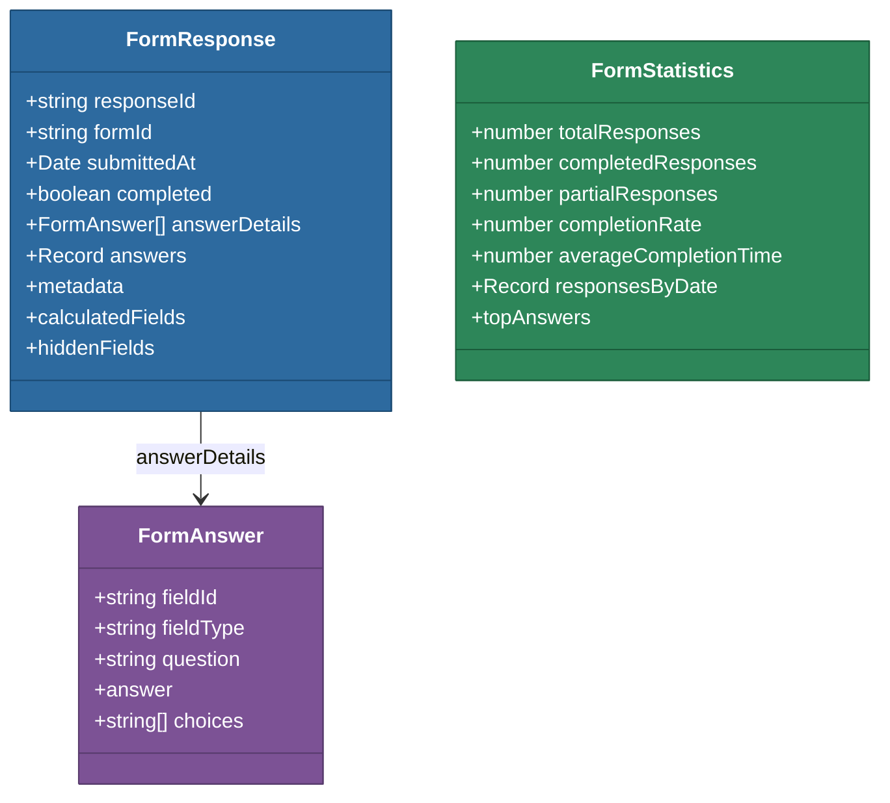

# @memberjunction/actions-bizapps-formbuilders

Form builder and survey platform integration actions for MemberJunction. This package provides a unified interface across four major form/survey platforms, enabling AI agents, workflows, and applications to programmatically retrieve responses, analyze submissions, and manage forms through the MemberJunction Actions framework.

This package is part of the [BizApps Actions](../README.md) collection within the broader [MemberJunction Actions Framework](../../README.md). For core action architecture, design philosophy, and when to use actions versus direct code, see the [Actions CLAUDE.md](../../CLAUDE.md).

## Architecture

The package follows a three-tier class hierarchy: a shared base class providing common form operations, provider-specific base classes handling API authentication and data normalization, and individual action classes implementing specific operations.



## Supported Platforms

| Platform | Auth Method | Actions | Capabilities |
|----------|------------|---------|-------------|
| **Typeform** | Bearer token (personal access token) | 10 | Full CRUD: responses, forms, file content |
| **JotForm** | API key (query parameter) | 8 | Full CRUD: submissions, forms |
| **SurveyMonkey** | OAuth 2.0 Bearer token | 8 | Full CRUD: responses, surveys, collectors |
| **Google Forms** | OAuth 2.0 Bearer token | 4 | Read-only: responses, form details |

## Installation

```bash
npm install @memberjunction/actions-bizapps-formbuilders
```

This package is part of the MemberJunction monorepo. When working within the monorepo, add the dependency to your package's `package.json` and run `npm install` at the repository root.

## Actions Reference

### Typeform Actions (10)

| Action Class | Registration Name | Description |
|-------------|------------------|-------------|
| `GetTypeformResponsesAction` | `GetTypeformResponsesAction` | Retrieve responses with filtering, pagination, and auto-paginate support |
| `GetSingleTypeformResponseAction` | `GetSingleTypeformResponseAction` | Retrieve a specific response by token |
| `GetTypeformStatisticsAction` | `GetTypeformStatisticsAction` | Calculate aggregate analytics (completion rates, distributions, top answers) |
| `ExportTypeformCSVAction` | `ExportTypeformCSVAction` | Export responses to CSV format with optional metadata |
| `WatchNewTypeformResponsesAction` | `WatchNewTypeformResponsesAction` | Poll for new submissions since a given timestamp |
| `GetTypeformAction` | `GetTypeformAction` | Retrieve complete form configuration and field definitions |
| `GetTypeformFormsAction` | `GetTypeformFormsAction` | List all forms in a workspace |
| `TypeformGetFileContentAction` | `TypeformGetFileContentAction` | Download and process file upload answers (PDF, Excel, Word, images) |
| `CreateTypeformAction` | `CreateTypeformAction` | Create new forms programmatically with fields, settings, and logic |
| `UpdateTypeformAction` | `UpdateTypeformAction` | Modify existing forms with safe merge mode |

### JotForm Actions (8)

| Action Class | Registration Name | Description |
|-------------|------------------|-------------|
| `GetJotFormSubmissionsAction` | `GetJotFormSubmissionsAction` | Retrieve submissions with filtering and pagination |
| `GetSingleJotFormSubmissionAction` | `GetSingleJotFormSubmissionAction` | Retrieve a specific submission by ID |
| `GetJotFormStatisticsAction` | `GetJotFormStatisticsAction` | Calculate aggregate analytics from submissions |
| `ExportJotFormCSVAction` | `ExportJotFormCSVAction` | Export submissions to CSV format |
| `WatchNewJotFormSubmissionsAction` | `WatchNewJotFormSubmissionsAction` | Poll for new submissions since a given timestamp |
| `GetJotFormAction` | `GetJotFormAction` | Retrieve form details and questions |
| `CreateJotFormAction` | `CreateJotFormAction` | Create new forms with questions and properties |
| `UpdateJotFormAction` | `UpdateJotFormAction` | Modify existing form configuration |

### SurveyMonkey Actions (8)

| Action Class | Registration Name | Description |
|-------------|------------------|-------------|
| `GetSurveyMonkeyResponsesAction` | `GetSurveyMonkeyResponsesAction` | Retrieve responses with date range and status filtering |
| `GetSingleSurveyMonkeyResponseAction` | `GetSingleSurveyMonkeyResponseAction` | Retrieve a specific response by ID |
| `GetSurveyMonkeyStatisticsAction` | `GetSurveyMonkeyStatisticsAction` | Calculate aggregate analytics from responses |
| `ExportSurveyMonkeyCSVAction` | `ExportSurveyMonkeyCSVAction` | Export responses to CSV format |
| `WatchNewSurveyMonkeyResponsesAction` | `WatchNewSurveyMonkeyResponsesAction` | Poll for new responses since a given timestamp |
| `GetSurveyMonkeyAction` | `GetSurveyMonkeyAction` | Retrieve survey details and configuration |
| `CreateSurveyMonkeyAction` | `CreateSurveyMonkeyAction` | Create new surveys with pages and questions |
| `UpdateSurveyMonkeyAction` | `UpdateSurveyMonkeyAction` | Modify existing survey properties |

### Google Forms Actions (4)

| Action Class | Registration Name | Description |
|-------------|------------------|-------------|
| `GetSingleGoogleFormsResponseAction` | `GetSingleGoogleFormsResponseAction` | Retrieve a specific response by ID |
| `GetGoogleFormsStatisticsAction` | `GetGoogleFormsStatisticsAction` | Calculate aggregate analytics from responses |
| `ExportGoogleFormsCSVAction` | `ExportGoogleFormsCSVAction` | Export responses to CSV format |
| `GetGoogleFormAction` | `GetGoogleFormAction` | Retrieve form details, questions, and quiz settings |

> **Note**: Google Forms API is read-only. There are no endpoints for creating or updating forms programmatically.

## Common Data Model

All providers normalize their responses into a shared `FormResponse` interface, enabling provider-agnostic processing downstream.



## Authentication and Credentials

All form builder actions use a secure credential resolution chain. Credentials are never passed as direct action parameters; instead, they are resolved from environment variables or the MemberJunction `Company Integrations` entity.

### Credential Resolution Order

1. **Environment variables** (company-specific): `BIZAPPS_{PROVIDER}_{COMPANY_ID}_{CREDENTIAL_TYPE}`
2. **Environment variables** (default): `BIZAPPS_{PROVIDER}_{CREDENTIAL_TYPE}`
3. **Database** (Company Integrations entity): `AccessToken`, `APIKey` fields

### Environment Variable Examples

```bash
# Typeform - Personal access token
export BIZAPPS_TYPEFORM_API_TOKEN=tfp_your_token_here
export BIZAPPS_TYPEFORM_12345_API_TOKEN=tfp_company_specific_token

# JotForm - API key
export BIZAPPS_JOTFORM_API_KEY=your_jotform_api_key
export BIZAPPS_JOTFORM_12345_API_KEY=company_specific_key

# SurveyMonkey - OAuth 2.0 access token
export BIZAPPS_SURVEYMONKEY_ACCESS_TOKEN=your_oauth_token

# Google Forms - OAuth 2.0 access token
export BIZAPPS_GOOGLE_FORMS_ACCESS_TOKEN=your_google_oauth_token

# OAuth2 client credentials (for token refresh)
export BIZAPPS_TYPEFORM_CLIENT_ID=your_client_id
export BIZAPPS_TYPEFORM_CLIENT_SECRET=your_client_secret
```

### Database Configuration

Store credentials in the `Company Integrations` entity linked to the appropriate Integration record:

```sql
-- 1. Create Integration record for the platform
INSERT INTO Integration (Name, Description, NavigationBaseURL, ClassName)
VALUES ('Typeform', 'Typeform form builder', 'https://api.typeform.com', 'TypeformIntegration');

-- 2. Link to Company with credentials
INSERT INTO CompanyIntegration (CompanyID, IntegrationID, AccessToken, IsActive)
VALUES (@CompanyID, @IntegrationID, 'tfp_your_token', 1);
```

## Usage Examples

### Retrieving Form Responses

```typescript
import { ActionEngineServer } from '@memberjunction/actions';

const engine = ActionEngineServer.Instance;

// Get Typeform responses with date filtering
const result = await engine.RunAction({
    Action: engine.Actions.find(a => a.Name === 'Get Typeform Responses'),
    Params: [
        { Name: 'CompanyID', Type: 'Input', Value: 'company-123' },
        { Name: 'FormID', Type: 'Input', Value: 'abc123' },
        { Name: 'Since', Type: 'Input', Value: '2024-01-01T00:00:00Z' },
        { Name: 'GetAllPages', Type: 'Input', Value: true }
    ],
    ContextUser: currentUser
});

if (result.Success) {
    const responses = result.Params.find(p => p.Name === 'Responses')?.Value;
    console.log(`Retrieved ${responses.length} responses`);
}
```

### Exporting Responses to CSV

```typescript
const exportResult = await engine.RunAction({
    Action: engine.Actions.find(a => a.Name === 'Export JotForm Responses to CSV'),
    Params: [
        { Name: 'CompanyID', Type: 'Input', Value: 'company-123' },
        { Name: 'FormID', Type: 'Input', Value: '240123456789' },
        { Name: 'IncludeMetadata', Type: 'Input', Value: true }
    ],
    ContextUser: currentUser
});

const csvData = exportResult.Params.find(p => p.Name === 'CSVData')?.Value;
```

### Creating a Form Programmatically

```typescript
const createResult = await engine.RunAction({
    Action: engine.Actions.find(a => a.Name === 'Create Typeform'),
    Params: [
        { Name: 'CompanyID', Type: 'Input', Value: 'company-123' },
        { Name: 'Title', Type: 'Input', Value: 'Customer Feedback Survey' },
        {
            Name: 'Fields', Type: 'Input', Value: [
                {
                    type: 'short_text',
                    title: 'What is your name?',
                    ref: 'name'
                },
                {
                    type: 'rating',
                    title: 'How satisfied are you?',
                    ref: 'satisfaction',
                    properties: { steps: 5, shape: 'star' }
                },
                {
                    type: 'long_text',
                    title: 'Any additional feedback?',
                    ref: 'feedback'
                }
            ]
        }
    ],
    ContextUser: currentUser
});

const formUrl = createResult.Params.find(p => p.Name === 'FormURL')?.Value;
```

### Watching for New Responses

```typescript
// Poll for new SurveyMonkey responses
const watchResult = await engine.RunAction({
    Action: engine.Actions.find(a => a.Name === 'Watch for New SurveyMonkey Responses'),
    Params: [
        { Name: 'CompanyID', Type: 'Input', Value: 'company-123' },
        { Name: 'SurveyID', Type: 'Input', Value: 'survey-456' },
        { Name: 'LastCheckedTimestamp', Type: 'Input', Value: '2024-06-01T00:00:00Z' },
        { Name: 'OnlyCompleted', Type: 'Input', Value: true }
    ],
    ContextUser: currentUser
});

const hasNew = watchResult.Params.find(p => p.Name === 'HasNewResponses')?.Value;
const newResponses = watchResult.Params.find(p => p.Name === 'NewResponses')?.Value;
```

## File Content Processing

The package includes a `FileContentProcessor` utility used by the Typeform `GetFileContentAction` to intelligently extract content from file upload answers. It supports multiple file formats:

| Format | Processing | Output |
|--------|-----------|--------|
| PDF | Text extraction via `pdf-parse` | Plain text |
| Excel (.xlsx, .xls) | Sheet parsing via `exceljs` | Structured JSON |
| Word (.docx, .doc) | Text extraction via `mammoth` | Plain text |
| Images | Base64 encoding | Base64 string (for LLM vision) |
| Text/JSON/XML/CSV | UTF-8 decoding | Plain text |
| Other binary | Base64 encoding | Base64 string |

## Error Handling

All actions return consistent error information through the `ActionResultSimple` interface:

| Result Code | Description |
|------------|-------------|
| `SUCCESS` | Operation completed successfully |
| `MISSING_FORM_ID` | Required FormID parameter was not provided |
| `MISSING_API_TOKEN` | No API credentials could be resolved |
| `MISSING_CONTEXT_USER` | Context user is required for credential lookup |
| `ERROR` | General error (check Message for details) |

Each provider automatically handles platform-specific HTTP errors:

- **401** - Invalid or expired API token
- **403** - Insufficient permissions / scope
- **404** - Form or response not found
- **429** - Rate limit exceeded (automatic retry with exponential backoff)

## Rate Limiting

All providers include built-in rate limit handling with automatic retry:

- Respects `Retry-After` headers when provided
- Falls back to 60-second wait when no header is present
- Adds 100ms delays between pagination requests to avoid hitting limits
- JotForm: Regional endpoints (US, EU, HIPAA) for data residency compliance

## Dependencies

| Package | Purpose |
|---------|---------|
| `@memberjunction/actions` | Action engine and `BaseAction` class |
| `@memberjunction/actions-base` | `ActionParam` types and base interfaces |
| `@memberjunction/core` | `RunView`, `Metadata`, `UserInfo`, logging |
| `@memberjunction/core-entities` | `CompanyIntegrationEntity` for credential lookup |
| `@memberjunction/global` | `@RegisterClass` decorator |
| `axios` | HTTP client for all provider API calls |
| `exceljs` | Excel file parsing in `FileContentProcessor` |
| `mammoth` | Word document text extraction |
| `pdf-parse` | PDF text extraction |

## Related Packages

- [@memberjunction/actions](../../Engine/readme.md) - Action execution engine
- [@memberjunction/actions-base](../../Base/README.md) - Base classes and interfaces
- [@memberjunction/core-actions](../../CoreActions/readme.md) - Pre-built core actions
- [@memberjunction/actions-bizapps-accounting](../Accounting/README.md) - Accounting integrations
- [@memberjunction/actions-bizapps-lms](../LMS/README.md) - LMS integrations
- [@memberjunction/actions-bizapps-crm](../CRM/README.md) - CRM integrations

## Adding a New Provider

To integrate a new form/survey platform:

1. Create provider directory: `src/providers/{platform}/`
2. Implement a provider base class extending `BaseFormBuilderAction` with:
   - `formPlatform` and `integrationName` properties
   - Axios instance with authentication and rate limit interceptors
   - API client methods for the provider's endpoints
   - Response normalization to the shared `FormResponse` interface
   - Provider-specific error handling
3. Create individual action classes in `src/providers/{platform}/actions/`
4. Export all classes from `src/providers/{platform}/index.ts`
5. Add the provider export to `src/index.ts`
