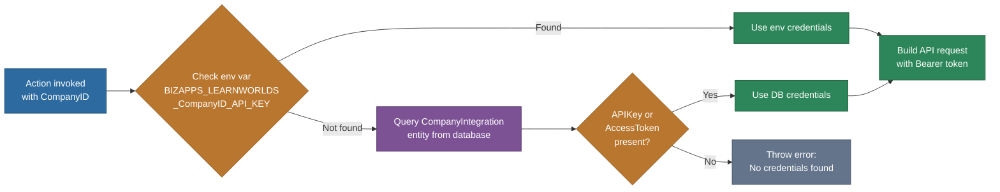

# @memberjunction/actions-bizapps-lms

Learning Management System (LMS) integration actions for MemberJunction. This package provides a standardized, multi-provider interface for interacting with LMS platforms through the MemberJunction Actions framework, currently supporting LearnWorlds with an extensible architecture for additional providers.

For general Actions framework concepts, patterns, and the "Actions as boundaries" philosophy, see the [Actions README](../../README.md) and [Actions CLAUDE.md](../../CLAUDE.md). For shared BizApps patterns (credential management, provider base classes, multi-tenant support), see the [BizApps README](../README.md).

## Architecture

The package follows a three-tier class hierarchy: a domain-level base class providing common LMS utilities, provider-specific base classes handling API authentication and communication, and individual action classes implementing specific operations.

```mermaid
graph TD
    subgraph Framework["MemberJunction Actions Framework"]
        BA[BaseAction<br/>@memberjunction/actions]
    end

    subgraph Domain["Domain Layer"]
        BLMS[BaseLMSAction<br/>Credential management<br/>Progress calculation<br/>Duration formatting<br/>Enrollment status mapping]
    end

    subgraph Provider["Provider Layer"]
        LWBase[LearnWorldsBaseAction<br/>API v2 authentication<br/>Paginated requests<br/>Date format conversion<br/>Status mapping]
    end

    subgraph Actions["LearnWorlds Actions"]
        direction LR
        UM["User Management<br/>GetUsers | GetUserDetails<br/>CreateUser | GetUserProgress"]
        CM["Course Management<br/>GetCourses | GetCourseDetails<br/>GetCourseAnalytics"]
        EM["Enrollment Management<br/>EnrollUser | GetUserEnrollments<br/>UpdateUserProgress"]
        AM["Assessment & Certs<br/>GetQuizResults<br/>GetCertificates"]
    end

    BA --> BLMS
    BLMS --> LWBase
    LWBase --> UM
    LWBase --> CM
    LWBase --> EM
    LWBase --> AM

    style Framework fill:#64748b,stroke:#475569,color:#fff
    style Domain fill:#2d6a9f,stroke:#1a4971,color:#fff
    style Provider fill:#7c5295,stroke:#563a6b,color:#fff
    style Actions fill:#2d8659,stroke:#1a5c3a,color:#fff
```

### Credential Resolution Flow

All actions resolve API credentials through a consistent two-step process, checking environment variables first with a database fallback.



## Installation

```bash
npm install @memberjunction/actions-bizapps-lms
```

This package is part of the MemberJunction monorepo. When working within the monorepo, add the dependency to your package's `package.json` and run `npm install` at the repository root.

## Setup

### 1. Create Integration Record

```sql
INSERT INTO Integration (Name, Description, NavigationBaseURL, ClassName)
VALUES ('LearnWorlds', 'LearnWorlds LMS Integration',
        'https://api.learnworlds.com', 'LearnWorldsIntegration');
```

### 2. Configure CompanyIntegration

```sql
INSERT INTO CompanyIntegration (CompanyID, IntegrationID, ExternalSystemID, IsActive)
VALUES (@CompanyID, @LearnWorldsIntegrationID, @SchoolDomain, 1);
-- ExternalSystemID: Your LearnWorlds school domain (e.g., 'myschool.learnworlds.com')
```

### 3. Set Environment Variables

```bash
# Format: BIZAPPS_LEARNWORLDS_{COMPANY_ID}_{CREDENTIAL_TYPE}
BIZAPPS_LEARNWORLDS_12345_API_KEY=lw_api_xxxxxxxxxxxxx
BIZAPPS_LEARNWORLDS_12345_SCHOOL_DOMAIN=myschool.learnworlds.com
```

## Available Actions

### User Management

| Action | Class | Description |
|--------|-------|-------------|
| Get Users | `GetLearnWorldsUsersAction` | List and search users with role, status, tag, and date filters |
| Get User Details | `GetLearnWorldsUserDetailsAction` | Comprehensive user profile with enrollments, achievements, and engagement metrics |
| Get User Progress | `GetLearnWorldsUserProgressAction` | Detailed learning progress across all courses or a specific course, with optional unit/lesson breakdown |
| Create User | `CreateUserAction` | Create a new user with optional course enrollments and welcome email |

### Course Management

| Action | Class | Description |
|--------|-------|-------------|
| Get Courses | `GetLearnWorldsCoursesAction` | Search and filter the course catalog by status, category, level, language, price range, and tags |
| Get Course Details | `GetLearnWorldsCourseDetailsAction` | Full course information including curriculum modules, instructors, and enrollment statistics |
| Get Course Analytics | `GetCourseAnalyticsAction` | Performance analytics with enrollment trends, engagement metrics, completion rates, and revenue data |

### Enrollment Management

| Action | Class | Description |
|--------|-------|-------------|
| Enroll User | `EnrollUserAction` | Enroll a user in a course with optional pricing, start/expiry dates, and notifications |
| Get User Enrollments | `GetUserEnrollmentsAction` | List all enrollments for a user with progress, course details, and summary statistics |
| Update User Progress | `UpdateUserProgressAction` | Update progress at the course or individual lesson level with score and time tracking |

### Assessment and Certificates

| Action | Class | Description |
|--------|-------|-------------|
| Get Quiz Results | `GetQuizResultsAction` | Retrieve quiz/assessment results with question-level details, answers, and accuracy metrics |
| Get Certificates | `GetCertificatesAction` | Fetch earned certificates with download links, verification codes, and expiration status |

## API Reference

### Base Classes

#### `BaseLMSAction`

Abstract base class for all LMS actions. Provides:

- **`getCompanyIntegration(companyId, contextUser)`** - Resolves the `CompanyIntegrationEntity` for the given company, with internal caching
- **`getCredentialFromEnv(companyId, credentialType)`** - Reads credentials from environment variables using the `BIZAPPS_{PROVIDER}_{COMPANY_ID}_{TYPE}` pattern
- **`getAPICredentials(integration)`** - Two-step credential resolution (environment variables first, then database)
- **`calculateProgressPercentage(completed, total)`** - Computes progress as a rounded percentage
- **`formatDuration(seconds)`** - Converts seconds to human-readable format (e.g., `2h 15m 30s`)
- **`mapEnrollmentStatus(status)`** - Normalizes provider-specific statuses to standard values: `active`, `completed`, `expired`, `suspended`, `unknown`

#### `LearnWorldsBaseAction`

LearnWorlds-specific base class extending `BaseLMSAction`. Provides:

- **`makeLearnWorldsRequest<T>(endpoint, method, body, contextUser)`** - Authenticated HTTP request to the LearnWorlds v2 API with Bearer token, error parsing, and JSON handling
- **`makeLearnWorldsPaginatedRequest<T>(endpoint, params, contextUser)`** - Auto-paginating wrapper that collects all pages of results, respecting `MaxResults` limits
- **`parseLearnWorldsDate(dateString)`** - Handles both ISO strings and Unix epoch timestamps (seconds)
- **`mapUserStatus(status)`** - Maps LearnWorlds statuses to `active | inactive | suspended`
- **`mapLearnWorldsEnrollmentStatus(enrollment)`** - Determines enrollment status from boolean flags (`completed`, `expired`, `suspended`, `active`)
- **`calculateProgress(progressData)`** - Extracts percentage, completed/total units, and time spent from LearnWorlds progress objects

### Action Parameters

Every action requires the `CompanyID` input parameter (inherited from `BaseLMSAction`). Additional parameters are action-specific, documented in the sections below.

#### GetLearnWorldsUsersAction

**Input Parameters:**

| Parameter | Type | Default | Description |
|-----------|------|---------|-------------|
| `CompanyID` | string | required | MemberJunction Company ID |
| `SearchText` | string | null | Search by name, email, or username |
| `Role` | string | null | Filter by role (student, instructor, admin) |
| `Status` | string | null | Filter by status (active, inactive, suspended) |
| `Tags` | string | null | Comma-separated tag filter |
| `CreatedAfter` | string | null | ISO date lower bound |
| `CreatedBefore` | string | null | ISO date upper bound |
| `SortBy` | string | `created` | Sort field (created, name, email, last_login) |
| `SortOrder` | string | `desc` | Sort direction (asc, desc) |
| `IncludeCourseStats` | boolean | `true` | Include enrollment statistics per user |
| `MaxResults` | number | `100` | Maximum number of users to return |

**Output Parameters:**

| Parameter | Type | Description |
|-----------|------|-------------|
| `Users` | `LearnWorldsUser[]` | Array of user objects with profile and course statistics |
| `TotalCount` | number | Total number of users returned |
| `Summary` | object | Aggregate statistics including role distribution, most active users, and recent signups |

#### GetLearnWorldsUserDetailsAction

**Input Parameters:**

| Parameter | Type | Default | Description |
|-----------|------|---------|-------------|
| `CompanyID` | string | required | MemberJunction Company ID |
| `UserID` | string | required | LearnWorlds user ID |
| `IncludeEnrollments` | boolean | `true` | Include course enrollment details |
| `IncludeStats` | boolean | `true` | Include additional learning statistics |

**Output Parameters:**

| Parameter | Type | Description |
|-----------|------|-------------|
| `UserDetails` | `LearnWorldsUserDetails` | Complete user profile with learning data, achievements, and account settings |
| `Summary` | object | Engagement overview with learning progress, achievement counts, and recent activity |

#### GetLearnWorldsUserProgressAction

**Input Parameters:**

| Parameter | Type | Default | Description |
|-----------|------|---------|-------------|
| `CompanyID` | string | required | MemberJunction Company ID |
| `UserID` | string | required | LearnWorlds user ID |
| `CourseID` | string | null | Optional specific course ID (omit for all courses) |
| `IncludeUnitDetails` | boolean | `false` | Include module/unit level breakdown |
| `IncludeLessonDetails` | boolean | `false` | Include individual lesson progress |

**Output Parameters:**

| Parameter | Type | Description |
|-----------|------|-------------|
| `UserProgress` | `UserLearningProgress` | Comprehensive progress data across all courses or a specific course |
| `Summary` | object | Overview with completion rate, current focus courses, and achievement data |

#### GetLearnWorldsCoursesAction

**Input Parameters:**

| Parameter | Type | Default | Description |
|-----------|------|---------|-------------|
| `CompanyID` | string | required | MemberJunction Company ID |
| `SearchText` | string | null | Search in title and description |
| `Status` | string | null | Filter by status (published, draft, coming_soon) |
| `CategoryID` | string | null | Filter by category ID |
| `Level` | string | null | Filter by difficulty (beginner, intermediate, advanced) |
| `Language` | string | null | Filter by course language |
| `OnlyFree` | boolean | `false` | Show only free courses |
| `MinPrice` | number | null | Minimum price filter |
| `MaxPrice` | number | null | Maximum price filter |
| `Tags` | string | null | Comma-separated tag filter |
| `InstructorID` | string | null | Filter by instructor |
| `CreatedAfter` | string | null | ISO date lower bound |
| `CreatedBefore` | string | null | ISO date upper bound |
| `SortBy` | string | `created` | Sort field (created, title, price, enrollments) |
| `SortOrder` | string | `desc` | Sort direction |
| `IncludeEnrollmentStats` | boolean | `true` | Include enrollment data |
| `MaxResults` | number | `100` | Maximum results to return |

**Output Parameters:**

| Parameter | Type | Description |
|-----------|------|-------------|
| `Courses` | `LearnWorldsCourse[]` | Array of course objects with full details |
| `TotalCount` | number | Total courses returned |
| `Summary` | `CourseCatalogSummary` | Catalog statistics with category/level/language counts, enrollment stats, and pricing |

#### GetLearnWorldsCourseDetailsAction

**Input Parameters:**

| Parameter | Type | Default | Description |
|-----------|------|---------|-------------|
| `CompanyID` | string | required | MemberJunction Company ID |
| `CourseID` | string | required | LearnWorlds course ID |
| `IncludeModules` | boolean | `true` | Include curriculum structure |
| `IncludeInstructors` | boolean | `true` | Include instructor profiles |
| `IncludeStats` | boolean | `true` | Include enrollment and completion statistics |

**Output Parameters:**

| Parameter | Type | Description |
|-----------|------|-------------|
| `CourseDetails` | object | Full course information including curriculum modules, instructor profiles, and stats |
| `Summary` | object | Key metrics overview |

#### EnrollUserAction

**Input Parameters:**

| Parameter | Type | Default | Description |
|-----------|------|---------|-------------|
| `CompanyID` | string | required | MemberJunction Company ID |
| `UserID` | string | required | LearnWorlds user ID |
| `CourseID` | string | required | Course to enroll in |
| `Price` | number | `0` | Enrollment price |
| `Justification` | string | `API Enrollment` | Reason for enrollment |
| `NotifyUser` | boolean | `true` | Send enrollment notification email |
| `StartDate` | string | null | Optional enrollment start date (ISO format) |
| `ExpiryDate` | string | null | Optional enrollment expiry date (ISO format) |

**Output Parameters:**

| Parameter | Type | Description |
|-----------|------|-------------|
| `EnrollmentDetails` | object | Enrollment record with progress tracking and certificate eligibility |
| `Summary` | object | Enrollment summary with user and course names |

#### GetUserEnrollmentsAction

**Input Parameters:**

| Parameter | Type | Default | Description |
|-----------|------|---------|-------------|
| `CompanyID` | string | required | MemberJunction Company ID |
| `UserID` | string | required | LearnWorlds user ID |
| `Status` | string | null | Filter by enrollment status |
| `IncludeExpired` | boolean | `false` | Include expired enrollments |
| `IncludeCourseDetails` | boolean | `true` | Include course metadata for each enrollment |
| `SortBy` | string | `enrolled_at` | Sort field |
| `SortOrder` | string | `desc` | Sort direction |
| `MaxResults` | number | `100` | Maximum results |

**Output Parameters:**

| Parameter | Type | Description |
|-----------|------|-------------|
| `Enrollments` | array | Enrollment records with progress, grade, and certificate data |
| `TotalCount` | number | Total enrollments found |
| `Summary` | object | Aggregate statistics by status, average progress, and total time spent |

#### UpdateUserProgressAction

**Input Parameters:**

| Parameter | Type | Default | Description |
|-----------|------|---------|-------------|
| `CompanyID` | string | required | MemberJunction Company ID |
| `UserID` | string | required | LearnWorlds user ID |
| `CourseID` | string | required | Course ID |
| `LessonID` | string | null | Optional lesson ID for lesson-level updates |
| `ProgressPercentage` | number | null | New progress percentage |
| `Completed` | boolean | null | Mark as completed |
| `TimeSpent` | number | null | Additional time spent (seconds) |
| `Score` | number | null | Score for quiz/assignment |
| `Notes` | string | null | Progress notes |

**Output Parameters:**

| Parameter | Type | Description |
|-----------|------|-------------|
| `ProgressDetails` | object | Previous and updated progress state with diff |
| `Summary` | object | Change summary including whether progress increased |

#### GetCourseAnalyticsAction

**Input Parameters:**

| Parameter | Type | Default | Description |
|-----------|------|---------|-------------|
| `CompanyID` | string | required | MemberJunction Company ID |
| `CourseID` | string | required | Course ID |
| `DateFrom` | string | null | Analytics period start date |
| `DateTo` | string | null | Analytics period end date |
| `IncludeUserBreakdown` | boolean | `false` | Include per-user progress distribution |
| `IncludeModuleStats` | boolean | `true` | Include module/lesson-level statistics |
| `IncludeRevenue` | boolean | `true` | Include revenue analytics |

**Output Parameters:**

| Parameter | Type | Description |
|-----------|------|-------------|
| `CourseAnalytics` | object | Comprehensive analytics: enrollment trends, progress distribution, engagement metrics, quiz performance, and revenue |
| `Summary` | object | Key metrics and growth/engagement trends |

#### GetCertificatesAction

**Input Parameters:**

| Parameter | Type | Default | Description |
|-----------|------|---------|-------------|
| `CompanyID` | string | required | MemberJunction Company ID |
| `UserID` | string | null | Filter by user (either UserID or CourseID required) |
| `CourseID` | string | null | Filter by course (either UserID or CourseID required) |
| `DateFrom` | string | null | Issued after date |
| `DateTo` | string | null | Issued before date |
| `IncludeDownloadLinks` | boolean | `true` | Include PDF and image download URLs |
| `SortBy` | string | `issued_at` | Sort field |
| `SortOrder` | string | `desc` | Sort direction |
| `MaxResults` | number | `100` | Maximum results |

**Output Parameters:**

| Parameter | Type | Description |
|-----------|------|-------------|
| `Certificates` | array | Certificate records with user/course info, download links, and verification data |
| `TotalCount` | number | Total certificates found |
| `Summary` | object | Active/expired counts with optional grouping by course or user |

#### GetQuizResultsAction

**Input Parameters:**

| Parameter | Type | Default | Description |
|-----------|------|---------|-------------|
| `CompanyID` | string | required | MemberJunction Company ID |
| `UserID` | string | null | Filter by user (at least one of UserID/CourseID/QuizID required) |
| `CourseID` | string | null | Filter by course |
| `QuizID` | string | null | Filter by specific quiz |
| `IncludeQuestions` | boolean | `true` | Include question text and metadata |
| `IncludeAnswers` | boolean | `true` | Include user answers with correct/incorrect analysis |
| `PassingOnly` | boolean | `false` | Return only passing attempts |
| `DateFrom` | string | null | Completed after date |
| `DateTo` | string | null | Completed before date |
| `SortBy` | string | `completed_at` | Sort field |
| `SortOrder` | string | `desc` | Sort direction |
| `MaxResults` | number | `100` | Maximum results |

**Output Parameters:**

| Parameter | Type | Description |
|-----------|------|-------------|
| `QuizResults` | array | Quiz attempts with scores, answers, accuracy metrics, and per-question breakdown |
| `TotalCount` | number | Total results found |
| `Summary` | object | Pass rate, average score, average duration, and per-quiz breakdown |

## Exported Interfaces

The package exports several TypeScript interfaces for strong typing:

- **`LearnWorldsUser`** - User profile with status, role, tags, custom fields, and course statistics
- **`LearnWorldsUserDetails`** - Extended user profile with enrollment details, achievements, and account settings
- **`UserEnrollment`** - Individual course enrollment with progress, grade, and certificate data
- **`CourseProgress`** - Detailed progress for a single course including unit-level breakdown
- **`UnitProgress`** - Progress within a course module/section
- **`LessonProgress`** - Individual lesson progress with type-specific fields (video watch time, quiz scores, assignment grades)
- **`UserLearningProgress`** - Aggregated learning progress across all courses with analytics
- **`LearnWorldsCourse`** - Full course metadata including pricing, structure, enrollment data, and learning outcomes
- **`CourseCatalogSummary`** - Catalog-level statistics with category, level, language, enrollment, and price breakdowns

## Usage Examples

### Get Active Students with Course Statistics

```typescript
import { ActionEngineServer } from '@memberjunction/actions';

const engine = ActionEngineServer.Instance;
const result = await engine.RunAction({
    ActionName: 'GetLearnWorldsUsersAction',
    Params: [
        { Name: 'CompanyID', Value: 'company-123' },
        { Name: 'Role', Value: 'student' },
        { Name: 'Status', Value: 'active' },
        { Name: 'IncludeCourseStats', Value: true },
        { Name: 'SortBy', Value: 'last_login' },
        { Name: 'SortOrder', Value: 'desc' }
    ],
    ContextUser: currentUser
});

if (result.Success) {
    const users = result.Params.find(p => p.Name === 'Users')?.Value;
    const summary = result.Params.find(p => p.Name === 'Summary')?.Value;
    console.log(`Found ${users.length} active students`);
    console.log(`Average courses per student: ${summary.averageCoursesPerUser}`);
}
```

### Track User Learning Progress

```typescript
const result = await engine.RunAction({
    ActionName: 'GetLearnWorldsUserProgressAction',
    Params: [
        { Name: 'CompanyID', Value: 'company-123' },
        { Name: 'UserID', Value: 'user-456' },
        { Name: 'IncludeUnitDetails', Value: true },
        { Name: 'IncludeLessonDetails', Value: true }
    ],
    ContextUser: currentUser
});

if (result.Success) {
    const progress = result.Params.find(p => p.Name === 'UserProgress')?.Value;
    console.log(`Completed ${progress.coursesCompleted} of ${progress.totalCourses} courses`);
    console.log(`Overall progress: ${progress.overallProgressPercentage}%`);

    for (const course of progress.courses) {
        if (course.status === 'in_progress') {
            console.log(`  ${course.courseTitle}: ${course.progressPercentage}%`);
        }
    }
}
```

### Search Course Catalog

```typescript
const result = await engine.RunAction({
    ActionName: 'GetLearnWorldsCoursesAction',
    Params: [
        { Name: 'CompanyID', Value: 'company-123' },
        { Name: 'SearchText', Value: 'JavaScript' },
        { Name: 'Status', Value: 'published' },
        { Name: 'Level', Value: 'beginner' },
        { Name: 'MaxPrice', Value: 100 }
    ],
    ContextUser: currentUser
});

if (result.Success) {
    const courses = result.Params.find(p => p.Name === 'Courses')?.Value;
    for (const course of courses) {
        console.log(`${course.title} - $${course.price} (${course.totalEnrollments} students)`);
    }
}
```

### Create User and Enroll in Courses

```typescript
const result = await engine.RunAction({
    ActionName: 'CreateUserAction',
    Params: [
        { Name: 'CompanyID', Value: 'company-123' },
        { Name: 'Email', Value: 'new.student@example.com' },
        { Name: 'FirstName', Value: 'Jane' },
        { Name: 'LastName', Value: 'Smith' },
        { Name: 'Role', Value: 'student' },
        { Name: 'SendWelcomeEmail', Value: true },
        { Name: 'EnrollInCourses', Value: ['course-101', 'course-202'] }
    ],
    ContextUser: currentUser
});

if (result.Success) {
    const summary = result.Params.find(p => p.Name === 'Summary')?.Value;
    console.log(`Created user: ${summary.email}`);
    console.log(`Enrolled in ${summary.coursesEnrolled} of ${summary.totalCoursesRequested} courses`);
}
```

## Adding New Providers

The package is designed for extensibility. To add support for a new LMS provider:

1. Create a provider directory: `src/providers/{provider-name}/`
2. Create a provider base class extending `BaseLMSAction` with provider-specific authentication and API communication
3. Implement individual action classes extending the provider base class
4. Map provider-specific data formats to the shared interfaces (`LearnWorldsUser`, `CourseProgress`, etc.)
5. Export everything from provider and actions index files
6. Re-export the new provider from `src/index.ts`

```
src/
  base/
    base-lms.action.ts          # Domain base class (shared)
  providers/
    learnworlds/                # Existing provider
      learnworlds-base.action.ts
      actions/
        get-users.action.ts
        ...
    moodle/                     # New provider
      moodle-base.action.ts
      actions/
        get-users.action.ts
        ...
  index.ts
```

## Dependencies

| Package | Purpose |
|---------|---------|
| `@memberjunction/core` | `UserInfo`, `Metadata`, `RunView` for entity access |
| `@memberjunction/global` | `@RegisterClass` decorator for action discovery |
| `@memberjunction/actions-base` | `ActionParam`, `ActionResultSimple`, `RunActionParams` types |
| `@memberjunction/actions` | `BaseAction` class that all actions extend |
| `@memberjunction/core-entities` | `CompanyIntegrationEntity` for credential/integration management |

## Related Packages

- [@memberjunction/actions](../../Engine) - Actions execution engine
- [@memberjunction/actions-base](../../Base) - Base classes and type definitions
- [@memberjunction/actions-bizapps-accounting](../Accounting) - Accounting system integrations (QuickBooks, etc.)
- [@memberjunction/actions-bizapps-crm](../CRM) - CRM system integrations

## Building

```bash
# Build this package
cd packages/Actions/BizApps/LMS
npm run build

# Watch mode for development
npm run watch
```
