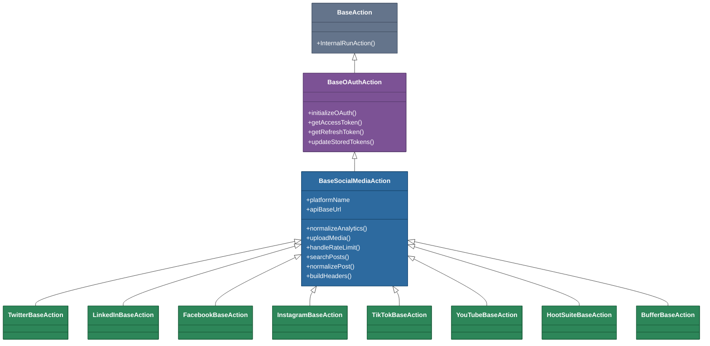
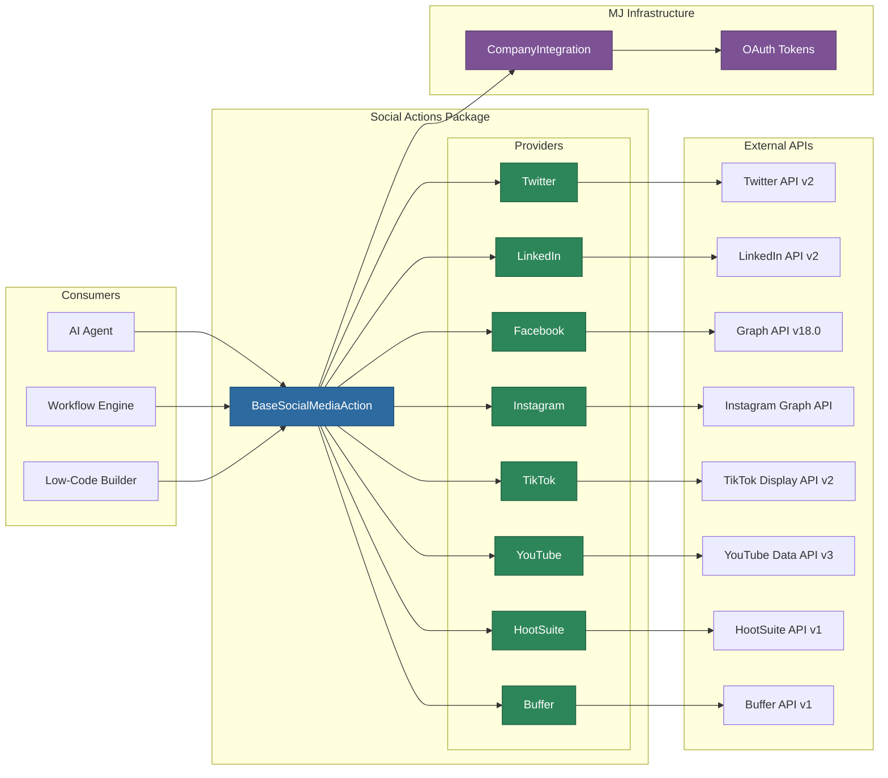

# @memberjunction/actions-bizapps-social

Social media automation actions for MemberJunction, providing a unified interface to create posts, retrieve analytics, manage content, and search across eight major platforms: Twitter/X, LinkedIn, Facebook, Instagram, TikTok, YouTube, HootSuite, and Buffer.

## Overview

This package implements the [BizApps action patterns](../README.md) from the MemberJunction Actions framework, extending the shared `BaseOAuthAction` class to provide platform-specific social media operations. Each platform has its own base class handling authentication, rate limiting, and API conventions, with individual action classes for discrete operations like creating posts, fetching analytics, and searching content.

All actions are registered via `@RegisterClass(BaseAction, ...)` for automatic discovery by MJ's metadata-driven action system, making them available to AI agents, workflow engines, and low-code environments. See the [Actions CLAUDE.md](../../CLAUDE.md) for the overall Actions design philosophy.

## Architecture

### Class Hierarchy



### Data Flow



## Installation

```bash
npm install @memberjunction/actions-bizapps-social
```

This package is part of the MemberJunction monorepo. When working within the monorepo, add the dependency to your package's `package.json` and run `npm install` from the repository root.

## Authentication

All platforms authenticate via OAuth 2.0 credentials stored in the MemberJunction `CompanyIntegration` entity. The `BaseOAuthAction` base class (from `@memberjunction/actions`) provides:

- Token retrieval from CompanyIntegration records
- Automatic token refresh when expired
- OAuth flow helpers
- Standard error handling for auth failures

### CompanyIntegration Field Mapping

| Field | Purpose |
|---|---|
| `AccessToken` | OAuth access token |
| `RefreshToken` | OAuth refresh token (where applicable) |
| `ExpirationDate` | Token expiration timestamp |
| `CustomAttribute1` | Platform account/profile ID |
| `CustomAttribute2` | OAuth Client ID / App ID |
| `CustomAttribute3` | OAuth Client Secret / App Secret |
| `CustomAttribute4` | Additional platform-specific data |

## Platform Reference

### Twitter/X

**API**: Twitter API v2 | **Rate Limits**: 15-900 requests per 15 min (varies by endpoint)

| Action | Class | Description |
|---|---|---|
| Create Tweet | `TwitterCreateTweetAction` | Post tweets with media, polls, replies, or quote tweets |
| Create Thread | `TwitterCreateThreadAction` | Post multi-tweet threads |
| Get Timeline | `TwitterGetTimelineAction` | Retrieve authenticated user's timeline |
| Get Mentions | `TwitterGetMentionsAction` | Retrieve mentions of the authenticated user |
| Get Analytics | `TwitterGetAnalyticsAction` | Retrieve tweet and account analytics |
| Schedule Tweet | `TwitterScheduleTweetAction` | Schedule a tweet for future publication |
| Delete Tweet | `TwitterDeleteTweetAction` | Delete an existing tweet |
| Search Tweets | `TwitterSearchTweetsAction` | Search tweets with full Twitter search operators |

**Media**: JPEG, PNG, GIF (15MB), WebP images (5MB); MP4 video (512MB). Chunked upload with processing status polling for videos.

### LinkedIn

**API**: LinkedIn Marketing Developer Platform v2 | **Rate Limits**: Application-level and member-level limits

| Action | Class | Description |
|---|---|---|
| Create Post | `LinkedInCreatePostAction` | Post to personal profiles or organization pages |
| Create Article | `LinkedInCreateArticleAction` | Publish long-form articles |
| Get Organization Posts | `LinkedInGetOrganizationPostsAction` | Retrieve posts from an organization page |
| Get Personal Posts | `LinkedInGetPersonalPostsAction` | Retrieve personal profile posts |
| Get Post Analytics | `LinkedInGetPostAnalyticsAction` | Retrieve analytics for specific posts |
| Get Followers | `LinkedInGetFollowersAction` | Retrieve follower information |
| Schedule Post | `LinkedInSchedulePostAction` | Schedule a post for future publication |
| Search Posts | `LinkedInSearchPostsAction` | Search organization posts |

**Media**: JPEG, PNG, GIF, WebP images (10MB). Two-step upload via asset registration.

### Facebook

**API**: Graph API v18.0 | **Rate Limits**: 200 calls per hour per user

| Action | Class | Description |
|---|---|---|
| Create Post | `FacebookCreatePostAction` | Create page or profile posts with media |
| Get Page Posts | `FacebookGetPagePostsAction` | Retrieve posts from a managed page |
| Get Post Insights | `FacebookGetPostInsightsAction` | Retrieve detailed post metrics |
| Get Page Insights | `FacebookGetPageInsightsAction` | Retrieve page-level analytics |
| Schedule Post | `FacebookSchedulePostAction` | Schedule posts for future publication |
| Create Album | `FacebookCreateAlbumAction` | Create photo albums on pages |
| Respond to Comments | `FacebookRespondToCommentsAction` | Reply to comments on posts |
| Boost Post | `FacebookBoostPostAction` | Promote posts with paid advertising |
| Search Posts | `FacebookSearchPostsAction` | Search within page posts |

**Media**: JPEG, PNG, GIF, BMP, TIFF images (4MB); MP4, MOV, MKV, WebM video (10GB). Page-specific access tokens for page operations.

### Instagram

**API**: Instagram Graph API + Basic Display API | **Rate Limits**: 200 calls per hour per user

| Action | Class | Description |
|---|---|---|
| Create Post | `InstagramCreatePostAction` | Create feed posts (image/video/carousel) |
| Create Story | `InstagramCreateStoryAction` | Create Instagram stories |
| Get Business Posts | `InstagramGetBusinessPostsAction` | Retrieve business account posts |
| Get Post Insights | `InstagramGetPostInsightsAction` | Retrieve post-level metrics |
| Get Account Insights | `InstagramGetAccountInsightsAction` | Retrieve account-level analytics |
| Get Comments | `InstagramGetCommentsAction` | Retrieve comments on posts |
| Schedule Post | `InstagramSchedulePostAction` | Schedule posts for future publication |
| Search Posts | `InstagramSearchPostsAction` | Search business account posts by caption |

**Media**: Requires publicly accessible URLs (CDN hosting). Container-based publishing workflow with status polling.

### TikTok

**API**: Display API v2 | **Rate Limits**: 1,000 requests per day

| Action | Class | Description |
|---|---|---|
| Create Video Post | `TikTokCreateVideoPostAction` | Create video posts (requires API approval) |
| Get User Videos | `TikTokGetUserVideosAction` | Retrieve authenticated user's videos |
| Get Video Analytics | `TikTokGetVideoAnalyticsAction` | Retrieve analytics for specific videos |
| Get Account Analytics | `TikTokGetAccountAnalyticsAction` | Retrieve account-level metrics |
| Get Comments | `TikTokGetCommentsAction` | Retrieve comments on videos |
| Get Trending Hashtags | `TikTokGetTrendingHashtagsAction` | Discover trending hashtags |
| Search Videos | `TikTokSearchVideosAction` | Search within user's own videos |

**Media**: Video only (MP4, MOV, WebM; max 287.6MB). Video upload requires special TikTok API approval.

### YouTube

**API**: Data API v3 | **Rate Limits**: 10,000 quota units per day

| Action | Class | Description |
|---|---|---|
| Upload Video | `YouTubeUploadVideoAction` | Upload videos with metadata and thumbnails |
| Get Channel Videos | `YouTubeGetChannelVideosAction` | Retrieve videos from a channel |
| Get Video Analytics | `YouTubeGetVideoAnalyticsAction` | Retrieve per-video analytics |
| Get Channel Analytics | `YouTubeGetChannelAnalyticsAction` | Retrieve channel-level metrics |
| Get Comments | `YouTubeGetCommentsAction` | Retrieve video comments |
| Update Video Metadata | `YouTubeUpdateVideoMetadataAction` | Update title, description, tags |
| Create Playlist | `YouTubeCreatePlaylistAction` | Create and manage playlists |
| Schedule Video | `YouTubeScheduleVideoAction` | Schedule video publication |
| Search Videos | `YouTubeSearchVideosAction` | Search channel videos with filters |

**Media**: MP4, AVI, MOV, WMV, FLV, WebM video (128GB). Resumable upload with chunked transfer. Quota-aware operations with cost tracking.

### HootSuite

**API**: Platform API v1 | **Rate Limits**: 250 requests per hour

| Action | Class | Description |
|---|---|---|
| Create Scheduled Post | `HootSuiteCreateScheduledPostAction` | Create and schedule multi-platform posts |
| Get Scheduled Posts | `HootSuiteGetScheduledPostsAction` | Retrieve scheduled post queue |
| Update Scheduled Post | `HootSuiteUpdateScheduledPostAction` | Modify a scheduled post |
| Delete Scheduled Post | `HootSuiteDeleteScheduledPostAction` | Remove a scheduled post |
| Bulk Schedule Posts | `HootSuiteBulkSchedulePostsAction` | Schedule multiple posts at once |
| Get Social Profiles | `HootSuiteGetSocialProfilesAction` | List connected social profiles |
| Get Analytics | `HootSuiteGetAnalyticsAction` | Retrieve cross-platform analytics |
| Search Posts | `HootSuiteSearchPostsAction` | Full text search across connected accounts |

**Media**: Two-step upload (request URL, then PUT file data) with processing status polling.

### Buffer

**API**: Buffer API v1 | **Rate Limits**: 600 requests per hour

| Action | Class | Description |
|---|---|---|
| Create Post | `BufferCreatePostAction` | Create posts across connected profiles |
| Get Profiles | `BufferGetProfilesAction` | List connected social profiles |
| Get Pending Posts | `BufferGetPendingPostsAction` | Retrieve queued/scheduled posts |
| Get Sent Posts | `BufferGetSentPostsAction` | Retrieve published posts |
| Get Analytics | `BufferGetAnalyticsAction` | Retrieve engagement analytics |
| Reorder Queue | `BufferReorderQueueAction` | Reorder posts in the publishing queue |
| Delete Post | `BufferDeletePostAction` | Remove a post from the queue |
| Search Posts | `BufferSearchPostsAction` | Client-side search across sent posts |

**Media**: Form-data upload returning media URLs for attachment to updates.

## Common Interfaces

All platform actions normalize data to shared interfaces defined in `BaseSocialMediaAction`:

### SocialPost

The standard format for posts across all platforms:

```typescript
interface SocialPost {
    id: string;
    platform: string;
    profileId: string;
    content: string;
    mediaUrls: string[];
    publishedAt: Date;
    scheduledFor?: Date;
    analytics?: SocialAnalytics;
    platformSpecificData: Record<string, unknown>;
}
```

### SocialAnalytics

Normalized engagement metrics:

```typescript
interface SocialAnalytics {
    impressions: number;
    engagements: number;
    clicks: number;
    shares: number;
    comments: number;
    likes: number;
    reach: number;
    saves?: number;
    videoViews?: number;
    platformMetrics: Record<string, unknown>;
}
```

### SearchParams

Unified search parameters:

```typescript
interface SearchParams {
    query?: string;
    hashtags?: string[];
    startDate?: Date;
    endDate?: Date;
    limit?: number;
    offset?: number;
}
```

### MediaFile

Standard media file representation:

```typescript
interface MediaFile {
    filename: string;
    mimeType: string;
    data: Buffer | string;  // Buffer or base64 string
    size: number;
}
```

## Usage Examples

### Creating a Tweet with Media

```typescript
import { ActionEngineServer } from '@memberjunction/actions';

const engine = ActionEngineServer.Instance;
const result = await engine.RunAction('TwitterCreateTweetAction', [
    { Name: 'CompanyIntegrationID', Value: 'integration-uuid' },
    { Name: 'Content', Value: 'Check out our latest product launch!' },
    { Name: 'MediaFiles', Value: [{
        filename: 'product.jpg',
        mimeType: 'image/jpeg',
        data: base64ImageData,
        size: 1024000
    }] }
], contextUser);

if (result.Success) {
    const tweetId = result.Params.find(p => p.Name === 'TweetID')?.Value;
    const tweetUrl = result.Params.find(p => p.Name === 'TweetURL')?.Value;
}
```

### Creating a LinkedIn Organization Post

```typescript
const result = await engine.RunAction('LinkedInCreatePostAction', [
    { Name: 'CompanyIntegrationID', Value: 'integration-uuid' },
    { Name: 'Content', Value: 'Excited to announce our new partnership!' },
    { Name: 'AuthorType', Value: 'organization' },
    { Name: 'OrganizationID', Value: 'org-12345' },
    { Name: 'Visibility', Value: 'PUBLIC' }
], contextUser);
```

### Uploading a YouTube Video

```typescript
const result = await engine.RunAction('YouTubeUploadVideoAction', [
    { Name: 'CompanyIntegrationID', Value: 'integration-uuid' },
    { Name: 'Title', Value: 'Product Demo - Q1 2025' },
    { Name: 'Description', Value: 'Full walkthrough of our latest features.' },
    { Name: 'Tags', Value: ['demo', 'product', 'tutorial'] },
    { Name: 'PrivacyStatus', Value: 'public' },
    { Name: 'VideoFile', Value: videoFileObject },
    { Name: 'NotifySubscribers', Value: true }
], contextUser);

if (result.Success) {
    const videoUrl = result.Params.find(p => p.Name === 'VideoURL')?.Value;
}
```

### Searching Historical Posts

```typescript
const result = await engine.RunAction('TwitterSearchTweetsAction', [
    { Name: 'CompanyIntegrationID', Value: 'integration-uuid' },
    { Name: 'Query', Value: 'product launch' },
    { Name: 'StartDate', Value: '2025-01-01' },
    { Name: 'EndDate', Value: '2025-06-30' },
    { Name: 'Limit', Value: 100 }
], contextUser);
```

### Multi-Platform Posting via Buffer

```typescript
const result = await engine.RunAction('BufferCreatePostAction', [
    { Name: 'CompanyIntegrationID', Value: 'integration-uuid' },
    { Name: 'ProfileIDs', Value: ['twitter-profile-id', 'linkedin-profile-id'] },
    { Name: 'Content', Value: 'Big announcement coming soon!' },
    { Name: 'ScheduledAt', Value: new Date('2025-03-15T10:00:00Z') }
], contextUser);
```

## Error Handling

All actions use a standardized error code enum for consistent error classification:

```typescript
enum SocialMediaErrorCode {
    RATE_LIMIT_EXCEEDED = 'RATE_LIMIT',
    INVALID_TOKEN = 'INVALID_TOKEN',
    TOKEN_EXPIRED = 'TOKEN_EXPIRED',
    PLATFORM_ERROR = 'PLATFORM_ERROR',
    INVALID_MEDIA = 'INVALID_MEDIA',
    POST_NOT_FOUND = 'POST_NOT_FOUND',
    INSUFFICIENT_PERMISSIONS = 'INSUFFICIENT_PERMISSIONS'
}
```

Each platform base class provides a dedicated error handler (e.g., `handleTwitterError`, `handleFacebookError`) that maps platform-specific HTTP status codes and error payloads to these standardized codes. Rate limiting is handled automatically with exponential backoff and request retry via Axios interceptors.

## Package Structure

```
src/
  index.ts                          # Package entry point
  base/
    base-social.action.ts           # BaseSocialMediaAction, interfaces, error codes
  providers/
    twitter/
      twitter-base.action.ts        # TwitterBaseAction (API v2, OAuth 2.0)
      actions/                      # 8 Twitter actions
    linkedin/
      linkedin-base.action.ts       # LinkedInBaseAction (Marketing API v2)
      actions/                      # 8 LinkedIn actions
    facebook/
      facebook-base.action.ts       # FacebookBaseAction (Graph API v18.0)
      actions/                      # 9 Facebook actions
    instagram/
      instagram-base.action.ts      # InstagramBaseAction (Graph API)
      actions/                      # 8 Instagram actions
    tiktok/
      tiktok-base.action.ts         # TikTokBaseAction (Display API v2)
      actions/                      # 7 TikTok actions
    youtube/
      youtube-base.action.ts        # YouTubeBaseAction (Data API v3)
      actions/                      # 9 YouTube actions
    hootsuite/
      hootsuite-base.action.ts      # HootSuiteBaseAction (Platform API v1)
      actions/                      # 8 HootSuite actions
    buffer/
      buffer-base.action.ts         # BufferBaseAction (Buffer API v1)
      actions/                      # 8 Buffer actions
```

**Total**: 65 action classes across 8 platform providers.

## Dependencies

| Package | Purpose |
|---|---|
| `@memberjunction/core` | Logging (`LogStatus`, `LogError`) |
| `@memberjunction/global` | `@RegisterClass` decorator for action discovery |
| `@memberjunction/actions-base` | `ActionParam`, `ActionResultSimple`, `RunActionParams` |
| `@memberjunction/actions` | `BaseAction`, `BaseOAuthAction` base classes |
| `@memberjunction/core-entities` | MJ entity type definitions |
| `axios` | HTTP client for platform API requests |
| `form-data` | Multipart form data for media uploads |

## Related Packages

- [@memberjunction/actions](../../Engine/readme.md) - Actions execution engine providing `BaseAction` and `BaseOAuthAction`
- [@memberjunction/actions-base](../../Base/README.md) - Base interfaces and type definitions
- [@memberjunction/core-actions](../../CoreActions/readme.md) - Core pre-built actions (HTTP, email, AI)
- [@memberjunction/actions-bizapps-accounting](../Accounting/README.md) - Accounting system integrations (same BizApps pattern)
- [@memberjunction/actions-bizapps-lms](../LMS/README.md) - Learning management system integrations

## Building

```bash
# From the package directory
cd packages/Actions/BizApps/Social
npm run build

# Watch mode
npm run watch
```
