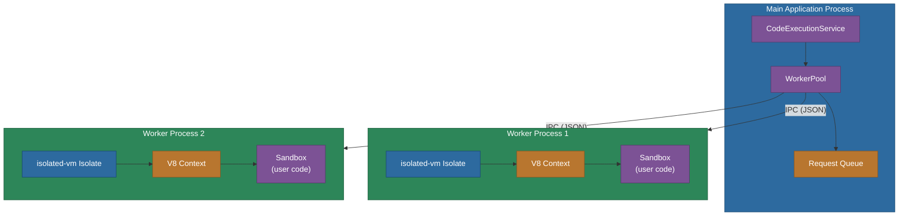
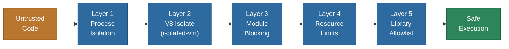
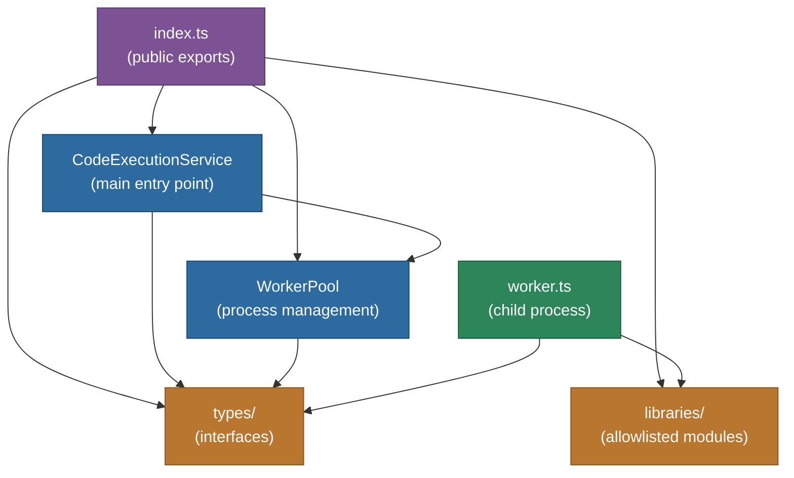
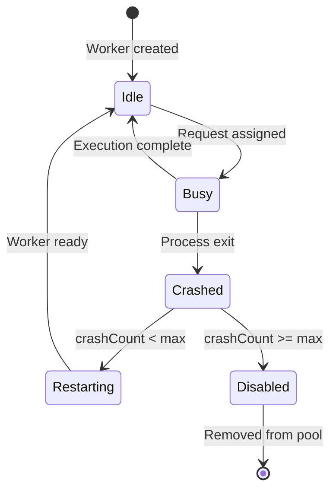

# @memberjunction/code-execution

Sandboxed JavaScript code execution service for MemberJunction AI agents and workflows. Executes untrusted code in isolated worker processes using V8 isolates (`isolated-vm`) with a defense-in-depth security model.

> **Parent package**: This package is part of the [MemberJunction Actions Framework](../README.md). For general Actions architecture, design philosophy, and the boundary between Actions and internal code, see the [parent CLAUDE.md](../CLAUDE.md).

## Overview

This package provides secure, isolated execution of JavaScript code for scenarios where AI agents or workflows need to generate and run code dynamically -- data analysis, transformations, calculations, and more. It uses a multi-layer security architecture to ensure that untrusted code cannot compromise system security or stability.

The service manages a pool of worker processes, each running code inside V8 isolates via the `isolated-vm` library. If a worker crashes due to a catastrophic error (e.g., V8 OOM), only that worker terminates and is automatically restarted -- the main application remains unaffected.

For comprehensive security analysis, threat model, and implementation details, see [security-research.md](./security-research.md).

## Installation

```bash
npm install @memberjunction/code-execution
```

This package is server-side only (Node.js). It requires the `isolated-vm` native module, which compiles during installation.

## Architecture

### Execution Flow



### Security Layers

The package uses a **defense-in-depth** approach with five independent security layers:



| Layer | Mechanism | Protects Against |
|-------|-----------|-----------------|
| Process Isolation | Workers run in separate OS processes via `child_process.fork()` | V8 catastrophic failures crashing the main app |
| V8 Isolates | Each execution runs in an isolated V8 context (`isolated-vm`) | Sandbox escape, cross-execution data leakage |
| Module Blocking | Dangerous Node.js modules blocked (`fs`, `http`, `child_process`, etc.) | Filesystem access, network requests, process spawning |
| Resource Limits | Configurable timeout and memory limits per execution | Denial-of-service via infinite loops or memory exhaustion |
| Library Allowlist | Only pre-vetted libraries available via `require()` | Supply chain attacks, unsafe library usage |

### Internal Module Structure



## Usage

### Direct TypeScript Usage

```typescript
import { CodeExecutionService } from '@memberjunction/code-execution';

// Create service with optional worker pool configuration
const service = new CodeExecutionService({
  poolSize: 2,              // Number of worker processes (default: 2)
  maxQueueSize: 100,        // Max queued requests (default: 100)
  maxCrashesPerWorker: 3,   // Crashes before marking unhealthy (default: 3)
  crashTimeWindow: 60000    // Time window for crash counting in ms (default: 60000)
});

// Initialize the worker pool (also auto-initializes on first execute)
await service.initialize();

// Execute code
const result = await service.execute({
  code: `
    const sum = input.values.reduce((a, b) => a + b, 0);
    const average = sum / input.values.length;
    output = { sum, average };
  `,
  language: 'javascript',
  inputData: { values: [10, 20, 30, 40, 50] },
  timeoutSeconds: 30,       // Optional (default: 30)
  memoryLimitMB: 128        // Optional (default: 128)
});

if (result.success) {
  console.log(result.output); // { sum: 150, average: 30 }
  console.log(result.logs);   // Any console.log output from the code
} else {
  console.error(result.error);
  console.error(result.errorType); // 'TIMEOUT' | 'MEMORY_LIMIT' | 'SYNTAX_ERROR' | etc.
}

// Check worker pool health
const stats = service.getStats();
console.log('Active workers:', stats.activeWorkers);
console.log('Busy workers:', stats.busyWorkers);
console.log('Queue length:', stats.queueLength);

// Graceful shutdown (important for clean application exit)
await service.shutdown();
```

### With MemberJunction Actions (for AI Agents)

AI agents interact with the sandbox through the "Execute Code" action:

```json
{
  "type": "Action",
  "action": {
    "name": "Execute Code",
    "params": {
      "code": "const total = input.prices.reduce((sum, p) => sum + p, 0); output = total;",
      "language": "javascript",
      "inputData": "{\"prices\": [10, 20, 30]}"
    }
  }
}
```

## API Reference

### CodeExecutionService

The main entry point for executing sandboxed code.

#### Constructor

```typescript
constructor(options?: WorkerPoolOptions)
```

| Option | Type | Default | Description |
|--------|------|---------|-------------|
| `poolSize` | `number` | `2` | Number of worker processes to maintain |
| `maxQueueSize` | `number` | `100` | Maximum requests to queue before rejecting |
| `maxCrashesPerWorker` | `number` | `3` | Crash count threshold before disabling a worker |
| `crashTimeWindow` | `number` | `60000` | Time window (ms) for crash counting |

#### Methods

| Method | Returns | Description |
|--------|---------|-------------|
| `initialize()` | `Promise<void>` | Start worker processes. Called automatically on first `execute()` if not called explicitly. |
| `execute(params)` | `Promise<CodeExecutionResult>` | Execute code in a sandboxed worker. See `CodeExecutionParams` below. |
| `getStats()` | `PoolStats` | Get current pool statistics (worker count, busy count, queue length). |
| `shutdown()` | `Promise<void>` | Gracefully terminate all workers and reject pending requests. |

### CodeExecutionParams

```typescript
interface CodeExecutionParams {
  code: string;              // JavaScript code to execute
  language: 'javascript';    // Currently only 'javascript' supported
  inputData?: unknown;       // Data available as the 'input' variable in sandbox
  timeoutSeconds?: number;   // Max execution time in seconds (default: 30)
  memoryLimitMB?: number;    // Memory limit per execution in MB (default: 128)
}
```

### CodeExecutionResult

```typescript
interface CodeExecutionResult {
  success: boolean;           // Whether execution completed without error
  output?: unknown;           // Value of the 'output' variable set by executed code
  logs?: string[];            // Captured console output (log, error, warn, info)
  error?: string;             // Error message if execution failed
  errorType?: 'TIMEOUT' | 'MEMORY_LIMIT' | 'SYNTAX_ERROR' | 'RUNTIME_ERROR' | 'SECURITY_ERROR';
  executionTimeMs?: number;   // Wall-clock execution duration in milliseconds
}
```

### WorkerPool

Manages the pool of worker processes. Typically used through `CodeExecutionService`, but can be instantiated directly for advanced use cases.

| Method | Returns | Description |
|--------|---------|-------------|
| `initialize()` | `Promise<void>` | Fork worker processes and wait for them to signal ready. |
| `execute(params)` | `Promise<CodeExecutionResult>` | Queue and execute a request in the next available worker. |
| `getStats()` | `PoolStats` | Return `totalWorkers`, `activeWorkers`, `busyWorkers`, `queueLength`. |
| `shutdown()` | `Promise<void>` | Gracefully kill all workers with SIGTERM, force-kill after 5 seconds. |

### Library Functions

| Function | Returns | Description |
|----------|---------|-------------|
| `isModuleAllowed(name)` | `boolean` | Check if a module name is in the allowlist. |
| `getAllowedModuleNames()` | `string[]` | Return all allowed module names. |
| `getLibrarySource(name)` | `string \| null` | Return the JavaScript source for a library (inline or bundled). |

## Sandbox Environment

### What Code CAN Do

- Access input data via the `input` variable
- Set output data via the `output` variable
- Use console methods (`console.log`, `console.error`, `console.warn`, `console.info`)
- Require allowed npm packages (see below)
- Perform calculations and data transformations
- Use safe built-in objects: `JSON`, `Math`, `Date`, `Array`, `Object`, `String`, `Number`, `Boolean`, `RegExp`, `Error`

### What Code CANNOT Do

- Access the filesystem (`fs`, `path` modules blocked)
- Make network requests (`http`, `https`, `net`, `axios` blocked; `fetch()` API disabled)
- Spawn processes (`child_process`, `cluster` blocked)
- Access system information (`os`, `process` blocked)
- Access environment variables
- Use `eval()` or `Function` constructor (within user code scope)
- Run indefinitely (timeout enforced)
- Exceed memory limits (per-isolate enforcement)

### Allowed Libraries

The sandbox provides a curated set of pre-vetted libraries accessible via `require()`:

| Library | Type | Description |
|---------|------|-------------|
| `lodash` | Inline subset | Array/collection/object utilities (`chunk`, `groupBy`, `sortBy`, `pick`, `omit`, `get`, `set`, `sum`, `sumBy`, `mean`, `meanBy`, `cloneDeep`, and more) |
| `date-fns` | Inline subset | Date manipulation (`format`, `addDays`, `subDays`, `addMonths`, `differenceInDays`, `isAfter`, `isBefore`, `startOfDay`, `endOfDay`, `parseISO`) |
| `mathjs` | Bundled full | Comprehensive mathematics library |
| `papaparse` | Bundled full | CSV parsing and generation |
| `jstat` | Bundled full | Statistical distributions, hypothesis testing, regression |
| `uuid` | Inline | UUID v4 generation |
| `validator` | Inline subset | String validation (`isEmail`, `isURL`, `isNumeric`, `isAlpha`, `isAlphanumeric`, `isEmpty`, `isLength`, `isIn`, `matches`) |

Libraries marked "Inline subset" are lightweight re-implementations of the most commonly used functions. Libraries marked "Bundled full" are the complete libraries loaded from pre-built JavaScript bundles.

## Error Handling

The service classifies errors into five categories:

```typescript
const result = await service.execute({
  code: 'while(true) {}',  // infinite loop
  language: 'javascript'
});

if (!result.success) {
  switch (result.errorType) {
    case 'TIMEOUT':
      // Code exceeded the configured timeout
      break;
    case 'MEMORY_LIMIT':
      // Code exceeded the configured memory limit
      break;
    case 'SYNTAX_ERROR':
      // Code has JavaScript syntax errors
      break;
    case 'RUNTIME_ERROR':
      // Code threw an unhandled exception
      break;
    case 'SECURITY_ERROR':
      // Code attempted a blocked operation (e.g., requiring 'fs')
      break;
  }
}
```

## Worker Pool Lifecycle

The worker pool implements automatic recovery with circuit breaker protection:



- **Idle**: Worker is ready to accept work.
- **Busy**: Worker is executing code. New requests are queued.
- **Crashed**: Worker process exited unexpectedly. Current request is rejected with an error.
- **Restarting**: Worker is being restarted (automatic). Crash count is tracked within the configured time window.
- **Disabled**: Too many crashes in the time window. Worker is removed from the pool to prevent crash loops.

## Examples

### Data Analysis

```typescript
const result = await service.execute({
  code: `
    const _ = require('lodash');

    const metrics = {
      totalSales: _.sumBy(input.sales, 'amount'),
      avgSale: _.meanBy(input.sales, 'amount'),
      topProducts: _.chain(input.sales)
        .groupBy('product')
        .map((items, product) => ({
          product,
          revenue: _.sumBy(items, 'amount')
        }))
        .sortBy(x => -x.revenue)
        .take(5)
        .value()
    };

    output = metrics;
  `,
  language: 'javascript',
  inputData: {
    sales: [
      { product: 'Widget', amount: 100 },
      { product: 'Gadget', amount: 200 },
      { product: 'Widget', amount: 150 }
    ]
  }
});
```

### Date Manipulation

```typescript
const result = await service.execute({
  code: `
    const { format, addDays, differenceInDays } = require('date-fns');

    const start = new Date(input.startDate);
    const end = new Date(input.endDate);

    output = {
      duration: differenceInDays(end, start),
      milestones: [
        format(addDays(start, 30), 'yyyy-MM-dd'),
        format(addDays(start, 60), 'yyyy-MM-dd'),
        format(addDays(start, 90), 'yyyy-MM-dd')
      ]
    };
  `,
  language: 'javascript',
  inputData: {
    startDate: '2025-01-01',
    endDate: '2025-12-31'
  }
});
```

### CSV Processing

```typescript
const result = await service.execute({
  code: `
    const Papa = require('papaparse');

    const parsed = Papa.parse(input.csvData, {
      header: true,
      dynamicTyping: true
    });

    const processed = parsed.data
      .filter(row => row.status === 'active')
      .map(row => ({
        id: row.id,
        name: row.name,
        value: row.value * 1.1 // 10% markup
      }));

    output = processed;
  `,
  language: 'javascript',
  inputData: {
    csvData: 'id,name,value,status\\n1,Item A,100,active\\n2,Item B,200,inactive'
  }
});
```

### Statistical Analysis

```typescript
const result = await service.execute({
  code: `
    const math = require('mathjs');

    const values = input.measurements;
    output = {
      mean: math.mean(values),
      median: math.median(values),
      std: math.std(values),
      variance: math.variance(values),
      min: math.min(values),
      max: math.max(values)
    };
  `,
  language: 'javascript',
  inputData: {
    measurements: [23.1, 24.5, 22.8, 25.0, 23.7, 24.2, 22.9]
  }
});
```

## Best Practices

1. **Initialize Once**: Create a single `CodeExecutionService` instance and reuse it across your application. The worker pool is shared and handles concurrency internally.
2. **Shutdown Gracefully**: Call `service.shutdown()` during application shutdown to terminate workers cleanly and reject pending requests.
3. **Set Appropriate Timeouts**: Adjust `timeoutSeconds` based on expected workload. Short timeouts (5-10s) for simple calculations, longer (30-60s) for complex data processing.
4. **Validate Input Data**: Ensure input data is JSON-serializable and in the expected format before execution. All data crosses an IPC boundary via JSON serialization.
5. **Check Result Success**: Always check `result.success` before accessing `result.output`. Errors are returned in the result object, not thrown as exceptions.
6. **Monitor Pool Health**: Use `service.getStats()` to monitor worker health and queue depth in production.
7. **Use Console Logging**: Add `console.log()` statements in sandbox code for debugging. Output is captured in `result.logs`.
8. **Leverage Libraries**: Use the provided allowlisted libraries (lodash, date-fns, mathjs, etc.) rather than reimplementing common operations.
9. **Keep Code Synchronous**: The sandbox does not support `async/await` or Promises. All code must be synchronous.

## Dependencies

| Package | Purpose |
|---------|---------|
| `@memberjunction/core` | MJ core framework (logging via `LogError`, `LogStatus`) |
| `@memberjunction/global` | MJ global utilities |
| `isolated-vm` | V8 isolate-based sandboxing (native module) |
| `lodash` | Source for inline lodash subset |
| `date-fns` | Source for inline date-fns subset |
| `mathjs` | Bundled for sandbox use |
| `papaparse` | Bundled for sandbox use |
| `uuid` | Source for inline UUID implementation |
| `validator` | Source for inline validator subset |

## Related Packages

- [@memberjunction/core-actions](../CoreActions) - Pre-built actions including the "Execute Code" action that wraps this service
- [@memberjunction/actions-base](../Base) - Base classes for the Actions framework
- [@memberjunction/actions](../Engine) - Server-side action execution engine

## Limitations

- **Language Support**: Currently only JavaScript. Python support may be added in the future.
- **Async Code**: No support for `async/await` or Promises. Sandbox code must be synchronous.
- **Library Expansion**: Adding new libraries requires code changes to the allowlist; they are not configurable at runtime.
- **Throughput**: Approximately 100-200 executions per second per worker. Use `poolSize` configuration or horizontal scaling for higher loads.
- **Data Size**: All input/output data crosses an IPC boundary via JSON serialization, so extremely large payloads may impact performance.

## License

MIT
