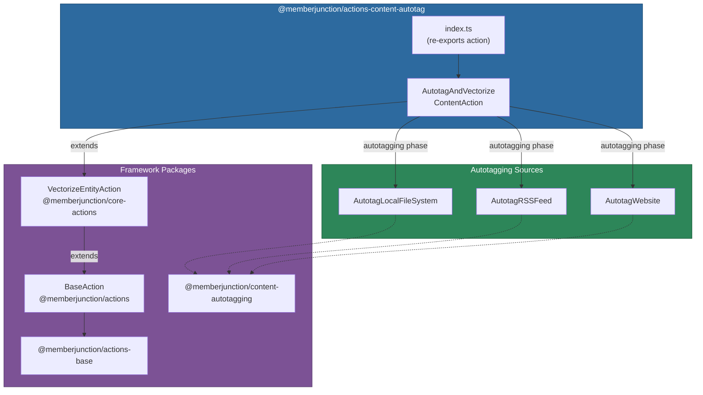
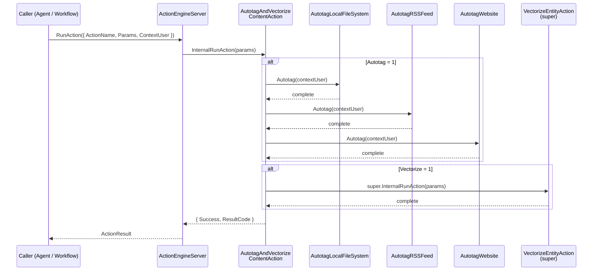

# @memberjunction/actions-content-autotag

The `@memberjunction/actions-content-autotag` package provides a single MemberJunction action that combines content autotagging with entity vectorization. It automatically tags content from three source types -- local file systems, RSS feeds, and websites -- and then optionally creates vector embeddings for semantic search and AI-powered retrieval.

For background on the MemberJunction Actions design philosophy (thin wrappers, direct service imports, composition over inheritance), see the [parent Actions CLAUDE.md](../CLAUDE.md).

**Server-side only** -- this package depends on Node.js APIs, database access, and server-side MJ infrastructure. Do not import it from Angular or other client-side code.

## Installation

```bash
npm install @memberjunction/actions-content-autotag
```

This package is part of the MemberJunction monorepo. When working inside the monorepo, add the dependency to your package's `package.json` and run `npm install` at the repository root.

## Architecture

The package contains a single action class that inherits from `VectorizeEntityAction` (in `@memberjunction/core-actions`) and adds an autotagging phase before the inherited vectorization logic. During the autotagging phase, three content-source processors from `@memberjunction/content-autotagging` are executed sequentially.



### Inheritance Chain

`AutotagAndVectorizeContentAction` extends `VectorizeEntityAction` rather than `BaseAction` directly. When the `Vectorize` parameter is enabled, the action delegates to `super.InternalRunAction()` to perform entity vectorization via the `EntityVectorSyncer` from `@memberjunction/ai-vector-sync`.

### Registration

The action is registered with the MJ class factory using:

```typescript
@RegisterClass(BaseAction, "__AutotagAndVectorizeContent")
```

This makes it discoverable at runtime by AI agents, workflow engines, and the `ActionEngineServer`.

## Execution Flow



## API Reference

### AutotagAndVectorizeContentAction

The single exported action class. Extends `VectorizeEntityAction` from `@memberjunction/core-actions`.

#### Action Parameters

| Parameter | Type | Required | Description |
|---|---|---|---|
| `Autotag` | `number` | Yes | Set to `1` to run the autotagging phase, `0` to skip |
| `Vectorize` | `number` | Yes | Set to `1` to run the vectorization phase, `0` to skip |
| `EntityNames` | `string` | When `Vectorize = 1` | Comma-separated list of entity names to vectorize (passed to parent `VectorizeEntityAction`) |

#### Return Value

Returns an `ActionResultSimple` with:

| Property | Type | Description |
|---|---|---|
| `Success` | `boolean` | `true` if both enabled phases completed without errors |
| `Message` | `string` | Error details if the action failed |
| `ResultCode` | `string` | `"SUCCESS"` or `"FAILED"` |

#### Autotagging Phase

When `Autotag = 1`, three content-source processors execute sequentially:

1. **AutotagLocalFileSystem** -- processes files from configured local directories
2. **AutotagRSSFeed** -- processes articles from configured RSS feed URLs
3. **AutotagWebsite** -- crawls and processes content from configured websites

Each processor reads its configuration from MemberJunction Content Source metadata. See `@memberjunction/content-autotagging` for source configuration details.

#### Vectorization Phase

When `Vectorize = 1`, the action calls `super.InternalRunAction(params)` which delegates to `VectorizeEntityAction`. That action parses the `EntityNames` parameter, looks up associated Entity Documents, and uses `EntityVectorSyncer` from `@memberjunction/ai-vector-sync` to create vector embeddings.

## Usage Examples

### Autotag and Vectorize (Full Pipeline)

```typescript
import { ActionEngineServer } from '@memberjunction/actions';

const engine = ActionEngineServer.Instance;

const result = await engine.RunAction({
    ActionName: '__AutotagAndVectorizeContent',
    Params: [
        { Name: 'Autotag', Value: 1 },
        { Name: 'Vectorize', Value: 1 },
        { Name: 'EntityNames', Value: 'Documents,Articles,KnowledgeBase' }
    ],
    ContextUser: currentUser
});

if (result.Success) {
    console.log('Content autotagging and vectorization completed successfully');
} else {
    console.error('Action failed:', result.Message);
}
```

### Autotag Only

```typescript
const result = await engine.RunAction({
    ActionName: '__AutotagAndVectorizeContent',
    Params: [
        { Name: 'Autotag', Value: 1 },
        { Name: 'Vectorize', Value: 0 }
    ],
    ContextUser: currentUser
});
```

### Vectorize Only

```typescript
const result = await engine.RunAction({
    ActionName: '__AutotagAndVectorizeContent',
    Params: [
        { Name: 'Autotag', Value: 0 },
        { Name: 'Vectorize', Value: 1 },
        { Name: 'EntityNames', Value: 'Documents' }
    ],
    ContextUser: currentUser
});
```

### Direct Class Instantiation

While action execution through the engine is preferred, the class can also be used directly:

```typescript
import { AutotagAndVectorizeContentAction } from '@memberjunction/actions-content-autotag';

const action = new AutotagAndVectorizeContentAction();
const result = await action.RunAction({
    ActionName: '__AutotagAndVectorizeContent',
    ContextUser: currentUser,
    Params: [
        { Name: 'Autotag', Value: 1 },
        { Name: 'Vectorize', Value: 1 },
        { Name: 'EntityNames', Value: 'Documents,Articles' }
    ]
});
```

## Error Handling

The action catches all errors during execution and returns them in the result object rather than throwing exceptions:

- **Missing parameters**: Throws an error if either `Autotag` or `Vectorize` params are not provided
- **Processing errors**: Any error during autotagging or vectorization is caught and returned with `Success: false` and `ResultCode: "FAILED"`
- **Partial execution**: If autotagging succeeds but vectorization fails (or vice versa), the error from the failing phase is returned

## Dependencies

### MemberJunction Packages

| Package | Purpose |
|---|---|
| `@memberjunction/actions` | `BaseAction` base class (transitive via `VectorizeEntityAction`) |
| `@memberjunction/actions-base` | `ActionResultSimple`, `RunActionParams`, `ActionParam` type definitions |
| `@memberjunction/core` | Core MJ framework, `UserInfo`, metadata access |
| `@memberjunction/core-actions` | `VectorizeEntityAction` parent class |
| `@memberjunction/core-entities` | Entity type definitions |
| `@memberjunction/content-autotagging` | `AutotagLocalFileSystem`, `AutotagRSSFeed`, `AutotagWebsite` processors |
| `@memberjunction/global` | `RegisterClass` decorator for MJ class factory registration |

### Third-Party Libraries

| Library | Purpose |
|---|---|
| `axios` | HTTP requests (used by content source processors) |

## Related Packages

- **[@memberjunction/core-actions](../CoreActions/README.md)** -- Contains `VectorizeEntityAction` (the parent class) and 100+ other core actions
- **[@memberjunction/actions-base](../Base/README.md)** -- Shared types and metadata engine
- **[@memberjunction/actions](../Engine/README.md)** -- Server-side action execution engine and `BaseAction`
- **[@memberjunction/content-autotagging](../../ContentAutotagging/)** -- Content source processors and autotagging engine
- **[@memberjunction/ai-vector-sync](../../AI/Vectors/Sync/)** -- Vector embedding synchronization used by the vectorization phase
- **[Parent Actions CLAUDE.md](../CLAUDE.md)** -- Design philosophy and development guidelines for all action packages
