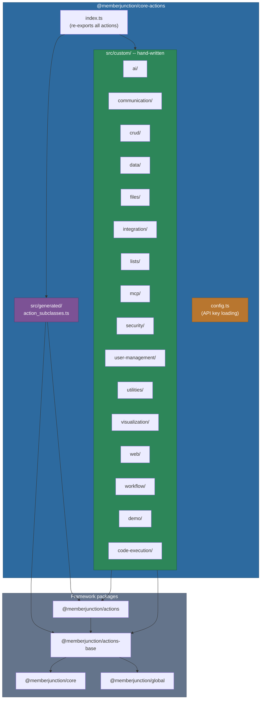
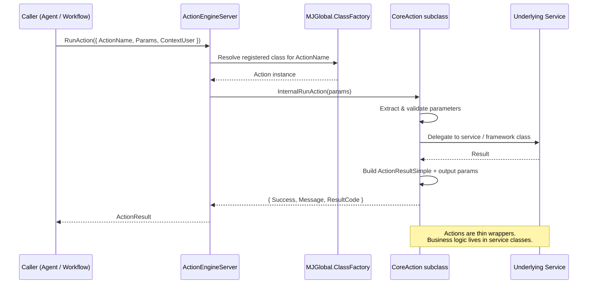

# @memberjunction/core-actions

The `@memberjunction/core-actions` package provides a comprehensive library of 100+ pre-built actions for the MemberJunction Actions framework. These actions cover AI integration, CRUD operations, communication, data transformation, file handling, visualization, workflow control, web interaction, and more. Each action is registered via `@RegisterClass(BaseAction, ...)` so it can be discovered and invoked by AI agents, workflow engines, and automation systems at runtime.

For background on when and how to use Actions vs. direct class imports, and the "thin wrapper" design philosophy, see the [parent Actions CLAUDE.md](../CLAUDE.md).

**Server-side only** -- this package depends on Node.js APIs, database access, and server-side MJ infrastructure. Do not import it from Angular or other client-side code.

## Installation

```bash
npm install @memberjunction/core-actions
```

This package is part of the MemberJunction monorepo. When working inside the monorepo, add the dependency to your package's `package.json` and run `npm install` at the repository root.

## Architecture

The package is organized into two layers: hand-written **custom actions** grouped by domain, and **generated actions** produced by the MJ CodeGen system. Both extend `BaseAction` from `@memberjunction/actions` and register themselves with the MJ class factory.



### Base Classes

Several abstract base classes reduce duplication across related actions:

| Base Class | Location | Purpose |
|---|---|---|
| `BaseRecordMutationAction` | `crud/base-record-mutation.action.ts` | Shared parameter extraction, entity loading, error analysis for Create/Update/Delete |
| `BaseFileStorageAction` | `files/base-file-storage.action.ts` | Common storage-provider resolution for all `File Storage: *` actions |
| `BaseFileHandlerAction` | `utilities/base-file-handler.ts` | Multi-source file loading (Storage, URL, direct data) |

### Generated Actions

The file `src/generated/action_subclasses.ts` contains actions produced by the MJ CodeGen system from natural-language `UserPrompt` descriptions stored in the database. Generated actions use a **composition pattern** -- they always extend `BaseAction` (never their parent action class) and invoke the parent action via `ActionEngineServer.Instance.RunAction()` at runtime. See the [parent README](../README.md) for details on the generated/child action architecture.

### Configuration

External API keys used by certain actions (Perplexity, Google Custom Search, Gamma) are loaded from `mj.config.cjs` or environment variables via the `config.ts` module:

```javascript
// mj.config.cjs
module.exports = {
  perplexityApiKey: 'pk-...',          // or PERPLEXITY_API_KEY env var
  gammaApiKey: 'sk-gamma-...',         // or GAMMA_API_KEY env var
  google: {
    customSearch: {
      apiKey: 'AIza...',               // or GOOGLE_CUSTOM_SEARCH_API_KEY
      cx: '017...',                    // or GOOGLE_CUSTOM_SEARCH_CX
    }
  }
};
```

## Action Catalog

All 100+ actions organized by category. Each action is registered with `@RegisterClass(BaseAction, "<name>")`.

### AI (8 actions)

Actions for prompt execution, agent discovery, image generation, and content summarization.

| Registration Name | Class | Description |
|---|---|---|
| `Execute AI Prompt` | `ExecuteAIPromptAction` | Run a named MJ AI prompt with variable substitution and optional model/temperature overrides |
| `SummarizeContentAction` | `SummarizeContentAction` | Summarize text content using AI |
| `Find Candidate Agents` | `FindCandidateAgentsAction` | Discover AI agents suitable for a task |
| `Find Candidate Actions` | `FindCandidateActionsAction` | Discover actions suitable for a task |
| `Find Best Agent` | `FindBestAgentAction` | Select the single best agent for a task |
| `Find Best Action` | `FindBestActionAction` | Select the single best action for a task |
| `Load Agent Spec` | `LoadAgentSpecAction` | Load full specification for an AI agent |
| `Generate Image` | `GenerateImageAction` | Generate images using AI models |

### Communication (3 actions)

Send messages via the MJ Communication Framework or webhook integrations.

| Registration Name | Class | Description |
|---|---|---|
| `__SendSingleMessage` | `SendSingleMessageAction` | Send a single message through any configured provider (email, SMS, etc.) |
| `Slack Webhook` | `SlackWebhookAction` | Post messages to Slack via incoming webhooks |
| `Teams Webhook` | `TeamsWebhookAction` | Post messages to Microsoft Teams via incoming webhooks |

### CRUD (5 actions)

Entity record create, read, update, and delete operations. The mutation actions share logic through `BaseRecordMutationAction`.

| Registration Name | Class | Description |
|---|---|---|
| `CreateRecordAction` | `CreateRecordAction` | Create a new entity record |
| `GetRecordAction` | `GetRecordAction` | Retrieve a single entity record by primary key |
| `GetRecordsAction` | `GetRecordsAction` | Retrieve multiple entity records with filtering |
| `UpdateRecordAction` | `UpdateRecordAction` | Update an existing entity record |
| `DeleteRecordAction` | `DeleteRecordAction` | Delete an entity record by primary key |

### Data Transformation (7 actions)

Parse, transform, aggregate, and explore structured data.

| Registration Name | Class | Description |
|---|---|---|
| `CSV Parser` | `CSVParserAction` | Parse CSV with configurable delimiters, headers, and type coercion |
| `JSON Transform` | `JSONTransformAction` | Transform JSON using JSONPath queries |
| `XML Parser` | `XMLParserAction` | Parse XML to JSON with namespace and attribute control |
| `Aggregate Data` | `AggregateDataAction` | Group-by aggregation (sum, avg, count, min, max) with having clauses |
| `Data Mapper` | `DataMapperAction` | Map fields between data structures using template expressions |
| `Explore Database Schema` | `ExploreDatabaseSchemaAction` | Retrieve entity metadata and schema information |
| `Execute Research Query` | `ExecuteResearchQueryAction` | Execute research-style queries against entity data |

### File Operations (8 actions)

Document generation, parsing, compression, and spreadsheet I/O.

| Registration Name | Class | Description |
|---|---|---|
| `PDF Generator` | `PDFGeneratorAction` | Generate PDFs from HTML or Markdown content |
| `PDF Extractor` | `PDFExtractorAction` | Extract text and metadata from PDF files |
| `Excel Reader` | `ExcelReaderAction` | Read data from Excel files with multi-sheet support |
| `Excel Writer` | `ExcelWriterAction` | Create formatted Excel files from structured data |
| `File Compress` | `FileCompressAction` | Compress files into ZIP archives |
| `File Storage: Get File Content` | `GetFileContentAction` | Read file content from MJ storage |
| `List Storage Accounts` | `ListStorageAccountsAction` | List available storage provider accounts |
| `Search Storage Files` | `SearchStorageFilesAction` | Search across storage providers by name or metadata |

### File Storage (12 actions)

Granular cloud storage operations for Azure Blob, AWS S3, Google Cloud Storage, Google Drive, Dropbox, Box.com, and SharePoint. All extend `BaseFileStorageAction`.

| Registration Name | Class | Description |
|---|---|---|
| `File Storage: List Objects` | `ListObjectsAction` | List objects in a container/bucket |
| `File Storage: Get Object` | `GetObjectAction` | Download an object from storage |
| `File Storage: Get Object Metadata` | `GetMetadataAction` | Retrieve object metadata |
| `File Storage: Get Download URL` | `GetDownloadUrlAction` | Generate a download URL (SAS/presigned) |
| `File Storage: Get Upload URL` | `GetUploadUrlAction` | Generate an upload URL |
| `File Storage: Check Object Exists` | `ObjectExistsAction` | Check if an object exists |
| `File Storage: Check Directory Exists` | `DirectoryExistsAction` | Check if a directory/prefix exists |
| `File Storage: Copy Object` | `CopyObjectAction` | Copy an object within or across containers |
| `File Storage: Move Object` | `MoveObjectAction` | Move an object (copy + delete) |
| `File Storage: Delete Object` | `DeleteObjectAction` | Delete an object from storage |
| `File Storage: Create Directory` | `CreateDirectoryAction` | Create a directory/prefix |
| `File Storage: Delete Directory` | `DeleteDirectoryAction` | Delete a directory/prefix |

### Integration (5 actions)

HTTP, GraphQL, OAuth, rate limiting, and third-party service integrations.

| Registration Name | Class | Description |
|---|---|---|
| `HTTP Request` | `HTTPRequestAction` | Make HTTP requests with auth, headers, and body support |
| `GraphQL Query` | `GraphQLQueryAction` | Execute GraphQL queries and mutations |
| `OAuth Flow` | `OAuthFlowAction` | Handle OAuth 2.0 authorization flows |
| `API Rate Limiter` | `APIRateLimiterAction` | Rate-limit outbound API calls |
| `Gamma Generate Presentation` | `GammaGeneratePresentationAction` | Generate presentations via the Gamma API |

### List Management (6 actions)

Manage MJ lists and list membership for entities.

| Registration Name | Class | Description |
|---|---|---|
| `Add Records to List` | `AddRecordsToListAction` | Add one or more records to a list |
| `Remove Records from List` | `RemoveRecordsFromListAction` | Remove records from a list |
| `Create List` | `CreateListAction` | Create a new list with optional initial records |
| `Get List Records` | `GetListRecordsAction` | Retrieve records from a list with filtering |
| `Get Record List Membership` | `GetRecordListMembershipAction` | Find which lists contain a specific record |
| `Update List Item Status` | `UpdateListItemStatusAction` | Bulk-update status on list items |

### MCP (5 actions)

Interact with external Model Context Protocol (MCP) servers.

| Registration Name | Class | Description |
|---|---|---|
| `Execute MCP Tool` | `ExecuteMCPToolAction` | Execute a tool on a connected MCP server |
| `List MCP Tools` | `ListMCPToolsAction` | List available tools from MCP servers |
| `Sync MCP Tools` | `SyncMCPToolsAction` | Synchronize MCP tool definitions to MJ metadata |
| `Test MCP Connection` | `TestMCPConnectionAction` | Test connectivity to an MCP server |
| `MCPToolAction` | `MCPToolAction` | Generic MCP tool invocation wrapper |

### Security (1 action)

| Registration Name | Class | Description |
|---|---|---|
| `Password Strength` | `PasswordStrengthAction` | Evaluate password strength using zxcvbn |

### User Management (5 actions)

| Registration Name | Class | Description |
|---|---|---|
| `CreateUserAction` | `CreateUserAction` | Create a new MJ user |
| `CreateEmployeeAction` | `CreateEmployeeAction` | Create a new employee record |
| `AssignUserRolesAction` | `AssignUserRolesAction` | Assign roles to a user |
| `CheckUserPermissionAction` | `CheckUserPermissionAction` | Check if a user has a specific permission |
| `ValidateEmailUniqueAction` | `ValidateEmailUniqueAction` | Validate that an email address is unique |

### Utilities (6 actions)

Miscellaneous server-side utilities.

| Registration Name | Class | Description |
|---|---|---|
| `__VectorizeEntity` | `VectorizeEntityAction` | Create AI vector embeddings for entity records |
| `__RunExternalChangeDetection` | `ExternalChangeDetectionAction` | Detect changes in external data sources |
| `__BusinessDaysCalculator` | `BusinessDaysCalculatorAction` | Calculate business days between dates |
| `__IPGeolocation` | `IPGeolocationAction` | Look up geographic location by IP address |
| `__CensusDataLookup` | `CensusDataLookupAction` | Query US Census Bureau data |
| `__QRCode` | `QRCodeAction` | Generate QR code images |

### Visualization (7 actions)

Generate SVG charts, diagrams, and infographics using D3 and Rough.js. All produce self-contained SVG markup suitable for embedding in HTML or saving as files.

| Registration Name | Class | Description |
|---|---|---|
| `__CreateSVGChart` | `CreateSVGChartAction` | Bar, line, pie, scatter, and area charts via D3 |
| `__CreateSVGDiagram` | `CreateSVGDiagramAction` | Flowcharts and process diagrams |
| `__CreateSVGWordCloud` | `CreateSVGWordCloudAction` | Word cloud visualizations via d3-cloud |
| `__CreateSVGNetwork` | `CreateSVGNetworkAction` | Force-directed network graphs via d3-force |
| `__CreateSVGInfographic` | `CreateSVGInfographicAction` | Multi-section infographics with icons and data |
| `__CreateSVGSketchDiagram` | `CreateSVGSketchDiagramAction` | Hand-drawn style diagrams via Rough.js |
| `__CreateMermaidDiagram` | `CreateMermaidDiagramAction` | Render Mermaid diagram definitions to SVG |

### Web (6 actions)

Search the web, extract page content, and validate URLs.

| Registration Name | Class | Description |
|---|---|---|
| `__WebSearch` | `WebSearchAction` | Search the web via DuckDuckGo with rate limiting |
| `__WebPageContent` | `WebPageContentAction` | Extract content from a web page |
| `__URLLinkValidator` | `URLLinkValidatorAction` | Validate that a URL is reachable |
| `__URLMetadataExtractor` | `URLMetadataExtractorAction` | Extract OpenGraph/meta tags from a URL |
| `Perplexity Search` | `PerplexitySearchAction` | AI-powered search via Perplexity API |
| `Google Custom Search` | `GoogleCustomSearchAction` | Search via Google Custom Search API |

### Workflow Control (5 actions)

Orchestrate action execution with branching, iteration, parallelism, and retry logic.

| Registration Name | Class | Description |
|---|---|---|
| `Conditional` | `ConditionalAction` | Branch execution based on a JavaScript condition |
| `Loop` | `LoopAction` | Iterate over collections or numeric ranges |
| `Parallel Execute` | `ParallelExecuteAction` | Run multiple actions concurrently |
| `Retry` | `RetryAction` | Retry a failed action with configurable attempts and backoff |
| `Delay` | `DelayAction` | Pause execution for a specified duration |

### Code Execution (1 action)

| Registration Name | Class | Description |
|---|---|---|
| `__ExecuteCode` | `ExecuteCodeAction` | Execute sandboxed code snippets |

### Demo (6 actions)

Reference implementations useful for testing and learning.

| Registration Name | Class | Description |
|---|---|---|
| `__GetWeather` | `GetWeatherAction` | Retrieve weather data for a location |
| `__GetStockPrice` | `GetStockPriceAction` | Look up stock price information |
| `__CalculateExpression` | `CalculateExpressionAction` | Evaluate mathematical expressions |
| `__ColorConverter` | `ColorConverterAction` | Convert between color formats (hex, RGB, HSL) |
| `__TextAnalyzer` | `TextAnalyzerAction` | Analyze text for word count, readability, etc. |
| `__UnitConverter` | `UnitConverterAction` | Convert between measurement units |

### Generated (2 actions)

AI-generated entity-specific child actions. These are maintained by CodeGen and should not be manually edited.

| Registration Name | Class | Description |
|---|---|---|
| `Create Conversation Record` | `Create_Conversation_Record_Action` | Create a Conversations entity record (child of Create Record) |
| `Get AI Model Cost` | `Get_AI_Model_Cost_Action` | Look up cost information for an AI model (child of Get Record) |

## Usage Examples

### Executing an Action via the Engine

```typescript
import { ActionEngineServer } from '@memberjunction/actions';

const engine = ActionEngineServer.Instance;

// Send an email
const result = await engine.RunAction({
    ActionName: '__SendSingleMessage',
    Params: [
        { Name: 'Provider', Value: 'SendGrid' },
        { Name: 'MessageType', Value: 'Email' },
        { Name: 'From', Value: 'noreply@example.com' },
        { Name: 'To', Value: 'user@example.com' },
        { Name: 'Subject', Value: 'Hello' },
        { Name: 'Body', Value: '<p>Hello from MJ</p>' }
    ],
    ContextUser: currentUser
});
```

### CRUD Operations

```typescript
// Create a record
const createResult = await engine.RunAction({
    ActionName: 'CreateRecordAction',
    Params: [
        { Name: 'EntityName', Value: 'Contacts' },
        { Name: 'Fields', Value: { FirstName: 'Jane', LastName: 'Doe', Email: 'jane@example.com' } }
    ],
    ContextUser: currentUser
});

// Get a record
const getResult = await engine.RunAction({
    ActionName: 'GetRecordAction',
    Params: [
        { Name: 'EntityName', Value: 'Contacts' },
        { Name: 'PrimaryKey', Value: { ID: 'abc-123' } }
    ],
    ContextUser: currentUser
});
```

### AI Prompt Execution

```typescript
const aiResult = await engine.RunAction({
    ActionName: 'Execute AI Prompt',
    Params: [
        { Name: 'PromptName', Value: 'Summarize Text' },
        { Name: 'Variables', Value: { text: 'Long article content...' } },
        { Name: 'TemperatureOverride', Value: 0.3 }
    ],
    ContextUser: currentUser
});
```

### Workflow Control

```typescript
// Conditional branching
const condResult = await engine.RunAction({
    ActionName: 'Conditional',
    Params: [
        { Name: 'Condition', Value: 'amount > 1000' },
        { Name: 'Context', Value: { amount: 1500 } },
        { Name: 'TrueAction', Value: { ActionName: 'Slack Webhook', Params: { /* ... */ } } },
        { Name: 'FalseAction', Value: { ActionName: 'Delay', Params: { Duration: 5000 } } }
    ],
    ContextUser: currentUser
});

// Parallel execution
const parallelResult = await engine.RunAction({
    ActionName: 'Parallel Execute',
    Params: [
        { Name: 'Actions', Value: ['Action1', 'Action2', 'Action3'] }
    ],
    ContextUser: currentUser
});
```

### Data Transformation

```typescript
// Parse CSV
const csvResult = await engine.RunAction({
    ActionName: 'CSV Parser',
    Params: [
        { Name: 'CSVData', Value: 'Name,Age\nAlice,30\nBob,25' },
        { Name: 'HasHeaders', Value: true }
    ],
    ContextUser: currentUser
});

// Aggregate data
const aggResult = await engine.RunAction({
    ActionName: 'Aggregate Data',
    Params: [
        { Name: 'Data', Value: [{ dept: 'Eng', salary: 100000 }, { dept: 'Eng', salary: 120000 }] },
        { Name: 'GroupBy', Value: 'dept' },
        { Name: 'Aggregations', Value: { avgSalary: 'avg:salary', count: 'count:*' } }
    ],
    ContextUser: currentUser
});
```

## Action Execution Flow

The following diagram illustrates how an action invocation flows from caller through the engine to this package's registered classes.



## Dependencies

### MemberJunction Packages

| Package | Purpose |
|---|---|
| `@memberjunction/actions` | `BaseAction` class and `ActionEngineServer` |
| `@memberjunction/actions-base` | `ActionResultSimple`, `RunActionParams`, `ActionParam` types |
| `@memberjunction/core` | `Metadata`, `RunView`, `BaseEntity`, logging utilities |
| `@memberjunction/global` | `RegisterClass` decorator |
| `@memberjunction/ai` | AI model abstraction layer |
| `@memberjunction/ai-prompts` | `AIPromptRunner` for prompt execution |
| `@memberjunction/ai-core-plus` | `AIPromptParams`, `AIPromptEntityExtended` |
| `@memberjunction/aiengine` | `AIEngine` singleton for model/prompt discovery |
| `@memberjunction/communication-engine` | Message sending infrastructure |
| `@memberjunction/communication-types` | `Message` type definitions |
| `@memberjunction/storage` | Cloud storage provider abstraction |
| `@memberjunction/export-engine` | Data export utilities |
| `@memberjunction/ai-vector-sync` | Vector embedding synchronization |
| `@memberjunction/ai-mcp-client` | MCP server communication |
| `@memberjunction/code-execution` | Sandboxed code execution |
| `@memberjunction/external-change-detection` | External change tracking |
| `@memberjunction/content-autotagging` | Content categorization |

### Third-Party Libraries

| Library | Used By |
|---|---|
| `d3-scale`, `d3-shape`, `d3-cloud`, `d3-force`, `d3-hierarchy` | Visualization actions (SVG charts, word clouds, networks) |
| `roughjs` | Sketch-style diagram rendering |
| `mermaid` | Mermaid diagram rendering |
| `pdfkit` | PDF generation |
| `pdf-parse` | PDF text extraction |
| `exceljs` | Excel read/write |
| `papaparse` | CSV parsing |
| `xml2js`, `xpath`, `@xmldom/xmldom` | XML parsing |
| `marked`, `turndown` | Markdown/HTML conversion |
| `jsdom` | Server-side DOM for web content extraction |
| `mammoth` | Word document conversion |
| `archiver`, `unzipper` | File compression |
| `axios` | HTTP requests |
| `jsonpath-plus`, `jmespath` | JSON querying |
| `nunjucks` | Template rendering |
| `zxcvbn` | Password strength analysis |
| `zod` | Configuration schema validation |
| `cosmiconfig` | Config file loading |

## Related Packages

- **[@memberjunction/actions-base](../Base/README.md)** -- Base classes, interfaces, and metadata engines
- **[@memberjunction/actions](../Engine/readme.md)** -- Server-side action execution engine
- **[Parent Actions README](../README.md)** -- Framework overview, generated actions guide, and best practices
- **[Parent Actions CLAUDE.md](../CLAUDE.md)** -- Design philosophy and development guidelines
