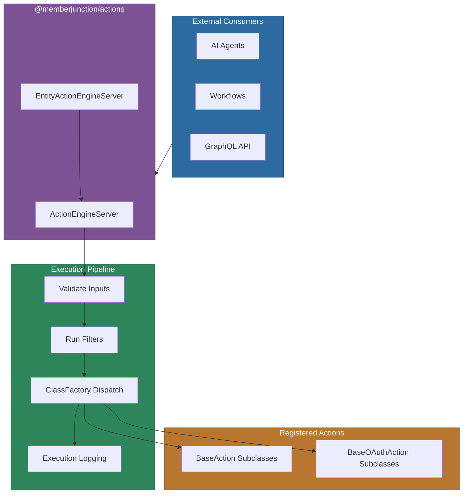
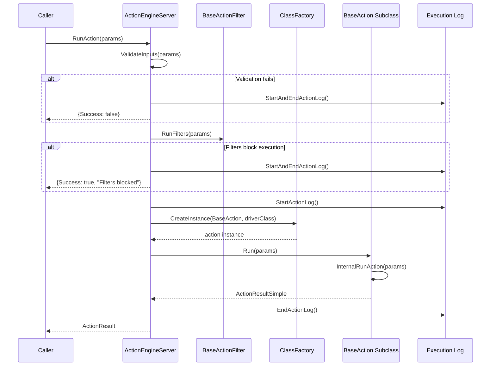
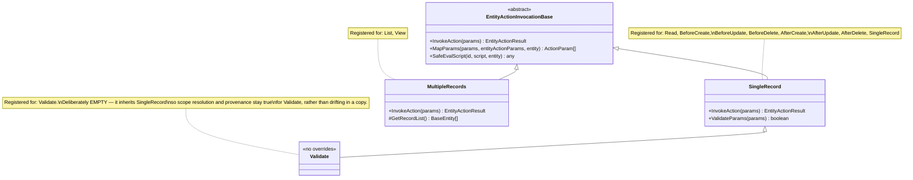
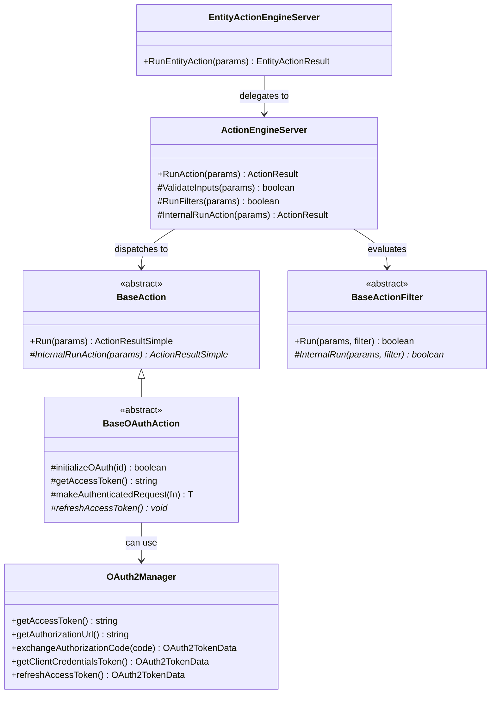

# @memberjunction/actions

Server-side action execution engine for MemberJunction. This package provides the runtime infrastructure for executing actions — including input validation, filter evaluation, ClassFactory-based action dispatch, execution logging, OAuth token management, and entity-bound action invocation. It is intended for server-side use only.

## Installation

```bash
npm install @memberjunction/actions
```

## Overview

The Actions Engine sits between external consumers (AI agents, workflows, APIs) and the actual action implementations registered via `@RegisterClass`. It handles the full execution lifecycle: validating inputs, running pre-execution filters, dispatching to the correct `BaseAction` subclass via ClassFactory, and logging results.

The package contains two subsystems:

- **Generic Action Engine** — Executes standalone actions with validation, filtering, and logging
- **Entity Action Engine** — Executes actions bound to entity records, supporting CRUD lifecycle hooks, list/view batch operations, and record validation


```mermaid
flowchart TD
    subgraph Consumers["External Consumers"]
        Agent["AI Agents"]
        WF["Workflows"]
        API["GraphQL API"]
    end

    subgraph Engine["@memberjunction/actions"]
        AES["ActionEngineServer"]
        EAES["EntityActionEngineServer"]
    end

    subgraph Pipeline["Execution Pipeline"]
        Validate["Validate Inputs"]
        Filter["Run Filters"]
        Dispatch["ClassFactory Dispatch"]
        Log["Execution Logging"]
    end

    subgraph Actions["Registered Actions"]
        BA["BaseAction Subclasses"]
        OAuth["BaseOAuthAction Subclasses"]
    end

    Consumers --> Engine
    AES --> Validate --> Filter --> Dispatch --> Log
    Dispatch --> BA
    Dispatch --> OAuth
    EAES --> AES

    style Consumers fill:#2d6a9f,stroke:#1a4971,color:#fff
    style Engine fill:#7c5295,stroke:#563a6b,color:#fff
    style Pipeline fill:#2d8659,stroke:#1a5c3a,color:#fff
    style Actions fill:#b8762f,stroke:#8a5722,color:#fff
```

## Key Features

- **Action Execution Pipeline** — Validates inputs, evaluates filters, dispatches via ClassFactory, and logs all executions
- **ClassFactory Dispatch** — Looks up `BaseAction` subclasses by `DriverClass` or action name at runtime
- **Pre-Execution Filters** — `BaseActionFilter` subclasses can gate whether an action should run
- **Execution Logging** — Automatic start/end logging to `Action Execution Logs` entity with params and result codes
- **OAuth Token Management** — `BaseOAuthAction` provides token lifecycle (refresh, retry on auth failure, persistence)
- **OAuth2Manager** — Standalone OAuth2 client supporting authorization code, client credentials, and refresh token flows
- **Entity Action Invocation** — Bind actions to entity CRUD lifecycle events (BeforeCreate, AfterUpdate, etc.)
- **Batch Entity Actions** — Run actions against Lists or Views of records with consolidated results
- **Script Evaluation** — Entity action params support runtime script evaluation with entity context
- **Transition Filters** — Filters see the values on *both* sides of a save, so a gate can express "when Status *becomes* Approved" rather than only "when Status *is* Approved"
- **Durable Dispatch** — An `After*` binding can opt into surviving a process restart (`EntityAction.RunMode = 'Durable'`)
- **Execution-Log Retention** — Each log row is stamped with the retention its action declared, and a scheduled purge enforces it

## Usage

### Running a Standalone Action

```typescript
import { ActionEngineServer } from '@memberjunction/actions';

// Configure the engine (typically done once at startup)
await ActionEngineServer.Instance.Config(false, contextUser);

// Find the action by name
const action = ActionEngineServer.Instance.Actions.find(a => a.Name === 'Send Email');

// Execute it
const result = await ActionEngineServer.Instance.RunAction({
    Action: action,
    ContextUser: contextUser,
    Params: [
        { Name: 'to', Value: 'user@example.com', Type: 'Input' },
        { Name: 'subject', Value: 'Hello', Type: 'Input' },
        { Name: 'body', Value: 'Message content', Type: 'Input' }
    ],
    Filters: []
});

if (result.Success) {
    console.log('Action completed:', result.Message);
} else {
    console.error('Action failed:', result.Message);
}
```

### Creating a Custom Action

All actions extend `BaseAction` and implement `InternalRunAction`. Register them with `@RegisterClass` so the engine can discover them via ClassFactory:

```typescript
import { RegisterClass } from '@memberjunction/global';
import { BaseAction } from '@memberjunction/actions';
import { RunActionParams, ActionResultSimple } from '@memberjunction/actions-base';

@RegisterClass(BaseAction, 'My Custom Action')
export class MyCustomAction extends BaseAction {
    protected async InternalRunAction(params: RunActionParams): Promise<ActionResultSimple> {
        const inputValue = params.Params.find(p => p.Name === 'input')?.Value;

        // Your action logic here
        const result = await this.doWork(inputValue);

        return {
            Success: true,
            ResultCode: 'SUCCESS',
            Message: `Processed: ${result}`
        };
    }

    private async doWork(input: string): Promise<string> {
        // Delegate to service classes for real logic
        return `Done with ${input}`;
    }
}
```

### Creating an OAuth-Authenticated Action

For actions that need to call external APIs with OAuth2 credentials:

```typescript
import { RegisterClass } from '@memberjunction/global';
import { BaseOAuthAction } from '@memberjunction/actions';
import { RunActionParams, ActionResultSimple } from '@memberjunction/actions-base';

@RegisterClass(BaseAction, 'Fetch External Data')
export class FetchExternalDataAction extends BaseOAuthAction {
    protected async refreshAccessToken(): Promise<void> {
        // Platform-specific token refresh logic
        const response = await fetch('https://api.example.com/oauth/token', {
            method: 'POST',
            body: new URLSearchParams({
                grant_type: 'refresh_token',
                refresh_token: this.getRefreshToken(),
            })
        });
        const data = await response.json();
        await this.updateStoredTokens(data.access_token, data.refresh_token, data.expires_in);
    }

    protected async InternalRunAction(params: RunActionParams): Promise<ActionResultSimple> {
        const companyIntegrationId = params.Params.find(
            p => p.Name === 'CompanyIntegrationID'
        )?.Value as string;

        // Initialize OAuth (loads tokens, refreshes if expired)
        if (!await this.initializeOAuth(companyIntegrationId)) {
            return this.handleOAuthError(new Error('OAuth initialization failed'));
        }

        // Make authenticated request with automatic retry on 401
        const data = await this.makeAuthenticatedRequest(async (token) => {
            const res = await fetch('https://api.example.com/data', {
                headers: { Authorization: `Bearer ${token}` }
            });
            return res.json();
        });

        return { Success: true, ResultCode: 'SUCCESS', Message: JSON.stringify(data) };
    }
}
```

### Using OAuth2Manager Directly

For standalone OAuth2 token management outside the action framework:

```typescript
import { OAuth2Manager } from '@memberjunction/actions';

const oauth = new OAuth2Manager({
    clientId: 'your-client-id',
    clientSecret: 'your-client-secret',
    tokenEndpoint: 'https://api.example.com/oauth/token',
    scopes: ['read', 'write'],
    onTokenUpdate: async (tokens) => {
        // Persist tokens to your storage
        await saveTokens(tokens);
    }
});

// Get a valid token (auto-refreshes if expired)
const token = await oauth.getAccessToken();

// Or use client credentials flow
const tokenData = await oauth.getClientCredentialsToken();
```

## Architecture

### Action Execution Pipeline

The `ActionEngineServer.RunAction()` method follows this sequence:


```mermaid
sequenceDiagram
    participant Caller
    participant Engine as ActionEngineServer
    participant Filter as BaseActionFilter
    participant CF as ClassFactory
    participant Action as BaseAction Subclass
    participant Log as Execution Log

    Caller->>Engine: RunAction(params)
    Engine->>Engine: ValidateInputs(params)
    alt Validation fails
        Engine->>Log: StartAndEndActionLog()
        Engine-->>Caller: {Success: false}
    end
    Engine->>Filter: RunFilters(params)
    alt Filters block execution
        Engine->>Log: StartAndEndActionLog()
        Engine-->>Caller: {Success: true, "Filters blocked"}
    end
    Engine->>Log: StartActionLog()
    Engine->>CF: CreateInstance(BaseAction, driverClass)
    CF-->>Engine: action instance
    Engine->>Action: Run(params)
    Action->>Action: InternalRunAction(params)
    Action-->>Engine: ActionResultSimple
    Engine->>Log: EndActionLog()
    Engine-->>Caller: ActionResult
```

### Entity Action Invocation

Entity actions are bound to entity lifecycle events. The `EntityActionEngineServer` delegates to invocation-type-specific handlers via ClassFactory:


```mermaid
classDiagram
    class EntityActionInvocationBase {
        <<abstract>>
        +InvokeAction(params) EntityActionResult
        +MapParams(params, entityActionParams, entity) ActionParam[]
        +SafeEvalScript(id, script, entity) any
    }

    class SingleRecord {
        +InvokeAction(params) EntityActionResult
        +ValidateParams(params) boolean
    }

    class MultipleRecords {
        +InvokeAction(params) EntityActionResult
        #GetRecordList() BaseEntity[]
    }

    class Validate {
        <<no overrides>>
    }

    EntityActionInvocationBase <|-- SingleRecord
    EntityActionInvocationBase <|-- MultipleRecords
    SingleRecord <|-- Validate

    note for SingleRecord "Registered for: Read, BeforeCreate,\nBeforeUpdate, BeforeDelete, AfterCreate,\nAfterUpdate, AfterDelete, SingleRecord"
    note for MultipleRecords "Registered for: List, View"
    note for Validate "Registered for: Validate.\nDeliberately EMPTY — it inherits SingleRecord\nso scope resolution and provenance stay true\nfor Validate, rather than drifting in a copy."
```

### Transition Filters — deciding on the change, not the end state

An entity action bound to `AfterUpdate` used to see only the record's *current* state, so "when an
invoice crosses 90 days" and "when Status becomes Approved" were inexpressible: the second is
indistinguishable from "when Status **is** Approved", which is true on every subsequent save too.

`EntityChangeContext` (in `@memberjunction/actions-base`) carries both sides of the save to the place
filters run. It is built from `EntityField.OldValue`, which `BaseEntity` has tracked all along — no
new tracking, just carrying what already existed to where it was needed.

Inside an Action Filter's `Code`, the change is available on `ActionFilterContext`:

```javascript
// "when Status becomes Approved" — fires once, on the transition
return ActionFilterContext.DidFieldChangeToValue('Status', 'Approved');

// the raw before/after bags, for anything the shorthands do not cover
const { OldValues, NewValues } = ActionFilterContext;
return NewValues.Amount > 100 && OldValues.Amount <= 100;
```

| Name | Meaning |
|---|---|
| `DidFieldChange(field)` | the field's value actually differs across this save |
| `DidFieldChangeToValue(field, value)` | …and its new value equals `value` (compared loosely, so `'1'` matches `1`) |
| `OldValues` / `NewValues` | both sides, by field name |
| `change` | the full `EntityChangeContext`, or `undefined` when there was no save behind the run |

Three behaviours worth knowing:

- **A create reports no changes.** A record whose Status started at `Approved` did not *become*
  anything, so `DidFieldChange` is false for every field on an insert.
- **Absence reads as false.** A direct invocation or a List/View fan-out has no save behind it, so
  the helpers answer false rather than guessing — filters gate execution, and firing on a question
  nobody could answer is the wrong default.
- **Evaluation is fail-closed.** A filter that throws, returns a non-boolean, or cannot be resolved
  prevents the run. That is why an `EntityActionFilter` row with `Status = 'Disabled'` is *skipped*
  rather than consulted: a disabled gate that was still evaluated would not be inert, it would block
  the action permanently.

### Durable dispatch — `After*` work that survives a restart

`After*` entity actions are dispatched fire-and-forget so a user's save is not held open by work that
happens afterwards. The cost is that a process dying mid-flight loses the action, with nothing to
retry it.

Setting `EntityAction.RunMode = 'Durable'` routes that dispatch to the task-graph substrate instead:
the work becomes a single-node durable graph with the claim protocol, restart recovery and orphan
reclaim that already exist there. It is per-binding and defaults to `Inline`, because durability
costs a Task row, a dispatcher hop of latency, and the action's parameters persisted at rest.

```typescript
binding.RunMode = 'Durable';   // MJ: Entity Actions
await binding.Save();
```

Four things the mode does *not* change:

- **`Validate` and `Before*` ignore it entirely.** Those run inside the save and can abort it;
  deferring them would decide the save's outcome after it had already happened.
- **A host with no submitter runs inline.** `RunMode = 'Durable'` asks for the work to be harder to
  lose, so refusing to run it where the durable path is unavailable would make opting in *less*
  reliable than leaving it off. The same fallback covers a failed submission, with the reason logged.
- **Parameters are redacted before they are persisted.** A parameter the binding marked as not-logged
  arrives at the durable runner absent, not secret.
- **The self-trigger guard does not follow the work.** `EntityActionDispatchGuard` tracks origin
  through `AsyncLocalStorage`, which a dispatcher in another process is definitionally outside of. A
  durable action that writes back to its own record must set
  `EntitySaveOptions.OriginatingEntityActionIDs` — the explicit channel for exactly this case.

### Execution-log retention

`Action.RetentionPeriod` (days; `NULL` means indefinite) is stamped onto each `ActionExecutionLog` row
when the run starts, so the row is self-describing. Retention is therefore decided at write time:
editing an action's retention changes what is kept *going forward* rather than retroactively deleting
history written under the previous policy.

Enforcement is a scheduled job (`Action Log Retention`), opt-in like every maintenance driver — the
job type activates nothing until someone creates a `MJ: Scheduled Job` of it with a cron expression.
It purges oldest-first, bounded per run, and reports when it stopped at its ceiling rather than
because it was finished. Rows with no retention are kept unless the job is explicitly configured with
`DefaultRetentionDays`.

### Class Hierarchy


```mermaid
classDiagram
    class BaseAction {
        <<abstract>>
        +Run(params) ActionResultSimple
        #InternalRunAction(params)* ActionResultSimple
    }

    class BaseOAuthAction {
        <<abstract>>
        #initializeOAuth(id) boolean
        #getAccessToken() string
        #makeAuthenticatedRequest(fn) T
        #refreshAccessToken()* void
    }

    class BaseActionFilter {
        <<abstract>>
        +Run(params, filter) boolean
        #InternalRun(params, filter)* boolean
    }

    class ActionEngineServer {
        +RunAction(params) ActionResult
        #ValidateInputs(params) boolean
        #RunFilters(params) boolean
        #InternalRunAction(params) ActionResult
    }

    class EntityActionEngineServer {
        +RunEntityAction(params) EntityActionResult
    }

    class OAuth2Manager {
        +getAccessToken() string
        +getAuthorizationUrl() string
        +exchangeAuthorizationCode(code) OAuth2TokenData
        +getClientCredentialsToken() OAuth2TokenData
        +refreshAccessToken() OAuth2TokenData
    }

    BaseAction <|-- BaseOAuthAction
    ActionEngineServer --> BaseAction : dispatches to
    ActionEngineServer --> BaseActionFilter : evaluates
    EntityActionEngineServer --> ActionEngineServer : delegates to
    BaseOAuthAction --> OAuth2Manager : can use
```

## API Reference

### ActionEngineServer

Singleton engine that executes actions. Access via `ActionEngineServer.Instance`.

| Method | Description |
|--------|-------------|
| `Config(forceRefresh, contextUser)` | Initialize/refresh the engine's action and filter metadata |
| `RunAction(params)` | Execute an action through the full pipeline (validate, filter, dispatch, log) |

### BaseAction

Abstract base class for all action implementations.

| Method | Description |
|--------|-------------|
| `Run(params)` | Public entry point — calls `InternalRunAction` |
| `InternalRunAction(params)` | **Abstract** — implement your action logic here |

### BaseOAuthAction

Abstract base for actions requiring OAuth authentication. Extends `BaseAction`.

| Method | Description |
|--------|-------------|
| `initializeOAuth(companyIntegrationId)` | Load integration, check/refresh tokens |
| `getAccessToken()` | Get the current access token |
| `makeAuthenticatedRequest(fn)` | Execute a request with automatic retry on 401/403 |
| `refreshAccessToken()` | **Abstract** — implement platform-specific token refresh |
| `updateStoredTokens(access, refresh?, expiresIn?)` | Persist new tokens to the Company Integration entity |
| `handleOAuthError(error)` | Return a standardized error result for OAuth failures |

### BaseActionFilter

Abstract base for pre-execution filters.

| Method | Description |
|--------|-------------|
| `Run(params, filter)` | Public entry point — calls `InternalRun` |
| `InternalRun(params, filter)` | **Abstract** — implement filter logic, return `true` to allow execution |

### EntityActionEngineServer

Singleton engine for entity-bound actions. Access via `EntityActionEngineServer.Instance`.

| Method | Description |
|--------|-------------|
| `RunEntityAction(params)` | Execute an entity action, dispatching to the correct invocation type handler |

### OAuth2Manager

Standalone OAuth2 token manager supporting multiple grant types.

| Method | Description |
|--------|-------------|
| `getAccessToken()` | Get a valid token, auto-refreshing if needed (thread-safe) |
| `getAuthorizationUrl(state?)` | Build the authorization URL for auth code flow |
| `exchangeAuthorizationCode(code)` | Exchange an auth code for tokens |
| `getClientCredentialsToken()` | Obtain tokens via client credentials flow |
| `refreshAccessToken()` | Refresh using the stored refresh token |
| `setTokens(access, refresh?, expiresIn?)` | Set tokens obtained externally |
| `isTokenValid()` | Check if current token is valid (with buffer) |

## Dependencies

This package depends on:

- [@memberjunction/global](../../MJGlobal/README.md) — ClassFactory and `@RegisterClass` decorator
- [@memberjunction/core](../../MJCore/readme.md) — `Metadata`, `RunView`, `BaseEntity`, logging utilities
- [@memberjunction/actions-base](../Base/README.md) — Shared types (`ActionEngineBase`, `RunActionParams`, `ActionResult`, `RuntimeActionBridgeBuilder` abstract)
- [@memberjunction/core-entities](../../MJCoreEntities/readme.md) — Generated entity classes (`ActionExecutionLogEntity`, `ActionFilterEntity`, etc.)
- [@memberjunction/action-runtime](../Runtime/README.md) — Sandbox executor for `Type='Runtime'` actions
- [@memberjunction/code-execution](../CodeExecution/README.md) — `BridgeHandlerMap` type (host-side bridge passed to the sandbox)
- [@memberjunction/ai](../../AI/Core/readme.md) — AI model integration (shared types)

**Not a direct dependency any longer**: `@memberjunction/ai-agents`, `@memberjunction/ai-prompts`, `@memberjunction/aiengine`, `@memberjunction/ai-core-plus`. These used to be pulled in for the Runtime-action bridge; the bridge was extracted into [`@memberjunction/action-runtime-host`](../RuntimeHost/README.md) (top of the Actions stack), and this package now resolves the concrete bridge builder via `MJGlobal.ClassFactory.CreateInstance(RuntimeActionBridgeBuilder)`. See the RuntimeHost README for the cycle-breaking architecture.

## Related Packages

- [@memberjunction/actions-base](../Base/README.md) — Shared types and base classes used by both client and server
- [@memberjunction/action-runtime](../Runtime/README.md) — Sandboxed executor for `Type='Runtime'` actions (approval gate, input/output wiring, isolated-vm dispatch)
- [@memberjunction/action-runtime-host](../RuntimeHost/README.md) — Default `utilities.*` bridge (md / rv / rq / entity / actions / agents / ai) exposed to sandboxed Runtime-action code
- [CoreActions](../CoreActions/) — Built-in action implementations (Create Record, generated actions, etc.)
- [ScheduledActions](../ScheduledActions/) — Scheduled action execution support
- [ApolloEnrichment](../ApolloEnrichment/) — Apollo data enrichment actions
- [ContentAutotag](../ContentAutotag/) — Content auto-tagging actions
- [CodeExecution](../CodeExecution/) — Isolated-vm sandbox + worker pool (`CodeExecutionService` used by `action-runtime`)

For the Actions system philosophy and development guide, see the [Actions CLAUDE.md](../CLAUDE.md).

## Contributing

See the [MemberJunction Contributing Guide](../../../CONTRIBUTING.md) for development setup and guidelines.
