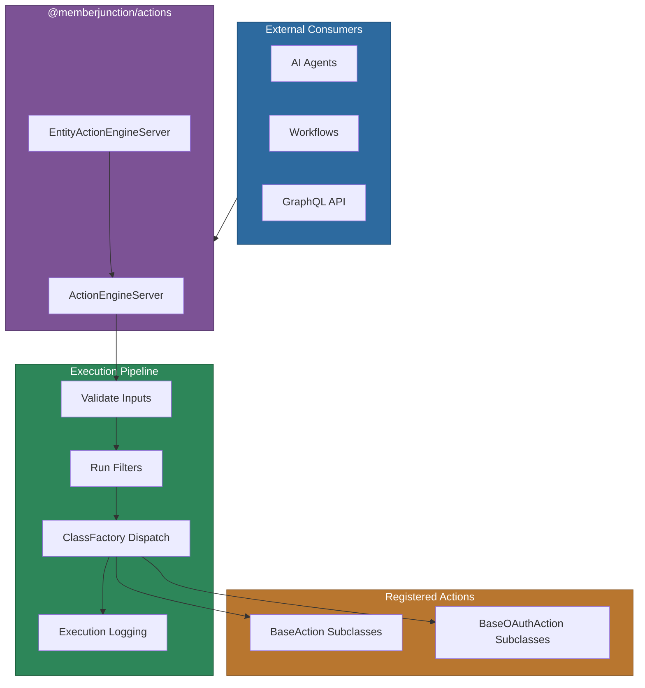
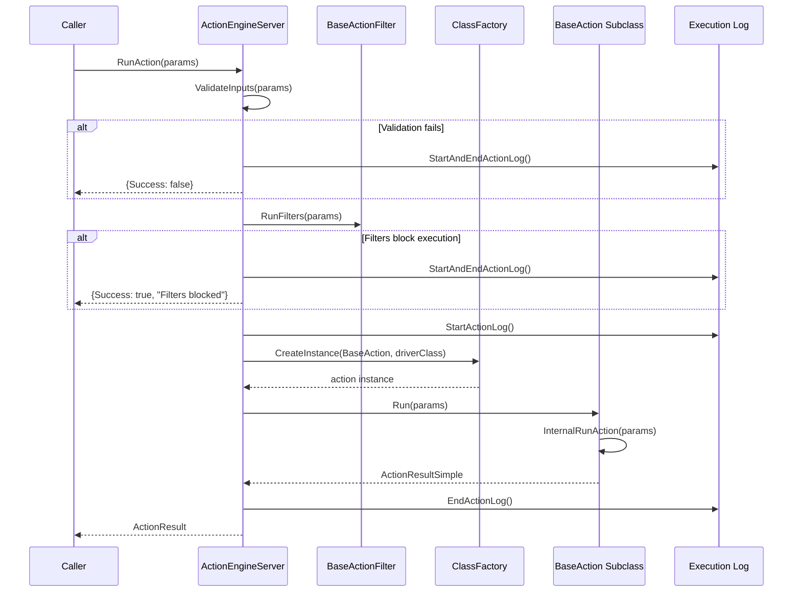
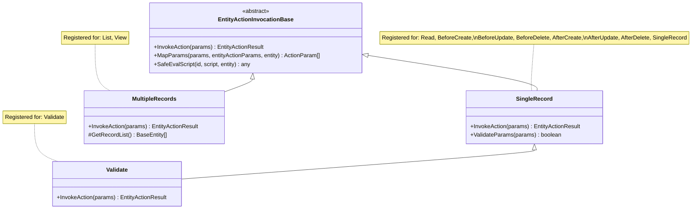
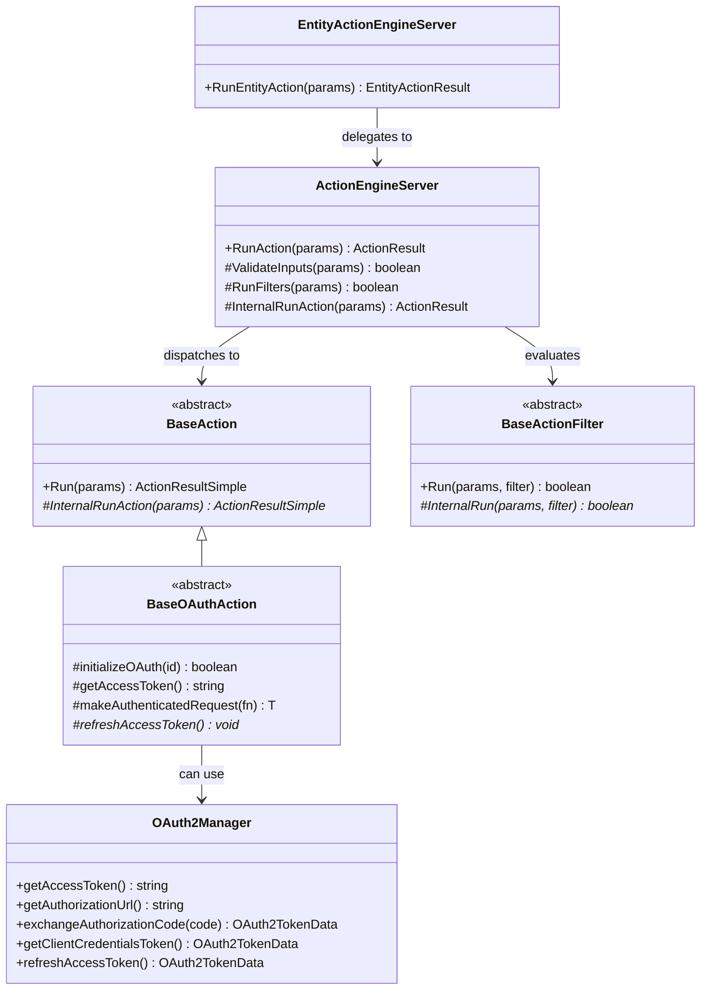

# @memberjunction/actions

Server-side action execution engine for MemberJunction. This package provides the runtime infrastructure for executing actions — including input validation, filter evaluation, ClassFactory-based action dispatch, execution logging, OAuth token management, and entity-bound action invocation. It is intended for server-side use only.

## Installation

```bash
npm install @memberjunction/actions
```

## Overview

The Actions Engine sits between external consumers (AI agents, workflows, APIs) and the actual action implementations registered via `@RegisterClass`. It handles the full execution lifecycle: validating inputs, running pre-execution filters, dispatching to the correct `BaseAction` subclass via ClassFactory, and logging results.

The package contains two subsystems:

- **Generic Action Engine** — Executes standalone actions with validation, filtering, and logging
- **Entity Action Engine** — Executes actions bound to entity records, supporting CRUD lifecycle hooks, list/view batch operations, and record validation



## Key Features

- **Action Execution Pipeline** — Validates inputs, evaluates filters, dispatches via ClassFactory, and logs all executions
- **ClassFactory Dispatch** — Looks up `BaseAction` subclasses by `DriverClass` or action name at runtime
- **Pre-Execution Filters** — `BaseActionFilter` subclasses can gate whether an action should run
- **Execution Logging** — Automatic start/end logging to `Action Execution Logs` entity with params and result codes
- **OAuth Token Management** — `BaseOAuthAction` provides token lifecycle (refresh, retry on auth failure, persistence)
- **OAuth2Manager** — Standalone OAuth2 client supporting authorization code, client credentials, and refresh token flows
- **Entity Action Invocation** — Bind actions to entity CRUD lifecycle events (BeforeCreate, AfterUpdate, etc.)
- **Batch Entity Actions** — Run actions against Lists or Views of records with consolidated results
- **Script Evaluation** — Entity action params support runtime script evaluation with entity context

## Usage

### Running a Standalone Action

```typescript
import { ActionEngineServer } from '@memberjunction/actions';

// Configure the engine (typically done once at startup)
await ActionEngineServer.Instance.Config(false, contextUser);

// Find the action by name
const action = ActionEngineServer.Instance.Actions.find(a => a.Name === 'Send Email');

// Execute it
const result = await ActionEngineServer.Instance.RunAction({
    Action: action,
    ContextUser: contextUser,
    Params: [
        { Name: 'to', Value: 'user@example.com', Type: 'Input' },
        { Name: 'subject', Value: 'Hello', Type: 'Input' },
        { Name: 'body', Value: 'Message content', Type: 'Input' }
    ],
    Filters: []
});

if (result.Success) {
    console.log('Action completed:', result.Message);
} else {
    console.error('Action failed:', result.Message);
}
```

### Creating a Custom Action

All actions extend `BaseAction` and implement `InternalRunAction`. Register them with `@RegisterClass` so the engine can discover them via ClassFactory:

```typescript
import { RegisterClass } from '@memberjunction/global';
import { BaseAction } from '@memberjunction/actions';
import { RunActionParams, ActionResultSimple } from '@memberjunction/actions-base';

@RegisterClass(BaseAction, 'My Custom Action')
export class MyCustomAction extends BaseAction {
    protected async InternalRunAction(params: RunActionParams): Promise<ActionResultSimple> {
        const inputValue = params.Params.find(p => p.Name === 'input')?.Value;

        // Your action logic here
        const result = await this.doWork(inputValue);

        return {
            Success: true,
            ResultCode: 'SUCCESS',
            Message: `Processed: ${result}`
        };
    }

    private async doWork(input: string): Promise<string> {
        // Delegate to service classes for real logic
        return `Done with ${input}`;
    }
}
```

### Creating an OAuth-Authenticated Action

For actions that need to call external APIs with OAuth2 credentials:

```typescript
import { RegisterClass } from '@memberjunction/global';
import { BaseOAuthAction } from '@memberjunction/actions';
import { RunActionParams, ActionResultSimple } from '@memberjunction/actions-base';

@RegisterClass(BaseAction, 'Fetch External Data')
export class FetchExternalDataAction extends BaseOAuthAction {
    protected async refreshAccessToken(): Promise<void> {
        // Platform-specific token refresh logic
        const response = await fetch('https://api.example.com/oauth/token', {
            method: 'POST',
            body: new URLSearchParams({
                grant_type: 'refresh_token',
                refresh_token: this.getRefreshToken(),
            })
        });
        const data = await response.json();
        await this.updateStoredTokens(data.access_token, data.refresh_token, data.expires_in);
    }

    protected async InternalRunAction(params: RunActionParams): Promise<ActionResultSimple> {
        const companyIntegrationId = params.Params.find(
            p => p.Name === 'CompanyIntegrationID'
        )?.Value as string;

        // Initialize OAuth (loads tokens, refreshes if expired)
        if (!await this.initializeOAuth(companyIntegrationId)) {
            return this.handleOAuthError(new Error('OAuth initialization failed'));
        }

        // Make authenticated request with automatic retry on 401
        const data = await this.makeAuthenticatedRequest(async (token) => {
            const res = await fetch('https://api.example.com/data', {
                headers: { Authorization: `Bearer ${token}` }
            });
            return res.json();
        });

        return { Success: true, ResultCode: 'SUCCESS', Message: JSON.stringify(data) };
    }
}
```

### Using OAuth2Manager Directly

For standalone OAuth2 token management outside the action framework:

```typescript
import { OAuth2Manager } from '@memberjunction/actions';

const oauth = new OAuth2Manager({
    clientId: 'your-client-id',
    clientSecret: 'your-client-secret',
    tokenEndpoint: 'https://api.example.com/oauth/token',
    scopes: ['read', 'write'],
    onTokenUpdate: async (tokens) => {
        // Persist tokens to your storage
        await saveTokens(tokens);
    }
});

// Get a valid token (auto-refreshes if expired)
const token = await oauth.getAccessToken();

// Or use client credentials flow
const tokenData = await oauth.getClientCredentialsToken();
```

## Architecture

### Action Execution Pipeline

The `ActionEngineServer.RunAction()` method follows this sequence:



### Entity Action Invocation

Entity actions are bound to entity lifecycle events. The `EntityActionEngineServer` delegates to invocation-type-specific handlers via ClassFactory:



### Class Hierarchy



## API Reference

### ActionEngineServer

Singleton engine that executes actions. Access via `ActionEngineServer.Instance`.

| Method | Description |
|--------|-------------|
| `Config(forceRefresh, contextUser)` | Initialize/refresh the engine's action and filter metadata |
| `RunAction(params)` | Execute an action through the full pipeline (validate, filter, dispatch, log) |

### BaseAction

Abstract base class for all action implementations.

| Method | Description |
|--------|-------------|
| `Run(params)` | Public entry point — calls `InternalRunAction` |
| `InternalRunAction(params)` | **Abstract** — implement your action logic here |

### BaseOAuthAction

Abstract base for actions requiring OAuth authentication. Extends `BaseAction`.

| Method | Description |
|--------|-------------|
| `initializeOAuth(companyIntegrationId)` | Load integration, check/refresh tokens |
| `getAccessToken()` | Get the current access token |
| `makeAuthenticatedRequest(fn)` | Execute a request with automatic retry on 401/403 |
| `refreshAccessToken()` | **Abstract** — implement platform-specific token refresh |
| `updateStoredTokens(access, refresh?, expiresIn?)` | Persist new tokens to the Company Integration entity |
| `handleOAuthError(error)` | Return a standardized error result for OAuth failures |

### BaseActionFilter

Abstract base for pre-execution filters.

| Method | Description |
|--------|-------------|
| `Run(params, filter)` | Public entry point — calls `InternalRun` |
| `InternalRun(params, filter)` | **Abstract** — implement filter logic, return `true` to allow execution |

### EntityActionEngineServer

Singleton engine for entity-bound actions. Access via `EntityActionEngineServer.Instance`.

| Method | Description |
|--------|-------------|
| `RunEntityAction(params)` | Execute an entity action, dispatching to the correct invocation type handler |

### OAuth2Manager

Standalone OAuth2 token manager supporting multiple grant types.

| Method | Description |
|--------|-------------|
| `getAccessToken()` | Get a valid token, auto-refreshing if needed (thread-safe) |
| `getAuthorizationUrl(state?)` | Build the authorization URL for auth code flow |
| `exchangeAuthorizationCode(code)` | Exchange an auth code for tokens |
| `getClientCredentialsToken()` | Obtain tokens via client credentials flow |
| `refreshAccessToken()` | Refresh using the stored refresh token |
| `setTokens(access, refresh?, expiresIn?)` | Set tokens obtained externally |
| `isTokenValid()` | Check if current token is valid (with buffer) |

## Dependencies

This package depends on:

- [@memberjunction/global](../../MJGlobal/README.md) — ClassFactory and `@RegisterClass` decorator
- [@memberjunction/core](../../MJCore/README.md) — `Metadata`, `RunView`, `BaseEntity`, logging utilities
- [@memberjunction/actions-base](../Base/README.md) — Shared types (`ActionEngineBase`, `RunActionParams`, `ActionResult`, etc.)
- [@memberjunction/core-entities](../../MJCoreEntities/README.md) — Generated entity classes (`ActionExecutionLogEntity`, `ActionFilterEntity`, etc.)
- [@memberjunction/ai](../../AI/Core/README.md) — AI model integration
- [@memberjunction/ai-core-plus](../../AI/CorePlus/README.md) — Extended AI utilities
- [@memberjunction/aiengine](../../AI/Engine/README.md) — AI engine orchestration
- [@memberjunction/ai-prompts](../../AI/Prompts/README.md) — AI prompt execution

## Related Packages

- [@memberjunction/actions-base](../Base/README.md) — Shared types and base classes used by both client and server
- [CoreActions](../CoreActions/) — Built-in action implementations (Create Record, generated actions, etc.)
- [ScheduledActions](../ScheduledActions/) — Scheduled action execution support
- [ApolloEnrichment](../ApolloEnrichment/) — Apollo data enrichment actions
- [ContentAutotag](../ContentAutotag/) — Content auto-tagging actions
- [CodeExecution](../CodeExecution/) — Dynamic code execution actions

For the Actions system philosophy and development guide, see the [Actions CLAUDE.md](../CLAUDE.md).

## Contributing

See the [MemberJunction Contributing Guide](../../../CONTRIBUTING.md) for development setup and guidelines.
