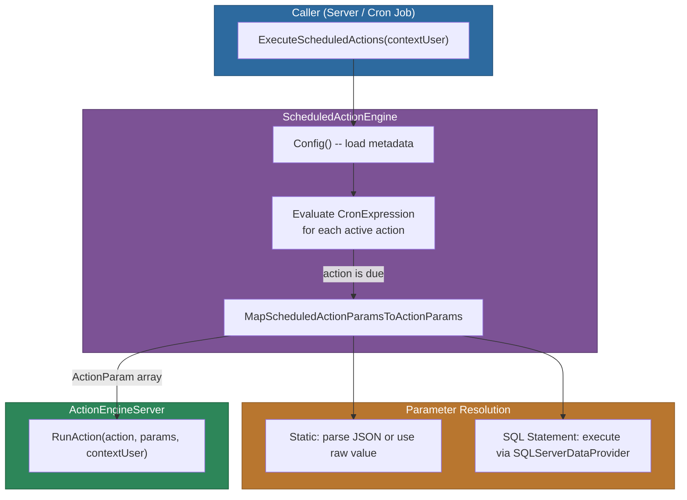
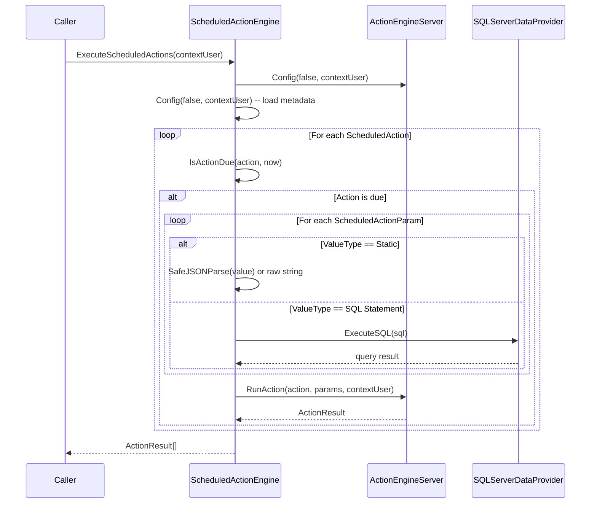

# @memberjunction/scheduled-actions

Scheduling engine for MemberJunction that enables recurring or one-time future execution of any defined action using cron expressions. The engine extends `BaseEngine` from `@memberjunction/core`, caching scheduled action metadata as a singleton and evaluating cron-based timing to determine which actions are due for execution.

For the broader Actions design philosophy -- including when to use Actions vs. direct class imports, and the "thin wrapper" principle -- see the [parent Actions CLAUDE.md](../CLAUDE.md).

## Installation

```bash
npm install @memberjunction/scheduled-actions
```

This package is server-side only. It depends on `@memberjunction/sqlserver-dataprovider` for dynamic SQL parameter evaluation and `@memberjunction/actions` for action execution.

## Architecture

`ScheduledActionEngine` is a singleton that loads two entity collections on `Config()`: **Scheduled Actions** and **Scheduled Action Params**. At execution time, it evaluates each action's cron expression against the current time, maps scheduled action params to the underlying action's expected params (resolving static values and SQL statements), and delegates execution to `ActionEngineServer`.



### Execution Sequence



## Key Concepts

### Scheduled Action Entity

Each scheduled action record links to an underlying MJ Action and defines when it should execute. The entity includes these fields:

| Field | Type | Description |
|-------|------|-------------|
| `Name` | `string` | Unique name identifying the scheduled action |
| `Description` | `string \| null` | Optional description of what this scheduled action does |
| `ActionID` | `string` | Foreign key to the `Actions` entity -- the action to execute |
| `Type` | `'Daily' \| 'Weekly' \| 'Monthly' \| 'Yearly' \| 'Custom'` | Schedule type; non-Custom types auto-generate the cron expression on save |
| `CronExpression` | `string \| null` | Cron expression for timing; auto-maintained unless Type is Custom |
| `Timezone` | `string` | Timezone for schedule evaluation (defaults to UTC) |
| `Status` | `'Pending' \| 'Active' \| 'Disabled' \| 'Expired'` | Only active actions are eligible for execution |
| `IntervalDays` | `number \| null` | Interval in days (used for certain schedule types) |
| `DayOfWeek` | `string \| null` | Day of week for Weekly schedules |
| `DayOfMonth` | `number \| null` | Day of month for Monthly/Yearly schedules |
| `Month` | `string \| null` | Month for Yearly schedules |
| `CustomCronExpression` | `string \| null` | User-provided cron expression for Custom type |

The `MJScheduledActionEntityExtended` class (from `@memberjunction/core-entities`) overrides `Save()` to auto-generate the `CronExpression` from `Type`, `DayOfWeek`, `DayOfMonth`, and `Month` whenever the type is not `Custom`. It also adds a `Params` property that the engine populates during `Config()`.

### Scheduled Action Params

Each param maps a scheduled action's input to the underlying action's expected parameter:

| Field | Type | Description |
|-------|------|-------------|
| `ScheduledActionID` | `string` | Foreign key to the parent scheduled action |
| `ActionParamID` | `string` | Foreign key to the `Action Params` entity -- which param to populate |
| `ValueType` | `'Static' \| 'SQL Statement'` | How the value is resolved at execution time |
| `Value` | `string \| null` | Either a literal value / JSON string, or a SQL query |
| `Comments` | `string \| null` | Optional notes about this parameter mapping |

### Parameter Resolution

At execution time, each scheduled action param is resolved based on its `ValueType`:

- **Static** -- The `Value` is first attempted as JSON via `SafeJSONParse()`. If parsing succeeds (returns non-null), the parsed object is used. Otherwise, the raw string value is passed through. This allows both scalar values (`"42"`) and structured data (`'{"key": "value"}'`).

- **SQL Statement** -- The `Value` is executed against SQL Server via `SQLServerDataProvider.ExecuteSQL()`. The query result becomes the parameter value. This enables dynamic parameter population at runtime (e.g., `SELECT COUNT(*) FROM Users WHERE Active = 1`).

### Cron Expression Evaluation

The engine uses the `cron-parser` library to evaluate cron expressions. The static `IsActionDue()` method parses the expression, computes the next execution time from the evaluation time, and returns `true` if the next execution is at or before the current time.

Cron format (6 fields):

```
second  minute  hour  day-of-month  month  day-of-week
  0       0      0       *            *        *
```

Schedule types auto-generate these expressions:
- **Daily**: `0 0 0 * * ?` -- midnight every day
- **Weekly**: `0 0 0 ? * {DayOfWeek}` -- midnight on the specified day
- **Monthly**: `0 0 0 {DayOfMonth} * ?` -- midnight on the specified day of month
- **Yearly**: `0 0 0 {DayOfMonth} {Month} ?` -- midnight on the specified day and month
- **Custom**: Uses the manually provided cron expression

## Usage

### Executing All Due Scheduled Actions

The primary use case is running all scheduled actions that are due at the current time:

```typescript
import { ScheduledActionEngine } from '@memberjunction/scheduled-actions';
import { UserInfo } from '@memberjunction/core';

async function runDueActions(contextUser: UserInfo) {
    const engine = ScheduledActionEngine.Instance;

    // Execute all actions whose cron expressions indicate they are due
    const results = await engine.ExecuteScheduledActions(contextUser);

    for (const result of results) {
        if (result.Success) {
            console.log(`Action succeeded: ${result.Message}`);
        } else {
            console.error(`Action failed: ${result.Message}`);
        }
    }
}
```

### Executing a Specific Scheduled Action by Name

To run a single scheduled action directly, bypassing the cron check if no expression is set:

```typescript
import { ScheduledActionEngine } from '@memberjunction/scheduled-actions';

async function runSpecificAction(contextUser: UserInfo) {
    const engine = ScheduledActionEngine.Instance;

    // Throws if the named action does not exist
    // Skips cron evaluation if CronExpression is null
    const result = await engine.ExecuteScheduledAction('Daily Sales Report', contextUser);

    if (result?.Success) {
        console.log('Report generated successfully');
    }
}
```

### Refreshing Cached Metadata

The engine caches scheduled actions and their params. Force a refresh when metadata has changed:

```typescript
const engine = ScheduledActionEngine.Instance;

// Force reload from database
await engine.Config(true, contextUser);

// Inspect loaded data
const actions = engine.ScheduledActions;      // MJScheduledActionEntityExtended[]
const params = engine.ScheduledActionParams;  // ScheduledActionParamEntity[]
```

### Checking If an Action Is Due

The static `IsActionDue` method can be used independently to test cron expression evaluation:

```typescript
import { ScheduledActionEngine } from '@memberjunction/scheduled-actions';

const isDue = ScheduledActionEngine.IsActionDue(scheduledAction, new Date());
if (isDue) {
    console.log(`${scheduledAction.Name} is due for execution`);
}
```

## API Reference

### ScheduledActionEngine

Singleton engine extending `BaseEngine<ScheduledActionEngine>`. Access via `ScheduledActionEngine.Instance`.

#### Properties

| Property | Type | Description |
|----------|------|-------------|
| `Instance` | `ScheduledActionEngine` | Static singleton accessor |
| `ScheduledActions` | `MJScheduledActionEntityExtended[]` | All loaded scheduled actions (with `Params` populated) |
| `ScheduledActionParams` | `ScheduledActionParamEntity[]` | All loaded scheduled action parameter mappings |

#### Methods

| Method | Signature | Description |
|--------|-----------|-------------|
| `Config` | `(forceRefresh?: boolean, contextUser?: UserInfo, provider?: IMetadataProvider) => Promise<boolean>` | Load or refresh scheduled action metadata from the database. Automatically associates params with their parent actions via `AdditionalLoading`. |
| `ExecuteScheduledActions` | `(contextUser: UserInfo) => Promise<ActionResult[]>` | Evaluate all scheduled actions against the current time and execute those that are due. Returns results for each executed action. |
| `ExecuteScheduledAction` | `(actionName: string, contextUser: UserInfo) => Promise<ActionResult>` | Execute a specific scheduled action by name. Throws if not found. Skips cron evaluation if `CronExpression` is null. |
| `IsActionDue` | `static (scheduledAction: MJScheduledActionEntityExtended, evalTime: Date) => boolean` | Determine whether a scheduled action's cron expression indicates it is due at the given evaluation time. |

#### Protected Methods

| Method | Signature | Description |
|--------|-----------|-------------|
| `MapScheduledActionParamsToActionParams` | `(scheduledAction: MJScheduledActionEntityExtended) => Promise<ActionParam[]>` | Resolve all param mappings for a scheduled action, handling both Static and SQL Statement value types. |
| `ExecuteSQL` | `(sql: string) => Promise<unknown>` | Execute a SQL query via `SQLServerDataProvider` and return the result. Logs errors and returns null on failure. |
| `AdditionalLoading` | `(contextUser?: UserInfo) => Promise<void>` | Post-load hook that associates `ScheduledActionParams` with their parent `ScheduledActions` via the `Params` property. |

## Dependencies

### MemberJunction Packages

| Package | Purpose |
|---------|---------|
| [`@memberjunction/core`](../../MJCore/) | `BaseEngine`, `Metadata`, `UserInfo`, `LogError`, `IMetadataProvider` |
| [`@memberjunction/core-entities`](../../MJCoreEntities/) | `MJScheduledActionEntityExtended`, `ScheduledActionParamEntity` entity classes |
| [`@memberjunction/actions-base`](../Base/) | `MJActionEntityExtended`, `ActionParam`, `ActionResult`, `RunActionParams` types |
| [`@memberjunction/actions`](../Engine/) | `ActionEngineServer` -- executes actions through the full pipeline |
| [`@memberjunction/core-actions`](../CoreActions/) | Core action implementations (ensures built-in actions are registered) |
| [`@memberjunction/core-entities-server`](../../MJCoreEntitiesServer/) | Server-side entity extensions |
| [`@memberjunction/global`](../../MJGlobal/) | `SafeJSONParse` utility |
| [`@memberjunction/sqlserver-dataprovider`](../../SQLServerDataProvider/) | `SQLServerDataProvider` for executing dynamic SQL parameter queries |

### Third-Party

| Package | Purpose |
|---------|---------|
| `cron-parser` | Parses and evaluates cron expressions to determine execution timing |

## Related Packages

| Package | Relationship |
|---------|-------------|
| [`@memberjunction/scheduled-actions-server`](../ScheduledActionsServer/) | Express server that wraps this engine, exposing HTTP endpoints for triggering scheduled actions |
| [`@memberjunction/actions`](../Engine/) | Server-side action execution engine that this package delegates to for running actions |
| [`@memberjunction/actions-base`](../Base/) | Shared types and base engine classes used by the action framework |
| [`@memberjunction/core-actions`](../CoreActions/) | Built-in action implementations that can be scheduled |
