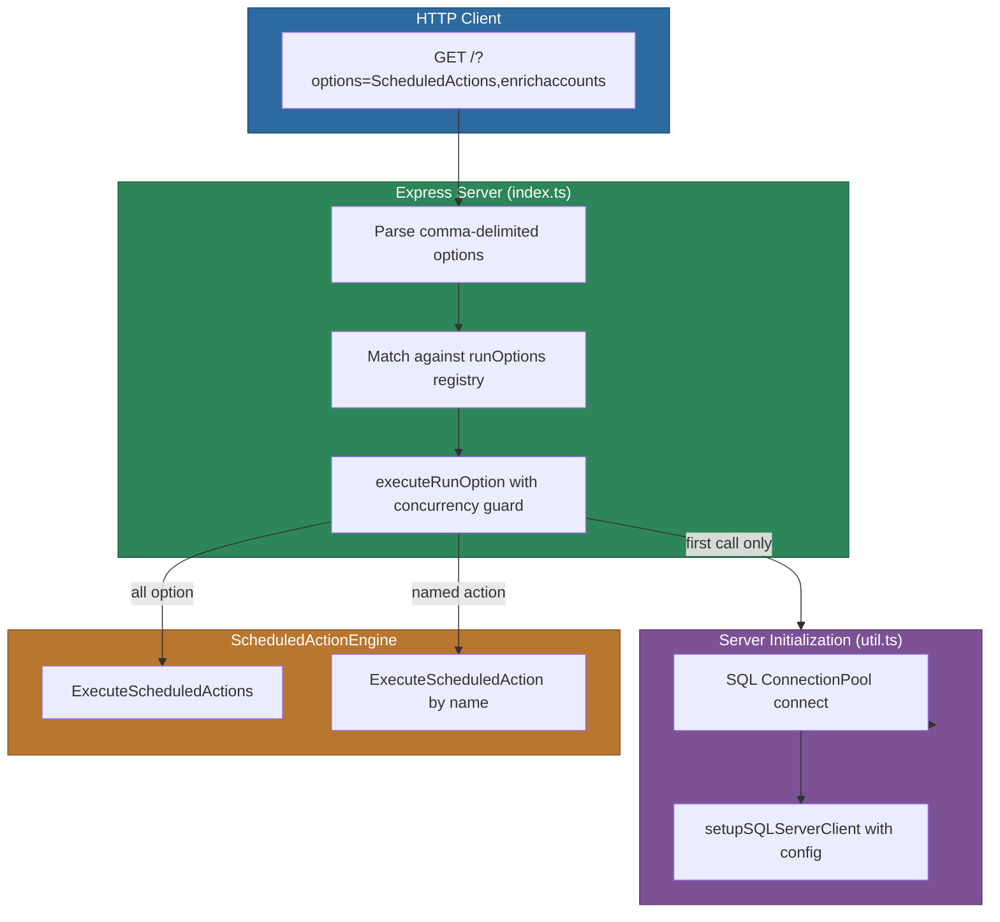
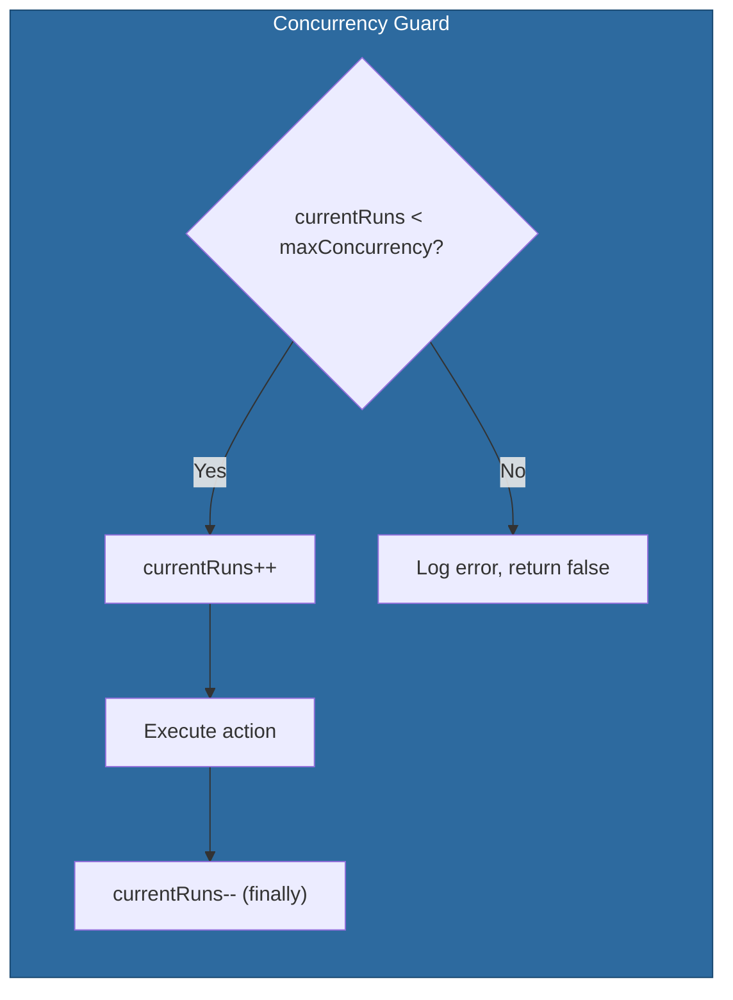

# @memberjunction/scheduled-actions-server

A standalone Express server application that executes scheduled actions in the MemberJunction framework. This server exposes HTTP endpoints to trigger scheduled actions including AI-powered content autotagging, vectorization, Apollo data enrichment, and any custom scheduled actions defined in the MJ system.

For the broader Actions design philosophy (when to use Actions, thin wrapper patterns, anti-patterns), see the [Actions CLAUDE.md](../CLAUDE.md) in the parent directory.

## Architecture

The server follows a simple request-driven architecture: an HTTP GET request arrives with a comma-delimited list of action options, the server initializes the MJ metadata layer (once per process lifetime), resolves the requested actions against a registry of `runOption` entries, and delegates execution to the `ScheduledActionEngine` from `@memberjunction/scheduled-actions`.



### Source File Layout

| File | Purpose |
|------|---------|
| `src/index.ts` | Express app, route handler, `runOption` registry, exported action functions |
| `src/config.ts` | Environment variable parsing via `env-var` and `dotenv` |
| `src/db.ts` | SQL Server connection pool configuration (`mssql`) |
| `src/util.ts` | One-time server initialization (`handleServerInit`) and timeout helper |

## Installation

```bash
npm install @memberjunction/scheduled-actions-server
```

This package is typically deployed as a standalone server rather than imported as a library, but its action functions are exported for programmatic use.

## Configuration

All configuration is driven by environment variables (loaded via `dotenv`):

| Variable | Required | Default | Description |
|----------|----------|---------|-------------|
| `DB_HOST` | Yes | -- | SQL Server hostname |
| `DB_PORT` | No | `1433` | SQL Server port |
| `DB_USERNAME` | Yes | -- | Database username |
| `DB_PASSWORD` | Yes | -- | Database password |
| `DB_DATABASE` | Yes | -- | Database name |
| `MJ_CORE_SCHEMA` | Yes | -- | MemberJunction schema name (e.g., `__mj`) |
| `CURRENT_USER_EMAIL` | Yes | -- | Email of the user context for action execution |
| `PORT` | No | `8000` | HTTP server listen port |
| `METADATA_AUTO_REFRESH_INTERVAL` | No | `3600000` | Metadata cache refresh interval in milliseconds |

Create a `.env` file in the package root or set these variables in your deployment environment.

## Usage

### Starting the Server

```bash
# Development mode with hot reload
npm run dev

# Development with debugging (inspector on port 4321)
npm run dev:debug

# Production mode
npm run start
```

### HTTP API

**GET** `/`

Triggers one or more scheduled actions based on the `options` query parameter.

| Parameter | Type | Description |
|-----------|------|-------------|
| `options` | string | Comma-delimited list of action option names to execute |

```bash
# Run all registered actions
curl "http://localhost:8000/?options=all"

# Run only the MJ scheduled actions engine
curl "http://localhost:8000/?options=ScheduledActions"

# Run multiple specific actions
curl "http://localhost:8000/?options=enrichaccounts,enrichcontacts"

# Run content autotagging and vectorization
curl "http://localhost:8000/?options=autoTagAndVectorize"
```

**Response format:**

```json
{ "Status": "Success" }
```
or
```json
{ "Status": "Error" }
```

### Available Action Options

| Option | Description |
|--------|-------------|
| `all` | Runs every registered action (excluding itself) sequentially |
| `ScheduledActions` | Executes all scheduled actions defined in the MJ system via `ScheduledActionEngine` |
| `enrichaccounts` | Runs the "Apollo Enrichment - Accounts" scheduled action |
| `enrichcontacts` | Runs the "Apollo Enrichment - Contacts" scheduled action |
| `autoTagAndVectorize` | Runs the "Autotag And Vectorize Content" scheduled action |

### Concurrency Control

Each `runOption` entry has a `maxConcurrency` property (default: `1`). If a request arrives while the maximum number of concurrent executions is already in progress for a given option, that option is skipped and an error is logged. This prevents resource exhaustion from overlapping long-running jobs.



### Programmatic Usage

The package exports its action functions for use from other Node.js code:

```typescript
import {
    runAll,
    runScheduledActions,
    enrichAccounts,
    enrichContacts,
    autotagAndVectorize,
    runScheduledAction
} from '@memberjunction/scheduled-actions-server';

// Execute all registered actions
const allSuccess = await runAll();

// Execute a specific named scheduled action
const result = await runScheduledAction('My Custom Scheduled Action');

// Execute built-in actions individually
await runScheduledActions();
await enrichAccounts();
await enrichContacts();
await autotagAndVectorize();
```

### Server Initialization

The server initializes the MJ metadata layer exactly once per process lifetime via `handleServerInit()`. This function:

1. Connects the `mssql` connection pool to SQL Server
2. Configures the MJ SQL Server data provider with the schema name and optional auto-refresh interval
3. Sets a flag to prevent re-initialization on subsequent requests

The SQL connection pool uses a 5-minute request timeout (`300000ms`) to accommodate long-running scheduled actions.

## API Reference

### Types

#### `runOption`

```typescript
type runOption = {
    name: string;
    description?: string;
    run: (initServer: boolean) => Promise<boolean>;
    maxConcurrency?: number;
    currentRuns?: number;
}
```

Defines a named action option that can be triggered via HTTP or programmatically.

### Exported Functions

| Function | Signature | Description |
|----------|-----------|-------------|
| `runAll` | `() => Promise<boolean>` | Runs all registered actions (excluding `all` itself) sequentially |
| `runScheduledActions` | `() => Promise<boolean>` | Executes all MJ scheduled actions via `ScheduledActionEngine` |
| `enrichAccounts` | `() => Promise<boolean>` | Runs the "Apollo Enrichment - Accounts" scheduled action |
| `enrichContacts` | `() => Promise<boolean>` | Runs the "Apollo Enrichment - Contacts" scheduled action |
| `autotagAndVectorize` | `() => Promise<boolean>` | Runs the "Autotag And Vectorize Content" scheduled action |
| `runScheduledAction` | `(actionName: string) => Promise<boolean>` | Runs a single named scheduled action |

All functions return `true` on success and `false` on failure. Errors are logged via MJ's `LogError` and `LogStatus` utilities.

## Build and Development

```bash
# Build TypeScript to dist/
npm run build

# Watch mode for development
npm run watch

# Run linting (ESLint + TypeScript type checking)
npm run lint

# Clean build artifacts
npm run clean

# Create deployment ZIP (node_modules + dist + package.json)
npm run zip
```

## Dependencies

### MemberJunction Packages

| Package | Purpose |
|---------|---------|
| `@memberjunction/core` | Core metadata, logging (`LogStatus`, `LogError`), `Metadata` class |
| `@memberjunction/core-entities` | Entity type definitions |
| `@memberjunction/actions` | Action framework base classes |
| `@memberjunction/scheduled-actions` | `ScheduledActionEngine` for executing scheduled actions |
| `@memberjunction/sqlserver-dataprovider` | SQL Server data provider, `UserCache`, `setupSQLServerClient` |
| `@memberjunction/ai` | AI integration framework |
| `@memberjunction/ai-openai` | OpenAI model driver |
| `@memberjunction/ai-mistral` | Mistral AI model driver |
| `@memberjunction/ai-vectors-pinecone` | Pinecone vector database integration |
| `@memberjunction/ai-vector-sync` | Vector synchronization utilities |
| `@memberjunction/actions-apollo` | Apollo data enrichment actions |
| `@memberjunction/actions-content-autotag` | Content autotagging action |

### Third-Party

| Package | Purpose |
|---------|---------|
| `express` | HTTP server framework |
| `mssql` | SQL Server client (connection pooling, query execution) |
| `dotenv` | `.env` file loading |
| `env-var` | Type-safe environment variable parsing with defaults |
| `typescript` | TypeScript compiler |

## Related Packages

| Package | Relationship |
|---------|-------------|
| [`@memberjunction/scheduled-actions`](../ScheduledActions/) | Core engine that this server wraps -- contains `ScheduledActionEngine` |
| [`@memberjunction/actions`](../CoreActions/) | Base action framework used by all action implementations |
| [`@memberjunction/actions-apollo`](../ActionProviders/Apollo/) | Apollo enrichment action implementations invoked by this server |
| [`@memberjunction/actions-content-autotag`](../ActionProviders/ContentAutotag/) | Content autotagging action invoked by this server |
