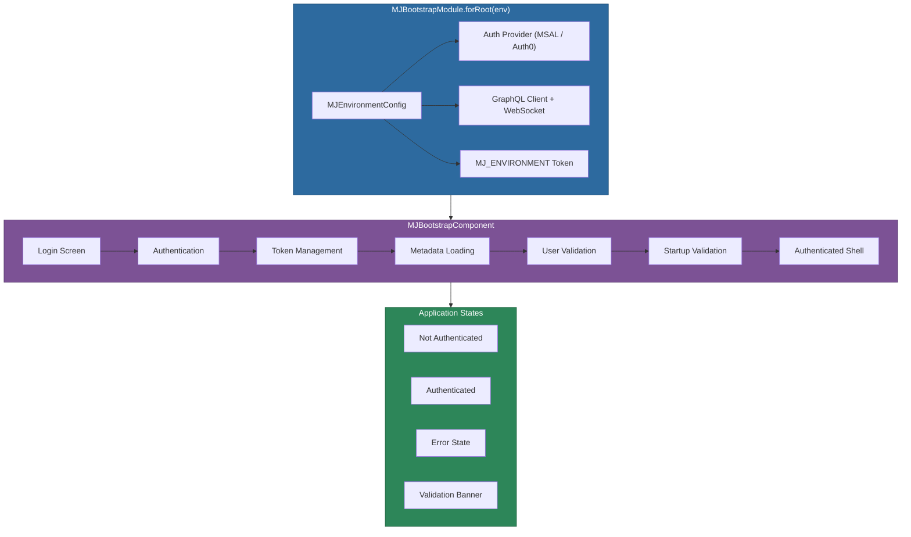

# @memberjunction/ng-bootstrap

MemberJunction Angular Bootstrap -- encapsulates all Angular authentication and initialization logic into a single reusable module. Reduces an entire MJExplorer application module to approximately 15 lines of code.

## Installation

```bash
npm install @memberjunction/ng-bootstrap
```

## Overview

In MemberJunction 3.0+, Angular applications become minimal configuration files that delegate authentication, GraphQL setup, metadata loading, and user validation to this bootstrap package. The `MJBootstrapModule` configures all necessary providers via `forRoot()`, while `MJBootstrapComponent` serves as the root component handling the full application lifecycle from login through to the authenticated shell.



## Usage

### Minimal Application Module

```typescript
import { NgModule } from '@angular/core';
import { BrowserModule } from '@angular/platform-browser';
import { BrowserAnimationsModule } from '@angular/platform-browser/animations';
import { MJBootstrapModule, MJBootstrapComponent } from '@memberjunction/ng-bootstrap';
import { MJExplorerModule } from '@memberjunction/ng-explorer-core';
import { environment } from '../environments/environment';

@NgModule({
  imports: [
    BrowserModule,
    BrowserAnimationsModule,
    MJBootstrapModule.forRoot(environment),
    MJExplorerModule
  ],
  bootstrap: [MJBootstrapComponent]
})
export class AppModule {}
```

### Environment Configuration

```typescript
import { MJEnvironmentConfig } from '@memberjunction/ng-bootstrap';

export const environment: MJEnvironmentConfig = {
  production: false,
  GRAPHQL_URI: 'http://localhost:4000/graphql',
  GRAPHQL_WS_URI: 'ws://localhost:4000/graphql',
  AUTH_TYPE: 'msal',
  MJ_CORE_SCHEMA_NAME: '__mj',

  // MSAL configuration
  CLIENT_ID: 'your-client-id',
  TENANT_ID: 'your-tenant-id'

  // OR Auth0 configuration
  // AUTH0_DOMAIN: 'yourapp.us.auth0.com',
  // AUTH0_CLIENTID: 'your-auth0-client-id'
};
```

## What It Handles

| Concern | Description |
|---------|-------------|
| Authentication | MSAL or Auth0 login/logout with token management |
| GraphQL setup | Client configuration with WebSocket subscriptions |
| Token refresh | Automatic token refresh before expiration |
| Metadata loading | MemberJunction entity metadata and definitions |
| User validation | Access and permission checks |
| Startup validation | System health checks on initialization |
| Error handling | Appropriate error messages for auth failures |
| Navigation | Initial routing after successful login |

## API Reference

### MJBootstrapModule.forRoot(environment)

Configures the bootstrap module with environment settings.

**Parameters:**
- `environment: MJEnvironmentConfig` -- Application configuration

**Returns:** `ModuleWithProviders<MJBootstrapModule>`

### MJEnvironmentConfig

```typescript
interface MJEnvironmentConfig {
  production: boolean;
  GRAPHQL_URI: string;
  GRAPHQL_WS_URI: string;
  AUTH_TYPE: 'msal' | 'auth0';
  MJ_CORE_SCHEMA_NAME: string;

  // MSAL-specific
  CLIENT_ID?: string;
  TENANT_ID?: string;

  // Auth0-specific
  AUTH0_DOMAIN?: string;
  AUTH0_CLIENTID?: string;
}
```

### Injection Tokens

- `MJ_ENVIRONMENT` -- Provides the `MJEnvironmentConfig` throughout the application

### MJStartupValidationService

An optional interface for implementing custom startup validation:

```typescript
interface MJStartupValidationService {
  Validate(): Promise<ValidationResult>;
}
```

## Migration from MJ 2.x

MemberJunction 2.x required ~350 lines of custom code in `app.component.ts` and `app.module.ts` for authentication and initialization. With 3.0+, this entire surface area is encapsulated in the bootstrap package:

| Before (2.x) | After (3.0+) |
|--------------|--------------|
| ~245 lines in `app.component.ts` | Removed entirely |
| ~107 lines in `app.module.ts` | ~15 lines |
| Custom auth logic | `MJBootstrapModule.forRoot(env)` |
| Manual GraphQL setup | Automatic |
| Custom error handling | Built-in |

## Dependencies

- [@memberjunction/core](../../MJCore/README.md) -- Core framework
- [@memberjunction/graphql-dataprovider](../../GraphQLDataProvider/README.md) -- GraphQL client
- [@memberjunction/ng-auth-services](../auth-services/README.md) -- Authentication services
- [@memberjunction/ng-explorer-core](../../Angular/Explorer/explorer-core/README.md) -- Explorer shell
- [@memberjunction/ng-shared](../shared/README.md) -- Shared utilities
