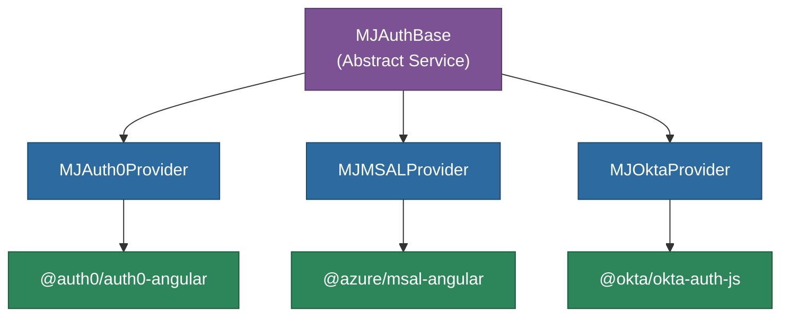

# @memberjunction/ng-auth-services

Angular authentication services for MemberJunction Explorer applications. Provides a unified abstraction layer supporting multiple OAuth providers (Auth0, Microsoft MSAL, Okta) through a consistent, type-safe API.

## Overview

This package implements a provider-agnostic authentication system using the Strategy pattern. A single abstract base class (`MJAuthBase`) defines the contract, while concrete providers handle Auth0, MSAL (Azure AD), and Okta specifics. Application code interacts only with the standardized interface, making provider switches a configuration change rather than a code change.



## Features

- **Unified Authentication Interface**: Standardized API across all providers via `IAngularAuthProvider`
- **Multiple Provider Support**: Auth0, Microsoft MSAL (Azure AD), and Okta
- **Standardized Types (v3.0.0)**: `StandardUserInfo`, `StandardAuthToken`, `StandardAuthError` eliminate leaky abstractions
- **Semantic Error Classification**: `AuthErrorType` enum replaces provider-specific error checking
- **Token Management**: ID token retrieval, token info, and automatic refresh
- **Observable State**: Reactive authentication state, user info, and email streams
- **Configuration Validation**: Each provider declares and validates its required configuration
- **Angular 21+ Compatible**: Built for modern Angular applications

## Installation

```bash
npm install @memberjunction/ng-auth-services
```

## Key Dependencies

| Dependency | Purpose |
|---|---|
| `@angular/core`, `@angular/common` | Angular framework |
| `@auth0/auth0-angular` | Auth0 provider (peer) |
| `@azure/msal-angular`, `@azure/msal-browser` | MSAL provider (peer) |
| `@okta/okta-auth-js` | Okta provider (peer) |
| `@memberjunction/core` | Core MJ utilities |
| `rxjs` | Reactive state management |

## Configuration

### Environment Setup

```typescript
// Auth0
export const environment = {
  AUTH_TYPE: 'auth0',
  AUTH0_DOMAIN: 'your-domain.auth0.com',
  AUTH0_CLIENTID: 'your-auth0-client-id',
};

// MSAL (Azure AD)
export const environment = {
  AUTH_TYPE: 'msal',
  CLIENT_ID: 'your-azure-ad-client-id',
  CLIENT_AUTHORITY: 'https://login.microsoftonline.com/your-tenant-id',
};

// Okta
export const environment = {
  AUTH_TYPE: 'okta',
  OKTA_ISSUER: 'https://your-org.okta.com/oauth2/default',
  OKTA_CLIENTID: 'your-okta-client-id',
};
```

### Module Setup

```typescript
import { AuthServicesModule } from '@memberjunction/ng-auth-services';

@NgModule({
  imports: [
    AuthServicesModule.forRoot(environment),
  ]
})
export class AppModule {}
```

## Usage

### Authentication Operations (v3.0.0 API)

```typescript
import { MJAuthBase, StandardUserInfo } from '@memberjunction/ng-auth-services';

@Component({ selector: 'app-header', template: '...' })
export class HeaderComponent {
  constructor(private authBase: MJAuthBase) {}

  async ngOnInit() {
    // Reactive auth state
    this.authBase.isAuthenticated().subscribe(isAuth => { /* ... */ });

    // Standardized user info
    this.authBase.getUserInfo().subscribe((user: StandardUserInfo | null) => {
      if (user) console.log(`Welcome ${user.name}!`);
    });

    // Token management
    const token = await this.authBase.getIdToken();
    const tokenInfo = await this.authBase.getTokenInfo();
  }

  login() { this.authBase.login(); }
  logout() { this.authBase.logout(); }
}
```

### Error Handling

```typescript
import { AuthErrorType } from '@memberjunction/ng-auth-services';

try {
  await this.authBase.refreshToken();
} catch (err) {
  const authError = this.authBase.classifyError(err);
  switch (authError.type) {
    case AuthErrorType.TOKEN_EXPIRED:
      // Session expired
      break;
    case AuthErrorType.USER_CANCELLED:
      // User cancelled - no error needed
      break;
    case AuthErrorType.NETWORK_ERROR:
      // Connectivity issue
      break;
  }
}
```

## Exported API

| Export | Type | Description |
|---|---|---|
| `MJAuthBase` | Abstract Service | Base authentication service all providers implement |
| `IAngularAuthProvider` | Interface | Contract for authentication providers |
| `AngularAuthProviderFactory` | Factory | Creates provider instances from configuration |
| `AuthServicesModule` | NgModule | Module with `forRoot()` configuration |
| `RedirectComponent` | Component | Handles OAuth redirect callbacks |
| `StandardUserInfo` | Interface | Standardized user profile data |
| `StandardAuthToken` | Interface | Standardized token information |
| `StandardAuthError` | Interface | Standardized error with classification |
| `AuthErrorType` | Enum | Semantic error categories |
| `TokenRefreshResult` | Interface | Token refresh operation result |
| `AuthState` | Interface | Complete authentication state snapshot |

## Build

```bash
cd packages/Angular/Explorer/auth-services && npm run build
```

## License

ISC
