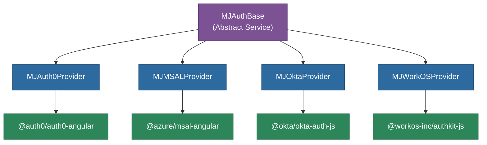

# @memberjunction/ng-auth-services

Angular authentication services for MemberJunction Explorer applications. Provides a unified abstraction layer supporting multiple OAuth providers (Auth0, Microsoft MSAL, Okta, Cognito, WorkOS) through a consistent, type-safe API.

## Overview

This package implements a provider-agnostic authentication system using the Strategy pattern. A single abstract base class (`MJAuthBase`) defines the contract, while concrete providers handle Auth0, MSAL (Azure AD), Okta, Cognito, and WorkOS (AuthKit) specifics. Application code interacts only with the standardized interface, making provider switches a configuration change rather than a code change.


```mermaid
graph TD
    A["MJAuthBase\n(Abstract Service)"] --> B["MJAuth0Provider"]
    A --> C["MJMSALProvider"]
    A --> D["MJOktaProvider"]
    A --> H["MJWorkOSProvider"]
    B --> E["@auth0/auth0-angular"]
    C --> F["@azure/msal-angular"]
    D --> G["@okta/okta-auth-js"]
    H --> I["@workos-inc/authkit-js"]

    style A fill:#7c5295,stroke:#563a6b,color:#fff
    style B fill:#2d6a9f,stroke:#1a4971,color:#fff
    style C fill:#2d6a9f,stroke:#1a4971,color:#fff
    style D fill:#2d6a9f,stroke:#1a4971,color:#fff
    style H fill:#2d6a9f,stroke:#1a4971,color:#fff
    style E fill:#2d8659,stroke:#1a5c3a,color:#fff
    style F fill:#2d8659,stroke:#1a5c3a,color:#fff
    style G fill:#2d8659,stroke:#1a5c3a,color:#fff
    style I fill:#2d8659,stroke:#1a5c3a,color:#fff
```

## Features

- **Unified Authentication Interface**: Standardized API across all providers via `IAngularAuthProvider`
- **Multiple Provider Support**: Auth0, Microsoft MSAL (Azure AD), Okta, Cognito, and WorkOS (AuthKit)
- **Standardized Types (v3.0.0)**: `StandardUserInfo`, `StandardAuthToken`, `StandardAuthError` eliminate leaky abstractions
- **Semantic Error Classification**: `AuthErrorType` enum replaces provider-specific error checking
- **Token Management**: ID token retrieval, token info, and automatic refresh
- **Observable State**: Reactive authentication state, user info, and email streams
- **Configuration Validation**: Each provider declares and validates its required configuration
- **Angular 21+ Compatible**: Built for modern Angular applications
- **Metadata-driven provider catalog**: the server publishes its configured providers pre-auth, and the app resolves which one to bootstrap from that catalog (falling back to `AUTH_TYPE`)
- **Multi-IdP login picker**: reusable, app-agnostic `<mj-login-picker>` rendered when 2+ providers are available

## Metadata-driven providers and the login picker

The server can define providers as data (`MJ: Authentication Providers`) and publishes the
non-secret subset at `GET /auth/providers`. The browser reads that **before login** and decides
which provider to wire into DI.

**Bootstrap.** `AuthServicesModule.forRoot()` runs at module-definition time, so the catalog must
be fetched before the root module is imported:

```typescript
// main.ts
await AuthProviderCatalog.Preload(environment.GRAPHQL_URI);
const { AppModule } = await import('./app/app.module');   // dynamic import is REQUIRED — see below
platformBrowserDynamic().bootstrapModule(AppModule);
```

The dynamic import is not stylistic: a static import is hoisted and would evaluate `AppModule`
(and `forRoot`) before the `await`, making the preload pointless. `forRoot()` reads the preload
itself — do **not** pass `AuthProviderCatalog.GetPreloaded()` as an argument, because Angular's
compiler rejects a function call in an `imports` array (`Value could not be determined statically`).

`Preload` never rejects. A 404 (older server), a network failure or a malformed body all yield an
empty catalog, and resolution falls back to `environment.AUTH_TYPE` — behaviour identical to before
the catalog existed.

**Rendering the picker.** Inject `MJ_AUTH_PROVIDER_RESOLUTION` and embed the shared component in
your own login surface:

```html
@if (resolution.showPicker) {
  <mj-login-picker [Providers]="resolution.choices" [Busy]="SigningIn"
                   (ProviderSelected)="OnProviderSelected($event)"></mj-login-picker>
}
```

`showPicker` is true only with 2+ providers — one option is not a choice, so single-provider
deployments render exactly as they always have.

**Switching providers reloads the page**, by necessity: each browser SDK contributes Angular
providers (interceptors, guards, config tokens) at module-definition time, so a live injector
cannot be re-composed. `AuthProviderCatalog.Select()` reports whether a reload is needed — choosing
the already-active provider logs in immediately; choosing another persists the choice, reloads, and
resumes login automatically.

**Catalog → driver config.** A row's values are projected onto the prefixed environment keys the
drivers already read (`AUTH0_DOMAIN`, `WORKOS_CLIENTID`, …), which covers Auth0/Okta/Cognito/WorkOS
with no per-driver code. A driver that reads different keys (MSAL uses unprefixed `CLIENT_ID` /
`CLIENT_AUTHORITY`) supplies a static `EnvironmentFromCatalog(info)` and maps the row itself.

## Installation

```bash
npm install @memberjunction/ng-auth-services
```

## Key Dependencies

| Dependency | Purpose |
|---|---|
| `@angular/core`, `@angular/common` | Angular framework |
| `@auth0/auth0-angular` | Auth0 provider (peer) |
| `@azure/msal-angular`, `@azure/msal-browser` | MSAL provider (peer) |
| `@okta/okta-auth-js` | Okta provider (peer) |
| `@workos-inc/authkit-js` | WorkOS AuthKit provider (peer) |
| `@memberjunction/core` | Core MJ utilities |
| `rxjs` | Reactive state management |

## Configuration

### Environment Setup

```typescript
// Auth0
export const environment = {
  AUTH_TYPE: 'auth0',
  AUTH0_DOMAIN: 'your-domain.auth0.com',
  AUTH0_CLIENTID: 'your-auth0-client-id',
};

// MSAL (Azure AD)
export const environment = {
  AUTH_TYPE: 'msal',
  CLIENT_ID: 'your-azure-ad-client-id',
  CLIENT_AUTHORITY: 'https://login.microsoftonline.com/your-tenant-id',
};

// Okta
export const environment = {
  AUTH_TYPE: 'okta',
  OKTA_ISSUER: 'https://your-org.okta.com/oauth2/default',
  OKTA_CLIENTID: 'your-okta-client-id',
};

// WorkOS (AuthKit)
export const environment = {
  AUTH_TYPE: 'workos',
  WORKOS_CLIENTID: 'client_01H...',
  // optional: WORKOS_REDIRECT_URI, WORKOS_API_HOSTNAME, WORKOS_DEV_MODE
};
```

> **WorkOS needs server-side setup too** — a JWT Template to add the user's `email` to the access
> token (WorkOS omits it by default, and MJ resolves users by email) and matching the `aud` claim.
> See the end-to-end **[WorkOS Integration Guide](../../../AuthProviders/WORKOS.md)**.

### Module Setup

```typescript
import { AuthServicesModule } from '@memberjunction/ng-auth-services';

@NgModule({
  imports: [
    AuthServicesModule.forRoot(environment),
  ]
})
export class AppModule {}
```

## Usage

### Authentication Operations (v3.0.0 API)

```typescript
import { MJAuthBase, StandardUserInfo } from '@memberjunction/ng-auth-services';

@Component({ selector: 'app-header', template: '...' })
export class HeaderComponent {
  constructor(private authBase: MJAuthBase) {}

  async ngOnInit() {
    // Reactive auth state
    this.authBase.isAuthenticated().subscribe(isAuth => { /* ... */ });

    // Standardized user info
    this.authBase.getUserInfo().subscribe((user: StandardUserInfo | null) => {
      if (user) console.log(`Welcome ${user.name}!`);
    });

    // Token management
    const token = await this.authBase.getIdToken();
    const tokenInfo = await this.authBase.getTokenInfo();
  }

  login() { this.authBase.login(); }
  logout() { this.authBase.logout(); }
}
```

### Error Handling

```typescript
import { AuthErrorType } from '@memberjunction/ng-auth-services';

try {
  await this.authBase.refreshToken();
} catch (err) {
  const authError = this.authBase.classifyError(err);
  switch (authError.type) {
    case AuthErrorType.TOKEN_EXPIRED:
      // Session expired
      break;
    case AuthErrorType.USER_CANCELLED:
      // User cancelled - no error needed
      break;
    case AuthErrorType.NETWORK_ERROR:
      // Connectivity issue
      break;
  }
}
```

## Exported API

| Export | Type | Description |
|---|---|---|
| `MJAuthBase` | Abstract Service | Base authentication service all providers implement |
| `IAngularAuthProvider` | Interface | Contract for authentication providers |
| `AngularAuthProviderFactory` | Factory | Creates provider instances from configuration |
| `AuthServicesModule` | NgModule | Module with `forRoot()` configuration |
| `RedirectComponent` | Component | Handles OAuth redirect callbacks |
| `StandardUserInfo` | Interface | Standardized user profile data |
| `StandardAuthToken` | Interface | Standardized token information |
| `StandardAuthError` | Interface | Standardized error with classification |
| `AuthErrorType` | Enum | Semantic error categories |
| `TokenRefreshResult` | Interface | Token refresh operation result |
| `AuthState` | Interface | Complete authentication state snapshot |
| `AuthProviderCatalog` | Class (static) | Pre-auth catalog fetch, provider resolution, and selection persistence |
| `AuthProviderResolution` | Interface | Which provider this page load bootstrapped, the choices, and whether to show the picker |
| `MJ_AUTH_PROVIDER_RESOLUTION` | InjectionToken | The resolution, for login surfaces |
| `MJLoginPickerComponent` | Component | Reusable `<mj-login-picker>` multi-IdP picker |
| `CatalogEnvironmentMapper` | Interface | Optional `EnvironmentFromCatalog` static for drivers with non-conventional keys |
| `mergeCatalogEnvironment` | Function | Projects a catalog row onto a driver's environment keys |

## Build

```bash
cd packages/Angular/Explorer/auth-services && npm run build
```

## License

Business Source License 1.1 — see [LICENSE](../../../../LICENSE) for details.
