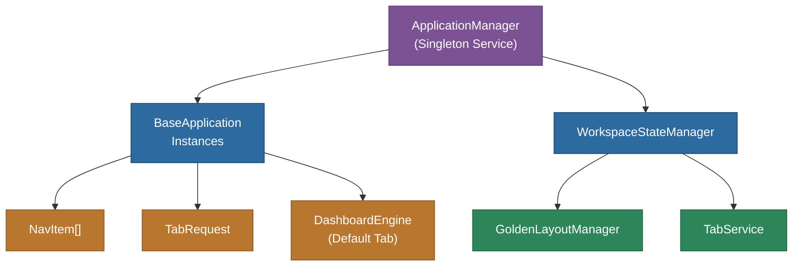

# @memberjunction/ng-base-application

Base application class system for app-centric navigation in MemberJunction Explorer. Provides extensible application classes, workspace configuration types, tab management, and state persistence.

## Overview

This package defines the foundational architecture for MemberJunction's multi-application workspace. Each "application" in MJ Explorer is an instance of `BaseApplication` (or a subclass) that provides its own navigation items, color theme, lifecycle hooks, and default dashboard. The `ApplicationManager` service handles loading, ordering, and switching between applications, while `WorkspaceStateManager` and `GoldenLayoutManager` handle tab state and layout persistence.



## Features

- **BaseApplication class**: Extensible via `@RegisterClass` for custom app behavior
- **ApplicationManager**: Loads user applications, manages active app state, handles `UserApplication` records
- **WorkspaceStateManager**: Persists and restores tab state across sessions
- **GoldenLayoutManager**: Manages the Golden Layout tab container
- **TabService**: Programmatic tab creation, switching, and closing
- **Type-safe interfaces**: `NavItem`, `TabRequest`, `WorkspaceConfiguration`
- **Dashboard integration**: Auto-loads default dashboards for apps with no nav items
- **Lifecycle hooks**: `OnActivate()` / `OnDeactivate()` for custom initialization and cleanup

## Installation

```bash
npm install @memberjunction/ng-base-application
```

## Key Dependencies

| Dependency | Purpose |
|---|---|
| `@memberjunction/core` | Metadata, entity access |
| `@memberjunction/core-entities` | DashboardEngine, UserApplicationEntity |
| `@memberjunction/global` | RegisterClass, ClassFactory |
| `golden-layout` | Tab container layout engine |
| `rxjs` | Observable state management |

## Usage

### Extending BaseApplication

```typescript
import { RegisterClass } from '@memberjunction/global';
import { BaseApplication } from '@memberjunction/ng-base-application';

@RegisterClass(BaseApplication, 'CRMApplication')
export class CRMApplication extends BaseApplication {
  override GetNavItems(): NavItem[] {
    const items = super.GetNavItems();
    // Add dynamic items based on permissions
    return items;
  }

  override async OnActivate(): Promise<void> {
    // Custom initialization when app becomes active
  }
}
```

### Using ApplicationManager

```typescript
import { ApplicationManager } from '@memberjunction/ng-base-application';

@Component({ /* ... */ })
export class AppSwitcherComponent {
  constructor(private appManager: ApplicationManager) {}

  ngOnInit() {
    this.appManager.Applications.subscribe(apps => {
      this.apps = apps; // User's active applications
    });
  }

  switchApp(app: BaseApplication) {
    this.appManager.SetActiveApp(app);
  }
}
```

## Exported API

| Export | Type | Description |
|---|---|---|
| `BaseApplication` | Class | Base class for application definitions |
| `ApplicationManager` | Service | Manages application instances and active state |
| `WorkspaceStateManager` | Service | Persists and restores workspace tab state |
| `GoldenLayoutManager` | Service | Manages Golden Layout tab container |
| `TabService` | Service | Programmatic tab management |
| `NavItem` | Interface | Navigation item configuration |
| `TabRequest` | Interface | Tab creation request |
| `WorkspaceConfiguration` | Interface | Complete workspace state |
| `UserAppConfig` | Interface | User application configuration |

## Build

```bash
cd packages/Angular/Explorer/base-application && npm run build
```

## License

ISC
