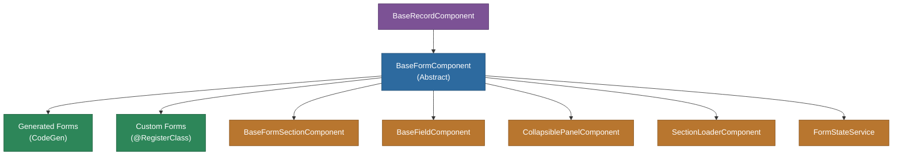

# @memberjunction/ng-base-forms

Abstract base classes and shared components for building entity record forms in MemberJunction Explorer. This package provides the foundation that all generated and custom entity forms extend.

## Overview

The `@memberjunction/ng-base-forms` package defines the component hierarchy that powers MemberJunction's dynamic form system. Forms are composed of sections, fields, and supporting UI elements. The `BaseFormComponent` handles record loading, edit mode toggling, validation, saving, tab management, and form state persistence. Generated forms (from CodeGen) and custom forms both extend these base classes.



## Features

- **BaseFormComponent**: Full record lifecycle management (load, edit, save, delete, revert)
- **BaseFormSectionComponent**: Sections within a form (Details, Related Data, etc.)
- **BaseFieldComponent**: Individual field rendering with type-specific editors
- **BaseRecordComponent**: Shared record-level functionality (loading, entity info)
- **CollapsiblePanelComponent**: Draggable, collapsible form sections with state persistence
- **SectionLoaderComponent**: Dynamic section loading via Angular's `ViewContainerRef`
- **FormStateService**: Persists expanded/collapsed section states to User Settings
- **ExplorerEntityDataGridComponent**: Embedded data grids for related entities
- **LinkFieldComponent**: Renders entity fields as clickable links (record, email, web)
- **Form context management**: `BaseFormContext` for passing state between sections

## Installation

```bash
npm install @memberjunction/ng-base-forms
```

## Key Dependencies

| Dependency | Purpose |
|---|---|
| `@memberjunction/core` | Entity metadata, RunView, validation |
| `@memberjunction/core-entities` | Entity type definitions |
| `@memberjunction/ng-shared` | SharedService, NavigationService |
| `@memberjunction/ng-tabstrip` | Tab strip for sub-entity views |
| `@memberjunction/ng-container-directives` | Dynamic component loading |
| `@memberjunction/ng-record-changes` | Record change history |
| `@progress/kendo-angular-*` | Kendo UI form controls |

## Usage

### Creating a Custom Form

Custom forms extend the generated form (not `BaseFormComponent` directly) to ensure proper `@RegisterClass` priority:

```typescript
import { RegisterClass } from '@memberjunction/global';
import { BaseFormComponent } from '@memberjunction/ng-base-forms';
import { ContactFormComponent } from '../../generated/Contacts/contact.form.component';

@RegisterClass(BaseFormComponent, 'Contacts')
@Component({
  selector: 'mj-contact-form-custom',
  templateUrl: './contact-form.component.html',
})
export class ContactFormExtended extends ContactFormComponent {
  override async ngOnInit(): Promise<void> {
    await super.ngOnInit();
    // Custom initialization
  }
}
```

### Using CollapsiblePanel

```html
<mj-collapsible-panel
  [Title]="'Additional Details'"
  [Expanded]="true"
  [Draggable]="true"
  (ExpandedChange)="onSectionToggle($event)">
  <!-- Section content -->
</mj-collapsible-panel>
```

## Exported API

| Export | Type | Description |
|---|---|---|
| `BaseFormComponent` | Abstract Class | Main form component base class |
| `BaseRecordComponent` | Abstract Class | Record-level base class |
| `BaseFormSectionComponent` | Abstract Class | Form section base class |
| `BaseFieldComponent` | Abstract Class | Field rendering base class |
| `BaseFormSectionInfo` | Class | Section metadata |
| `BaseFormContext` | Class | Form context management |
| `CollapsiblePanelComponent` | Component | Collapsible, draggable panel |
| `SectionLoaderComponent` | Component | Dynamic section loader |
| `LinkFieldComponent` | Component | Clickable entity field links |
| `FormSectionControlsComponent` | Component | Section-level action controls |
| `ExplorerEntityDataGridComponent` | Component | Embedded related-entity grid |
| `FormStateService` | Service | Section state persistence |
| `FormState` | Interface | Form state shape |
| `BaseFormsModule` | NgModule | Module declaration |

## Build

```bash
cd packages/Angular/Explorer/base-forms && npm run build
```

## License

ISC
