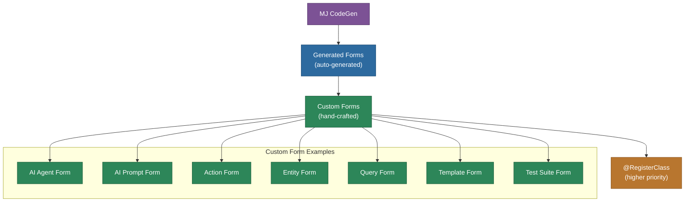

# @memberjunction/ng-core-entity-forms

Generated and custom Angular forms for all MemberJunction core entities. Contains auto-generated CRUD forms produced by CodeGen and hand-crafted custom form extensions for entities requiring specialized UI.

## Overview

This package has two major sections:

1. **Generated Forms** (`src/lib/generated/`): Auto-generated by MemberJunction CodeGen from database schema. Each entity gets a complete Angular form component with typed fields, dropdowns for foreign keys, and validation. These files should never be edited manually.

2. **Custom Forms** (`src/lib/custom/`): Hand-crafted form extensions that override generated forms for entities needing specialized UI (AI Agents, AI Prompts, Actions, Entities, Queries, Templates, Tests, etc.).



## Features

- **Complete CRUD forms** for every MemberJunction core entity
- **Custom AI Agent form**: Multi-prompt management, sub-agent configuration, action assignment, flow-based agent editing
- **Custom AI Prompt form**: Prompt editing with template selection, model configuration
- **Custom Action form**: Action parameter management, execution log viewing
- **Custom Entity form**: Entity field management, relationship visualization
- **Custom Query form**: Query editing with category management and run dialogs
- **Custom Template form**: Template content editing with parameter grids
- **Custom Test forms**: Test suite management, test run visualization, rubric editing
- **AI Agent Run visualization**: Step-by-step execution timeline, analytics, cost tracking
- **Dialog components**: Entity selector, prompt selector, sub-agent selector, and more

## Installation

```bash
npm install @memberjunction/ng-core-entity-forms
```

## Key Dependencies

| Dependency | Purpose |
|---|---|
| `@memberjunction/ng-base-forms` | Base form classes |
| `@memberjunction/core-entities` | Entity type definitions |
| `@memberjunction/ng-code-editor` | Code editing (SQL, TypeScript) |
| `@memberjunction/ng-flow-editor` | Flow-based agent editing |
| `@memberjunction/ng-agents` | AI agent components |
| `@memberjunction/ng-ai-test-harness` | AI testing UI |
| `@memberjunction/ng-entity-relationship-diagram` | ERD visualization |
| `@progress/kendo-angular-*` | Kendo UI components |
| `d3` | Data visualization |
| `rete` | Node-based flow editor |

## Usage

### Importing the Module

```typescript
import {
  CoreGeneratedFormsModule,
  CoreCustomFormsModule
} from '@memberjunction/ng-core-entity-forms';

@NgModule({
  imports: [CoreGeneratedFormsModule, CoreCustomFormsModule]
})
export class AppModule {}
```

### Using the New Agent Dialog

```typescript
import { NewAgentDialogService } from '@memberjunction/ng-core-entity-forms';

@Component({ /* ... */ })
export class MyComponent {
  constructor(private agentDialogService: NewAgentDialogService) {}

  createAgent() {
    this.agentDialogService.open();
  }
}
```

## Custom Form Architecture

Custom forms follow the pattern of extending the generated form to ensure `@RegisterClass` priority:

```typescript
import { RegisterClass } from '@memberjunction/global';
import { BaseFormComponent } from '@memberjunction/ng-base-forms';
import { AIAgentFormComponent } from '../../generated/...';

@RegisterClass(BaseFormComponent, 'AI Agents')
@Component({ /* ... */ })
export class AIAgentFormComponentExtended extends AIAgentFormComponent {
  // Custom implementation with multi-prompt management, etc.
}

export function LoadAIAgentFormComponentExtended() {
  // Prevents tree-shaking
}
```

## Exported API

| Export | Type | Description |
|---|---|---|
| `CoreGeneratedFormsModule` | NgModule | All auto-generated entity forms |
| `CoreCustomFormsModule` | NgModule | Custom form overrides |
| `NewAgentDialogComponent` | Component | Dialog for creating new AI agents |
| `NewAgentDialogService` | Service | Service to open new agent dialog |
| `FlowAgentFormSectionComponent` | Component | Flow-based agent editing section |

## Build

```bash
cd packages/Angular/Explorer/core-entity-forms && npm run build
```

## License

ISC
