# @memberjunction/ng-dashboards

Comprehensive Angular dashboard components for MemberJunction Explorer, providing administrative interfaces for AI operations, entity management, actions, communication, testing, scheduling, credentials, API keys, version history, MCP servers, and more.

## Overview

This package provides a rich collection of dashboard components registered as `BaseResourceComponent` subclasses. Each dashboard is loaded dynamically within the Explorer shell based on application navigation configuration. Dashboards follow MemberJunction's engine-class pattern for data access (no Angular services for data) and use getter/setter state management for reactivity.

```mermaid
graph TD
    BRC["BaseResourceComponent"] --> AID["AI Dashboard"]
    BRC --> EAD["Entity Admin Dashboard"]
    BRC --> ACT["Actions Dashboard"]
    BRC --> COM["Communication Dashboard"]
    BRC --> TST["Testing Dashboard"]
    BRC --> SCH["Scheduling Dashboard"]
    BRC --> CRD["Credentials Dashboard"]
    BRC --> AK["API Keys Dashboard"]
    BRC --> MCP["MCP Dashboard"]
    BRC --> CS["Component Studio"]
    BRC --> DE["Data Explorer"]
    BRC --> VH["Version History"]
    BRC --> QB["Query Browser"]
    BRC --> DB["Dashboard Browser"]
    BRC --> HD["Home Dashboard"]
    BRC --> LST["Lists Dashboard"]

    style BRC fill:#7c5295,stroke:#563a6b,color:#fff
    style AID fill:#2d6a9f,stroke:#1a4971,color:#fff
    style EAD fill:#2d6a9f,stroke:#1a4971,color:#fff
    style ACT fill:#2d6a9f,stroke:#1a4971,color:#fff
    style COM fill:#2d8659,stroke:#1a5c3a,color:#fff
    style TST fill:#2d8659,stroke:#1a5c3a,color:#fff
    style SCH fill:#2d8659,stroke:#1a5c3a,color:#fff
    style CRD fill:#b8762f,stroke:#8a5722,color:#fff
    style AK fill:#b8762f,stroke:#8a5722,color:#fff
    style MCP fill:#b8762f,stroke:#8a5722,color:#fff
    style CS fill:#b8762f,stroke:#8a5722,color:#fff
    style DE fill:#2d6a9f,stroke:#1a4971,color:#fff
    style VH fill:#2d8659,stroke:#1a5c3a,color:#fff
    style QB fill:#b8762f,stroke:#8a5722,color:#fff
    style DB fill:#b8762f,stroke:#8a5722,color:#fff
    style HD fill:#7c5295,stroke:#563a6b,color:#fff
    style LST fill:#2d6a9f,stroke:#1a4971,color:#fff
```



## Dashboards

### AI Dashboard
- **Execution Monitoring**: Real-time AI execution tracking with KPI cards, time-series charts, and performance heatmaps
- **Prompt Management**: Create, edit, and version AI prompts with model-prompt priority matrix
- **Agent Configuration**: Configure AI agents with filtering and inline editing
- **Model Management**: Manage AI model configurations
- **System Configuration**: System-wide AI settings management

### Actions Dashboard
- **Action Explorer**: Tree-based action browser with category management
- **Execution Monitoring**: Monitor action execution logs
- **Scheduled Actions**: Manage scheduled action configurations
- **Code Management**: View and manage action code
- **Entity Integration**: Configure entity-action relationships
- **Security Permissions**: Manage action-level permissions

### Data Explorer
- **Navigation Panel**: Tree-based entity browser
- **View Selector**: Switch between entity views with filtering
- **Filter Dialog**: Dynamic filter construction

### Communication Dashboard
- Monitor, logs, providers, runs, and template management for entity communications

### Testing Dashboard
- Test execution, analytics, review, and explorer views for MJ's testing framework

### Scheduling Dashboard
- Overview, jobs, and activity monitoring for scheduled tasks

### Component Studio
- Visual component builder with AI assistant, code editing, specs, and versioning

### Additional Dashboards
- **API Keys**: API key management with scopes, applications, and usage tracking
- **Credentials**: Credential management with categories, types, and audit
- **MCP (Model Context Protocol)**: MCP server management and testing
- **Version History**: Labels, diffs, restore, and graph visualization
- **Query Browser / Dashboard Browser**: Browse and manage queries and dashboards
- **Lists**: List management with categories, operations, and Venn diagrams
- **Home**: Default landing dashboard

## Installation

```bash
npm install @memberjunction/ng-dashboards
```

## Key Dependencies

| Dependency | Purpose |
|---|---|
| `@memberjunction/core`, `@memberjunction/core-entities` | Entity metadata and data access |
| `@memberjunction/ng-base-application` | BaseResourceComponent base |
| `@memberjunction/ng-shared`, `@memberjunction/ng-shared-generic` | Shared services, loading indicators |
| `@memberjunction/ng-dashboard-viewer` | Dashboard rendering |
| `@memberjunction/ng-query-viewer` | Query execution and display |
| `@progress/kendo-angular-*` | Kendo UI components |
| `d3` | Data visualization |
| `codemirror` | Code editing |

## Usage

```typescript
import { DashboardsModule } from '@memberjunction/ng-dashboards';

@NgModule({
  imports: [DashboardsModule]
})
export class AppModule {}
```

All dashboard components are registered via `@RegisterClass(BaseResourceComponent, 'ClassName')` and are loaded dynamically based on application navigation configuration. They do not need to be referenced directly in templates.

## Build

```bash
cd packages/Angular/Explorer/dashboards && npm run build
```

## License

ISC
