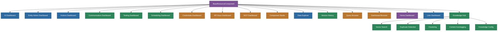

# @memberjunction/ng-dashboards

Comprehensive Angular dashboard components for MemberJunction Explorer, providing administrative interfaces for AI operations, entity management, actions, communication, testing, scheduling, credentials, API keys, version history, MCP servers, and more.

## Overview

This package provides a rich collection of dashboard components registered as `BaseResourceComponent` subclasses. Each dashboard is loaded dynamically within the Explorer shell based on application navigation configuration. Dashboards follow MemberJunction's engine-class pattern for data access (no Angular services for data) and use getter/setter state management for reactivity.


```mermaid
graph TD
    BRC["BaseResourceComponent"] --> AID["AI Dashboard"]
    BRC --> EAD["Entity Admin Dashboard"]
    BRC --> ACT["Actions Dashboard"]
    BRC --> COM["Communication Dashboard"]
    BRC --> TST["Testing Dashboard"]
    BRC --> SCH["Scheduling Dashboard"]
    BRC --> CRD["Credentials Dashboard"]
    BRC --> AK["API Keys Dashboard"]
    BRC --> MCP["MCP Dashboard"]
    BRC --> CS["Component Studio"]
    BRC --> DE["Data Explorer"]
    BRC --> VH["Version History"]
    BRC --> QB["Query Browser"]
    BRC --> DB["Dashboard Browser"]
    BRC --> HD["Home Dashboard"]
    BRC --> LST["Lists Dashboard"]
    BRC --> KH["Knowledge Hub"]
    KH --> VS["Vector Search"]
    KH --> DD["Duplicate Detection"]
    KH --> CL["Clustering"]
    KH --> AT["Content Autotagging"]
    KH --> KC["Knowledge Config"]

    style BRC fill:#7c5295,stroke:#563a6b,color:#fff
    style KH fill:#2d8659,stroke:#1a5c3a,color:#fff
    style VS fill:#2d8659,stroke:#1a5c3a,color:#fff
    style DD fill:#2d8659,stroke:#1a5c3a,color:#fff
    style CL fill:#2d8659,stroke:#1a5c3a,color:#fff
    style AT fill:#2d8659,stroke:#1a5c3a,color:#fff
    style KC fill:#2d8659,stroke:#1a5c3a,color:#fff
    style AID fill:#2d6a9f,stroke:#1a4971,color:#fff
    style EAD fill:#2d6a9f,stroke:#1a4971,color:#fff
    style ACT fill:#2d6a9f,stroke:#1a4971,color:#fff
    style COM fill:#2d8659,stroke:#1a5c3a,color:#fff
    style TST fill:#2d8659,stroke:#1a5c3a,color:#fff
    style SCH fill:#2d8659,stroke:#1a5c3a,color:#fff
    style CRD fill:#b8762f,stroke:#8a5722,color:#fff
    style AK fill:#b8762f,stroke:#8a5722,color:#fff
    style MCP fill:#b8762f,stroke:#8a5722,color:#fff
    style CS fill:#b8762f,stroke:#8a5722,color:#fff
    style DE fill:#2d6a9f,stroke:#1a4971,color:#fff
    style VH fill:#2d8659,stroke:#1a5c3a,color:#fff
    style QB fill:#b8762f,stroke:#8a5722,color:#fff
    style DB fill:#b8762f,stroke:#8a5722,color:#fff
    style HD fill:#7c5295,stroke:#563a6b,color:#fff
    style LST fill:#2d6a9f,stroke:#1a4971,color:#fff
```

## Dashboards

### AI Dashboard
- **Execution Monitoring**: Real-time AI execution tracking with KPI cards, time-series charts, and performance heatmaps
- **Prompt Management**: Create, edit, and version AI prompts with model-prompt priority matrix
- **Agent Configuration**: Configure AI agents with filtering and inline editing
- **Model Management**: Manage AI model configurations
- **System Configuration**: System-wide AI settings management

### Actions Dashboard
- **Action Explorer**: Tree-based action browser with category management
- **Execution Monitoring**: Monitor action execution logs
- **Scheduled Actions**: Manage scheduled action configurations
- **Code Management**: View and manage action code
- **Entity Integration**: Configure entity-action relationships
- **Security Permissions**: Manage action-level permissions

### Data Explorer
- **Navigation Panel**: Tree-based entity browser
- **View Selector**: Switch between entity views with filtering
- **Filter Dialog**: Dynamic filter construction

### Communication Dashboard
- Monitor, logs, providers, runs, and template management for entity communications

### Testing Dashboard
- Test execution, analytics, review, and explorer views for MJ's testing framework

### Scheduling Dashboard
- Overview, jobs, and activity monitoring for scheduled tasks

### Component Studio
- Visual component builder with AI assistant, code editing, specs, and versioning

### Knowledge Hub Dashboards

The Knowledge Hub application provides a suite of dashboards for managing vector infrastructure, content processing, and AI-powered data exploration.

#### Vector Search Dashboard
- **Unified search**: Combines vector similarity (Pinecone) with full-text search using Reciprocal Rank Fusion (RRF)
- **Entity document selection**: Pick which entity document to search against
- **Result cards**: Display matched records with relevance scores and metadata

#### Duplicate Detection Dashboard
- **Kanban board**: Organizes potential duplicates by status (Pending, Reviewed, Merged, Rejected)
- **Comparison slide-in**: Side-by-side field diff showing which fields match, differ, or are empty
- **Merge confirmation**: Dialog showing dependency counts and affected records before executing a merge
- **Drag-and-drop**: Move duplicate pairs between kanban columns for triage
- **Threshold controls**: Adjust potential and absolute match thresholds for the run
- **Progress tracking**: Real-time progress reporting during detection runs

#### Clustering Dashboard
- **Scatter plot visualization**: Interactive SVG scatter plot powered by `@memberjunction/ng-clustering`
- **Detail panel**: Click a point to see entity metadata, cluster members, and navigate to the record
- **Cluster member list**: Browse all records in the selected point's cluster
- **LLM cluster naming**: Generate descriptive cluster labels using the "Cluster Naming" AI prompt
- **Entity document selector**: Choose which entity document (and embedding model) to use when the entity has multiple documents
- **Save/restore**: Save visualizations with viewport state and cluster labels for later review
- **Config panel**: Positioned at top-left with algorithm, metric, and entity selection controls
- **FetchEntityVectors**: Uses the `FetchEntityVectors` GraphQL query to retrieve vectors from Pinecone with entity metadata filtering

#### Content Autotagging / "Classify" Dashboard
The Classify sub-app (driver class `AutotaggingPipelineResource`) is a thin host shell that delegates each tab to a self-contained sub-page component. See **[the Classify architecture README](src/AI/components/autotagging/README.md)** for the full component map, data layer, and feature details.

Left-navigation tabs:
- **Pipeline**: Real-time pipeline monitor — stage counts, KPI cards, live feed, and run controls with GraphQL progress subscription
- **Sources**: CRUD for content sources, source-detail panel, schedule dialog, full classifier config (taxonomy mode, thresholds, budgets) inline, and a dry-run disposition preview
- **Content Types**: Content type definitions with default embedding model / vector index
- **Tag Library**: Browse the tag taxonomy with weight visualization and word cloud
- **Taxonomy**: Tag governance — tree, duplicates, orphans, treemap, audit, plus per-tag **Governance / Synonyms / Scope** editors
- **Suggestions Inbox**: Human-in-the-loop review queue for ambiguous classifications (approve / merge / reject)
- **Tag Health**: Automated taxonomy-quality signals (merge candidates, low-usage, wide-node) with triage actions
- **Run History**: Historical process-run logs with per-source detail

Architecture: the former 5,147-line monolith was decomposed into 6 tab components (`tabs/`) + 4 dialog components (`dialogs/`) + a shared pure layer (`shared/`: types, formatters, dry-run disposition logic). Cacheable metadata is read from existing engines (`KnowledgeHubMetadataEngine`, `TagEngineBase`, `AIEngineBase`); high-volume rows use `RunView` (never cached).

#### Knowledge Config Dashboard
- **Central configuration**: Manage entity documents, vector indexes, vector databases, and content infrastructure
- **Uses KnowledgeHubMetadataEngine**: Singleton cache for all Knowledge Hub metadata with auto-refresh

### Predictive Studio

The Predictive Studio app (`src/PredictiveStudio/`) is a multi-section, lazy-loaded surface for training, comparing, deploying, and monitoring ML models (see the [Predictive Studio Guide](../../../../guides/PREDICTIVE_STUDIO_GUIDE.md)). Its sections include Home, Algorithm Catalog, Pipeline Builder, Experiments, Model Registry, Compare Runs, and **Models in Production** (`PSProductionResourceComponent` — deployed models, what each writes, schedule, last run, and a generic prediction-distribution mini-viz, all driven by `MJ: ML Model Scoring Bindings` + `MJ: Process Runs`). The panels read live engine data via `PredictiveStudioEngine`; Promote/Validate/Archive and experiment Pause/Resume/Cancel are wired to Remote Operations behind a confirm modal, and Home's "Ask the agent" CTA opens a docked, seeded Model-Dev-Agent chat. See [`src/PredictiveStudio/`](src/PredictiveStudio/) and the guide's [Business-User Experience](../../../../guides/PREDICTIVE_STUDIO_GUIDE.md#16-the-business-user-experience) section.

### Additional Dashboards
- **API Keys**: API key management with scopes, applications, and usage tracking
- **Credentials**: Credential management with categories, types, and audit
- **MCP (Model Context Protocol)**: MCP server management and testing
- **Version History**: Labels, diffs, restore, and graph visualization
- **Query Browser / Dashboard Browser**: Browse and manage queries and dashboards
- **Lists**: List management with categories, operations, and Venn diagrams
- **Home**: Default landing dashboard

## Installation

```bash
npm install @memberjunction/ng-dashboards
```

## Key Dependencies

| Dependency | Purpose |
|---|---|
| `@memberjunction/core`, `@memberjunction/core-entities` | Entity metadata and data access |
| `@memberjunction/ng-base-application` | BaseResourceComponent base |
| `@memberjunction/ng-shared`, `@memberjunction/ng-shared-generic` | Shared services, loading indicators |
| `@memberjunction/ng-dashboard-viewer` | Dashboard rendering |
| `@memberjunction/ng-query-viewer` | Query execution and display |
| `@progress/kendo-angular-*` | Kendo UI components |
| `d3` | Data visualization |
| `codemirror` | Code editing |

## Usage

```typescript
import { DashboardsModule } from '@memberjunction/ng-dashboards';

@NgModule({
  imports: [DashboardsModule]
})
export class AppModule {}
```

All dashboard components are registered via `@RegisterClass(BaseResourceComponent, 'ClassName')` and are loaded dynamically based on application navigation configuration. They do not need to be referenced directly in templates.

## Form Builder cockpit

`FormBuilderResourceComponent` (under `src/FormBuilder/`) is the
standalone Form Studio surface — reachable from the app rail. Cockpit
layout:

- **Left rail:** existing forms + version rail for the active form
  (Active / Pending / Inactive flags via `joinVersionsWithOverrides`).
  Row-level "Activate" / "Restore" buttons disambiguated by status.
- **Center pane (tabbed):** Preview / Code / Layout
  - **Preview:** live `<mj-interactive-form>` mount bound to a real
    Top-1 record from the target entity (ORDER BY name field). Spec
    merges live `EditableCode` over the saved spec so
    `dataRequirements` / charts continue to work.
  - **Code:** Monaco-style textarea editing of JSX.
  - **Layout:** legacy drag-drop canvas. Shows a divergence banner when
    the JSX has hand-authored content the canvas can't round-trip.
- **Right rail (chat pane):** "Refine with AI" — fires
  `ConversationBridgeService.RequestExpandOverlay()` and re-registers
  ActiveForm context.

**New-form flow** seeds the canvas + code from
`buildDefaultFormScaffold(entityName, provider)` (in
`@memberjunction/interactive-component-types/forms`). Manual create
starts at the same baseline as the AI agent path.

**EntityFormOverrideService** (under `ComponentStudio/services/`) holds
`activateVersion()` and `revertToComponent()` — client-side mirrors of
the server actions used by the cockpit's version-rail rows.

See [/plans/interactive-forms/phase-2-runtime-loop.md](../../../../plans/interactive-forms/phase-2-runtime-loop.md) for the full architecture.

## Build

```bash
cd packages/Angular/Explorer/dashboards && npm run build
```

## License

ISC
