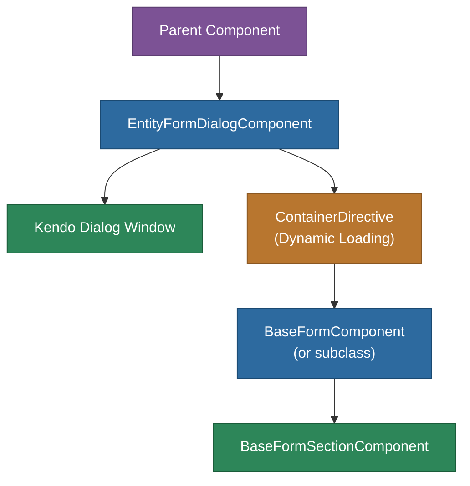

# @memberjunction/ng-entity-form-dialog

A reusable Angular dialog component that displays a MemberJunction entity form for viewing and/or editing any record from any entity. Supports showing the complete form or a specific section.

## Overview

The `EntityFormDialogComponent` wraps MemberJunction's dynamic form system inside a Kendo UI dialog window. It dynamically loads the registered form component for the given entity (including custom form overrides) and provides configurable Save/Cancel buttons with automatic record handling.



## Features

- **Universal entity support**: Works with any MemberJunction entity
- **Two display modes**: Complete form or single named section
- **Configurable buttons**: Show/hide Save and Cancel independently
- **Automatic save handling**: Optionally saves the record when user clicks Save
- **Auto-revert on cancel**: Optionally reverts record changes when user cancels
- **Resizable dialog**: Configurable width and height with user-resizable window
- **Dynamic form loading**: Uses `@RegisterClass` to load the correct form component

## Installation

```bash
npm install @memberjunction/ng-entity-form-dialog
```

## Key Dependencies

| Dependency | Purpose |
|---|---|
| `@memberjunction/core` | Entity metadata, BaseEntity |
| `@memberjunction/ng-base-forms` | BaseFormComponent, BaseFormSectionComponent |
| `@memberjunction/ng-container-directives` | Dynamic component loading |
| `@memberjunction/ng-shared` | SharedService |
| `@progress/kendo-angular-dialog` | Kendo UI dialog window |
| `@progress/kendo-angular-buttons` | Dialog action buttons |

## Usage

```html
<mj-entity-form-dialog
  [Title]="'Edit Contact'"
  [Record]="contactRecord"
  [Visible]="isDialogOpen"
  [Mode]="'complete'"
  [ShowSaveButton]="true"
  [ShowCancelButton]="true"
  [HandleSave]="true"
  [AutoRevertOnCancel]="true"
  [Width]="800"
  [Height]="600"
  (DialogClosed)="onDialogClosed($event)">
</mj-entity-form-dialog>
```

### Inputs

| Input | Type | Default | Description |
|---|---|---|---|
| `Title` | `string` | `''` | Dialog title bar text |
| `Record` | `BaseEntity` | `null` | The entity record to display |
| `Visible` | `boolean` | `false` | Controls dialog visibility |
| `Mode` | `'complete' \| 'section'` | `'complete'` | Show entire form or specific section |
| `SectionName` | `string` | `''` | Section name (when Mode is `'section'`) |
| `ShowSaveButton` | `boolean` | `true` | Show the Save button |
| `ShowCancelButton` | `boolean` | `true` | Show the Cancel button |
| `HandleSave` | `boolean` | `true` | Auto-save record on Save click |
| `AutoRevertOnCancel` | `boolean` | `true` | Auto-revert record on Cancel click |
| `Width` | `number` | `800` | Dialog width in pixels |
| `Height` | `number` | `600` | Dialog height in pixels |

### Outputs

| Output | Type | Description |
|---|---|---|
| `DialogClosed` | `EventEmitter<'Save' \| 'Cancel'>` | Emitted when dialog closes with action taken |

## Exported API

| Export | Type | Description |
|---|---|---|
| `EntityFormDialogComponent` | Component | The dialog component |
| `EntityFormDialogModule` | NgModule | Module declaration |

## Build

```bash
cd packages/Angular/Explorer/entity-form-dialog && npm run build
```

## License

ISC
