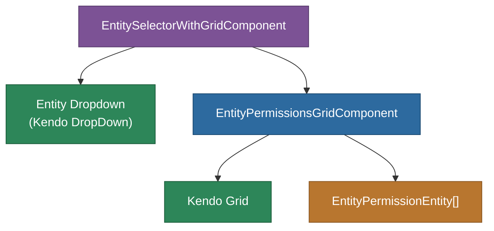

# @memberjunction/ng-entity-permissions

Angular components for displaying and editing entity-level CRUD permissions in MemberJunction. Provides a grid-based interface for managing Read, Create, Update, and Delete permissions per role or per entity.

## Overview

This package provides two main components for permission management: `EntityPermissionsGridComponent` displays a grid of permission checkboxes (filterable by entity or role), and `EntitySelectorWithGridComponent` combines an entity dropdown with the permissions grid for a complete permission management interface.



## Features

- **Dual mode**: View permissions by Entity (all roles for an entity) or by Role (all entities for a role)
- **Interactive grid**: Toggle CRUD permissions with checkboxes
- **Permission change events**: Emits `EntityPermissionChangedEvent` with cancel support
- **Entity selector**: Combined dropdown + grid for complete permission management
- **Auto-refresh**: Automatically reloads when entity or role changes

## Installation

```bash
npm install @memberjunction/ng-entity-permissions
```

## Key Dependencies

| Dependency | Purpose |
|---|---|
| `@memberjunction/core` | Metadata, RunView |
| `@memberjunction/core-entities` | EntityPermissionEntity |
| `@progress/kendo-angular-grid` | Permissions grid |
| `@progress/kendo-angular-dropdowns` | Entity/role selector |

## Usage

### Entity Mode (All Roles for an Entity)

```html
<mj-entity-permissions-grid
  [Mode]="'Entity'"
  [EntityName]="'Contacts'"
  (PermissionChanged)="onPermissionChanged($event)">
</mj-entity-permissions-grid>
```

### Role Mode (All Entities for a Role)

```html
<mj-entity-permissions-grid
  [Mode]="'Role'"
  [RoleName]="'Admin'"
  (PermissionChanged)="onPermissionChanged($event)">
</mj-entity-permissions-grid>
```

### Combined Selector + Grid

```html
<mj-entity-selector-with-grid
  (PermissionChanged)="onPermissionChanged($event)">
</mj-entity-selector-with-grid>
```

### Permission Change Event

```typescript
onPermissionChanged(event: EntityPermissionChangedEvent) {
  // event.EntityName, event.RoleID
  // event.PermissionTypeChanged: 'Read' | 'Create' | 'Update' | 'Delete'
  // event.Value: boolean
  // Set event.Cancel = true to prevent the change
}
```

## Exported API

| Export | Type | Description |
|---|---|---|
| `EntityPermissionsGridComponent` | Component | CRUD permissions grid |
| `EntitySelectorWithGridComponent` | Component | Entity dropdown + permissions grid |
| `EntityPermissionChangedEvent` | Type | Permission change event shape |
| `EntityPermissionsModule` | NgModule | Module declaration |

## Build

```bash
cd packages/Angular/Explorer/entity-permissions && npm run build
```

## License

ISC
