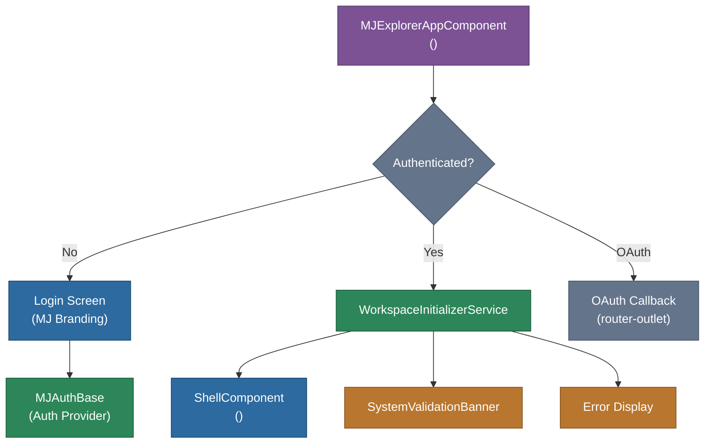

# @memberjunction/ng-explorer-app

Complete branded application shell for MemberJunction Explorer-style applications. Provides the login screen, authentication flow, workspace initialization, and main application frame.

## Overview

Explorer App is the top-level entry point component for MemberJunction Explorer applications. It handles the full application lifecycle: displaying a branded login screen for unauthenticated users, orchestrating authentication via `MJAuthBase`, initializing the workspace through `WorkspaceInitializerService`, and rendering the `mj-shell` component for authenticated users. It also handles OAuth callback routing and error display.



## Features

- **Branded login screen**: MemberJunction-styled login page with logo and welcome messaging
- **Authentication integration**: Works with any `MJAuthBase` provider (MSAL, Auth0, etc.)
- **Workspace initialization**: Delegates GraphQL setup, metadata loading, and user validation to `WorkspaceInitializerService`
- **OAuth callback handling**: Conditional rendering for OAuth callback routes
- **Error classification**: Handles no-roles, no-access, token-expired, and network errors with user-friendly messages
- **Auth retry**: Automatic one-time retry for expired tokens
- **System validation banner**: Displays startup configuration warnings
- **Bundled assets**: Ships with MJ logo, fonts, and SCSS theme files

## Installation

```bash
npm install @memberjunction/ng-explorer-app
```

## Key Dependencies

| Dependency | Purpose |
|---|---|
| `@memberjunction/ng-bootstrap` | `MJ_ENVIRONMENT` injection token, `MJEnvironmentConfig` |
| `@memberjunction/ng-explorer-core` | `ShellModule`, `StartupValidationService`, `SystemValidationBannerComponent` |
| `@memberjunction/ng-auth-services` | `MJAuthBase` authentication abstraction |
| `@memberjunction/ng-workspace-initializer` | `WorkspaceInitializerService` for workspace setup |
| `@memberjunction/core` | `SetProductionStatus`, `LogError` |

## Usage

### Module Import

```typescript
import { MJExplorerAppModule } from '@memberjunction/ng-explorer-app';

@NgModule({
  imports: [
    MJExplorerAppModule.forRoot(environment)  // Pass environment config
  ],
  bootstrap: [/* your bootstrap component */]
})
export class AppModule {}
```

The `forRoot()` method provides the `MJ_ENVIRONMENT` and `MJ_STARTUP_VALIDATION` tokens.

### Template

```html
<mj-explorer-app></mj-explorer-app>
```

This single component handles everything: login display, authentication, workspace initialization, and the full Explorer shell.

## Exported API

| Export | Type | Description |
|---|---|---|
| `MJExplorerAppModule` | NgModule | Application shell module with `forRoot()` configuration |
| `MJExplorerAppComponent` | Component | `<mj-explorer-app>` - the main application entry point |

## Build

```bash
cd packages/Angular/Explorer/explorer-app && npm run build
```

## Related Packages

- [`@memberjunction/ng-explorer-core`](../explorer-core) - Shell, routing, and resource components
- [`@memberjunction/ng-workspace-initializer`](../workspace-initializer) - Workspace initialization service
- [`@memberjunction/ng-explorer-modules`](../explorer-modules) - Consolidated module bundle
- [`@memberjunction/ng-auth-services`](../auth-services) - Authentication abstraction

## License

MIT
