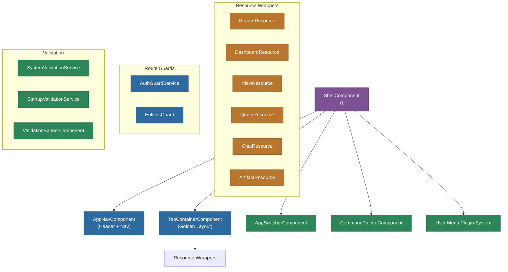

# @memberjunction/ng-explorer-core

Core components and infrastructure for the MemberJunction Explorer application. Provides the shell, routing, resource wrappers, command palette, user menu system, authentication guards, and single-entity/record/dashboard view components.

## Overview

Explorer Core is the central package that implements the Explorer application's runtime. It provides the `ShellComponent` (the main application frame with header, app switcher, navigation, and tab container), resource wrapper components for each resource type, route guards, validation services, and an extensible user menu plugin system.



## Features

- **Shell Component**: App-centric header with app switcher, nav items, Golden Layout tab container, loading animations, and notification badges
- **Resource Wrappers**: Specialized components for Records, Dashboards, Views, Queries, Lists, Search Results, Conversations, and Artifacts
- **Command Palette**: Global keyboard-driven command search (Ctrl+K / Cmd+K)
- **User Menu Plugin System**: Extensible via `BaseUserMenu` with `@RegisterClass` overrides
- **Route Guards**: `AuthGuardService` for authentication, `EntitiesGuard` for entity route validation
- **System Validation**: Startup validation services with visual banner for configuration issues
- **OAuth Module**: OAuth callback handling for external service integrations
- **Single-entity views**: `SingleRecordComponent`, `SingleDashboardComponent`, `SingleQueryComponent`, `SingleListDetailComponent`, `SingleSearchResultComponent`
- **Dashboard management**: Add/edit/delete dashboard items, preferences dialog
- **User profile**: Profile viewing and notification components

## Installation

```bash
npm install @memberjunction/ng-explorer-core
```

## Key Dependencies

| Dependency | Purpose |
|---|---|
| `@memberjunction/ng-base-application` | ApplicationManager, WorkspaceStateManager, GoldenLayoutManager |
| `@memberjunction/ng-auth-services` | MJAuthBase for authentication |
| `@memberjunction/ng-shared`, `@memberjunction/ng-shared-generic` | Shared services, NavigationService |
| `@memberjunction/ng-dashboards` | Dashboard components |
| `@memberjunction/ng-entity-form-dialog` | Entity form dialogs |
| `@memberjunction/ng-conversations` | Chat conversation components |
| `@memberjunction/ng-artifacts` | Artifact viewer |
| `golden-layout` | Tab container layout engine |
| `@progress/kendo-angular-*` | Kendo UI components |

## Usage

### Module Import

```typescript
import { ExplorerCoreModule, ShellModule } from '@memberjunction/ng-explorer-core';

@NgModule({
  imports: [ExplorerCoreModule, ShellModule]
})
export class AppModule {}
```

### Shell Component

```html
<mj-shell></mj-shell>
```

The shell handles everything: header navigation, app switching, tab management, workspace state persistence, loading animations, and user menu.

### Custom Resource Types

```typescript
import { RegisterClass } from '@memberjunction/global';
import { BaseResourceComponent } from '@memberjunction/ng-shared';

@RegisterClass(BaseResourceComponent, 'MyCustomResource')
@Component({ selector: 'mj-custom-resource', template: '...' })
export class CustomResource extends BaseResourceComponent {
  async GetResourceDisplayName(data: ResourceData): Promise<string> {
    return `Custom: ${data.Name}`;
  }
  async GetResourceIconClass(data: ResourceData): Promise<string> {
    return 'fa-solid fa-star';
  }
}
```

### User Menu Customization

```typescript
import { RegisterClass } from '@memberjunction/global';
import { BaseUserMenu, UserMenuItem } from '@memberjunction/ng-explorer-core';

@RegisterClass(BaseUserMenu)
export class CustomUserMenu extends BaseUserMenu {
  public GetMenuItems(): UserMenuItem[] {
    const items = super.GetMenuItems();
    items.push({
      id: 'my-action', label: 'My Action', icon: 'fa-solid fa-star',
      group: 'primary', order: 50, developerOnly: false,
      visible: true, enabled: true
    });
    return items;
  }
}
```

### Command Palette

The command palette is available globally via Ctrl+K (Cmd+K on Mac). Custom commands can be registered via `CommandPaletteService`.

## Exported API

Key exports include:

| Export | Type | Description |
|---|---|---|
| `ShellComponent` | Component | Main application shell |
| `ShellModule` | NgModule | Shell module with all shell-related components |
| `ExplorerCoreModule` | NgModule | Core module with routes and common components |
| `ResourceContainerComponent` | Component | Dynamic resource loading container |
| `CommandPaletteComponent` | Component | Global command search |
| `CommandPaletteService` | Service | Programmatic command palette control |
| `AuthGuardService` | Guard | Authentication route guard |
| `EntitiesGuard` | Guard | Entity route validation guard |
| `SystemValidationService` | Service | System configuration validation |
| `StartupValidationService` | Service | Startup validation checks |
| `SystemValidationBannerComponent` | Component | Validation issue banner |
| `BaseUserMenu` | Class | Extensible user menu base class |
| `UserMenuItem`, `UserMenuContext` | Interfaces | User menu type definitions |
| `DashboardPreferencesDialogComponent` | Component | Dashboard preferences editor |
| `SingleRecordComponent` | Component | Single record viewer/editor |
| `SingleDashboardComponent` | Component | Single dashboard viewer |
| `SingleQueryComponent` | Component | Single query viewer |
| `OAuthModule` | NgModule | OAuth callback handling |
| `AppRoutingModule` | NgModule | Application routing configuration |

## Build

```bash
cd packages/Angular/Explorer/explorer-core && npm run build
```

## License

ISC
