# @memberjunction/ng-explorer-modules

Consolidated module bundle that re-exports all MemberJunction Explorer and Kendo UI modules in a single import. Replaces 20+ individual module imports with one.

## Overview

Explorer Modules provides `MJExplorerModulesBundle`, a convenience NgModule that aggregates all commonly needed MJ Explorer modules and Kendo UI modules. Instead of importing each module individually in your application, import this single bundle to get the complete set of MJ functionality.

```mermaid
graph TD
    BUNDLE["MJExplorerModulesBundle"] --> EC["ExplorerCoreModule"]
    BUNDLE --> CGF["CoreGeneratedFormsModule"]
    BUNDLE --> WI["WorkspaceInitializerModule"]
    BUNDLE --> LD["LinkDirectivesModule"]
    BUNDLE --> CD["ContainerDirectivesModule"]
    BUNDLE --> ES["ExplorerSettingsModule"]
    BUNDLE --> SM["ShellModule"]
    BUNDLE --> KM["MJKendoModule"]

    style BUNDLE fill:#7c5295,stroke:#563a6b,color:#fff
    style EC fill:#2d6a9f,stroke:#1a4971,color:#fff
    style CGF fill:#2d6a9f,stroke:#1a4971,color:#fff
    style WI fill:#2d6a9f,stroke:#1a4971,color:#fff
    style LD fill:#2d6a9f,stroke:#1a4971,color:#fff
    style CD fill:#2d6a9f,stroke:#1a4971,color:#fff
    style ES fill:#2d6a9f,stroke:#1a4971,color:#fff
    style SM fill:#2d6a9f,stroke:#1a4971,color:#fff
    style KM fill:#2d8659,stroke:#1a5c3a,color:#fff
```



## Installation

```bash
npm install @memberjunction/ng-explorer-modules
```

## Usage

```typescript
import { MJExplorerModulesBundle } from '@memberjunction/ng-explorer-modules';

@NgModule({
  imports: [
    BrowserModule,
    MJExplorerModulesBundle,  // Replaces 20+ individual module imports
    // ... your app-specific modules
  ]
})
export class AppModule {}
```

## Included Modules

### MemberJunction Modules

| Module | Package | Purpose |
|---|---|---|
| `ExplorerCoreModule` | `@memberjunction/ng-explorer-core` | Core Explorer infrastructure and routing |
| `ShellModule` | `@memberjunction/ng-explorer-core` | Application shell with header, nav, and tabs |
| `CoreGeneratedFormsModule` | `@memberjunction/ng-core-entity-forms` | Auto-generated CRUD forms for all entities |
| `WorkspaceInitializerModule` | `@memberjunction/ng-workspace-initializer` | Workspace initialization service |
| `LinkDirectivesModule` | `@memberjunction/ng-link-directives` | Email, web, and entity record link directives |
| `ContainerDirectivesModule` | `@memberjunction/ng-container-directives` | Dynamic component container directives |
| `ExplorerSettingsModule` | `@memberjunction/ng-explorer-settings` | User settings and preferences |

### Kendo UI Modules

All Kendo UI modules are included via [`MJKendoModule`](../kendo-modules).

## Exported API

| Export | Type | Description |
|---|---|---|
| `MJExplorerModulesBundle` | NgModule | Consolidated bundle of all Explorer and Kendo modules |

## Build

```bash
cd packages/Angular/Explorer/explorer-modules && npm run build
```

## Related Packages

- [`@memberjunction/ng-kendo-modules`](../kendo-modules) - Kendo UI module bundle (included)
- [`@memberjunction/ng-explorer-core`](../explorer-core) - Core Explorer components
- [`@memberjunction/ng-explorer-app`](../explorer-app) - Application shell entry point

## License

ISC
