# @memberjunction/ng-explorer-settings

Angular components for the Settings section of MemberJunction Explorer. Provides a tabbed settings interface covering general preferences, user management, role management, application management, entity permissions, appearance, notifications, SQL logging, and profile settings.

## Overview

The `SettingsComponent` serves as the main container, registered via `@RegisterClass(BaseNavigationComponent, 'Settings')`. It provides a searchable, tabbed interface for administrative and user settings. Each settings area is implemented as a standalone component that can be used independently.

```mermaid
graph TD
    SC["SettingsComponent\n(<mj-settings>)"] --> GS["GeneralSettingsComponent"]
    SC --> AI["AccountInfoComponent"]
    SC --> AS["AppearanceSettingsComponent"]
    SC --> APS["ApplicationSettingsComponent"]
    SC --> UM["UserManagementComponent"]
    SC --> RM["RoleManagementComponent"]
    SC --> AM["ApplicationManagementComponent"]
    SC --> EP["EntityPermissionsComponent"]
    SC --> NP["NotificationPreferencesComponent"]
    SC --> SL["SQLLoggingComponent"]
    SC --> UP["UserProfileSettingsComponent"]
    SC --> UAC["UserAppConfigComponent"]

    UM --> UD["UserDialogComponent"]
    RM --> RD["RoleDialogComponent"]
    AM --> AD["ApplicationDialogComponent"]
    EP --> PD["PermissionDialogComponent"]

    style SC fill:#7c5295,stroke:#563a6b,color:#fff
    style GS fill:#2d6a9f,stroke:#1a4971,color:#fff
    style AI fill:#2d6a9f,stroke:#1a4971,color:#fff
    style AS fill:#2d6a9f,stroke:#1a4971,color:#fff
    style APS fill:#2d6a9f,stroke:#1a4971,color:#fff
    style UM fill:#2d8659,stroke:#1a5c3a,color:#fff
    style RM fill:#2d8659,stroke:#1a5c3a,color:#fff
    style AM fill:#2d8659,stroke:#1a5c3a,color:#fff
    style EP fill:#2d8659,stroke:#1a5c3a,color:#fff
    style NP fill:#b8762f,stroke:#8a5722,color:#fff
    style SL fill:#b8762f,stroke:#8a5722,color:#fff
    style UP fill:#b8762f,stroke:#8a5722,color:#fff
    style UAC fill:#b8762f,stroke:#8a5722,color:#fff
    style UD fill:#2d8659,stroke:#1a5c3a,color:#fff
    style RD fill:#2d8659,stroke:#1a5c3a,color:#fff
    style AD fill:#2d8659,stroke:#1a5c3a,color:#fff
    style PD fill:#2d8659,stroke:#1a5c3a,color:#fff
```



## Features

- **Tabbed settings interface** with search across all settings
- **General settings**: Core application preferences
- **Account info**: User account details
- **Appearance settings**: Theme and display preferences
- **Application settings**: Application-specific configuration
- **User management**: CRUD for users with dialog-based editing
- **Role management**: CRUD for roles with dialog-based editing
- **Application management**: CRUD for applications with dialog-based editing
- **Entity permissions**: Permission grid integrated from `@memberjunction/ng-entity-permissions`
- **Notification preferences**: Notification configuration
- **SQL logging**: SQL query logging viewer
- **User profile settings**: Profile editing
- **User app configuration**: Per-user application configuration
- **Reusable settings card**: `SettingsCardComponent` for consistent card layout
- **Shared settings module**: Common settings UI elements

## Installation

```bash
npm install @memberjunction/ng-explorer-settings
```

## Key Dependencies

| Dependency | Purpose |
|---|---|
| `@memberjunction/core`, `@memberjunction/core-entities` | Entity metadata and data |
| `@memberjunction/ng-base-application` | BaseNavigationComponent |
| `@memberjunction/ng-entity-permissions` | Entity permission grid |
| `@memberjunction/ng-entity-form-dialog` | Entity form dialogs |
| `@memberjunction/ng-simple-record-list` | Simple record CRUD lists |
| `@memberjunction/ng-join-grid` | Join/relationship grid |
| `@memberjunction/ng-user-avatar` | User avatar display |
| `@progress/kendo-angular-*` | Kendo UI components |
| `@angular/cdk` | Angular CDK utilities |

## Usage

```typescript
import { ExplorerSettingsModule } from '@memberjunction/ng-explorer-settings';

@NgModule({
  imports: [ExplorerSettingsModule]
})
export class AppModule {}
```

The `SettingsComponent` is registered via `@RegisterClass(BaseNavigationComponent, 'Settings')` and is typically loaded through Explorer's navigation system.

## Exported API

| Export | Type | Description |
|---|---|---|
| `ExplorerSettingsModule` | NgModule | Main settings module |
| `SettingsComponent` | Component | Main tabbed settings container |
| `GeneralSettingsComponent` | Component | General preferences |
| `AccountInfoComponent` | Component | Account information |
| `AppearanceSettingsComponent` | Component | Theme/display settings |
| `ApplicationSettingsComponent` | Component | Application preferences |
| `UserManagementComponent` | Component | User CRUD management |
| `RoleManagementComponent` | Component | Role CRUD management |
| `ApplicationManagementComponent` | Component | Application CRUD management |
| `EntityPermissionsSettingsComponent` | Component | Entity permission management |
| `NotificationPreferencesComponent` | Component | Notification settings |
| `SQLLoggingComponent` | Component | SQL logging viewer |
| `UserProfileSettingsComponent` | Component | Profile editing |
| `UserAppConfigComponent` | Component | User app configuration |
| `SettingsCardComponent` | Component | Reusable settings card layout |
| `UserDialogComponent` | Component | User edit dialog |
| `RoleDialogComponent` | Component | Role edit dialog |
| `ApplicationDialogComponent` | Component | Application edit dialog |
| `PermissionDialogComponent` | Component | Permission edit dialog |

## Build

```bash
cd packages/Angular/Explorer/explorer-settings && npm run build
```

## License

ISC
