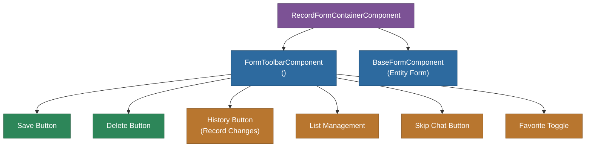

# @memberjunction/ng-form-toolbar

Angular toolbar component for entity record forms in MemberJunction Explorer. Provides Save, Delete, record history, list management, and AI chat integration buttons with consistent behavior across all entity forms.

## Overview

The `FormToolbarComponent` is the standard toolbar placed above entity forms. It coordinates with the `BaseFormComponent` to provide consistent record actions. The `RecordFormContainerComponent` wraps a form with its toolbar as a complete unit.



## Features

- **Save/Cancel**: Save and revert record changes
- **Delete confirmation**: Delete with confirmation dialog
- **Record history**: Opens record changes dialog showing audit trail
- **List management**: Add/remove records from lists with enhanced list management dialog
- **List membership indicator**: Shows count of lists containing the current record
- **Skip Chat integration**: Opens AI chat for the current record
- **Favorites**: Toggle favorite status for records
- **Content projection**: Supports `#additionalControls` for custom toolbar buttons
- **Disable support**: Global and state-based disable controls

## Installation

```bash
npm install @memberjunction/ng-form-toolbar
```

## Key Dependencies

| Dependency | Purpose |
|---|---|
| `@memberjunction/ng-base-forms` | BaseFormComponent reference |
| `@memberjunction/ng-shared` | SharedService, EventCodes |
| `@memberjunction/ng-record-changes` | Record change history |
| `@memberjunction/ng-list-management` | List management dialog |
| `@memberjunction/core` | Metadata, CompositeKey, RunView |
| `@progress/kendo-angular-buttons` | Toolbar buttons |
| `@progress/kendo-angular-dialog` | Confirmation dialogs |

## Usage

```html
<mj-form-toolbar
  [form]="formComponent"
  [ShowSkipChatButton]="true">
  <!-- Optional: Custom toolbar buttons -->
  <ng-template #additionalControls>
    <button kendoButton (click)="customAction()">Custom</button>
  </ng-template>
</mj-form-toolbar>
```

### Inputs

| Input | Type | Default | Description |
|---|---|---|---|
| `form` | `BaseFormComponent` | Required | Reference to the form component |
| `ShowSkipChatButton` | `boolean` | `true` | Show/hide the AI chat button |

### Using RecordFormContainer

The `RecordFormContainerComponent` combines the toolbar with a form:

```html
<mj-record-form-container
  [record]="entityRecord"
  [entityName]="'Contacts'">
</mj-record-form-container>
```

## Exported API

| Export | Type | Description |
|---|---|---|
| `FormToolbarComponent` | Component | The form toolbar |
| `RecordFormContainerComponent` | Component | Toolbar + form container |
| `FormToolbarModule` | NgModule | Module declaration |

## Build

```bash
cd packages/Angular/Explorer/form-toolbar && npm run build
```

## License

ISC
