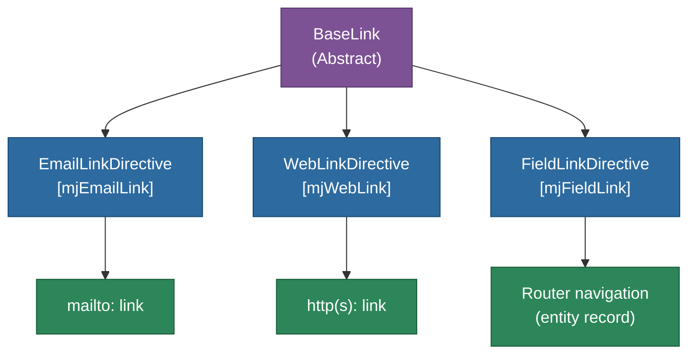

# @memberjunction/ng-link-directives

Angular directives for transforming elements into clickable email, web, or entity record links. Used throughout MemberJunction forms to make field values interactive.

## Overview

This package provides three directives that wrap elements in anchor tags based on the type of data they represent. A `BaseLink` abstract class handles the shared DOM manipulation logic. These directives are used automatically by MemberJunction's form system to make email addresses, URLs, and foreign key values clickable.



## Features

- **Email links**: Wraps text in a `mailto:` anchor tag
- **Web links**: Wraps text in an `http(s):` anchor tag (opens in new tab)
- **Field/Record links**: Wraps entity foreign key values as router links to navigate to the referenced record
- **Automatic styling**: Adds `link-text` CSS class with consistent font sizing
- **Lightweight**: Minimal DOM manipulation using Angular `Renderer2`

## Installation

```bash
npm install @memberjunction/ng-link-directives
```

## Key Dependencies

| Dependency | Purpose |
|---|---|
| `@memberjunction/core` | EntityField metadata |
| `@memberjunction/ng-shared` | SharedService, navigation |
| `@angular/router` | Router for record navigation |

## Usage

### Import the Module

```typescript
import { LinkDirectivesModule } from '@memberjunction/ng-link-directives';

@NgModule({
  imports: [LinkDirectivesModule]
})
export class AppModule {}
```

### Email Link

```html
<span [mjEmailLink]="emailField">user@example.com</span>
```

### Web Link

```html
<span [mjWebLink]="urlField">https://example.com</span>
```

### Field/Record Link

```html
<span [mjFieldLink]="foreignKeyField" [record]="entityRecord">Related Record</span>
```

## Exported API

| Export | Type | Description |
|---|---|---|
| `LinkDirectivesModule` | NgModule | Module with all directive declarations |
| `BaseLink` | Abstract Class | Shared link creation logic |
| `EmailLinkDirective` | Directive | `[mjEmailLink]` - creates mailto links |
| `WebLinkDirective` | Directive | `[mjWebLink]` - creates web links |
| `FieldLinkDirective` | Directive | `[mjFieldLink]` - creates record navigation links |

## Build

```bash
cd packages/Angular/Explorer/link-directives && npm run build
```

## License

ISC
