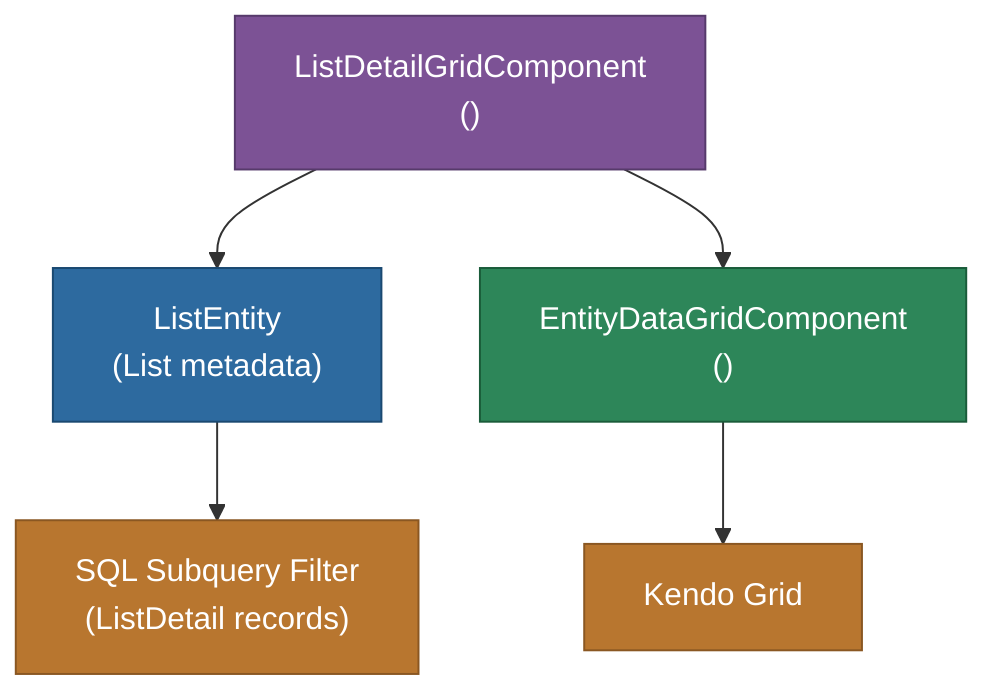

# @memberjunction/ng-list-detail-grid

Angular grid component for displaying records belonging to a MemberJunction List. Wraps the `mj-entity-data-grid` component with automatic list-based filtering using subquery SQL filters.

## Overview

The `ListDetailGridComponent` takes a `listId` and loads the associated `ListEntity` to determine the target entity and build a SQL subquery filter that fetches only records whose IDs appear in the list's detail records. It supports auto-navigation to records on click, selection events, and dynamic list switching.



## Features

- **List-based filtering**: Automatically builds SQL subquery filter from ListDetail records
- **Auto-navigation**: Optionally navigates to entity record on row click
- **Row click events**: Emits `ListGridRowClickedEvent` with entity info and composite key
- **Dynamic list switching**: Reloads when `listId` input changes
- **Toolbar integration**: Configurable grid toolbar via `GridToolbarConfig`
- **Selection modes**: Supports single and multi-row selection
- **Loading state**: Shows loading indicator via `<mj-loading>` while list data loads

## Installation

```bash
npm install @memberjunction/ng-list-detail-grid
```

## Key Dependencies

| Dependency | Purpose |
|---|---|
| `@memberjunction/core` | Metadata, RunView, CompositeKey |
| `@memberjunction/core-entities` | ListEntity |
| `@memberjunction/ng-entity-viewer` | EntityDataGridComponent |
| `@memberjunction/ng-shared` | SharedService, navigation |
| `@memberjunction/ng-shared-generic` | Loading indicator |

## Usage

```html
<mj-list-detail-grid
  [listId]="selectedList.ID"
  [autoNavigate]="true"
  (rowClicked)="onRecordSelected($event)">
</mj-list-detail-grid>
```

### Inputs

| Input | Type | Default | Description |
|---|---|---|---|
| `listId` | `string` | Required | The List ID to display records for |
| `autoNavigate` | `boolean` | `false` | Navigate to record on row click |

### Outputs

| Output | Type | Description |
|---|---|---|
| `rowClicked` | `EventEmitter<ListGridRowClickedEvent>` | Emitted when a row is clicked |

### ListGridRowClickedEvent

```typescript
interface ListGridRowClickedEvent {
  entityId: string;
  entityName: string;
  compositeKey: CompositeKey;
  record: BaseEntity;
}
```

## Exported API

| Export | Type | Description |
|---|---|---|
| `ListDetailGridComponent` | Component | List-filtered data grid |
| `ListGridRowClickedEvent` | Interface | Row click event type |
| `ListDetailGridModule` | NgModule | Module declaration |

## Build

```bash
cd packages/Angular/Explorer/list-detail-grid && npm run build
```

## License

ISC
