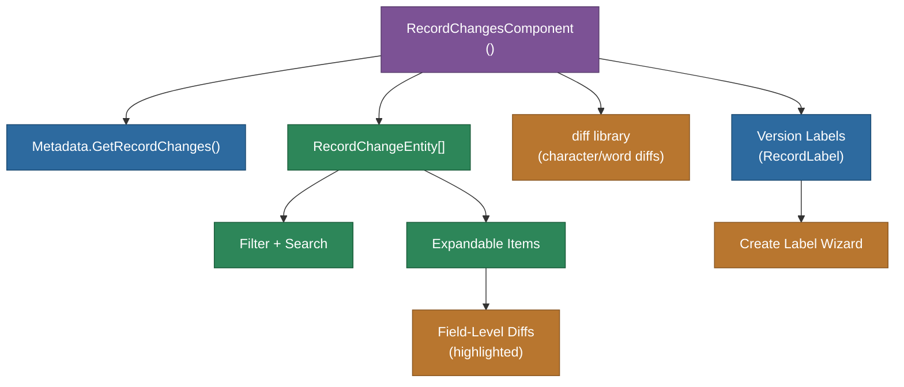

# @memberjunction/ng-record-changes

Angular component for displaying the change history (audit trail) of a specific entity record in MemberJunction. Shows a chronological list of all changes with field-level diffs, filtering, version labels, and restore capabilities.

## Overview

The `RecordChangesComponent` loads all `RecordChange` entries for a given `BaseEntity` record and presents them in a slide-out panel. Each change shows the timestamp, change type, user, and field-level diffs with character-level highlighting. It integrates with MemberJunction's built-in version control system ("Record Changes") that automatically tracks all entity modifications.



## Features

- **Chronological change list**: All changes sorted newest-first
- **Field-level diffs**: Character-level and word-level diff highlighting using the `diff` library
- **Expandable change items**: Click to expand and see detailed field changes
- **Search and filter**: Filter changes by text, type, and source
- **Version labels**: View and create version labels associated with record changes
- **Slide-out panel**: Appears as an animated side panel overlay
- **OnPush change detection**: Optimized for performance with `ChangeDetectionStrategy.OnPush`
- **Notification integration**: Error notifications via `MJNotificationService`

## Installation

```bash
npm install @memberjunction/ng-record-changes
```

## Key Dependencies

| Dependency | Purpose |
|---|---|
| `@memberjunction/core` | Metadata, BaseEntity, CompositeKey |
| `@memberjunction/core-entities` | RecordChangeEntity |
| `@memberjunction/ng-notifications` | Error notifications |
| `@memberjunction/ng-shared-generic` | Loading indicator |
| `@memberjunction/ng-versions` | Version label management |
| `diff` | Character-level and word-level diffing |
| `@angular/platform-browser` | DomSanitizer for safe HTML diffs |

## Usage

```html
<mj-record-changes
  [record]="entityRecord"
  (dialogClosed)="onHistoryClosed()">
</mj-record-changes>
```

### Inputs

| Input | Type | Description |
|---|---|---|
| `record` | `BaseEntity` | The entity record to show change history for |

### Outputs

| Output | Type | Description |
|---|---|---|
| `dialogClosed` | `EventEmitter<void>` | Emitted when the slide-out panel closes |

### Programmatic Usage

```typescript
@ViewChild(RecordChangesComponent) recordChanges: RecordChangesComponent;

showHistory() {
  this.recordChanges.IsVisible = true;
  this.recordChanges.LoadRecordChanges(
    this.record.PrimaryKey,
    '',
    this.record.EntityInfo.Name
  );
}
```

## Exported API

| Export | Type | Description |
|---|---|---|
| `RecordChangesComponent` | Component | Record change history viewer |
| `RecordChangesModule` | NgModule | Module declaration |

## Build

```bash
cd packages/Angular/Explorer/record-changes && npm run build
```

## License

ISC
