# @memberjunction/ng-shared

Shared services, base classes, and utility components used across all MemberJunction Explorer Angular packages. This is the foundational shared layer that most other Explorer packages depend on.

## Overview

This package provides the core services and abstractions that enable MemberJunction Explorer's component ecosystem. The `SharedService` singleton manages application startup, metadata loading, resource types, and engine pre-warming. The `NavigationService` centralizes all tab and record navigation with shift-key detection for power users. Base classes like `BaseNavigationComponent` and `BaseResourceComponent` define the contracts for routable and resource-bound components.

```mermaid
graph TD
    SS["SharedService\n(Singleton)"] --> MD["Metadata Loading"]
    SS --> RT["ResourceType Management"]
    SS --> EW["Engine Pre-warming"]
    SS --> EVT["Event System"]

    NS["NavigationService"] --> WSM["WorkspaceStateManager"]
    NS --> AM["ApplicationManager"]
    NS --> SK["Shift-Key Detection"]

    BNC["BaseNavigationComponent"] --> BRC["BaseResourceComponent"]
    BRC --> RD["ResourceData"]

    TS["TitleService"] --> DT["Document Title"]
    DMS["DeveloperModeService"] --> US["User Settings\n(Persistence)"]

    style SS fill:#7c5295,stroke:#563a6b,color:#fff
    style NS fill:#2d6a9f,stroke:#1a4971,color:#fff
    style BNC fill:#2d6a9f,stroke:#1a4971,color:#fff
    style BRC fill:#2d8659,stroke:#1a5c3a,color:#fff
    style TS fill:#b8762f,stroke:#8a5722,color:#fff
    style DMS fill:#b8762f,stroke:#8a5722,color:#fff
    style MD fill:#2d8659,stroke:#1a5c3a,color:#fff
    style RT fill:#2d8659,stroke:#1a5c3a,color:#fff
    style EW fill:#2d8659,stroke:#1a5c3a,color:#fff
    style EVT fill:#2d8659,stroke:#1a5c3a,color:#fff
    style WSM fill:#b8762f,stroke:#8a5722,color:#fff
    style AM fill:#b8762f,stroke:#8a5722,color:#fff
    style SK fill:#b8762f,stroke:#8a5722,color:#fff
    style RD fill:#b8762f,stroke:#8a5722,color:#fff
    style DT fill:#b8762f,stroke:#8a5722,color:#fff
    style US fill:#b8762f,stroke:#8a5722,color:#fff
```



## Features

- **SharedService**: Application startup, metadata refresh, resource type registry, event broadcast, notification helpers, engine pre-warming (AIEngineBase, DashboardEngine, ArtifactMetadataEngine)
- **NavigationService**: Centralized navigation with auto shift-key detection for "open in new tab" behavior, Home app integration, entity/record/dashboard/query/view/search tab creation
- **BaseNavigationComponent**: Base class for all routable Explorer components
- **BaseResourceComponent**: Base class for resource-bound components (dashboards, views, custom resources) with lifecycle events (LoadStarted, LoadComplete, ResourceRecordSaved)
- **EventCodes**: Standardized event code constants for component communication
- **TitleService**: Manages the browser document title based on active tab
- **DeveloperModeService**: Toggleable developer mode persisted to User Settings, with role-based access (Developer, Admin, System Administrator, Integration roles)
- **SYSTEM_APP_ID**: System-level application identifier constant

## Installation

```bash
npm install @memberjunction/ng-shared
```

## Key Dependencies

| Dependency | Purpose |
|---|---|
| `@memberjunction/core` | Metadata, StartupManager, CompositeKey |
| `@memberjunction/core-entities` | ResourceTypeEntity, ResourceData, DashboardEngine, UserNotificationEntity |
| `@memberjunction/global` | MJGlobal event system, InvokeManualResize |
| `@memberjunction/graphql-dataprovider` | GraphQLDataProvider |
| `@memberjunction/ai-engine-base` | AIEngineBase (pre-warming) |
| `@memberjunction/ng-base-application` | WorkspaceStateManager, ApplicationManager, TabService |
| `@memberjunction/ng-base-types` | BaseAngularComponent |
| `@memberjunction/ng-notifications` | MJNotificationService |
| `@progress/kendo-angular-notification` | Kendo NotificationService |
| `rxjs` | Observables, BehaviorSubject |

## Usage

### SharedService

```typescript
import { SharedService } from '@memberjunction/ng-shared';

@Component({ /* ... */ })
export class MyComponent {
  constructor(private shared: SharedService) {}

  async ngOnInit() {
    // Refresh metadata
    await SharedService.RefreshData(true);

    // Access resource types
    const resourceTypes = SharedService.ResourceTypes;

    // Show notification
    this.shared.CreateSimpleNotification('Record saved!', 'success', 2000);
  }
}
```

### NavigationService

```typescript
import { NavigationService } from '@memberjunction/ng-shared';

@Component({ /* ... */ })
export class MyComponent {
  constructor(private nav: NavigationService) {}

  openRecord(entityName: string, pkey: CompositeKey) {
    // Automatically detects shift-key for new tab behavior
    this.nav.NavigateToRecord(entityName, pkey);
  }

  openDashboard(dashboardId: string) {
    this.nav.NavigateToDashboard(dashboardId);
  }
}
```

### BaseResourceComponent

```typescript
import { RegisterClass } from '@memberjunction/global';
import { BaseResourceComponent } from '@memberjunction/ng-shared';

@RegisterClass(BaseResourceComponent, 'MyResource')
@Component({ selector: 'my-resource', template: '...' })
export class MyResource extends BaseResourceComponent {
  async GetResourceDisplayName(data: ResourceData): Promise<string> {
    return data.Name;
  }
  async GetResourceIconClass(data: ResourceData): Promise<string> {
    return 'fa-solid fa-chart-bar';
  }
}
```

### DeveloperModeService

```typescript
import { DeveloperModeService } from '@memberjunction/ng-shared';

@Component({ /* ... */ })
export class MyComponent {
  constructor(private devMode: DeveloperModeService) {}

  ngOnInit() {
    this.devMode.IsEnabled$.subscribe(enabled => {
      this.showDevTools = enabled;
    });
  }
}
```

## Exported API

| Export | Type | Description |
|---|---|---|
| `SharedService` | Service | Core singleton for app state, metadata, resource types |
| `NavigationService` | Service | Centralized navigation with shift-key detection |
| `TitleService` | Service | Browser document title management |
| `DeveloperModeService` | Service | Developer mode toggle with persistence |
| `BaseNavigationComponent` | Abstract Class | Base for routable components |
| `BaseResourceComponent` | Abstract Class | Base for resource-bound components |
| `EventCodes` | Constants | Standardized event codes |
| `SYSTEM_APP_ID` | Constant | System-level application identifier |
| `SharedModule` | NgModule | Module declaration |

## Build

```bash
cd packages/Angular/Explorer/shared && npm run build
```

## License

ISC
