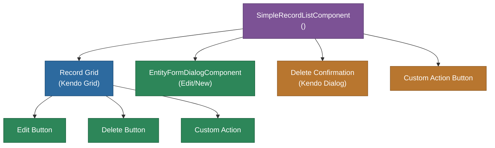

# @memberjunction/ng-simple-record-list

A lightweight, reusable Angular component for displaying, creating, editing, and deleting records from any MemberJunction entity. Provides a streamlined grid interface with built-in CRUD operations, custom action buttons, and inline form dialogs.

## Overview

The `SimpleRecordListComponent` is designed for settings pages and administrative interfaces where a full data grid is overkill. It renders a simple list of records for a given entity with configurable columns, sorting, and action buttons (edit, delete, custom action). New records and edits are handled via the `EntityFormDialogComponent`.



## Features

- **Entity-agnostic**: Works with any MemberJunction entity by name
- **Configurable columns**: Specify which columns to display, or auto-select from metadata
- **CRUD operations**: Built-in New, Edit, and Delete with confirmation dialogs
- **Custom action button**: Optional per-row action with configurable icon, tooltip, and handler
- **Dynamic icons/tooltips**: Custom action icon and tooltip can be functions of the record
- **Inline form editing**: Opens `EntityFormDialogComponent` for editing individual records
- **Section-mode editing**: Optionally show only a specific form section in the edit dialog
- **Default values**: Set default field values for new records
- **Extra filter**: Apply additional SQL filter to scope the visible records
- **Delete prevention**: Cancel delete via event handler
- **Sorting**: Sort by any column

## Installation

```bash
npm install @memberjunction/ng-simple-record-list
```

## Key Dependencies

| Dependency | Purpose |
|---|---|
| `@memberjunction/core` | Metadata, BaseEntity, RunView |
| `@memberjunction/ng-entity-form-dialog` | Record editing dialog |
| `@memberjunction/ng-notifications` | Notification service |
| `@progress/kendo-angular-grid` | Grid display |
| `@progress/kendo-angular-dialog` | Confirmation dialogs |

## Usage

```html
<mj-simple-record-list
  [EntityName]="'Roles'"
  [Columns]="['Name', 'Description']"
  [SortBy]="'Name'"
  [AllowNew]="true"
  [AllowEdit]="true"
  [AllowDelete]="true"
  [ExtraFilter]="'IsActive = 1'"
  (RecordSaved)="onSaved($event)"
  (RecordDeleted)="onDeleted($event)">
</mj-simple-record-list>
```

### Key Inputs

| Input | Type | Default | Description |
|---|---|---|---|
| `EntityName` | `string` | `''` | Entity to display records for |
| `Columns` | `string[]` | `[]` | Column names to display |
| `SortBy` | `string` | `''` | Column to sort by |
| `AllowNew` | `boolean` | `true` | Show New button |
| `AllowEdit` | `boolean` | `true` | Show Edit button per row |
| `AllowDelete` | `boolean` | `true` | Show Delete button per row |
| `AllowCustomAction` | `boolean` | `false` | Show custom action button per row |
| `CustomActionIcon` | `string` | `''` | FA icon class for custom action |
| `CustomActionIconFunction` | `(record: BaseEntity) => string` | `null` | Dynamic icon per record |
| `CustomActionTooltip` | `string` | `''` | Tooltip for custom action |
| `CustomActionTooltipFunction` | `(record: BaseEntity) => string` | `null` | Dynamic tooltip per record |
| `ExtraFilter` | `string` | `''` | Additional SQL filter |
| `DefaultValues` | `Record<string, string>` | `{}` | Default values for new records |
| `EditSectionName` | `string` | `''` | Show only this section in edit dialog |

### Key Outputs

| Output | Type | Description |
|---|---|---|
| `RecordSaved` | `EventEmitter<BaseEntity>` | Emitted after record save |
| `RecordDeleted` | `EventEmitter<BaseEntity>` | Emitted after record delete |
| `CustomActionClicked` | `EventEmitter<BaseEntity>` | Emitted when custom action clicked |
| `DeleteRequested` | `EventEmitter<{record, cancel}>` | Emitted before delete (cancelable) |

## Exported API

| Export | Type | Description |
|---|---|---|
| `SimpleRecordListComponent` | Component | The record list component |
| `SimpleRecordListModule` | NgModule | Module declaration |

## Build

```bash
cd packages/Angular/Explorer/simple-record-list && npm run build
```

## License

ISC
