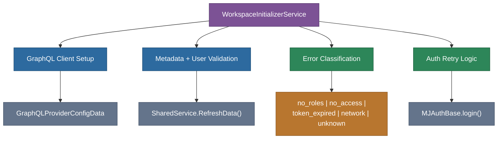

# @memberjunction/ng-workspace-initializer

Reusable workspace initialization service for MemberJunction Angular applications. Handles GraphQL client setup, metadata loading, user validation, error classification, and authentication retry logic.

## Overview

This package extracts the workspace initialization logic that was originally embedded in the MJExplorer `AppComponent` into a standalone, reusable service. Any MemberJunction Angular application can use `WorkspaceInitializerService` to bootstrap an authenticated workspace session with proper error handling and retry semantics.



## Features

- **GraphQL client setup**: Configures the GraphQL data provider with token refresh callbacks
- **Metadata loading**: Loads entity metadata and validates the current user
- **Startup validation**: Triggers system configuration checks after initialization
- **Error classification**: Categorizes errors into actionable types (`no_roles`, `no_access`, `token_expired`, `network`, `unknown`)
- **Auth retry**: One-time automatic retry for expired tokens with 24-hour backoff

## Installation

```bash
npm install @memberjunction/ng-workspace-initializer
```

## Key Dependencies

| Dependency | Purpose |
|---|---|
| `@memberjunction/core` | `Metadata`, `LogError`, `LogStatus` |
| `@memberjunction/graphql-dataprovider` | `setupGraphQLClient`, `GraphQLProviderConfigData` |
| `@memberjunction/ng-auth-services` | `MJAuthBase` for token operations |
| `@memberjunction/ng-shared` | `SharedService` for data refresh |
| `@memberjunction/ng-explorer-core` | `StartupValidationService` |

## Usage

### Module Import

```typescript
import { WorkspaceInitializerModule } from '@memberjunction/ng-workspace-initializer';

@NgModule({
  imports: [WorkspaceInitializerModule]
})
export class AppModule {}
```

### Initialize a Workspace

```typescript
import { WorkspaceInitializerService } from '@memberjunction/ng-workspace-initializer';

class MyAppComponent {
  constructor(private workspaceInit: WorkspaceInitializerService) {}

  async onLogin(token: string, userInfo: StandardUserInfo) {
    const result = await this.workspaceInit.initializeWorkspace(token, userInfo, {
      GRAPHQL_URI: 'http://localhost:4000',
      GRAPHQL_WS_URI: 'ws://localhost:4000',
      MJ_CORE_SCHEMA_NAME: '__mj'
    });

    if (result.success) {
      // Workspace ready - navigate to app
    } else if (result.error) {
      // Handle typed error
      console.error(result.error.type, result.error.userMessage);

      // Optionally retry for retryable errors
      const retried = await this.workspaceInit.handleAuthRetry(
        result.error,
        window.location.pathname
      );
    }
  }
}
```

## API Reference

### WorkspaceInitializerService

| Method | Returns | Description |
|---|---|---|
| `initializeWorkspace(token, userInfo, environment)` | `Promise<WorkspaceInitResult>` | Sets up GraphQL client, loads metadata, validates user |
| `classifyError(err)` | `WorkspaceInitError` | Categorizes an error into an actionable type |
| `handleAuthRetry(error, currentPath)` | `Promise<boolean>` | Attempts auth retry for retryable errors (24h backoff) |

### Interfaces

```typescript
interface WorkspaceEnvironment {
  GRAPHQL_URI: string;
  GRAPHQL_WS_URI: string;
  MJ_CORE_SCHEMA_NAME: string;
}

interface WorkspaceInitResult {
  success: boolean;
  error?: WorkspaceInitError;
}

interface WorkspaceInitError {
  type: 'no_roles' | 'no_access' | 'token_expired' | 'network' | 'unknown';
  message: string;
  userMessage: string;
  shouldRetry: boolean;
}
```

## Exported API

| Export | Type | Description |
|---|---|---|
| `WorkspaceInitializerModule` | NgModule | Module providing the service |
| `WorkspaceInitializerService` | Service | Main initialization service |
| `WorkspaceEnvironment` | Interface | Environment configuration shape |
| `WorkspaceInitResult` | Interface | Initialization result |
| `WorkspaceInitError` | Interface | Typed error with classification |

## Build

```bash
cd packages/Angular/Explorer/workspace-initializer && npm run build
```

## Related Packages

- [`@memberjunction/ng-explorer-app`](../explorer-app) - Application shell that consumes this service
- [`@memberjunction/ng-explorer-core`](../explorer-core) - Shell and validation services
- [`@memberjunction/ng-auth-services`](../auth-services) - Authentication abstraction

## License

ISC
