# @memberjunction/ng-testing

Angular components, widgets, and services for building testing and evaluation interfaces within MemberJunction applications. This package provides a comprehensive UI toolkit for running tests, reviewing results, providing feedback, and visualizing evaluation data.

## Overview

The `@memberjunction/ng-testing` package delivers a full suite of Angular components purpose-built for MemberJunction's testing framework. It includes dialog components for executing tests and collecting feedback, a collection of reusable widget components for displaying scores, statuses, costs, and evaluation data, and services that orchestrate test execution and manage evaluation preferences.

```mermaid
graph TD
    A[TestingModule] --> B[Dialog Components]
    A --> C[Widget Components]
    A --> D[Services]

    B --> B1[TestRunDialogComponent]
    B --> B2[TestFeedbackDialogComponent]

    C --> C1[TestStatusBadgeComponent]
    C --> C2[ScoreIndicatorComponent]
    C --> C3[CostDisplayComponent]
    C --> C4[TestResultsMatrixComponent]
    C --> C5[EvaluationBadgeComponent]
    C --> C6[EvaluationModeToggleComponent]
    C --> C7[ReviewStatusIndicatorComponent]
    C --> C8[ExecutionContextComponent]

    D --> D1[TestingDialogService]
    D --> D2[TestingExecutionService]
    D --> D3[EvaluationPreferencesService]

    style A fill:#2d6a9f,stroke:#1a4971,color:#fff
    style B fill:#7c5295,stroke:#563a6b,color:#fff
    style C fill:#2d8659,stroke:#1a5c3a,color:#fff
    style D fill:#b8762f,stroke:#8a5722,color:#fff
```



## Installation

```bash
npm install @memberjunction/ng-testing
```

## Usage

### Import the Module

```typescript
import { TestingModule } from '@memberjunction/ng-testing';

@NgModule({
  imports: [
    TestingModule,
    // ... other imports
  ]
})
export class YourModule { }
```

### Dialog Components

#### Test Run Dialog

Opens a dialog for executing and monitoring test runs:

```html
<mj-test-run-dialog
  [visible]="showTestRunDialog"
  [testSuiteId]="selectedSuiteId"
  (dialogClosed)="onTestRunClosed($event)">
</mj-test-run-dialog>
```

#### Test Feedback Dialog

Collects user feedback on individual test results:

```html
<mj-test-feedback-dialog
  [visible]="showFeedbackDialog"
  [testRunId]="selectedTestRunId"
  (feedbackSubmitted)="onFeedbackSubmitted($event)">
</mj-test-feedback-dialog>
```

### Widget Components

#### Test Status Badge

Displays a color-coded badge indicating test status (passed, failed, running, etc.):

```html
<mj-test-status-badge [status]="testResult.Status"></mj-test-status-badge>
```

#### Score Indicator

Visual indicator for numeric scores with color gradients:

```html
<mj-score-indicator [score]="testResult.Score"></mj-score-indicator>
```

#### Cost Display

Formats and displays execution cost data:

```html
<mj-cost-display [cost]="testResult.Cost"></mj-cost-display>
```

#### Test Results Matrix

Grid display comparing test results across multiple suite runs:

```html
<mj-test-results-matrix
  [matrixData]="matrixData"
  (cellClicked)="onMatrixCellClicked($event)">
</mj-test-results-matrix>
```

#### Evaluation Badge and Mode Toggle

```html
<mj-evaluation-badge [evaluationType]="'automated'"></mj-evaluation-badge>
<mj-evaluation-mode-toggle
  [mode]="currentMode"
  (modeChanged)="onModeChanged($event)">
</mj-evaluation-mode-toggle>
```

#### Review Status Indicator and Execution Context

```html
<mj-review-status-indicator [status]="reviewStatus"></mj-review-status-indicator>
<mj-execution-context [context]="executionContext"></mj-execution-context>
```

### Services

#### TestingDialogService

Programmatically open testing dialogs:

```typescript
import { TestingDialogService } from '@memberjunction/ng-testing';

constructor(private testingDialog: TestingDialogService) {}

openTestRun() {
  this.testingDialog.openTestRunDialog(testSuiteId);
}
```

#### TestingExecutionService

Manages test execution lifecycle:

```typescript
import { TestingExecutionService } from '@memberjunction/ng-testing';

constructor(private testExecution: TestingExecutionService) {}

async runTests() {
  const result = await this.testExecution.executeTestSuite(suiteId);
}
```

#### EvaluationPreferencesService

Manages user preferences for evaluation settings:

```typescript
import { EvaluationPreferencesService } from '@memberjunction/ng-testing';

constructor(private evalPrefs: EvaluationPreferencesService) {}

getPreferences() {
  return this.evalPrefs.getPreferences();
}
```

## Models and Types

The package exports several TypeScript interfaces for working with test data:

- **TestTag** -- Tag metadata applied to test runs with optional category and color
- **TagsHelper** -- Utility class for parsing, serializing, and managing test tags
- **TestRunDataPoint** -- Analytics data point for charting test run results
- **TestAnalyticsSummary** -- Aggregated analytics for a time period
- **TestRunComparison** -- Comparison data between two test suite runs
- **TestAnalyticsFilter** -- Filter options for test analytics queries
- **MatrixCellData / MatrixColumnData / MatrixRowData** -- Data structures for the test results matrix component

## Dependencies

### Runtime Dependencies

| Package | Description |
|---------|-------------|
| `@memberjunction/core` | Core MemberJunction framework |
| `@memberjunction/core-entities` | Entity type definitions |
| `@memberjunction/global` | Global utilities and event system |
| `@memberjunction/graphql-dataprovider` | GraphQL data access |
| `@memberjunction/ng-base-types` | Base Angular component types |
| `@memberjunction/ng-code-editor` | Code editor component |
| `@memberjunction/ng-container-directives` | Layout directives |
| `@memberjunction/ng-notifications` | Notification system |
| `@memberjunction/ng-shared` | Shared Angular utilities |
| `@memberjunction/testing-engine-base` | Testing engine core |
| `@progress/kendo-angular-*` | Kendo UI components |

### Peer Dependencies

- `@angular/common` ^21.x
- `@angular/core` ^21.x
- `@angular/forms` ^21.x
- `@angular/platform-browser` ^21.x

## Build

```bash
cd packages/Angular/Generic/Testing
npm run build
```

## License

ISC
