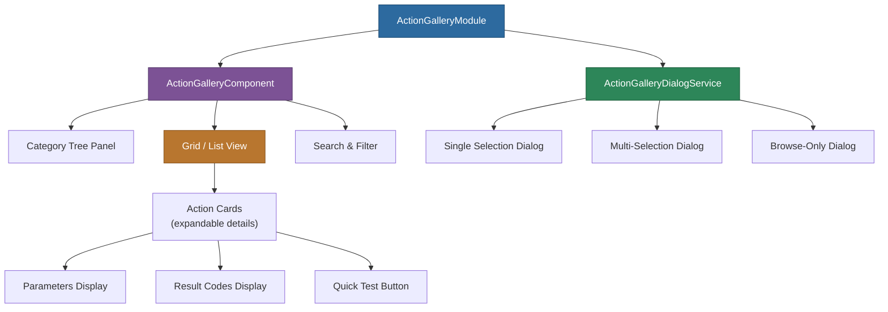

# @memberjunction/ng-action-gallery

A filterable gallery component for browsing and selecting MemberJunction actions, with grid and list views, category navigation, search, and dialog integration.

## Overview

The Action Gallery provides a rich interface for discovering, browsing, and selecting actions. It features both grid and list view modes, hierarchical category navigation with counts, real-time search filtering, and single or multi-selection support. The gallery integrates with the AI Test Harness for quick action testing.



## Installation

```bash
npm install @memberjunction/ng-action-gallery
```

## Usage

### Module Import

```typescript
import { ActionGalleryModule } from '@memberjunction/ng-action-gallery';

@NgModule({
  imports: [ActionGalleryModule]
})
export class YourModule { }
```

### Standalone Gallery

```html
<mj-action-gallery
  [config]="galleryConfig"
  [preSelectedActions]="selectedIds"
  (actionSelected)="onActionSelected($event)"
  (actionsSelected)="onActionsSelected($event)"
  (actionTestRequested)="onTestRequested($event)">
</mj-action-gallery>
```

```typescript
galleryConfig: ActionGalleryConfig = {
  selectionMode: true,
  multiSelect: true,
  showCategories: true,
  showSearch: true,
  defaultView: 'grid',
  gridColumns: 3,
  enableQuickTest: true,
  theme: 'light'
};
```

### Dialog Mode

```typescript
import { ActionGalleryDialogService } from '@memberjunction/ng-action-gallery';

constructor(private actionGallery: ActionGalleryDialogService) {}

// Single selection
selectSingleAction() {
  this.actionGallery.openForSingleSelection({
    title: 'Select an Action',
    showCategories: true,
    enableQuickTest: true
  }).subscribe(action => {
    if (action) {
      console.log('Selected:', action);
    }
  });
}

// Multi-selection
selectMultipleActions() {
  this.actionGallery.openForMultiSelection({
    title: 'Select Actions',
    preSelectedActions: ['id1', 'id2'],
    submitButtonText: 'Add Selected Actions'
  }).subscribe(actions => {
    console.log('Selected actions:', actions);
  });
}

// Browse only (no selection)
browseActions() {
  this.actionGallery.openForBrowsing({
    title: 'Action Browser',
    enableQuickTest: true
  });
}
```

## Configuration

### ActionGalleryConfig

| Property | Type | Default | Description |
|----------|------|---------|-------------|
| `selectionMode` | `boolean` | `false` | Enable selection mode |
| `multiSelect` | `boolean` | `false` | Allow multiple selections |
| `showCategories` | `boolean` | `true` | Show category sidebar |
| `showSearch` | `boolean` | `true` | Show search bar |
| `defaultView` | `'grid' \| 'list'` | `'grid'` | Default view mode |
| `gridColumns` | `number` | `3` | Number of grid columns |
| `enableQuickTest` | `boolean` | `true` | Show test buttons |
| `theme` | `'light' \| 'dark'` | `'light'` | Visual theme |

### ActionGalleryDialogConfig

Extends `ActionGalleryConfig` with:

| Property | Type | Default | Description |
|----------|------|---------|-------------|
| `title` | `string` | `'Select Actions'` | Dialog title |
| `width` | `number` | `1200` | Dialog width |
| `height` | `number` | `800` | Dialog height |
| `submitButtonText` | `string` | `'Select'` | Submit button text |
| `cancelButtonText` | `string` | `'Cancel'` | Cancel button text |
| `preSelectedActions` | `string[]` | `[]` | Pre-selected action IDs |

## Features

### Category Navigation

- Hierarchical category tree with action counts per category
- Collapsible/expandable nodes
- "All Actions" and "Uncategorized" special categories

### Action Cards

Each action displays as an expandable card showing:
- Action name and icon with category badge
- Description text
- Quick test button (if enabled)
- Expanded details with parameters (types and required status) and result codes

### Search and Filtering

Real-time search across action names, descriptions, and categories.

### View Modes

- **Grid View**: Visual cards in a responsive grid layout
- **List View**: Compact table format for scanning many actions

## Integration with AI Test Harness

```typescript
enableQuickTest: true

onTestRequested(action: ActionEntity) {
  this.testHarness.openForAction(action.ID).subscribe(result => {
    console.log('Test result:', result);
  });
}
```

## CSS Customization

```scss
:root {
  --gallery-primary: #007bff;
  --gallery-hover: #0056b3;
  --gallery-selected: #e3f2fd;
  --gallery-background: #ffffff;
  --gallery-text: #212529;
  --gallery-border: #dee2e6;
}
```

## Dependencies

| Package | Description |
|---------|-------------|
| `@memberjunction/core` | Core framework |
| `@memberjunction/core-entities` | Entity type definitions |
| `@memberjunction/ng-ai-test-harness` | AI test harness integration |
| `@memberjunction/ng-container-directives` | Layout directives |
| `@memberjunction/ng-shared-generic` | Shared generic components |
| `@progress/kendo-angular-*` | Kendo UI components |

### Peer Dependencies

- `@angular/common` ^21.x
- `@angular/core` ^21.x
- `@angular/forms` ^21.x
- `@angular/animations` ^21.x

## Build

```bash
cd packages/Angular/Generic/action-gallery
npm run build
```

## License

ISC
