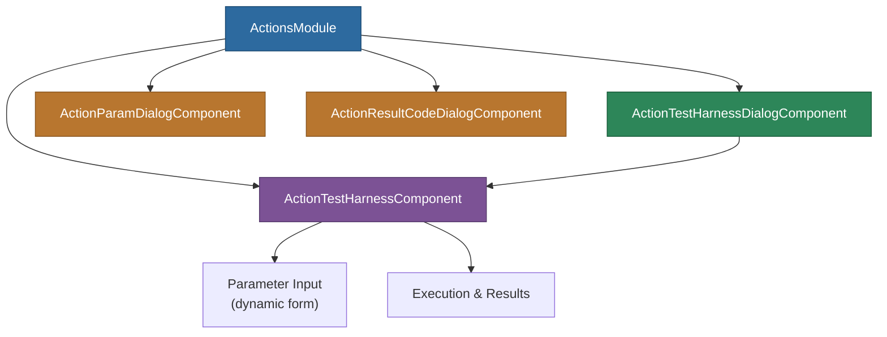

# @memberjunction/ng-actions

Reusable Angular components for testing and running MemberJunction Actions. This package provides a lightweight action test harness and parameter/result-code editing dialogs with no Kendo UI dependencies.

## Overview

The `@memberjunction/ng-actions` package provides a self-contained set of components for interacting with MemberJunction Actions: executing them with custom parameter values, viewing results, and editing action parameter definitions and result codes. Unlike other MJ Angular packages, this module has no Kendo UI dependency, making it suitable for any Angular application.



## Installation

```bash
npm install @memberjunction/ng-actions
```

## Usage

### Module Import

```typescript
import { ActionsModule } from '@memberjunction/ng-actions';

@NgModule({
  imports: [ActionsModule]
})
export class YourModule { }
```

### Action Test Harness

Embed the test harness for running actions with dynamic parameter input:

```html
<mj-action-test-harness
  [actionId]="selectedActionId"
  (executionComplete)="onExecutionComplete($event)">
</mj-action-test-harness>
```

### Action Test Harness Dialog

Wrap the test harness in a dialog for modal usage:

```html
<mj-action-test-harness-dialog
  [visible]="showDialog"
  [actionId]="selectedActionId"
  (dialogClosed)="onDialogClosed()">
</mj-action-test-harness-dialog>
```

### Action Param Dialog

Edit action parameter definitions:

```html
<mj-action-param-dialog
  [visible]="showParamDialog"
  [actionParam]="selectedParam"
  (saved)="onParamSaved($event)"
  (cancelled)="onParamCancelled()">
</mj-action-param-dialog>
```

### Action Result Code Dialog

Edit action result code definitions:

```html
<mj-action-result-code-dialog
  [visible]="showResultCodeDialog"
  [resultCode]="selectedResultCode"
  (saved)="onResultCodeSaved($event)"
  (cancelled)="onResultCodeCancelled()">
</mj-action-result-code-dialog>
```

## Exported Types

```typescript
import {
  ActionsModule,
  ActionTestHarnessComponent,
  ActionParamValue,
  ActionResult,
  ActionTestHarnessDialogComponent,
  ActionParamDialogComponent,
  ActionParamDialogResult,
  ActionResultCodeDialogComponent,
  ActionResultCodeDialogResult
} from '@memberjunction/ng-actions';
```

## Dependencies

| Package | Description |
|---------|-------------|
| `@memberjunction/core` | Core framework |
| `@memberjunction/core-entities` | Entity type definitions |
| `@memberjunction/global` | Global utilities |
| `@memberjunction/graphql-dataprovider` | GraphQL data access |

### Peer Dependencies

- `@angular/common` ^21.x
- `@angular/core` ^21.x
- `@angular/forms` ^21.x

**Note**: This package does not depend on Kendo UI, making it lightweight and suitable for use in any Angular project.

## Build

```bash
cd packages/Angular/Generic/actions
npm run build
```

## License

ISC
