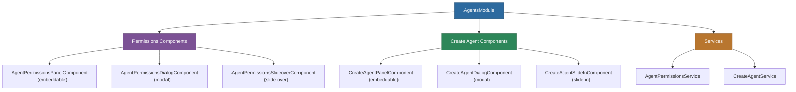

# @memberjunction/ng-agents

Reusable Angular components for AI Agent management in MemberJunction applications, including permissions management and agent creation with panel, dialog, and slide-over presentation modes.

## Overview

This package provides a complete set of UI components for managing AI Agents within MemberJunction. Each feature area (permissions and agent creation) offers three presentation variants -- an embeddable panel, a centered modal dialog, and a right-side slide-over/slide-in -- so you can integrate agent management into any layout pattern.



## Installation

```bash
npm install @memberjunction/ng-agents
```

## Usage

### Module Import

```typescript
import { AgentsModule } from '@memberjunction/ng-agents';

@NgModule({
  imports: [AgentsModule]
})
export class YourModule { }
```

### Permissions Components

#### Embeddable Panel

```html
<mj-agent-permissions-panel
  [agentId]="selectedAgentId"
  (permissionsChanged)="onPermissionsChanged($event)">
</mj-agent-permissions-panel>
```

#### Modal Dialog

```html
<mj-agent-permissions-dialog
  [visible]="showPermissionsDialog"
  [agentId]="selectedAgentId"
  (dialogClosed)="onPermissionsDialogClosed()">
</mj-agent-permissions-dialog>
```

#### Slide-Over

```html
<mj-agent-permissions-slideover
  [visible]="showPermissionsSlide"
  [agentId]="selectedAgentId"
  (closed)="onSlideoverClosed()">
</mj-agent-permissions-slideover>
```

### Create Agent Components

#### Embeddable Panel

```html
<mj-create-agent-panel
  (agentCreated)="onAgentCreated($event)"
  (cancelled)="onCreateCancelled()">
</mj-create-agent-panel>
```

#### Modal Dialog

```html
<mj-create-agent-dialog
  [visible]="showCreateDialog"
  (agentCreated)="onAgentCreated($event)"
  (dialogClosed)="onCreateDialogClosed()">
</mj-create-agent-dialog>
```

#### Slide-In

```html
<mj-create-agent-slidein
  [visible]="showCreateSlideIn"
  (agentCreated)="onAgentCreated($event)"
  (closed)="onSlideInClosed()">
</mj-create-agent-slidein>
```

### Programmatic Dialog Access

```typescript
import { CreateAgentService } from '@memberjunction/ng-agents';

constructor(private createAgentService: CreateAgentService) {}

openCreateAgent() {
  this.createAgentService.openDialog().subscribe(agent => {
    if (agent) {
      console.log('Agent created:', agent.Name);
    }
  });
}
```

## Dependencies

| Package | Description |
|---------|-------------|
| `@memberjunction/core` | Core framework |
| `@memberjunction/core-entities` | Entity type definitions |
| `@memberjunction/global` | Global utilities |
| `@memberjunction/ai-core-plus` | AI core plus functionality |
| `@memberjunction/ai-engine-base` | AI engine base classes |
| `@memberjunction/ng-shared` | Shared Angular utilities |
| `@angular/cdk` | Angular CDK for overlays |

### Peer Dependencies

- `@angular/common` ^21.x
- `@angular/core` ^21.x
- `@angular/platform-browser` ^21.x

## Build

```bash
cd packages/Angular/Generic/agents
npm run build
```

## License

ISC
