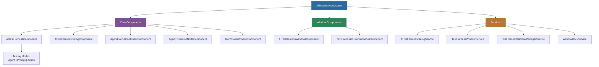

# @memberjunction/ng-ai-test-harness

A comprehensive Angular component for testing AI agents, prompts, and actions in MemberJunction applications. Supports embedded, dialog, and floating window presentation modes with real-time streaming, execution monitoring, and window management.

## Overview

The AI Test Harness provides a multi-mode testing interface for MemberJunction's AI capabilities. It supports three testing modes (Agent, Prompt, Action), multiple presentation contexts (embedded component, dialog, floating window), and includes specialized components for monitoring agent execution trees and viewing JSON results.



## Installation

```bash
npm install @memberjunction/ng-ai-test-harness
```

## Usage

### Module Import

```typescript
import { AITestHarnessModule } from '@memberjunction/ng-ai-test-harness';

@NgModule({
  imports: [AITestHarnessModule]
})
export class YourModule { }
```

### Embedded Mode

```html
<mj-ai-test-harness
  [config]="testConfig"
  [embedded]="true"
  (executionComplete)="onTestComplete($event)"
  (modeChanged)="onModeChanged($event)">
</mj-ai-test-harness>
```

```typescript
testConfig: TestHarnessConfig = {
  mode: 'agent',
  entityId: 'agent-id-here',
  showHistory: true,
  showAdvancedOptions: false,
  theme: 'light',
  maxHistoryItems: 10
};
```

### Dialog Mode

```typescript
import { AITestHarnessDialogService } from '@memberjunction/ng-ai-test-harness';

constructor(private testHarness: AITestHarnessDialogService) {}

// Test an agent
testAgent() {
  this.testHarness.openForAgent('agent-id').subscribe(result => {
    if (result.success) {
      console.log('Agent test successful:', result);
    }
  });
}

// Test a prompt
testPrompt() {
  this.testHarness.openForPrompt('prompt-id').subscribe(result => {
    console.log('Prompt test result:', result);
  });
}

// Test an action
testAction() {
  this.testHarness.openForAction('action-id').subscribe(result => {
    console.log('Action test result:', result);
  });
}
```

### Floating Window Mode

```typescript
import { TestHarnessWindowService } from '@memberjunction/ng-ai-test-harness';

constructor(private windowService: TestHarnessWindowService) {}

openInWindow() {
  this.windowService.open({
    mode: 'agent',
    entityId: 'agent-id'
  });
}
```

### Agent Execution Monitor

Visualize agent execution as a tree of steps:

```html
<mj-agent-execution-monitor
  [agentRunId]="runId"
  [autoRefresh]="true">
</mj-agent-execution-monitor>
```

### JSON Viewer Window

Display JSON data in a formatted, scrollable window:

```html
<mj-json-viewer-window
  [data]="jsonData"
  [title]="'Execution Result'">
</mj-json-viewer-window>
```

## Configuration

### TestHarnessConfig

| Property | Type | Default | Description |
|----------|------|---------|-------------|
| `mode` | `'agent' \| 'prompt' \| 'action'` | `'agent'` | Testing mode |
| `entityId` | `string` | - | Pre-selected entity ID |
| `showHistory` | `boolean` | `true` | Show execution history |
| `showAdvancedOptions` | `boolean` | `false` | Show advanced settings |
| `theme` | `'light' \| 'dark'` | `'light'` | Visual theme |
| `maxHistoryItems` | `number` | `10` | Max history items to display |

## Advanced Features

### Streaming Responses

The test harness supports real-time streaming for compatible AI models:

```typescript
this.testHarness.open({
  mode: 'prompt',
  streamResponse: true,
  temperature: 0.7,
  maxTokens: 2000
});
```

### Window Management

The `TestHarnessWindowManagerService` coordinates multiple floating test windows with docking support via `WindowDockService`.

## CSS Customization

```scss
:root {
  --harness-primary: #007bff;
  --harness-success: #28a745;
  --harness-error: #dc3545;
  --harness-background: #f8f9fa;
  --harness-text: #212529;
}
```

## Dependencies

| Package | Description |
|---------|-------------|
| `@memberjunction/ai` | AI abstraction layer |
| `@memberjunction/ai-core-plus` | AI core plus functionality |
| `@memberjunction/ai-engine-base` | AI engine base classes |
| `@memberjunction/core` | Core framework |
| `@memberjunction/core-entities` | Entity type definitions |
| `@memberjunction/global` | Global utilities |
| `@memberjunction/graphql-dataprovider` | GraphQL data access |
| `@memberjunction/ng-code-editor` | Code editor component |
| `@memberjunction/ng-container-directives` | Layout directives |
| `@memberjunction/ng-notifications` | Notification system |
| `@memberjunction/ng-shared` | Shared Angular utilities |
| `@memberjunction/ng-shared-generic` | Shared generic components |
| `@progress/kendo-angular-*` | Kendo UI components |

### Peer Dependencies

- `@angular/common` ^21.x
- `@angular/core` ^21.x
- `@angular/forms` ^21.x
- `@angular/animations` ^21.x

## Build

```bash
cd packages/Angular/Generic/ai-test-harness
npm run build
```

## License

ISC
