# @memberjunction/ng-artifacts

Angular artifact viewer plugin system for rendering different artifact types (JSON, Code, Markdown, HTML, SVG, React Components) with version history, message cards, and an extensible plugin architecture.

## Overview

The `@memberjunction/ng-artifacts` package provides a pluggable viewer system for MemberJunction conversation artifacts. Each artifact type (JSON, Code, Markdown, HTML, SVG, Component) is rendered by a dedicated viewer plugin, selected automatically based on the artifact's type metadata. The package also includes components for artifact version history browsing, viewer panels, and inline message cards.

```mermaid
graph TD
    A[ArtifactsModule] --> B[Viewer Components]
    A --> C[Plugin System]
    A --> D[Services]

    B --> B1[ArtifactViewerPanelComponent]
    B --> B2[ArtifactVersionHistoryComponent]
    B --> B3[ArtifactMessageCardComponent]
    B --> B4[ArtifactTypePluginViewerComponent]

    C --> C0[BaseArtifactViewerComponent]
    C --> C1[JsonArtifactViewerComponent]
    C --> C2[CodeArtifactViewerComponent]
    C --> C3[MarkdownArtifactViewerComponent]
    C --> C4[HtmlArtifactViewerComponent]
    C --> C5[SvgArtifactViewerComponent]
    C --> C6[ComponentArtifactViewerComponent]

    D --> D1[ArtifactIconService]

    style A fill:#2d6a9f,stroke:#1a4971,color:#fff
    style B fill:#7c5295,stroke:#563a6b,color:#fff
    style C fill:#2d8659,stroke:#1a5c3a,color:#fff
    style D fill:#b8762f,stroke:#8a5722,color:#fff
```



## Installation

```bash
npm install @memberjunction/ng-artifacts
```

## Usage

### Module Import

```typescript
import { ArtifactsModule } from '@memberjunction/ng-artifacts';

@NgModule({
  imports: [ArtifactsModule]
})
export class YourModule { }
```

### Artifact Viewer Panel

Full-featured panel with toolbar and version navigation:

```html
<mj-artifact-viewer-panel
  [artifactId]="selectedArtifactId"
  [versionId]="selectedVersionId"
  (versionChanged)="onVersionChanged($event)">
</mj-artifact-viewer-panel>
```

### Artifact Type Plugin Viewer

Automatically selects and loads the correct plugin based on artifact type:

```html
<mj-artifact-type-plugin-viewer
  [artifactVersion]="currentVersion"
  [artifactTypeName]="'Code'">
</mj-artifact-type-plugin-viewer>
```

### Artifact Version History

Timeline of artifact versions:

```html
<mj-artifact-version-history
  [artifactId]="selectedArtifactId"
  (versionSelected)="onVersionSelected($event)">
</mj-artifact-version-history>
```

### Artifact Message Card

Compact card for displaying an artifact reference within a conversation message:

```html
<mj-artifact-message-card
  [artifact]="artifactRef"
  (clicked)="onArtifactCardClicked($event)">
</mj-artifact-message-card>
```

## Plugin Architecture

### IArtifactViewerPlugin Interface

All artifact viewer plugins implement this interface and are registered with `@RegisterClass`:

```typescript
interface IArtifactViewerPlugin {
  readonly componentType: Type<IArtifactViewerComponent>;
  canHandle(artifactTypeName: string, contentType?: string): boolean;
  getMetadata?(artifactVersion: ArtifactVersionEntity): ArtifactMetadata;
}
```

### Creating a Custom Plugin

```typescript
import { RegisterClass } from '@memberjunction/global';
import { BaseArtifactViewerComponent } from '@memberjunction/ng-artifacts';

@RegisterClass(BaseArtifactViewerComponent, 'MyCustomType')
@Component({
  selector: 'my-custom-viewer',
  template: `<div>{{ artifactVersion.Content }}</div>`
})
export class MyCustomViewerComponent extends BaseArtifactViewerComponent {
  // Custom rendering logic
}
```

### Built-in Plugins

| Plugin | Artifact Type | Description |
|--------|---------------|-------------|
| `JsonArtifactViewerComponent` | JSON | Formatted JSON with syntax highlighting |
| `CodeArtifactViewerComponent` | Code | Code editor with language detection |
| `MarkdownArtifactViewerComponent` | Markdown | Rendered markdown content |
| `HtmlArtifactViewerComponent` | HTML | Sandboxed HTML rendering |
| `SvgArtifactViewerComponent` | SVG | SVG image rendering |
| `ComponentArtifactViewerComponent` | Component | Dynamic React/Angular component rendering |

## Services

### ArtifactIconService

Provides appropriate Font Awesome icons for artifact types:

```typescript
import { ArtifactIconService } from '@memberjunction/ng-artifacts';

constructor(private iconService: ArtifactIconService) {}

getIcon() {
  const icon = this.iconService.getIconForType('Code');
  // Returns 'fa-solid fa-code'
}
```

## Dependencies

| Package | Description |
|---------|-------------|
| `@memberjunction/core` | Core framework |
| `@memberjunction/core-entities` | Entity type definitions |
| `@memberjunction/global` | Global utilities and class registration |
| `@memberjunction/interactive-component-types` | Interactive component interfaces |
| `@memberjunction/ng-base-types` | Base Angular component types |
| `@memberjunction/ng-code-editor` | Code editor for code artifacts |
| `@memberjunction/ng-notifications` | Notification system |
| `@memberjunction/ng-react` | React component bridge |
| `@memberjunction/ng-shared-generic` | Shared generic components |
| `@memberjunction/ng-markdown` | Markdown rendering |
| `marked` | Markdown parser |
| `@angular/cdk` | Angular CDK |

### Peer Dependencies

- `@angular/common` ^21.x
- `@angular/core` ^21.x
- `@angular/platform-browser` ^21.x

## Build

```bash
cd packages/Angular/Generic/artifacts
npm run build
```

## License

ISC
