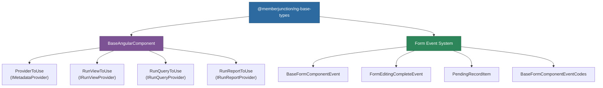

# @memberjunction/ng-base-types

Foundational types and base classes for Angular components in the MemberJunction ecosystem, providing standardized provider management and form event coordination.

## Overview

This package provides essential building blocks that other MemberJunction Angular packages depend on. It exports `BaseAngularComponent`, an abstract base class that standardizes data provider access across the component tree, and a set of form event types used for coordinating save/delete operations across form sub-components.



## Installation

```bash
npm install @memberjunction/ng-base-types
```

## Usage

### BaseAngularComponent

Abstract base class that all MemberJunction Angular components should extend for standardized provider management:

```typescript
import { BaseAngularComponent } from '@memberjunction/ng-base-types';

@Component({
  selector: 'my-component',
  templateUrl: './my-component.html'
})
export class MyComponent extends BaseAngularComponent {
  async loadData() {
    // Access the metadata provider
    const metadata = this.ProviderToUse;

    // Use RunView functionality
    const viewProvider = this.RunViewToUse;

    // Execute queries
    const queryProvider = this.RunQueryToUse;

    // Run reports
    const reportProvider = this.RunReportToUse;
  }
}
```

#### Properties

| Property | Type | Description |
|----------|------|-------------|
| `Provider` | `IMetadataProvider \| null` | Optional custom provider instance. If not specified, uses the default global provider. |

#### Getter Methods

| Method | Return Type | Description |
|--------|-------------|-------------|
| `ProviderToUse` | `IMetadataProvider` | Returns the Provider if specified, otherwise returns Metadata.Provider |
| `RunViewToUse` | `IRunViewProvider` | Provider cast as IRunViewProvider for running views |
| `RunQueryToUse` | `IRunQueryProvider` | Provider cast as IRunQueryProvider for executing queries |
| `RunReportToUse` | `IRunReportProvider` | Provider cast as IRunReportProvider for running reports |

### Form Event System

#### BaseFormComponentEventCodes

Constants for event type identification:

```typescript
const BaseFormComponentEventCodes = {
  BASE_CODE: 'BaseFormComponent_Event',
  EDITING_COMPLETE: 'EDITING_COMPLETE',
  REVERT_PENDING_CHANGES: 'REVERT_PENDING_CHANGES',
  POPULATE_PENDING_RECORDS: 'POPULATE_PENDING_RECORDS'
}
```

#### Event Classes

```typescript
// Base event for form component communication
class BaseFormComponentEvent {
  subEventCode: string;
  elementRef: unknown;
  returnValue: unknown;
}

// Emitted when form editing is complete, carrying pending changes
class FormEditingCompleteEvent extends BaseFormComponentEvent {
  subEventCode: string = BaseFormComponentEventCodes.EDITING_COMPLETE;
  pendingChanges: PendingRecordItem[] = [];
}

// Represents a record pending save or delete
class PendingRecordItem {
  entityObject: BaseEntity;
  action: 'save' | 'delete' = 'save';
}
```

### Handling Form Events

```typescript
import {
  BaseFormComponentEvent,
  BaseFormComponentEventCodes,
  FormEditingCompleteEvent,
  PendingRecordItem
} from '@memberjunction/ng-base-types';

onFormEvent(event: BaseFormComponentEvent) {
  switch (event.subEventCode) {
    case BaseFormComponentEventCodes.EDITING_COMPLETE:
      const editEvent = event as FormEditingCompleteEvent;
      this.processPendingChanges(editEvent.pendingChanges);
      break;
    case BaseFormComponentEventCodes.REVERT_PENDING_CHANGES:
      this.revertChanges();
      break;
    case BaseFormComponentEventCodes.POPULATE_PENDING_RECORDS:
      this.populateRecords();
      break;
  }
}
```

## Dependencies

| Package | Description |
|---------|-------------|
| `@memberjunction/core` | Core MemberJunction framework |
| `@memberjunction/core-entities` | Entity definitions |
| `@memberjunction/global` | Global utilities |
| `tslib` | TypeScript runtime helpers |

### Peer Dependencies

- `@angular/common` ^21.x
- `@angular/core` ^21.x

## Build

```bash
cd packages/Angular/Generic/base-types
npm run build
```

## License

ISC
