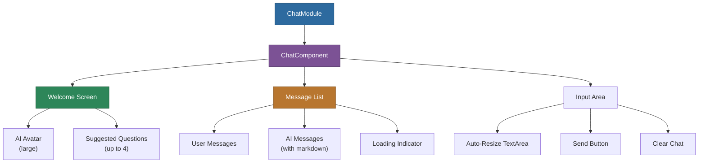

# @memberjunction/ng-chat

A reusable Angular chat component for building AI-assisted conversations, chatbots, or peer-to-peer chat interfaces in MemberJunction applications.

## Overview

The `@memberjunction/ng-chat` package provides a feature-rich chat component with markdown rendering, customizable welcome screens with suggested prompts, real-time message handling, auto-scrolling, loading indicators, and keyboard shortcuts. It can be used for AI conversations, customer support interfaces, or any messaging scenario.



## Installation

```bash
npm install @memberjunction/ng-chat
```

## Usage

### Import the Module

```typescript
import { ChatModule } from '@memberjunction/ng-chat';

@NgModule({
  imports: [ChatModule]
})
export class YourModule { }
```

### Basic Usage

```html
<mj-chat
  [AIImageURL]="'assets/bot-avatar.png'"
  [InitialMessage]="'How can I help you today?'"
  (MessageAdded)="handleNewMessage($event)"
  (ClearChatRequested)="handleClearChat()">
</mj-chat>
```

### Complete Example with AI Integration

```typescript
import { Component, ViewChild } from '@angular/core';
import { ChatComponent, ChatMessage, ChatWelcomeQuestion } from '@memberjunction/ng-chat';

@Component({
  selector: 'app-ai-assistant',
  template: `
    <mj-chat
      #chatComponent
      [AIImageURL]="'assets/bot-avatar.png'"
      [AILargeImageURL]="'assets/bot-large.png'"
      [InitialMessage]="'Hi! How can I help you today?'"
      [WelcomeQuestions]="welcomeQuestions"
      [Placeholder]="'Ask me anything...'"
      (MessageAdded)="handleNewMessage($event)"
      (ClearChatRequested)="handleClearChat()">
    </mj-chat>
  `
})
export class AIAssistantComponent {
  @ViewChild('chatComponent') chatComponent!: ChatComponent;

  welcomeQuestions: ChatWelcomeQuestion[] = [
    { topLine: 'Generate a report', bottomLine: 'Create a sales summary', prompt: 'Generate a sales report for Q2' },
    { topLine: 'Find information', bottomLine: 'Search customer details', prompt: 'Find customer XYZ' },
    { topLine: 'Summarize data', bottomLine: 'Key metrics overview', prompt: 'Summarize dashboard metrics' },
    { topLine: 'Help with a task', bottomLine: 'Step-by-step guidance', prompt: 'Help me create a new entity' }
  ];

  async handleNewMessage(message: ChatMessage) {
    if (message.senderType === 'user') {
      this.chatComponent.ShowWaitingIndicator = true;
      try {
        const response = await this.aiService.getResponse(message.message);
        this.chatComponent.SendMessage(response, 'Assistant', 'ai', null);
      } finally {
        this.chatComponent.ShowWaitingIndicator = false;
      }
    }
  }

  handleClearChat() {
    this.chatComponent.ClearAllMessages();
  }
}
```

## API Reference

### Component Selector

`<mj-chat></mj-chat>`

### Inputs

| Property | Type | Default | Description |
|----------|------|---------|-------------|
| `InitialMessage` | `string` | `''` | Initial message shown when chat is empty |
| `Messages` | `ChatMessage[]` | `[]` | Array of messages to display |
| `AIImageURL` | `string` | `''` | URL for the AI's avatar image (24px max width) |
| `AILargeImageURL` | `string` | `''` | URL for the AI's large avatar on welcome screen |
| `WelcomeQuestions` | `ChatWelcomeQuestion[]` | `[]` | Array of up to 4 welcome prompts |
| `ClearAllMessagesPrompt` | `string` | `'Are you sure you want to clear all messages?'` | Confirmation dialog text |
| `AllowSend` | `boolean` | `true` | Enable/disable message sending |
| `Placeholder` | `string` | `'Type a message...'` | Input field placeholder text |
| `ShowWaitingIndicator` | `boolean` | `false` | Show/hide loading spinner |

### Outputs

| Event | Type | Description |
|-------|------|-------------|
| `MessageAdded` | `EventEmitter<ChatMessage>` | Emitted when a new message is added |
| `ClearChatRequested` | `EventEmitter<void>` | Emitted when user confirms clearing |

### Public Methods

| Method | Parameters | Description |
|--------|------------|-------------|
| `SendCurrentMessage()` | none | Sends the current input field content |
| `SendMessage()` | `message, senderName, senderType, id, fireEvent?` | Adds a message programmatically |
| `SendUserMessage()` | `message: string` | Convenience method for user messages |
| `ClearAllMessages()` | none | Clears all messages and resets to initial state |
| `HandleClearChat()` | none | Shows clear confirmation dialog |

### Classes

```typescript
class ChatMessage {
  message: string;
  senderName: string;
  senderType: 'user' | 'ai';
  id?: unknown;
}

class ChatWelcomeQuestion {
  topLine: string;
  bottomLine: string;
  prompt: string;
}
```

## Styling

Key CSS classes for customization:

- `.chat-message-wrap` -- Container for each message
- `.chat-message` / `.chat-message-ai` -- Message content styling
- `.chat-message-image` -- Avatar container
- `.chat-input-container` -- Input area container
- `.chat-welcome-container` -- Welcome screen container

## Dependencies

| Package | Description |
|---------|-------------|
| `@memberjunction/core` | Core utilities |
| `@memberjunction/ng-container-directives` | Container directives |
| `@memberjunction/ng-shared-generic` | Shared generic components |
| `@memberjunction/ng-markdown` | Markdown rendering |
| `@progress/kendo-angular-indicators` | Loading spinner |
| `@progress/kendo-angular-buttons` | Button components |
| `@progress/kendo-angular-dialog` | Dialog for confirmations |

### Peer Dependencies

- `@angular/common` ^21.x
- `@angular/core` ^21.x
- `@angular/forms` ^21.x

## Build

```bash
cd packages/Angular/Generic/chat
npm run build
```

## License

ISC
