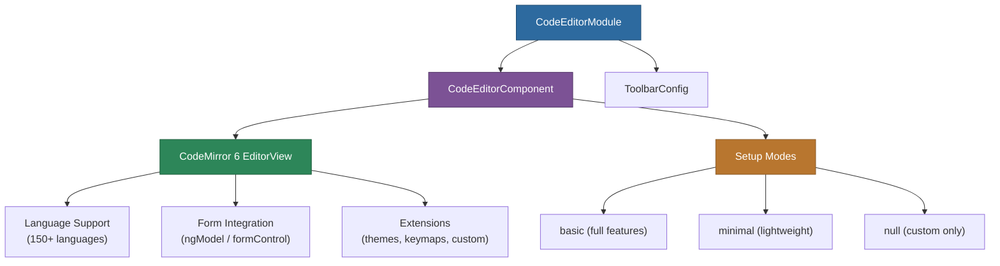

# @memberjunction/ng-code-editor

A flexible Angular code editor component built on CodeMirror 6, with syntax highlighting for 150+ languages, Angular forms integration, and extensive customization options.

## Overview

The `@memberjunction/ng-code-editor` package wraps CodeMirror 6 in an Angular component with full support for `ngModel`, `formControlName`, and `ControlValueAccessor`. It provides syntax highlighting, line wrapping, whitespace visualization, configurable indentation, and runtime language switching -- all reactive to input property changes.



## Installation

```bash
npm install @memberjunction/ng-code-editor
```

## Usage

### Import the Module

```typescript
import { CodeEditorModule } from '@memberjunction/ng-code-editor';

@NgModule({
  imports: [CodeEditorModule]
})
export class AppModule { }
```

### Basic Usage

```html
<mj-code-editor
  [value]="code"
  [language]="'javascript'"
  [placeholder]="'// Enter your code here...'"
  (change)="onCodeChange($event)">
</mj-code-editor>
```

### With ngModel

```html
<mj-code-editor
  [(ngModel)]="code"
  [languages]="languages"
  [language]="'typescript'"
  [lineWrapping]="true"
  [indentWithTab]="true">
</mj-code-editor>
```

```typescript
import { languages } from '@codemirror/language-data';

export class MyComponent {
  code = '';
  languages = languages;
}
```

### With Reactive Forms

```html
<form [formGroup]="form">
  <mj-code-editor
    formControlName="query"
    [languages]="languages"
    [language]="'sql'"
    [placeholder]="'SELECT * FROM ...'"
    [setup]="'basic'">
  </mj-code-editor>
</form>
```

## API Reference

### Component Selector

`mj-code-editor`

### Inputs

| Input | Type | Default | Description |
|-------|------|---------|-------------|
| `value` | `string` | `''` | The editor's content |
| `disabled` | `boolean` | `false` | Disables the editor |
| `readonly` | `boolean` | `false` | Makes the editor read-only |
| `placeholder` | `string` | `''` | Placeholder text when empty |
| `indentWithTab` | `boolean` | `false` | Tab key indents instead of focusing next element |
| `indentUnit` | `string` | `''` | Indentation string (e.g., `'  '` for 2 spaces) |
| `lineWrapping` | `boolean` | `false` | Wrap long lines |
| `highlightWhitespace` | `boolean` | `false` | Visualize whitespace characters |
| `languages` | `LanguageDescription[]` | `[]` | Available language descriptions (static) |
| `language` | `string` | `''` | Current language for syntax highlighting |
| `setup` | `'basic' \| 'minimal' \| null` | `'basic'` | Built-in editor setup |
| `extensions` | `Extension[]` | `[]` | Additional CodeMirror extensions |
| `autoFocus` | `boolean` | `false` | Focus editor on init (static) |
| `root` | `Document \| ShadowRoot` | `undefined` | Custom root for the editor (static) |

### Outputs

| Output | Type | Description |
|--------|------|-------------|
| `change` | `EventEmitter<string>` | Content changed |
| `focus` | `EventEmitter<void>` | Editor gained focus |
| `blur` | `EventEmitter<void>` | Editor lost focus |

### Public Properties

| Property | Type | Description |
|----------|------|-------------|
| `view` | `EditorView \| undefined` | Underlying CodeMirror EditorView instance |

### Setup Modes

- **`'basic'`** (default): Full setup with line numbers, fold gutters, search, bracket matching
- **`'minimal'`**: Undo/redo history and basic keymaps only
- **`null`**: No built-in setup; complete customization via extensions

## Dependencies

| Package | Description |
|---------|-------------|
| `@memberjunction/core` | Core framework |
| `@memberjunction/core-entities` | Entity definitions |
| `@memberjunction/global` | Global utilities |
| `@memberjunction/ng-container-directives` | Container directives |
| `codemirror` | CodeMirror 6 core |
| `@codemirror/lang-javascript` | JavaScript/TypeScript language |
| `@codemirror/lang-json` | JSON language |
| `@codemirror/lang-python` | Python language |
| `@codemirror/lang-sql` | SQL language |
| `@codemirror/language-data` | 150+ language definitions |
| `@codemirror/merge` | Merge/diff extensions |

### Peer Dependencies

- `@angular/common` ^21.x
- `@angular/core` ^21.x

## Build

```bash
cd packages/Angular/Generic/code-editor
npm run build
```

## License

ISC
