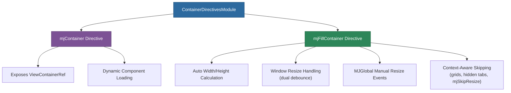

# @memberjunction/ng-container-directives

Angular directives for container management in MemberJunction applications -- `mjContainer` for dynamic component loading via ViewContainerRef, and `mjFillContainer` for automatic element resizing to fill parent containers.

## Overview

This package provides two essential layout directives. `mjContainer` exposes a `ViewContainerRef` for programmatic component creation. `mjFillContainer` automatically calculates and sets element dimensions based on the parent container, with context-aware behavior that skips resizing inside grids, hidden tabs, or elements marked with `mjSkipResize`.



## Installation

```bash
npm install @memberjunction/ng-container-directives
```

## Usage

### Import the Module

```typescript
import { ContainerDirectivesModule } from '@memberjunction/ng-container-directives';

@NgModule({
  imports: [ContainerDirectivesModule]
})
export class YourModule { }
```

### mjContainer

Exposes a `ViewContainerRef` for dynamic component loading:

```html
<div mjContainer></div>
```

```typescript
import { Container } from '@memberjunction/ng-container-directives';

@Component({
  selector: 'app-dynamic-host',
  template: `<div mjContainer></div>`
})
export class DynamicHostComponent {
  @ViewChild(Container, { static: true }) container!: Container;

  ngOnInit() {
    const ref = this.container.viewContainerRef;
    // ref.createComponent(YourDynamicComponent);
  }
}
```

### mjFillContainer

Automatically resizes an element to fill its parent:

```html
<!-- Fills both width and height (default) -->
<div mjFillContainer>Content</div>

<!-- Custom margins -->
<div mjFillContainer [fillWidth]="true" [fillHeight]="true" [rightMargin]="10" [bottomMargin]="20">
  Content with margins
</div>

<!-- Fill only width -->
<div mjFillContainer [fillWidth]="true" [fillHeight]="false">
  Content that fills width only
</div>
```

### Skipping Resize

```html
<div mjSkipResize>This element will not be resized</div>
```

### Manual Resize Triggering

```typescript
import { MJGlobal, MJEventType } from '@memberjunction/global';

MJGlobal.Instance.RaiseEvent({
  event: MJEventType.ManualResizeRequest,
  args: null
});
```

## Configuration

### mjFillContainer Inputs

| Property | Type | Default | Description |
|----------|------|---------|-------------|
| `fillWidth` | `boolean` | `true` | Fill the parent's width |
| `fillHeight` | `boolean` | `true` | Fill the parent's height |
| `rightMargin` | `number` | `0` | Right margin in pixels |
| `bottomMargin` | `number` | `0` | Bottom margin in pixels |

### Static Properties

```typescript
import { FillContainer } from '@memberjunction/ng-container-directives';

// Disable resize globally
FillContainer.DisableResize = true;

// Enable debug logging
FillContainer.OutputDebugInfo = true;
```

## How It Works

1. **Parent detection**: Identifies the nearest block-level parent element
2. **Size calculation**: Computes dimensions based on parent size, element position, and margins
3. **Event handling**: Listens for window resize (dual debounce: 100ms active, 500ms settled) and MJGlobal manual resize events
4. **Context awareness**: Automatically skips elements with `mjSkipResize`, elements inside grids (`role="grid"`), hidden tabs, or hidden/undisplayed parents

## Dependencies

| Package | Description |
|---------|-------------|
| `@memberjunction/core` | Core utilities and logging |
| `@memberjunction/global` | Global event system |
| `rxjs` | Event handling and debouncing |

### Peer Dependencies

- `@angular/common` ^21.x
- `@angular/core` ^21.x
- `@angular/router` ^21.x

## Build

```bash
cd packages/Angular/Generic/container-directives
npm run build
```

## License

ISC
