# @memberjunction/ng-conversations

A comprehensive Angular component library for building conversation-based interfaces in MemberJunction, including messaging, artifact management, collections, projects, tasks, agent interaction panels, and collaboration features.

## Overview

The `@memberjunction/ng-conversations` package is a large, feature-rich module that powers MemberJunction's conversation UI. It provides 40+ components covering the entire conversation lifecycle: message composition and rendering (with markdown, mentions, code blocks, and artifacts), conversation navigation and history, threaded discussions, artifact collections and libraries, project/task management, agent execution panels, sharing/permission modals, search, notifications, and export.

```mermaid
graph TD
    A[ConversationsModule] --> B[Messaging]
    A --> C[Navigation]
    A --> D[Collections & Library]
    A --> E[Agent & Tasks]
    A --> F[Collaboration]

    B --> B1[MessageItemComponent]
    B --> B2[MessageListComponent]
    B --> B3[MessageInputComponent]
    B --> B4[MentionEditorComponent]
    B --> B5[SuggestedResponsesComponent]
    B --> B6[ConversationMessageRatingComponent]

    C --> C1[ConversationWorkspaceComponent]
    C --> C2[ConversationNavigationComponent]
    C --> C3[ConversationSidebarComponent]
    C --> C4[ConversationListComponent]
    C --> C5[ConversationChatAreaComponent]
    C --> C6[ThreadPanelComponent]

    D --> D1[CollectionTreeComponent]
    D --> D2[CollectionViewComponent]
    D --> D3[LibraryFullViewComponent]
    D --> D4[ArtifactCreateModalComponent]

    E --> E1[AgentProcessPanelComponent]
    E --> E2[ActiveAgentIndicatorComponent]
    E --> E3[TasksFullViewComponent]
    E --> E4[GlobalTasksPanelComponent]

    F --> F1[ShareModalComponent]
    F --> F2[MembersModalComponent]
    F --> F3[ExportModalComponent]
    F --> F4[SearchPanelComponent]

    style A fill:#2d6a9f,stroke:#1a4971,color:#fff
    style B fill:#7c5295,stroke:#563a6b,color:#fff
    style C fill:#2d8659,stroke:#1a5c3a,color:#fff
    style D fill:#b8762f,stroke:#8a5722,color:#fff
    style E fill:#7c5295,stroke:#563a6b,color:#fff
    style F fill:#2d8659,stroke:#1a5c3a,color:#fff
```



## Installation

```bash
npm install @memberjunction/ng-conversations
```

## Usage

### Import the Module

```typescript
import { ConversationsModule } from '@memberjunction/ng-conversations';

@NgModule({
  imports: [ConversationsModule]
})
export class YourModule { }
```

### Full Conversation Workspace

The top-level workspace component provides a complete conversation experience with sidebar, chat area, and thread panel:

```html
<mj-conversation-workspace
  [conversationId]="selectedConversationId"
  (conversationChanged)="onConversationChanged($event)">
</mj-conversation-workspace>
```

### Chat Area

The chat area handles message display, input, and agent interactions:

```html
<mj-conversation-chat-area
  [conversationId]="conversationId"
  [conversation]="conversation"
  [threadId]="selectedThreadId"
  [isNewConversation]="isNewConversation"
  (conversationCreated)="onConversationCreated($event)"
  (threadOpened)="onThreadOpened($event)"
  (threadClosed)="onThreadClosed()">
</mj-conversation-chat-area>
```

### Message Components

#### Message List

```html
<mj-message-list
  [messages]="conversationMessages"
  [isLoading]="isLoadingMessages"
  (messageRated)="onMessageRated($event)">
</mj-message-list>
```

#### Message Input with Mentions

```html
<mj-message-input
  [conversationId]="conversationId"
  [allowSend]="!isProcessing"
  (messageSent)="onMessageSent($event)">
</mj-message-input>
```

#### Mention Editor

```html
<mj-mention-editor
  [mentionSources]="availableMentionSources"
  (mentionSelected)="onMentionSelected($event)">
</mj-mention-editor>
```

### Collections and Library

```html
<!-- Collection tree for organizing artifacts -->
<mj-collection-tree
  [projectId]="currentProjectId"
  (collectionSelected)="onCollectionSelected($event)">
</mj-collection-tree>

<!-- Full library view -->
<mj-library-full-view
  [projectId]="currentProjectId">
</mj-library-full-view>
```

### Project and Task Management

```html
<!-- Project selector -->
<mj-project-selector
  [currentProjectId]="projectId"
  (projectChanged)="onProjectChanged($event)">
</mj-project-selector>

<!-- Tasks view -->
<mj-tasks-full-view
  [projectId]="currentProjectId">
</mj-tasks-full-view>
```

### Agent Components

```html
<!-- Agent execution panel -->
<mj-agent-process-panel
  [agentRunId]="activeRunId">
</mj-agent-process-panel>

<!-- Active agent indicator -->
<mj-active-agent-indicator
  [isActive]="agentIsRunning">
</mj-active-agent-indicator>
```

### Collaboration

```html
<!-- Share modal -->
<mj-share-modal
  [visible]="showShareModal"
  [resourceId]="resourceId"
  [resourceType]="'conversation'"
  (closed)="onShareClosed()">
</mj-share-modal>

<!-- Export modal -->
<mj-export-modal
  [visible]="showExportModal"
  [conversationId]="conversationId"
  (exported)="onExported($event)">
</mj-export-modal>
```

## Component Reference

### Messaging Components

| Component | Selector | Description |
|-----------|----------|-------------|
| `MessageItemComponent` | `mj-message-item` | Single message display with markdown, artifacts, and rating |
| `MessageListComponent` | `mj-message-list` | Scrollable message list with auto-scroll |
| `MessageInputComponent` | `mj-message-input` | Message input with attachment support |
| `MessageInputBoxComponent` | `mj-message-input-box` | Core input box with auto-resize |
| `SuggestedResponsesComponent` | `mj-suggested-responses` | Quick response buttons |
| `FormQuestionComponent` | `mj-form-question` | Structured form input within conversations |
| `AgentResponseFormComponent` | `mj-agent-response-form` | Agent-generated form responses |
| `ActionableCommandsComponent` | `mj-actionable-commands` | Clickable command suggestions |
| `MentionDropdownComponent` | `mj-mention-dropdown` | @-mention autocomplete dropdown |
| `MentionEditorComponent` | `mj-mention-editor` | Rich text input with mention support |
| `ConversationMessageRatingComponent` | `mj-conversation-message-rating` | Message feedback (thumbs up/down) |

### Navigation Components

| Component | Selector | Description |
|-----------|----------|-------------|
| `ConversationWorkspaceComponent` | `mj-conversation-workspace` | Full workspace layout |
| `ConversationNavigationComponent` | `mj-conversation-navigation` | Top-level navigation |
| `ConversationSidebarComponent` | `mj-conversation-sidebar` | Left sidebar with conversation list |
| `ConversationListComponent` | `mj-conversation-list` | Scrollable conversation history |
| `ConversationChatAreaComponent` | `mj-conversation-chat-area` | Main chat area |
| `ConversationEmptyStateComponent` | `mj-conversation-empty-state` | Empty state display |
| `ThreadPanelComponent` | `mj-thread-panel` | Threaded discussion panel |

### Collection and Library Components

| Component | Selector | Description |
|-----------|----------|-------------|
| `CollectionTreeComponent` | `mj-collection-tree` | Hierarchical collection browser |
| `CollectionViewComponent` | `mj-collection-view` | Collection detail view |
| `CollectionArtifactCardComponent` | `mj-collection-artifact-card` | Artifact card within collections |
| `LibraryFullViewComponent` | `mj-library-full-view` | Full library interface |
| `CollectionFormModalComponent` | `mj-collection-form-modal` | Create/edit collection |
| `ArtifactCreateModalComponent` | `mj-artifact-create-modal` | Create new artifact |
| `CollectionsFullViewComponent` | `mj-collections-full-view` | All collections browser |

### Project and Task Components

| Component | Selector | Description |
|-----------|----------|-------------|
| `ProjectSelectorComponent` | `mj-project-selector` | Project selection dropdown |
| `ProjectFormModalComponent` | `mj-project-form-modal` | Create/edit project |
| `TasksFullViewComponent` | `mj-tasks-full-view` | Full tasks management view (standalone) |
| `TasksDropdownComponent` | `mj-tasks-dropdown` | Task quick-access dropdown |
| `TaskWidgetComponent` | `mj-task-widget` | Compact task widget |
| `GlobalTasksPanelComponent` | `mj-global-tasks-panel` | Global tasks panel |

### Agent Components

| Component | Selector | Description |
|-----------|----------|-------------|
| `AgentProcessPanelComponent` | `mj-agent-process-panel` | Agent execution panel |
| `ActiveAgentIndicatorComponent` | `mj-active-agent-indicator` | Active processing indicator |
| `ActiveTasksPanelComponent` | `mj-active-tasks-panel` | Active tasks panel |

### Utility Components

| Component | Selector | Description |
|-----------|----------|-------------|
| `ShareModalComponent` | `mj-share-modal` | Resource sharing modal |
| `MembersModalComponent` | `mj-members-modal` | Members management |
| `ExportModalComponent` | `mj-export-modal` | Data export modal |
| `SearchPanelComponent` | `mj-search-panel` | Search across conversations |
| `NotificationBadgeComponent` | `mj-notification-badge` | Unread notification count |
| `ActivityIndicatorComponent` | `mj-activity-indicator` | Active processing indicator |
| `ToastComponent` | `mj-toast` | Toast notification display |
| `InputDialogComponent` | `mj-input-dialog` | Generic text input dialog |
| `ImageViewerComponent` | `mj-image-viewer` | Image attachment viewer |

## Directives

| Directive | Selector | Description |
|-----------|----------|-------------|
| `SearchShortcutDirective` | `[mjSearchShortcut]` | Keyboard shortcut for search |

## Key Design Patterns

### Performance Optimization

Message components use dynamic component creation (`ViewContainerRef.createComponent`) instead of Angular template binding to minimize render cycles and improve performance with large message lists.

### MJ Entity Integration

All data operations use the MemberJunction entity system:
- `Metadata.GetEntityObject()` for entity creation
- `RunView` for efficient data loading
- Proper generic typing throughout

### Reactive State Management

RxJS `BehaviorSubject` instances for all state, with derived observables using `combineLatest` and `shareReplay(1)` for efficient caching.

## Dependencies

### MemberJunction Packages

| Package | Description |
|---------|-------------|
| `@memberjunction/core` | Core framework |
| `@memberjunction/core-entities` | Entity type definitions |
| `@memberjunction/global` | Global utilities |
| `@memberjunction/graphql-dataprovider` | GraphQL data access |
| `@memberjunction/ng-artifacts` | Artifact viewer components |
| `@memberjunction/ng-code-editor` | Code editor component |
| `@memberjunction/ng-container-directives` | Container directives |
| `@memberjunction/ng-markdown` | Markdown rendering |
| `@memberjunction/ng-shared-generic` | Shared generic components |
| `@memberjunction/ng-testing` | Testing framework components |

### Kendo UI Packages

Uses `@progress/kendo-angular-dialog`, `@progress/kendo-angular-buttons`, `@progress/kendo-angular-inputs`, `@progress/kendo-angular-layout`, `@progress/kendo-angular-indicators`, `@progress/kendo-angular-dropdowns`, `@progress/kendo-angular-notification`, `@progress/kendo-angular-upload`, `@progress/kendo-angular-dateinputs`.

### Peer Dependencies

- `@angular/common` ^21.x
- `@angular/core` ^21.x
- `@angular/forms` ^21.x
- `@angular/router` ^21.x

## Build

```bash
cd packages/Angular/Generic/conversations
npm run build
```

## License

ISC
